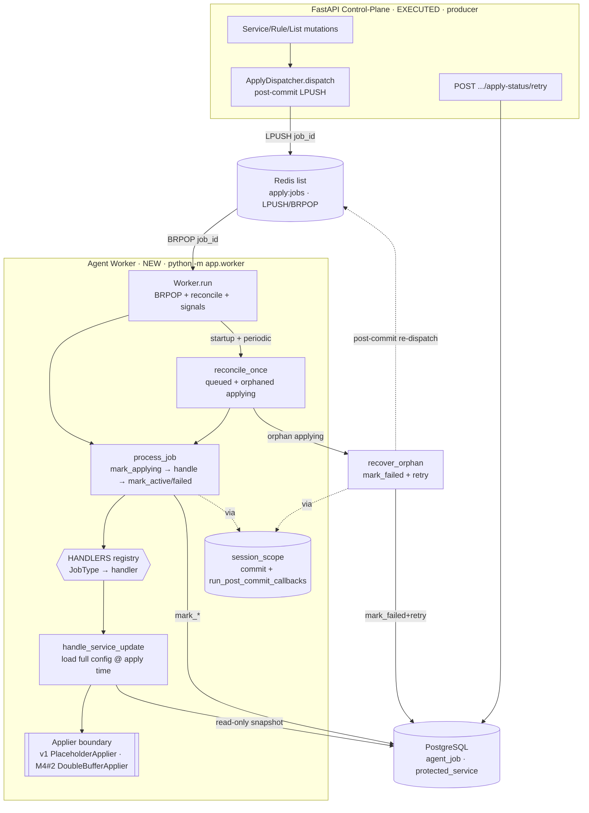
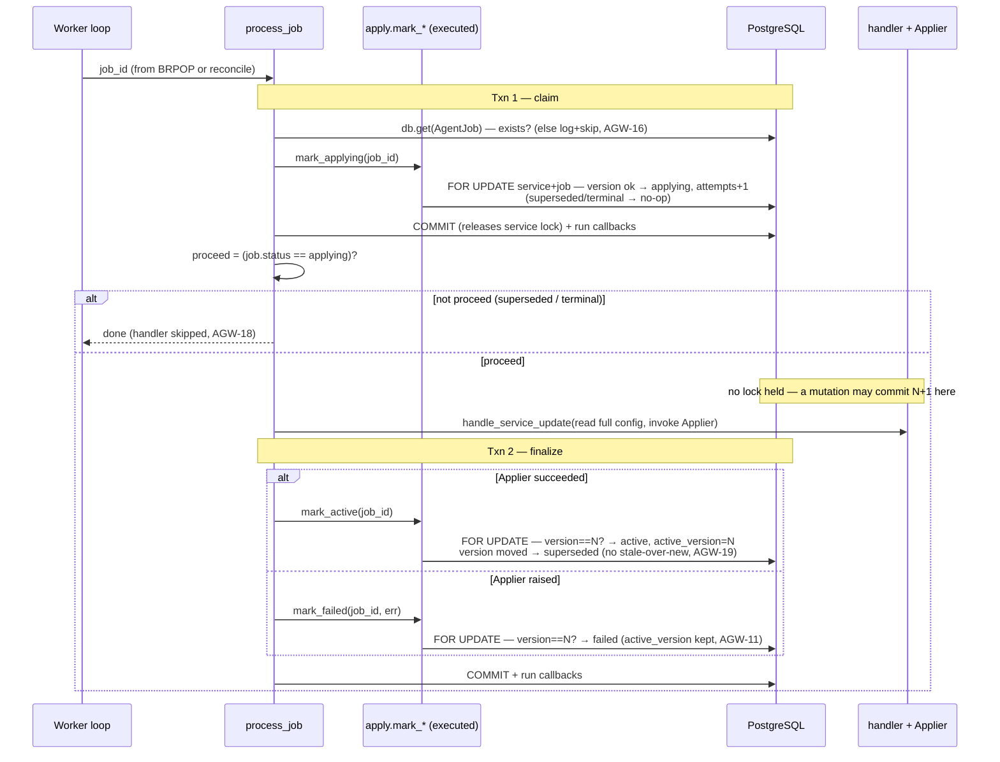

# Agent Worker & Job Pipeline Design

**Spec**: `.specs/features/agent-worker/spec.md` (AGW-01..30)
**Context**: `.specs/features/agent-worker/context.md` (D-AGW-1..2, A-AGW-1..8)
**Status**: Draft (awaiting approval → Tasks)
**Depends on** (all **executed** — verified live against the working tree, not designs):
- **Apply-status** (`app/services/apply.py`, `app/core/applystate.py`, commits `a4b1ffd..de47b5f`) —
  the worker is the *consumer half*. It calls the executed, version-guarded `mark_applying` /
  `mark_active` / `mark_failed` / `retry`, reads `APPLY_QUEUE_KEY = "apply:jobs"`, and adds **zero**
  transition logic (APLY-03 honored). `app/db/models.py::AgentJob` / `ProtectedService` /
  `JobStatus` / `JobType` / `ChangeTrigger` are reused unchanged.
- **Session/Redis plumbing** (`app/db/session.py`, `app/core/redis.py`) — reuses `get_session_factory`,
  `add_post_commit_callback` / `run_post_commit_callbacks` (the exact post-commit mechanism the API's
  `get_db` uses, which the worker must replicate so `retry`'s re-dispatch fires), `get_redis_client`,
  `close_redis_client`.
- **Config** (`app/core/config.py::Settings`, env-prefix `CONTROL_PLANE_`) — extended with worker knobs.
- **Audit** (`app/services/audit.py::record_event`) — reused **only** via `retry` (system actor).

This feature writes **nothing** to the data-plane and adds **no** API endpoint. It is executable
independently of the M3 *Fairness* Execute (disjoint files).

---

## Architecture Overview

A single long-running asyncio process (`python -m app.worker`, A-AGW-1) with one job in flight at a
time (A-AGW-2). Four ideas carry the whole design:

1. **Consumer, never author (AGW-04).** Every state change goes through the executed `mark_*` / `retry`.
   The worker owns *orchestration* (when to call them, in what transaction, with what error handling) —
   never the transition table. `core/applystate.py` stays the one guard (APLY-03).

2. **Two transactions per job — the lock must be released across the applier (the crux).** `mark_applying`
   commits and **releases** the `ProtectedService` `FOR UPDATE` lock *before* the applier runs; the
   terminal `mark_active`/`mark_failed` **re-takes** it. This is exactly what makes "no stale-over-new"
   real under churn (AGW-18/19): a mutation that commits `version=N+1` while the applier is mid-flight
   is only *possible* because the worker isn't holding the row lock — and it is then observed by the
   terminal mark as `service.version > job.version → superseded`. Holding one lock across the applier
   would serialize mutations behind the apply and defeat the guard.

3. **Ledger is the queue of record (AGW-12..17).** The Redis list is a low-latency notification; the
   `agent_job` table is the truth. A **startup + periodic reconcile sweep** finds committed-but-
   undelivered `queued` jobs (`dispatched_at IS NULL`, Redis was down) and orphaned `applying` jobs
   (crash). A popped id that fails to process is never lost — it is still `queued`/`applying` in the
   ledger, so the sweep re-drives it. This is the promise M1 deferred (A-APLY-1/APLY-27/36).

4. **Handler → applier boundary (AGW-07/10, D-AGW-1).** A registry keyed by `JobType` selects a handler;
   `SERVICE_UPDATE` reads the target's **full config from PostgreSQL at apply time** (identity-only
   jobs, A-AGW-5) and invokes an injected `Applier`. v1 = a succeeding `PlaceholderApplier`; **M4 #2
   swaps the implementation behind this boundary, not the boundary itself.**

**Component view** — source: `diagrams/worker-architecture.mmd` · rendered: `diagrams/worker-architecture.svg`



**Process-one-job sequence (the two-transaction version guard)** — source:
`diagrams/process-job-sequence.mmd` · rendered: `diagrams/process-job-sequence.svg`



---

## Research Notes (Knowledge Verification Chain)

- **Step 1 (Codebase — authoritative, all executed):**
  - `apply.mark_applying/active/failed(db, job_id)` take a session, mutate + `db.flush()`, **do not
    commit** (caller owns the txn), and silently **no-op** on terminal or superseded jobs. `_load_*_for_update`
    raise `HTTPException(404)` when the row is absent — the worker therefore **pre-checks existence with
    `db.get`** before calling, so it never depends on FastAPI exception types (AGW-16).
  - `apply.retry(db, service, actor)` requires `service.apply_status == failed` (else `NotFailedError`),
    resets the current-version job to `queued`, `record_event(action="apply.retry", actor=…)`, and
    `_register_dispatch` (post-commit LPUSH). With `actor=None` the audit records `actor_username="system"`
    (verified in `audit.record_event`) — this is exactly the attribution the orphan-recovery path wants,
    so **no change to `retry` is needed** (resolves the D-AGW-2 audit-attribution flag).
  - `_register_dispatch` → `add_post_commit_callback`; callbacks fire **only** via
    `run_post_commit_callbacks(session)`. The API's `get_db` runs them after `commit()`. **The worker must
    replicate this** or `retry`'s re-dispatch never reaches Redis — hence the `session_scope` UoW below.
  - `ApplyDispatcher.dispatch` uses `LPUSH apply:jobs`; the FIFO consumer is therefore `BRPOP apply:jobs`.
  - `get_session_factory()` → `expire_on_commit=False, autoflush=False` (objects survive commit; safe to
    read `job.status` post-commit). `get_redis_client()` is a lazy singleton with `decode_responses=True`.
  - Entrypoint precedent: `app/cli.py` (`asyncio.run`, session-per-command, `dispose_engine()` in
    `finally`). The worker mirrors this shape at process scope.
- **Step 2 (Project docs):** TDD 4.5 (worker sequence: consume idempotent-by-version → read full config →
  build → swap/fail, ≤5 s), PRD 6.8 (job table + reliability: idempotent, swap-only-on-full-build, restart
  preserves active state), PRD 11.3 (restart must not lose active state), AD-008 (`redis.asyncio`,
  `compose.test.yml`), D-SLRD-1 (interim-writer precedent for the placeholder applier). All honored.
- **Step 3 (Context7 MCP):** unavailable in this environment (per prior designs) — skipped.
- **Step 4 (Web — the one load-bearing external API):** redis-py async `brpop([key], timeout)` returns a
  `(key, value)` tuple (str under `decode_responses=True`, the executed client's setting) on success and
  `None` on timeout — **verified 2026-07-10** against redis-py docs (redis.readthedocs.io) + the BRPOP
  command reference. `asyncio.loop.add_signal_handler(SIGTERM/SIGINT, cb)` for cooperative shutdown is
  standard-library and stable. No API is being invented.
- **Step 5 (Flagged):** none uncertain. Two choices, recorded under Tech Decisions: the two-transaction
  boundary (vs one lock across the applier) and one-transaction orphan recovery (vs two).

---

## Code Reuse Analysis

### Existing components to leverage

| Component | Location | How to use |
| --- | --- | --- |
| `mark_applying`/`mark_active`/`mark_failed`/`retry` | `app/services/apply.py` | The **only** way the worker changes state (AGW-04); called inside `session_scope` |
| `APPLY_QUEUE_KEY`, `APPLY_ERROR_LIMIT` | `app/services/apply.py` | Consumer reads the same list key; `mark_failed` already truncates errors |
| `AgentJob`, `ProtectedService`, `JobStatus`, `JobType`, `ChangeTrigger`, `utc_now` | `app/db/models.py` | Read/query unchanged; no new columns, no migration |
| `get_session_factory`, `add_post_commit_callback`, `run_post_commit_callbacks`, `discard_post_commit_callbacks`, `dispose_engine` | `app/db/session.py` | Build the worker's `session_scope`; dispose on shutdown |
| `get_redis_client`, `close_redis_client` | `app/core/redis.py` | `BRPOP` consume; close on shutdown |
| `Settings` (`CONTROL_PLANE_` env prefix) | `app/core/config.py` | **Extend** with worker knobs (AGW-29) |
| `app/cli.py` entrypoint pattern | `app/cli.py` | Shape of `python -m app.worker` (asyncio.run, dispose in finally) |

### This feature establishes (for reuse by later features)

| Primitive | Location | Reused by |
| --- | --- | --- |
| `Applier` protocol + `ServiceConfig` snapshot | `app/worker/applier.py` | **M4 #2** swaps `PlaceholderApplier` → `DoubleBufferApplier` (build+swap) behind the same boundary |
| `HANDLERS` registry + "no handler → mark_failed" | `app/worker/handlers.py` | **M4 #3** (`FEED_SYNC`), **M4 #2** (`MAP_REBUILD`/`ACTIVE_SLOT_SWAP`), **M5** (`TELEMETRY_AGGREGATE`) register handlers |
| `process_job` / `reconcile_once` (loop-free, injectable) | `app/worker/processor.py` | Directly unit/integration-testable; M4 reuses the orchestration verbatim |
| `session_scope` UoW (commit + run post-commit callbacks) | `app/db/session.py` (added) | Any non-request caller of services that register post-commit work |

### Integration points

| System | Integration method |
| --- | --- |
| Redis | `BRPOP APPLY_QUEUE_KEY timeout` (consumer of the executed dispatcher's `LPUSH`); no Stream (A-AGW-3) |
| PostgreSQL | Read config snapshots + drive `mark_*`/`retry`; **no schema change, no migration** |
| Apply service | Import + call executed functions; the worker is a new caller, not a modifier |
| Settings/env | New `CONTROL_PLANE_WORKER_*` fields with documented defaults (AGW-26/29) |
| Deploy | New process `python -m app.worker`, colocated on the node (A-AGW-1); `compose.test.yml`-compatible |

---

## Components

### Worker settings — `app/core/config.py::Settings` (extended) — MODIFIED (additive)
- **Purpose**: env-tunable knobs, defaults meeting AGW-05 (≤5 s nominal) / AGW-13 (≤60 s degraded).
- **New fields** (env `CONTROL_PLANE_WORKER_*`):
  - `worker_poll_timeout_seconds: float = 2.0` — `BRPOP` block; small so shutdown/reconcile are responsive
    (nominal latency is push-driven, not gated by this — BRPOP wakes immediately on `LPUSH`).
  - `worker_reconcile_interval_seconds: float = 15.0` — periodic `queued & dispatched_at IS NULL` sweep;
    ≤ 60 s degraded bound.
  - `worker_backoff_initial_seconds: float = 0.5`, `worker_backoff_max_seconds: float = 30.0` — bounded
    exponential backoff for Redis/DB outages (AGW-14/15).
  - `worker_shutdown_grace_seconds: float = 10.0` — in-flight job grace on SIGTERM (AGW-23).
- **Reuses**: the existing `BaseSettings`/`get_settings` (`@lru_cache`). No new settings class.

### Applier boundary — `app/worker/applier.py` — NEW (the M4 #2 seam)
- **Purpose**: the single build+activate contract for one service at one version (D-AGW-1).
- **Interfaces**:
  - `@dataclass(frozen=True) ServiceConfig` — an immutable snapshot: `service_id`, `version`, service
    fields (name, `cidr_or_ip`, mode, enabled, `vip_pps`, `vip_bps`), `plan` (committed/ceiling/billing),
    `rules: list[...]`, `whitelist: list[...]`, `blacklist: list[...]`. Read at apply time (AGW-09).
  - `class Applier(Protocol): async def apply(self, config: ServiceConfig) -> None` — **raises** on build
    failure (→ `mark_failed`, AGW-11); returns on success (→ `mark_active`).
  - `class PlaceholderApplier(Applier)` — logs a one-line summary of what it *would* build (service +
    counts of rules/list entries at version N) and returns. v1 = success (D-AGW-1). **Never touches the
    data-plane / bpffs** — so startup triggers no unsolicited swap (AGW-21, binding on M4 #2 too).
  - `async def load_service_config(db, service_id) -> ServiceConfig | None` — read-only snapshot
    (service + plan + rules + whitelist + blacklist); `None` if the service is gone (defensive; the job
    would normally be CASCADE-removed first).
- **Dependencies**: models (read). **Reuses**: `ProtectedService` + children relationships.

### Handler registry — `app/worker/handlers.py` — NEW
- **Purpose**: map `JobType → handler`; the forward-compat extension point (AGW-07/08).
- **Interfaces**:
  - `Handler = Callable[[AsyncSession, AgentJob, Applier], Awaitable[None]]`.
  - `HANDLERS: dict[JobType, Handler] = {JobType.service_update: handle_service_update}`.
  - `async def handle_service_update(db, job, applier)` — `cfg = await load_service_config(db, job.target_id)`;
    if `cfg is None` raise (→ mark_failed "service missing"); else `await applier.apply(cfg)` (AGW-09/10).
  - `class NoHandlerError(Exception)` — raised by `process_job` when `job.job_type not in HANDLERS`
    (mapped to `mark_failed`, AGW-08). In v1 unreachable (only `SERVICE_UPDATE` exists) but the rule is
    the contract M4/M5 rely on.
- **Dependencies**: `applier`, models. **Reuses**: `JobType`.

### Job processor — `app/worker/processor.py` — NEW (loop-free; the testable core)
- **Purpose**: process exactly one job through the two-transaction version guard, and reconcile the
  ledger. No infinite loop, no signals — everything here is directly unit/integration-testable.
- **Interfaces**:
  - `async def process_job(job_id, *, session_factory, applier) -> None` —
    1. **Txn 1 (claim)** via `session_scope`: `job = await db.get(AgentJob, job_id)`; `None` → log+skip
       (AGW-16). Non-UUID ids are rejected earlier by the loop. `await mark_applying(db, job_id)`;
       `proceed = (await db.get(AgentJob, job_id)).status == JobStatus.applying`. Commit releases the
       service lock.
    2. If not `proceed` (superseded/terminal) → return (handler skipped, AGW-17/18).
    3. **Handler** (its own short read txn or a fresh read session): `handler = HANDLERS.get(job_type)`;
       missing → `mark_failed(NoHandlerError)` in Txn 2 and return (AGW-08). Else run the handler
       (reads config, invokes applier). Applier success/failure decides the terminal mark.
    4. **Txn 2 (finalize)** via `session_scope`: success → `mark_active(db, job_id)`; handler raised →
       `mark_failed(db, job_id, f"{type(e).__name__}: {e}")` (`logger.exception` for the full trace,
       AGW-25). `active_version` untouched on failure (executed guarantee, AGW-11).
    - **Infra vs handler failure (crux, AGW-15):** handler/applier exceptions → `mark_failed` (a real
      terminal outcome). Infra exceptions (DB/Redis connection errors, or a bug raised by `mark_*`) are
      **not** converted to `mark_failed` — they propagate to the loop's backoff; the job stays
      `queued`/`applying` in the ledger and is re-driven by the sweep. Txn 2's terminal mark is retried a
      bounded number of times on transient DB errors before giving up (leaving a recoverable orphan).
  - `async def reconcile_once(*, session_factory, applier, include_orphans: bool) -> int` —
    - `queued` jobs → `process_job` each (covers `dispatched_at IS NULL` after a Redis outage, and any
      queued backlog). Ordered by `version` asc so older versions are attempted first (all but the latest
      supersede harmlessly).
    - if `include_orphans` (**startup only**): `applying` jobs → `recover_orphan`. During runtime the
      periodic sweep passes `include_orphans=False` — a runtime `applying` row is the job in flight (single
      worker), never touched.
    - returns the count processed (for the startup log / tests).
  - `async def recover_orphan(db, job)` (called inside a `session_scope`) — D-AGW-2, **one transaction,
    existing edges only**: `await mark_failed(db, job.id, "worker restarted mid-apply")` then
    `await retry(db, service, actor=None)` (→ `failed→queued`, `record_event` system actor, post-commit
    re-dispatch). Durable evidence of recovery = the `apply.retry` (system) audit event + incremented
    `attempts`; the `failed` state is transient on the reused job row.
- **Dependencies**: `apply` (executed), `handlers`, `applier`, `session_scope`, models.
- **Reuses**: every state change is an executed `apply.*` call.

### Worker runtime — `app/worker/worker.py` — NEW (the loop + I/O edges)
- **Purpose**: the long-running loop, Redis consumption, sweep scheduling, backoff, signals.
- **Interfaces**:
  - `class Worker` — ctor injects `settings`, `redis`, `session_factory`, `applier` (all overridable for
    tests).
  - `async def run(self, stop: asyncio.Event | None = None) -> None`:
    - install SIGTERM/SIGINT handlers → set an internal `stop` event (AGW-23);
    - **startup**: `await reconcile_once(include_orphans=True)` (AGW-12/21/22) + log effective config once
      (AGW-26);
    - **loop** until `stop`: `res = await brpop(key, timeout=poll)`; on `(key, value)` → parse UUID (bad →
      log+skip) → `process_job`; on `None` (timeout) → if `reconcile` due, `reconcile_once(include_orphans=
      False)` (AGW-06/13). Wrap each iteration so a `RedisError` enters **degraded mode** (log once,
      DB-poll `reconcile_once` on the backoff cadence, periodically re-attempt `brpop`; resume on success
      — AGW-14) and a DB `OperationalError` triggers bounded backoff without dropping work (AGW-15).
    - **shutdown**: stop consuming; allow the in-flight `process_job` up to `shutdown_grace` via
      `asyncio.wait_for` (exceeded → leave `applying` for next startup, AGW-23); `close_redis_client()` +
      `dispose_engine()`.
  - `async def _brpop(self)` — thin wrapper returning `uuid.UUID | None`, isolating the verified
    redis-py contract.
- **Dependencies**: `processor`, `redis`, `session`, `config`, stdlib `asyncio`/`signal`/`logging`.
- **Reuses**: `get_redis_client`, `close_redis_client`, `dispose_engine`.

### Entrypoint — `app/worker/__main__.py` — NEW
- **Purpose**: `python -m app.worker` (A-AGW-1).
- **Behavior**: configure stdlib logging; `settings = get_settings()`; `applier = PlaceholderApplier()`;
  `asyncio.run(Worker(settings=settings, applier=applier).run())`. Mirrors `app/cli.py`.
- **Reuses**: `Settings`, `Worker`.

### Shared UoW — `app/db/session.py::session_scope` — ADDED (additive)
- **Purpose**: a non-request unit of work with the **same** commit + post-commit-callback semantics as
  `get_db`, so `retry`/`enqueue`-registered dispatches fire from the worker.
- **Interface**: `@asynccontextmanager async def session_scope() -> AsyncIterator[AsyncSession]` — open
  session; on success `commit()` then `run_post_commit_callbacks(session)`; on error
  `discard_post_commit_callbacks(session)` + `rollback()` + re-raise.
- **Note**: `get_db` may later delegate to this (identical body); not required for this feature — kept
  additive to avoid touching the executed request path.

---

## Data Models

**No new models, no migration.** The worker reads/queries `AgentJob` + `ProtectedService` (+ plan/rules/
lists) and mutates them **only** through executed `apply.*` functions. `ServiceConfig` is an in-memory
snapshot dataclass, not persisted. `JobType` stays `SERVICE_UPDATE`-only (A-AGW-4) — M4 #2/#3 and M5 add
their enum values (a trivial migration) in their own features when they register handlers.

---

## The two-transaction guard (crux)

```
async def process_job(job_id, *, session_factory, applier):
    # ── Txn 1: claim ───────────────────────────────────────────────
    async with session_scope() as db:            # commit + run post-commit callbacks
        if await db.get(AgentJob, job_id) is None:
            log.info("skip: job gone", job_id); return            # AGW-16 (CASCADE-deleted)
        await mark_applying(db, job_id)           # FOR UPDATE svc+job; superseded/terminal → no-op
        proceed = (await db.get(AgentJob, job_id)).status is JobStatus.applying
    # lock released here — a mutation may now commit version N+1

    if not proceed:
        return                                    # superseded / already terminal (AGW-17/18)

    # ── Handler: no lock held ──────────────────────────────────────
    outcome = await _run_handler(job_id, session_factory, applier)   # success | (fail, err)

    # ── Txn 2: finalize ────────────────────────────────────────────
    async with session_scope() as db:
        if outcome is SUCCESS:
            await mark_active(db, job_id)         # version==N → active; moved → superseded (AGW-19)
        else:
            await mark_failed(db, job_id, outcome.err)   # active_version kept (AGW-11)
```

Because Txn 1 commits (and unlocks) before the handler and Txn 2 re-takes the lock, a concurrent
`bump_version` to `N+1` is *observable* and is caught by the executed `_superseded(service, job)` check
inside `mark_active`/`mark_failed` — so version N's terminal mark becomes a `superseded` no-op and the
later job for `N+1` advances `active_version` exactly once (AGW-20). No job is cancelled; the guard is
the only concurrency control (A-APLY-3), now exercised concurrently for the first time.

Reconcile drains `queued` jobs oldest-version-first and (startup only) heals `applying` orphans; the
BRPOP loop and reconcile never run concurrently (single loop, one job at a time), so duplicate delivery
(Redis entry + reconcile row) resolves to one advance via the terminal-job guard (AGW-17).

---

## Error Handling Strategy

| Scenario | Handling | Result |
| --- | --- | --- |
| Handler/applier raises (build failure) | Txn 2 `mark_failed(err)`; full trace to logs | job `failed`, service `failed`, `active_version` kept; retry-able (AGW-11/03) |
| `JobType` has no handler | `mark_failed(NoHandlerError)` | job `failed`, worker continues (AGW-08) |
| Popped id not in ledger (CASCADE-deleted service) | `db.get` None → log + skip | no crash (AGW-16) |
| Popped payload not a UUID | loop parses → `ValueError` → log + skip | no crash (edge case) |
| Job superseded before/at claim | `mark_applying` no-op; `proceed=False` | handler skipped (AGW-18) |
| Mutation commits N+1 mid-apply | Txn 2 terminal mark sees version moved | version N → `superseded`; N+1 applies (AGW-19/20) |
| Duplicate delivery (Redis + reconcile / retry re-dispatch) | terminal-job guard | one advance, rest no-op (AGW-17) |
| Redis unavailable (BRPOP) | log once → **degraded**: DB-poll `reconcile_once` on backoff cadence; retry BRPOP | no crash-loop; queued jobs still applied ≤ interval; resume on reconnect (AGW-14) |
| PostgreSQL transiently unavailable | bounded exponential backoff; popped id **not** dropped | job stays `queued`/`applying`, re-driven by sweep (AGW-15) |
| Terminal mark fails on transient DB error | bounded retry in Txn 2, then give up | recoverable orphan → next startup heals (AGW-24) |
| Worker crash between marks (orphan `applying`) | startup `recover_orphan`: `mark_failed`+`retry` | re-queued, self-heals; audit `apply.retry` (system) (AGW-22) |
| Runtime orphan (transient, no restart) | never wedges the **service** (version < service.version; next mutation supersedes it) | cosmetic ledger row, healed at restart |
| SIGTERM/SIGINT | stop consuming; in-flight job gets `shutdown_grace`; else left `applying` | clean exit; next start heals (AGW-23) |
| Unexpected bug in `mark_*` | `logger.exception` + continue with next job | one poisonous job never wedges the pipeline; job recoverable via sweep |

---

## Tech Decisions (non-obvious)

| Decision | Choice | Rationale |
| --- | --- | --- |
| Lock lifetime across the applier | **Two transactions** — `mark_applying` commits (unlocks) before the handler; terminal mark re-locks | The *only* way a mid-apply mutation can supersede (AGW-18/19); one lock across the applier would serialize mutations behind the apply |
| Detect superseded/terminal at claim | Re-read `job.status` after `mark_applying` (no return-value change to executed fn) | Keeps `apply.py` byte-for-byte untouched (AGW-04); `expire_on_commit=False` makes the read free (identity map) |
| Job existence | `db.get` pre-check before `mark_applying` | Avoids depending on `apply.py`'s `HTTPException(404)` in a non-HTTP process (AGW-16) |
| Orphan recovery | **One transaction**, `mark_failed`+`retry`, existing edges only | Zero new `LEGAL_APPLY` edges (D-AGW-2); atomic; single post-commit re-dispatch |
| Recovery audit attribution | `retry(actor=None)` → `record_event` "system" (already supported) | No change to `retry`; resolves the flagged attribution question; recovery is traceable |
| Orphan sweep scope | `applying` healed **startup-only**; periodic sweep = `queued` only | Single worker ⇒ a runtime `applying` row is the live job; timeout/lease reclaim is the deferred idea (A-AGW-2) |
| Post-commit dispatch from worker | Reuse `add_post_commit_callback` + a shared `session_scope` | `retry`'s re-dispatch fires only if callbacks run; mirrors `get_db` exactly (no new dispatch path) |
| Handler → applier boundary | Injected `Applier` protocol; v1 `PlaceholderApplier` succeeds | D-AGW-1; M4 #2 swaps the impl, not the boundary; makes success/failure/churn testable now with fakes |
| Config delivery | Handler reads full config from PG at apply time; jobs carry identity only | TDD 4.5 (`đọc config đầy đủ`); rapid edits collapse naturally (A-AGW-5) |
| Loop-free core | `process_job`/`reconcile_once` are plain coroutines; loop/signals isolated in `Worker` | Directly unit/integration-testable without infinite loops or signals |
| Dispatch channel | Redis **list** `BRPOP` (A-AGW-3) | Ledger is the queue of record; Stream is a deferred upgrade behind `ApplyDispatcher` |
| Settings home | Extend the one `Settings` with `WORKER_*` fields | 12-factor, single env module (A-AGW-1); no parallel config |

---

## Testing Notes (feeds Tasks / TESTING.md)

- **Unit** (`@pytest.mark.unit`, `[P]`-eligible, no DB): `HANDLERS` lookup + `NoHandlerError` path;
  `PlaceholderApplier.apply` (logs + succeeds); `ServiceConfig` snapshot shape from a stub;
  UUID-parse/`_brpop` return handling (`(key,value)` → UUID; `None` → idle); backoff sequence
  (initial→max, capped). Pure.
- **Integration** (`compose.test.yml` PG+Redis, sequential): drive with injectable appliers —
  - **happy path / ≤5 s** — enqueue via the executed service path → `process_job` (or one `Worker.run`
    tick) → `active`, `active_version=N`, elapsed ≤ 5 s (AGW-05).
  - **no handler** — a job with an unhandled type → `failed`, worker proceeds (AGW-08). (Requires a temp
    enum value or a monkeypatched `HANDLERS`; Tasks picks the least-invasive mechanism.)
  - **handler failure** — `FailingApplier` raises → `failed` + `active_version` unchanged (AGW-11);
    then **retry** via the executed endpoint/service with a fixed applier → `active` (AGW-30).
  - **reconcile / Redis-lost** — insert a committed `queued` job with `dispatched_at IS NULL` (no LPUSH)
    → `reconcile_once` → `active` (AGW-12/13).
  - **orphan recovery** — seed a job+service at `applying` → `reconcile_once(include_orphans=True)` →
    re-queued + re-dispatched + eventually `active`; assert an `apply.retry` (system) audit row and
    `attempts` incremented (AGW-22/24).
  - **supersede under churn (crux)** — a `BarrierApplier` blocks in `apply()` on an `asyncio.Event`; start
    `process_job(vN)`, and once it is past `mark_applying` (barrier entered) commit a `bump_version` to
    `N+1` in a separate session, release the barrier → vN's `mark_active` no-ops (`superseded`), then
    `process_job(vN+1)` → `active_version=N+1`, exactly one advance (AGW-18/19/20).
  - **duplicate delivery** — `process_job(job_id)` twice → one advance, second no-op (AGW-17).
  - **graceful shutdown** — `Worker.run(stop)` with `stop` set after one tick → clean exit; a job left
    mid-flight by a forced stop is `applying` and heals on the next startup sweep (AGW-23/24).
  - **Redis-down degrade** — may be a **gated/opt-in** integration case (stop the redis container mid-run,
    assert DB-poll still applies queued jobs, resume on restart) if scriptable; otherwise a documented
    manual check (AGW-14). Tasks decides.
- **Gate**: unit → **quick**; everything touching PG/Redis → **full** (`compose.test.yml`). No data-plane
  `make` gates (pure control-plane).

---

## Open Questions / Flags (confirm before or during Tasks)

1. **`no-handler` test mechanism** — v1 has only `SERVICE_UPDATE`, so AGW-08 needs either a
   test-only enum value or a monkeypatched empty `HANDLERS`. Proposed: monkeypatch `HANDLERS` in the test
   (no schema/enum churn). Confirm.
2. **Config snapshot depth** — `ServiceConfig` includes plan + rules + whitelist + blacklist (everything
   M4 #2 will need to build a slot). It is **logged-only** in v1 (placeholder). Confirm the full snapshot
   is built now (so M4 #2 inherits it) vs a minimal identity-only snapshot deferred to M4 #2.
3. **`session_scope` placement** — proposed in `app/db/session.py` (shared, additive), *not* refactoring
   `get_db` to use it in this feature. Confirm (vs a worker-local UoW helper).
4. **Degraded-mode Redis test** — gated/opt-in integration vs documented manual check (AGW-14). Confirm
   scope for v1.
5. **Structured logging format** — stdlib `logger` with `extra={...}` fields (job_id, type, target,
   version, outcome, duration_ms, attempt); a JSON formatter is deferred to M5 telemetry. Confirm plain
   stdlib is acceptable for v1 (AGW-25).
