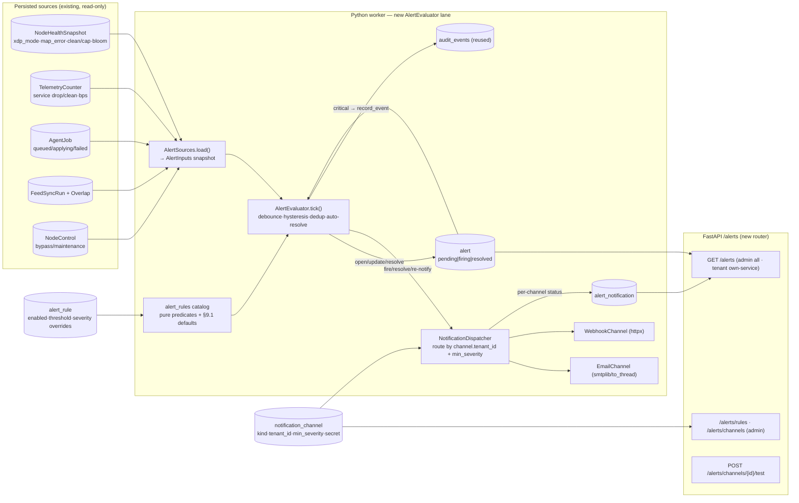

# Alerting Design

**Spec**: `.specs/features/alerting/spec.md` (ALRT-01..42)
**Context**: `.specs/features/alerting/context.md` (D-ALRT-1..4, A-ALRT-1..8)
**Status**: Draft (2026-07-14)
**Decision record**: **AD-033**

---

## Research & Grounding (codebase-verified)

Every load-bearing fact below was read from the current tree, not assumed:

- **Worker background-lane shape** (`worker/worker.py`): `Worker.__init__` already accepts optional
  `telemetry`/`billing`/`node_control` lanes typed as a `run_loop(stop: asyncio.Event)` `Protocol`; `run()`
  spawns each with `asyncio.create_task(lane.run_loop(stop_event))` and drains it in `finally` via
  `_finish_background_lane` (grace-timeout, catch-log). **Alerting adds one more lane the same way**
  (`AlertEvaluator`) — a new `AlertLane` Protocol + `alerts` ctor param + one `create_task` + one
  `_finish_background_lane`. No Redis `JobType` (D-ALRT-1 / A-ALRT-1).
- **Lane loop idiom** (`worker/telemetry.py::run_loop`): `while not stop`: `try: await tick() except
  Exception: logger.exception(...)`; then `await asyncio.wait_for(stop.wait(), timeout=interval)` with
  `TimeoutError → continue`. One bad tick never stops the lane (ALRT-09). Copied verbatim.
- **Alert data sources — all persisted, read-only** (no new DP surface, A-ALRT-2):
  - `NodeHealthSnapshot` (`db/models.py` L1016, written every `worker_telemetry_interval_seconds` ≈ 2 s by
    the telemetry lane): `captured_at`, `xdp_mode` (`XdpMode.{native,generic,offline,unknown}`),
    `map_error_count`, `node_clean_bps` (**bits/s** — `_rate(clean_bytes, 8)`), `node_capacity_bps`,
    `bloom_stats` (JSONB), `active_slot`, `map_version`. **Latest row = current node health.**
  - `TelemetryCounter` (L971): per-window `scope` (`node`/`service`), `service_id`, `dp_id`, `window_start`,
    `clean_pkts/bytes`, `drop_pkts/bytes`, `drop_by_reason` (JSONB), `pps`, `bps` (**bits/s**), `is_baseline`.
  - `AgentJob` (L876): `status` (`JobStatus.{queued,applying,succeeded,failed,superseded}`), `Index` on
    `status`, timestamps — backlog = `count(status=queued)`, apply-failed = recent `status=failed`,
    stuck-applying = `status=applying` beyond a bound.
  - `FeedSyncRun` (L729): `status` (`FeedSyncStatus`), `error`, `finished_at`, `overlap_count`;
    `FeedSyncOverlap` (L792) rows carry `service_id` + `whitelist_entry_id` → the whitelist-overlap alert's
    owning service/tenant.
  - `NodeControl` (L850, **singleton** `id=1`): `bypass_enabled`, `maintenance_enabled`, `*_activated_at`,
    `bypass_reason` — read directly for the bypass/maintenance alert **and** for the P3 maintenance-silence
    gate (the table already exists — migration `_0010`).
- **Committed-honored derivation already exists** (`api/routers/telemetry.py` L460
  `_committed_clean_bps(plan)` + L453/L536 `counter.bps >= committed_clean_bps`). The fairness/SLA rule
  **reuses this exact comparison** (bits/s vs bits/s); the helper is extracted to a shared `services/` module
  so both the router and the evaluator import it (no logic fork).
- **§9.1 thresholds source of truth** (`frontend/src/theme/thresholds.ts`): `map_error > 0 → critical`,
  `clean/capacity ≥ 0.9 → warning`, `≥ 1.0 → critical`, `committed-not-honored → warning`,
  `bloom_hit_lpm_miss ≥ 1000 → warning`. Mirrored **server-side** as the seeded defaults (A-ALRT-4).
- **Auth/audit reuse**: `services/audit.py::record_event(db, *, actor, action, target_type, target_id,
  outcome, ip, metadata)` — `actor=None → actor_username="system"`, and `scrub_metadata` already drops any
  key containing `password/token/secret/credential`. Critical alerts call it verbatim (ALRT-26). `core/deps.py`
  gives `Principal{user_id,role,tenant_id}`, `require_admin(principal)` (403), `load_service_for_principal`
  (**404** cross-tenant), `authorize_tenant_resource`, `scope_to_tenant`.
- **No email/contact column exists** on `User` or `Tenant` (`db/models.py` L272/L295 — `username` is CITEXT,
  no email). **Routing therefore keys off a `NotificationChannel.tenant_id` scope, not a user email**
  (D-033-2) — a deliberate refinement of context's "owning tenant's contact channel".
- **Outbound deps**: `httpx>=0.27.2` is a project dependency (feed fetcher uses `AsyncClient`) → webhook
  delivery reuses it. **No SMTP/email library is installed** → email uses stdlib `smtplib` via
  `asyncio.to_thread` (D-033-5, no new dependency).
- **DB / migration idioms** (`db/models.py`, `db/session.py`): `Base`, `TimestampMixin`, `utc_now()`,
  `SAEnum(..., native_enum=False, values_callable=…)`, `JSONB`, `UUID(as_uuid=True)` PKs, FK `ondelete`
  (`SET NULL` for durable history, `CASCADE` for transient children), `session_scope()` commit-on-exit UoW.
  **Current migration head = `20260714_0010_node_control`** (chain `…0008_telemetry → 0009_billing →
  0010_node_control`); the alerting migration is `20260714_0011_alerting` (down_revision `…_0010`, pinned
  live at Execute).
- **Settings** (`core/config.py`): `env_prefix="CONTROL_PLANE_"`; `worker_*` float knobs; existing
  `worker_telemetry_*` / `worker_billing_*` / `worker_node_control_*` groups. Alerting adds a `worker_alert_*`
  group and **reuses** the telemetry reader knobs (none needed — it reads DB rows, not `dpstat`).
- **Testing gates** (`.specs/codebase/TESTING.md`): CP quick = `ruff+mypy+pytest -m unit`; full = `+pytest`
  on `compose.test.yml`; only **unit** tasks may be `[P]` (integration shares infra).

**Nothing here needed Context7/web** — every fact is grounded in this repo or the approved AD-030/AD-031/
AD-032 sibling designs. No fabricated APIs.

---

## Architecture Overview

Alerting is a **control-plane / worker-only** feature — **zero data-plane surface, no new counters**. One new
worker background lane (`AlertEvaluator`) runs on a coarse tick, reads the already-persisted source rows into
an immutable `AlertInputs` snapshot, evaluates the fixed §9.3 **rule catalog** (pure predicates), and drives a
**stateful `Alert` lifecycle** (`pending → firing → resolved`) with **for-duration debounce**, a **hysteresis
band**, **dedup by `(rule, scope)`**, a **re-notify window**, and **auto-resolve** — all counters live on the
`Alert` row so the whole lifecycle is **restart-recoverable** from the DB. On a fire/resolve/re-notify the
`NotificationDispatcher` fans out to the routed, enabled `NotificationChannel`s (email via stdlib SMTP,
webhook via httpx), records a per-channel `AlertNotification` with bounded-retry status, and — for **critical**
alerts — writes an `AuditEvent`. Routing + isolation are enforced **by channel scope** (`tenant_id`): node
alerts → admin (`tenant_id IS NULL`) channels only; service alerts → the owning tenant's channels **and**
admin channels. A `/alerts` REST surface serves admin-wide and tenant-scoped history + admin channel/rule
config; a P2 SPA panel layers on the M5 telemetry shell.



Rendered: `diagrams/alerting-architecture.{mmd,svg}` (component/data-flow) and
`diagrams/alerting-sequence.{mmd,svg}` (sequence: evaluate tick → debounce/fire → dispatch → auto-resolve).

---

## Code Reuse Analysis

### Existing Components to Leverage

| Component | Location | How to Use |
| --- | --- | --- |
| Worker background-lane lifecycle (`Protocol` + `create_task` + `_finish_background_lane`) | `worker/worker.py` (telemetry/billing/node_control) | Add `AlertLane` Protocol + `alerts` param; spawn `AlertEvaluator.run_loop(stop)`; drain in `finally` |
| `run_loop` catch-log-continue idiom | `worker/telemetry.py` | Copy verbatim for `AlertEvaluator.run_loop` (ALRT-09) |
| `NodeHealthSnapshot` / `TelemetryCounter` / `AgentJob` / `FeedSyncRun`+`FeedSyncOverlap` / `NodeControl` | `db/models.py` | The alert **sources** — read latest/recent rows; **no new DP surface** (A-ALRT-2) |
| `_committed_clean_bps(plan)` + `counter.bps >= committed` | `api/routers/telemetry.py` L460 | Extract to `services/telemetry_math.py`; reuse for the fairness/SLA rule (ALRT-16) — no logic fork |
| §9.1 threshold constants | `frontend/theme/thresholds.ts` | Mirror server-side as seeded defaults in `alert_rules.py` (A-ALRT-4) |
| `record_event` + `scrub_metadata` | `services/audit.py` | Critical alerts → `AuditEvent` (ALRT-26); secret-scrubbing reused for metadata |
| Auth/ownership guards | `core/deps.py` (`Principal`, `require_admin`→403, `load_service_for_principal`→404, `scope_to_tenant`) | `/alerts` router deps; tenant history filtered by denormalized `tenant_id` (ALRT-33) |
| `httpx.AsyncClient` | project dep (feed fetcher) | `WebhookChannel` delivery (ALRT-27) |
| `TimestampMixin`, `SAEnum(native_enum=False)`, `JSONB`, FK `ondelete`, `session_scope` | `db/models.py`, `db/session.py` | New 4 models + evaluator/API DB access |
| Alembic migration pattern | `migrations/versions/…_0010_node_control.py` (head) | New `…_0011_alerting.py` (down_revision `…_0010`) |
| Settings `worker_*` convention | `core/config.py` | Add `worker_alert_*` knobs |
| Router registration | `api/main.py::create_app` | Register the `/alerts` router |
| Telemetry SPA shell (auth/layout/polling, `theme/thresholds.ts` coloring) | `frontend/` (AD-030) | P2 `AlertsPanel` reuses it (ALRT-35..37) |

### Integration Points

| System | Integration Method |
| --- | --- |
| Telemetry `NodeHealthSnapshot`/`TelemetryCounter` + `_committed_clean_bps` | **Hard reuse** — the alert byte/health source. **Execute-gated on telemetry executed** (A-ALRT-8, satisfied); the whole CP slice builds now against fixture rows |
| `NodeControl` (M6 #1) | Read `bypass_enabled`/`maintenance_enabled` directly for ALRT-19 + the P3 maintenance-silence gate — **soft coordination**, table already exists (`_0010`) |
| `FeedSyncRun`/`FeedSyncOverlap` (M4 #3) | Read `status=failed` (ALRT-15) + overlap rows→service/tenant (ALRT-20) |
| `AgentJob` (M1/M4) | Read `queued`/`applying`/`failed` for backlog/stuck/apply-failed (ALRT-13/14) |
| `AuditEvent` (M1) | **Write** target for critical alerts (reused, not a source) |
| M6 SLA/OLA reporting (sibling) | May read `Alert` history later; not built here |

---

## Components

### 1. `alert_rules.py` — the fixed §9.3 rule catalog + pure predicates

- **Purpose**: declare the fixed rule catalog (one entry per §9.3 event) with seeded §9.1 defaults, and the
  **pure** predicate that maps an `AlertInputs` snapshot to zero-or-more `RuleObservation`s.
- **Location**: new `control-plane/app/services/alert_rules.py` (pure, no I/O — unit-testable).
- **Interfaces**:
  - `@dataclass(frozen) RuleDef` — `key: str` (e.g. `"map_error"`, `"attack_onset"`), `scope: AlertScope`
    (`node`/`service`), `severity: Severity` (default; may escalate), `fire_threshold`, `clear_threshold`
    (hysteresis band), `default_enabled: bool`, `title: str`. Escalating rules (near-capacity) carry a
    `(warn, crit)` pair.
  - `RULES: tuple[RuleDef, ...]` — the 11 catalog entries (ALRT-10..20).
  - `RuleObservation` — `(rule_key, scope_key, tenant_id, service_id, severity, metric_value, firing: bool,
    context: dict)` — one per (rule, in-scope subject) evaluated this tick. `firing=True` means the raw
    fire-condition is met **this tick** (debounce/hysteresis applied later by the evaluator).
  - `evaluate(inputs: AlertInputs, effective: Mapping[str, EffectiveRule]) -> list[RuleObservation]` — pure;
    `effective` folds admin overrides + §9.1 defaults per rule; disabled rules produce no observation.
  - `DEFAULT_THRESHOLDS` — the §9.1 mirror: `map_error>0` (crit), clean/cap `0.9`/`1.0`, committed-not-
    honored (warn), `bloom_fp≥1000` (warn), **plus new defaults** `attack_onset` (service `drop_bps` share
    / `drop_pps` over a floor), `apply_failed` (any recent `failed`), `backlog` (`queued` count),
    `stuck_applying`, `feed_fail`, `telemetry_stale`, `bypass_or_maintenance`.
- **Reuses**: `Severity` semantics from `theme/thresholds.ts`; `_committed_clean_bps` for ALRT-16.
- **Notes**: rules bind to **structured source fields** on `AlertInputs`, not audit-log text (D-033-1).

### 2. `AlertSources` — snapshot reader

- **Purpose**: read the persisted source rows into one immutable `AlertInputs` per tick (all DB, no `dpstat`).
- **Location**: new `control-plane/app/worker/alert_sources.py`.
- **Interfaces**:
  - `async def load(self, db: AsyncSession, now: datetime) -> AlertInputs` — one batched read:
    latest `NodeHealthSnapshot`; recent service+node `TelemetryCounter` (last window per `dp_id` →
    service/tenant via `ProtectedService`+`ServicePlan`); `AgentJob` `queued` count / newest `failed` /
    oldest `applying`; recent `FeedSyncRun` `failed` + open `FeedSyncOverlap`; the `NodeControl` singleton.
  - `AlertInputs` (frozen dataclass) — typed fields the predicates read; **telemetry staleness** derived
    from `now − NodeHealthSnapshot.captured_at`.
- **Dependencies**: `session_factory`, `Settings.worker_alert_*`.
- **Reuses**: model queries mirror telemetry/billing readers; `ProtectedService.dp_id → (service, tenant)`
  cache like billing's.

### 3. `AlertEvaluator` — the worker lane (lifecycle engine)

- **Purpose**: the whole evaluate → debounce → fire/resolve → dispatch cycle in one background lane.
- **Location**: new `control-plane/app/worker/alert_evaluator.py`.
- **Interfaces**:
  - `async def run_loop(self, stop) -> None` — `while not stop`: `try: await tick() except Exception:
    logger.exception`; sleep `worker_alert_interval_seconds` via `wait_for(stop.wait())` (ALRT-09).
  - `async def tick(self) -> None` — one `session_scope`: `inputs = sources.load()`; `observations =
    evaluate(inputs, effective_rules)`; `reconcile(observations)`; then dispatch pending notifications.
  - `async def reconcile(self, observations)` — the **lifecycle core** keyed by `(rule_key, scope_key)`:
    - Load all non-`resolved` `Alert` rows into a `{(rule,scope): Alert}` map (**restart recovery** — all
      state is in the DB, ALRT-07).
    - **Firing observation, no active alert** → create `Alert(state=pending, fire_streak=1)`.
    - **Firing, `pending`** → `fire_streak += 1`; when `≥ N` (`worker_alert_fire_ticks`) → `state=firing`,
      `fired_at=now`, enqueue a **fire** notification (ALRT-02), reset `clear_streak`.
    - **Firing, already `firing`** → dedup: update `metric_value`/context, no new alert (ALRT-05); if
      `now − last_notified_at ≥ re_notify_window` **and not acknowledged** → enqueue a **reminder** (ALRT-06).
    - **Not firing this tick, `pending`** → `fire_streak` resets; if it stays non-firing it is dropped
      (silent, never notified — ALRT-03).
    - **Not firing (below clear-threshold), `firing`** → `clear_streak += 1`; when `≥ M`
      (`worker_alert_clear_ticks`) → `state=resolved`, `resolved_at=now`, enqueue a **resolve** notification
      (ALRT-04). Metric in the hysteresis band (between clear & fire) holds state (no flap).
    - **Rule disabled / source absent** → any active alert for it auto-resolves (ALRT-08/09).
  - `async def dispatch_pending(self)` — hand `pending` `AlertNotification`s to the `NotificationDispatcher`.
- **State**: **none in-memory** — every counter (`fire_streak`, `clear_streak`, `last_notified_at`) lives on
  the `Alert` row, so a restart resumes exactly (ALRT-07). A `dp_id → (service,tenant)` cache is rebuilt each
  tick (cheap, ≤1000 rows).
- **Maintenance silence (P3, ALRT-40)**: when `NodeControl.maintenance_enabled`, suppress **enqueuing**
  notifications for rules tagged `silence_in_maintenance` (apply-failed/backlog/stuck) — the `Alert` still
  opens (visible in history) but no delivery; safety rules (`map_error`, native→generic, bypass) still deliver.
- **Dependencies**: `AlertSources`, `alert_rules.evaluate`, `NotificationDispatcher`, `session_factory`,
  `Settings.worker_alert_*`.
- **Reuses**: telemetry `run_loop` shape; `session_scope`; `record_event` (critical → audit inside `reconcile`).

### 4. `NotificationDispatcher` + channels

- **Purpose**: route a fired/resolved alert to the right enabled channels and deliver with bounded retry.
- **Location**: new `control-plane/app/worker/alert_dispatch.py`.
- **Interfaces**:
  - `async def deliver(self, db, notification: AlertNotification, alert: Alert, channel:
    NotificationChannel) -> None` — attempt one delivery; on success `status=sent`; on failure
    `status=failed`/`retrying`, `attempts += 1`, bounded backoff, capped at `worker_alert_max_attempts`
    (ALRT-24/25). **Per-channel isolation** — one channel's failure never blocks another or the lane.
  - **Routing** (`select_channels(alert)`): enabled channels where `min_severity ≤ alert.severity` **and**
    (`alert.scope == node` → `tenant_id IS NULL`) **or** (`alert.scope == service` →
    `tenant_id == alert.tenant_id` **or** `tenant_id IS NULL`). **Isolation is structural** (D-033-2):
    a tenant channel (`tenant_id=T`) can only ever match `T`'s service alerts (ALRT-22/23/33).
  - `EmailChannel.send(...)` — build a MIME message (no secrets/PII), `await asyncio.to_thread(smtplib…)`
    using the channel's SMTP config + write-only `secret` (ALRT-28).
  - `WebhookChannel.send(...)` — `httpx.AsyncClient.post(url, json=envelope, headers=…)` with a timeout;
    envelope = `{alert_id, rule, severity, scope, state, service_id?, tenant_id?, fired_at, resolved_at?,
    metric, title, context}` — **bounded, no secrets, no raw PII** (ALRT-27), context truncated to a cap.
  - `POST /alerts/channels/{id}/test` support: `send_test(channel)` delivers a synthetic alert **without**
    persisting an `Alert` (P2, ALRT-39).
- **Dependencies**: `httpx.AsyncClient` (shared, closed on worker shutdown like the feed client), stdlib
  `smtplib`, `Settings.worker_alert_*`.
- **Reuses**: httpx client lifecycle pattern from `feed_runner`; `scrub_metadata` for envelope hygiene.

### 5. Worker integration

- **Location**: `worker/worker.py`, `worker/__main__.py`, `core/config.py`.
- **Change**: `Worker.__init__` gains `alerts: AlertLane | None`; `run()` spawns `alert_task =
  create_task(self.alerts.run_loop(stop_event))` and drains it in `finally` alongside the other lanes;
  `__main__` builds `AlertSources`+`AlertEvaluator`+`NotificationDispatcher` from settings when
  `worker_alert_enabled`. **Not** a Redis `JobType`/`AgentJob` (A-ALRT-1).
- **New settings** (`Settings`): `worker_alert_enabled: bool = True`,
  `worker_alert_interval_seconds: float = Field(15.0, gt=0)` (coarse — alerts don't need the 2 s telemetry
  cadence), `worker_alert_fire_ticks: int = Field(2, ge=1)` (N), `worker_alert_clear_ticks: int =
  Field(2, ge=1)` (M), `worker_alert_renotify_seconds: float = Field(1800.0, gt=0)`,
  `worker_alert_max_attempts: int = Field(3, ge=1)`, `worker_alert_delivery_timeout_seconds: float =
  Field(10.0, gt=0)`, `worker_alert_history_retention_days: int = Field(90, gt=0)`,
  `worker_alert_stuck_applying_seconds`, `worker_alert_backlog_threshold`, `worker_alert_telemetry_stale_seconds`.
- **Reuses**: the spawn/await/cancel lifecycle; `worker_*` settings convention.

### 6. Data models + migration

- **Location**: `db/models.py`, `migrations/versions/…_0011_alerting.py` (down_revision `…_0010_node_control`,
  pinned at Execute). Four tables + two enums. See **Data Models** below.
- **Reuses**: `TimestampMixin`, `SAEnum(native_enum=False)`, `JSONB`, `UUID` PKs, FK `ondelete`
  (`SET NULL` for durable history like billing D-031-7; `CASCADE` for `AlertNotification` children).

### 7. `/alerts` API router + schemas

- **Purpose**: history reads (admin + tenant-scoped) + admin channel/rule config + channel test (ALRT-29..39).
- **Location**: new `app/api/routers/alerts.py` + `app/api/schemas/alerts.py`; registered in
  `main.py::create_app`.
- **Interfaces**:
  - `GET /alerts?state=&severity=&scope=&service_id=&since=` — **admin**: all alerts + per-notification
    status. **tenant**: only `scope=service AND tenant_id == principal.tenant_id` (node/other-tenant hidden,
    ALRT-33); if `service_id` given → `load_service_for_principal` first (**404** cross-tenant). Returns
    `AlertResponse[]` (rule, severity, scope, state, `fired_at`/`resolved_at`, metric, delivery summary).
  - `GET /alerts/{id}` — same isolation; includes `AlertNotification` rows (ALRT-32/24).
  - `GET /alerts/rules` / `PATCH /alerts/rules/{key}` — `require_admin`; catalog with **effective**
    threshold/severity/enabled; PATCH persists an override; un-overridden shows the §9.1 default (ALRT-31),
    audited (ALRT-34).
  - `GET/POST/PATCH/DELETE /alerts/channels` — `require_admin`; CRUD `NotificationChannel`; **secrets are
    write-only** — never serialized on read (ALRT-30); every mutation audited as dangerous-action (ALRT-34).
  - `POST /alerts/channels/{id}/test` — `require_admin`; synthetic delivery, no persisted `Alert` (ALRT-39).
  - `GET /alerts/export?format=csv|json&since=` — `require_admin`; history export (P3, ALRT-42).
- **Schemas**: `AlertResponse`, `AlertNotificationResponse`, `AlertRuleResponse` (effective values),
  `NotificationChannelResponse` (**no secret**), `NotificationChannelCreate/Update` (secret write-only),
  `AlertAckRequest` (P3, ALRT-41).
- **Dependencies/Reuses**: `get_current_user`, `get_db`, `require_admin`, `load_service_for_principal`,
  `scope_to_tenant`; router/schema `Annotated[..., Depends]` conventions from `routers/telemetry.py`.

### 8. Alerts panel in the SPA (P2, gated on telemetry SPA)

- **Purpose**: active + recent alerts, role-scoped, severity-colored (ALRT-35..37).
- **Location**: `control-plane/frontend/` — new `AlertsPanel`/route reusing the telemetry SPA shell (auth,
  layout, TanStack Query `refetchInterval` 2 s, `theme/thresholds.ts` `severityColor`), D-TEL-2.
- **Reuses**: `/auth/me` role routing, `api/client.ts`, table/badge components. **Gated on telemetry SPA
  executed.** Admin config screens for channels/rules are optional beyond a read view (flag).

---

## Data Models

### Enums

```python
class AlertScope(StrEnum):
    node = "node"          # admin audience
    service = "service"    # owning-tenant + admin audience

class AlertState(StrEnum):
    pending = "pending"    # debouncing — fire condition seen, not yet notified (silent if it clears)
    firing = "firing"      # notified; deduped while it persists
    resolved = "resolved"  # auto-resolved / disabled — terminal

class AlertSeverity(StrEnum):
    info = "info"
    warning = "warning"
    critical = "critical"

class ChannelKind(StrEnum):
    email = "email"
    webhook = "webhook"

class NotificationState(StrEnum):
    pending = "pending"
    sent = "sent"
    retrying = "retrying"
    failed = "failed"
```

### `AlertRule` (catalog + admin overrides)

```python
class AlertRule(TimestampMixin, Base):
    __tablename__ = "alert_rule"
    id: uuid (pk)
    key: str(64) UNIQUE                 # stable catalog key, e.g. "map_error"
    enabled: bool = True                # admin toggle (ALRT-08/31)
    severity_override: AlertSeverity | None
    fire_threshold_override: Numeric(18,4) | None   # NULL → §9.1-seeded default in code
    clear_threshold_override: Numeric(18,4) | None
    silence_in_maintenance: bool = False            # P3 gate (ALRT-40)
    # created_at / updated_at
```

- The **catalog** (title/scope/default severity/default thresholds) lives in `alert_rules.py`; a `key` row is
  upserted on startup so overrides persist. Effective value = override ?? code default.

### `NotificationChannel` (admin-configured delivery target)

```python
class NotificationChannel(TimestampMixin, Base):
    __tablename__ = "notification_channel"
    id: uuid (pk)
    name: str(255)
    kind: ChannelKind                   # email | webhook
    tenant_id: uuid | None -> tenant.id (ondelete=CASCADE)   # NULL = admin/node channel; set = tenant channel (D-033-2)
    enabled: bool = True
    min_severity: AlertSeverity = info  # severity routing (ALRT-38)
    config: JSONB                       # email:{smtp_host,port,use_tls,from,to[]} · webhook:{url,method,headers}
    secret: str | None                  # write-only: SMTP password / webhook auth — never serialized (ALRT-30)
    # created_at / updated_at
    __table_args__ = (Index("ix_notification_channel_tenant", "tenant_id", "enabled"),)
```

- **Routing/isolation is by `tenant_id`** (D-033-2): node alerts → `tenant_id IS NULL`; service alerts →
  `tenant_id == owner OR tenant_id IS NULL`. No user/tenant email column is touched (none exists). `CASCADE`
  on tenant delete (tenants are delete-blocked while active, AD-009, so a channel only drops with its tenant).

### `Alert` (stateful instance — dedup key `(rule_key, scope_key)`)

```python
class Alert(TimestampMixin, Base):
    __tablename__ = "alert"
    id: uuid (pk)
    rule_key: str(64)                   # -> AlertRule.key (by value, catalog is code-owned)
    scope: AlertScope
    scope_key: str(128)                 # "node" | service dp_id/uuid — the dedup discriminator
    service_id: uuid | None -> protected_service.id (ondelete=SET NULL)   # durable after delete
    tenant_id: uuid | None  -> tenant.id (ondelete=SET NULL)              # denormalized isolation (ALRT-33)
    service_name: str(255) | None       # snapshot for attribution after delete
    severity: AlertSeverity
    state: AlertState                   # pending | firing | resolved
    metric_value: Numeric(18,4) | None
    context: JSONB                      # bounded, scrubbed
    fire_streak: int = 0                # consecutive firing ticks (for-duration, ALRT-02/03)
    clear_streak: int = 0               # consecutive clear ticks (auto-resolve, ALRT-04)
    first_observed_at: datetime(tz)
    fired_at: datetime(tz) | None
    resolved_at: datetime(tz) | None
    last_notified_at: datetime(tz) | None   # re-notify window (ALRT-06)
    acknowledged_at: datetime(tz) | None    # P3 ack (ALRT-41)
    acknowledged_by: uuid | None -> users.id (ondelete=SET NULL)
    __table_args__ = (
        Index("uq_alert_active_scope", "rule_key", "scope_key",
              unique=True, postgresql_where=text("state <> 'resolved'")),   # ≤1 active per (rule,scope) — dedup (ALRT-05)
        Index("ix_alert_tenant_state", "tenant_id", "state"),               # tenant history
        Index("ix_alert_state_fired", "state", "fired_at"),                 # admin history / retention
    )
```

- **Lifecycle** (all in-row → restart-safe, ALRT-07): `pending`(debounce) → `firing`(notify) → `resolved`
  (auto-resolve/disable). The **partial-unique index** enforces at most one non-resolved alert per
  `(rule_key, scope_key)` — dedup by construction; a resolved row frees the key for the next occurrence.
- Node alerts: `scope_key="node"`, `tenant_id=NULL`. Service alerts: `scope_key=str(dp_id)`, `tenant_id`+
  `service_name` snapshotted so history survives service deletion.

### `AlertNotification` (per-channel delivery attempt)

```python
class AlertNotification(TimestampMixin, Base):
    __tablename__ = "alert_notification"
    id: uuid (pk)
    alert_id: uuid -> alert.id (ondelete=CASCADE)
    channel_id: uuid | None -> notification_channel.id (ondelete=SET NULL)
    channel_name: str(255)              # snapshot
    kind: ChannelKind
    trigger: str(16)                    # "fire" | "resolve" | "reminder"
    state: NotificationState            # pending | sent | retrying | failed
    attempts: int = 0
    last_error: str | None
    sent_at: datetime(tz) | None
    __table_args__ = (Index("ix_alert_notification_alert", "alert_id"),)
```

- **CASCADE** to `Alert` (a delivery record is meaningless without its alert); `channel_id SET NULL` +
  `channel_name` snapshot keep the record readable after a channel is deleted.

---

## Error Handling Strategy

| Scenario | Handling | Impact |
| --- | --- | --- |
| A source query errors / source absent (e.g. bypass pre-M6 #1) | `AlertSources.load` returns partial `AlertInputs`; predicate skips that rule; any active alert for a missing source auto-resolves | Only that rule pauses (ALRT-09/19) |
| One bad tick (any exception) | `run_loop` catches, logs, continues; per-tick `session_scope` rolls back | Brief gap; next tick resumes (ALRT-09) |
| Metric in the hysteresis band | `fire_streak`/`clear_streak` unchanged → state held | No flap (ALRT-04) |
| Condition flaps under N ticks | `pending` `fire_streak` resets; no notification | No storm (ALRT-03) |
| Worker restart mid-firing | Non-resolved `Alert` rows reloaded; streaks/`last_notified_at` in-row → resume; no duplicate inside re-notify window | Continuity (ALRT-07) |
| Webhook endpoint down / timeout | Bounded retry + backoff; `AlertNotification.state=failed`, `attempts` capped; lane keeps running | Delivery lost, **alert not lost** (ALRT-25) |
| Email channel unconfigured/misconfigured | Only that channel skipped; other channels still deliver; failure recorded | Partial delivery, no crash (ALRT-21/25) |
| No channel matches (none configured) | `Alert` still opens + is queryable; no `AlertNotification` | Visible in history/SPA even with zero channels |
| Counter reset / version change (source) | Sources read persisted **windowed** rows (already reset-corrected by the telemetry lane) | No negative/absurd metric |
| Critical alert fires | `record_event(actor=None, action="alert.fired", outcome="critical", …)` in the same txn | Audited (ALRT-26) |
| Secret in channel config | `secret` column never serialized; `scrub_metadata` strips it from audit/envelope | No leak (ALRT-27/30) |
| Tenant requests another tenant's / a node alert | History filtered by `tenant_id`+`scope`; `service_id` via `load_service_for_principal`→**404** | No cross-tenant leak (ALRT-22/33) |
| Maintenance window active (P3) | `silence_in_maintenance` rules open silently (no delivery); safety rules still deliver | Reduced noise (ALRT-40) |
| Full worker-process death | **Not self-detectable** by an in-worker lane; surfaced via `NodeHealthSnapshot.captured_at` staleness for an external monitor / API | Documented gap (D-033-7) |

---

## Tech Decisions (AD-033)

| Decision | Choice | Rationale |
| --- | --- | --- |
| **D-033-1** rule inputs | Bind rules to **structured source rows** (`NodeHealthSnapshot`/`TelemetryCounter`/`AgentJob`/`FeedSyncRun`+overlap/`NodeControl`); `AuditEvent` is the **write** target for critical alerts only | Typed, testable, no brittle log parsing; refines context's "reads emitted audit events" (cleaner than event scraping) |
| **D-033-2** routing / isolation | Route by **`NotificationChannel.tenant_id`** (NULL=admin/node, set=tenant); node→NULL-channels, service→owner+NULL channels | **No email column exists** on User/Tenant; channel-scope makes §5.2 isolation **structural**, keeps channels admin-configured (D-ALRT-3) with no new user-contact surface |
| **D-033-3** lifecycle & restart | Single `Alert` row per `(rule,scope)` walking `pending→firing→resolved`, **all streak/notify state in-row**; partial-unique index for dedup | For-duration + hysteresis + dedup + **restart recovery** (ALRT-07) with one table, no in-memory state to lose |
| **D-033-4** mechanism | One worker **background asyncio lane** (`AlertEvaluator.run_loop`), coarse `15 s` tick; **not** a Redis `JobType` | Periodic evaluation like telemetry/billing/node-control lanes (D-ALRT-1); no version/idempotency/durability semantics needed |
| **D-033-5** delivery transport | Webhook = **httpx** (existing dep); email = **stdlib `smtplib` via `asyncio.to_thread`** | Zero new dependency; keeps the lane async; bounded per-channel, isolated failures (ALRT-25/28) |
| **D-033-6** thresholds | Seed server-side defaults **mirroring `theme/thresholds.ts` §9.1**; new defaults for attack-onset/backlog/stuck/stale; per-rule admin override + `worker_alert_*` | Single §9.1 semantics (A-ALRT-4); tunable without redeploy |
| **D-033-7** worker-down scope | In-worker lane detects **backlog / stuck-applying / telemetry-staleness**; **full process death is a documented external-monitor gap** (via `NodeHealthSnapshot` freshness) | An in-worker lane cannot fire when its own worker is dead — stated honestly, not faked |
| **D-033-8** history durability | `Alert`/`AlertNotification` `SET NULL` on service/tenant/channel delete + name snapshots; `AlertNotification` CASCADE to `Alert`; `worker_alert_history_retention_days=90` prune | Post-incident history outlives the deleted subject (mirrors billing D-031-7); bounded growth |

---

## Cross-Feature Dependencies & Execute Gates

- **Execute-gated on *Telemetry & dashboards* executed** (A-ALRT-8): `NodeHealthSnapshot`,
  `TelemetryCounter`, and `_committed_clean_bps` all originate there — **satisfied (VERIFIED 2026-07-14)**.
  The **entire feature (models + evaluator + dispatcher + `/alerts` API) is buildable and unit/integration-
  testable now** against fixture source rows; live firing lights up as the sources populate.
- **Soft coordination (not hard gates)**: `NodeControl` (M6 #1) is read for ALRT-19 + the maintenance-silence
  gate — its table already exists (`_0010`), so ALRT-19 works today (fires on `bypass_enabled`/
  `maintenance_enabled`); if a source is ever absent, ALRT-09 skips its rule. `FeedSyncRun`/`AgentJob`
  sources are executed. **No dependency reversal, no M1/M4 reach** — alerting adds only additive models + one
  lane + one router + one extracted helper (`_committed_clean_bps` → `services/telemetry_math.py`, an
  import-only refactor the telemetry router keeps using).
- **P2 SPA panel** gated on the telemetry SPA shell executed (D-TEL-2); **P1 API/evaluator are not**.
- **M6 SLA/OLA reporting (sibling)** may later read `Alert` history — no contract added here.

---

## Open Flags for Tasks

1. **Tick cadence** — `worker_alert_interval_seconds = 15` (chosen; coarse, alerts don't need 2 s) vs align
   to telemetry 2 s. Confirm 15 s + `fire_ticks=2`/`clear_ticks=2` (≈30 s to fire) is the intended debounce.
2. **Email transport** — stdlib `smtplib`/`to_thread` (chosen, no new dep) vs adding `aiosmtplib`. Confirm no
   new dependency is preferred.
3. **`_committed_clean_bps` extraction** — move to `services/telemetry_math.py` and re-import from the
   telemetry router (chosen) vs duplicate the 3-line helper. Extraction avoids a logic fork.
4. **Attack-onset metric** — default on service `drop_pkts`/`drop_bytes` **share of total** over a floor
   (chosen) vs absolute `drop_pps`. No §9.1 default exists; pick the initial threshold + confirm it's
   admin-overridable.
5. **Rule catalog persistence** — upsert a `AlertRule` row per code `key` on startup so overrides persist
   (chosen) vs keep rules code-only and store overrides in a settings table. Confirm the upsert-on-startup.
6. **Channel config screens** — P2 SPA ships an alert **read** panel; admin channel/rule **config UI** is a
   flag (API-only for v1 vs a config screen). Recommend API-only in v1 (matches "no config CRUD screens" from
   telemetry out-of-scope).
7. **Worker-down external detection** — document the `NodeHealthSnapshot`-freshness gap only (chosen) vs add
   a dedicated `worker_heartbeat` row. Recommend documenting the gap; a heartbeat table is deferable.
8. **Migration down_revision** — `…_0011_alerting` after `…_0010_node_control` (head today); pin the exact
   revision live at Execute.

---

## Requirement Coverage Map

| Requirement | Component(s) |
| --- | --- |
| ALRT-01..09 (engine & lifecycle) | §3 `AlertEvaluator.reconcile`, §2 `AlertSources`, §6 `Alert` model (in-row streaks/partial-unique dedup), §5 worker/settings |
| ALRT-10..20 (§9.3 event coverage) | §1 `alert_rules` catalog + predicates, §2 `AlertSources`, telemetry_math reuse (ALRT-16), `NodeControl` read (ALRT-19), `FeedSyncOverlap` (ALRT-20) |
| ALRT-21..28 (delivery, routing, isolation) | §4 `NotificationDispatcher`/`EmailChannel`/`WebhookChannel`, §6 `NotificationChannel`/`AlertNotification`, §3 critical→`record_event` |
| ALRT-29..34 (config & history API) | §7 `/alerts` router + schemas (rules/channels/history), §6 models, `require_admin`/`load_service_for_principal`, secret write-only |
| ALRT-35..37 (SPA surface, P2) | §8 `AlertsPanel` (telemetry SPA shell) |
| ALRT-38..39 (severity routing & test) | §4 `min_severity` routing, §7 `POST /alerts/channels/{id}/test` |
| ALRT-40..42 (silence / ack / export & retention, P3) | §3 maintenance-silence gate, §6 `Alert.acknowledged_*`, §7 `/alerts/export`, §3/§5 retention prune |

All 42 requirements mapped. **Next: Tasks** (resolve the 8 flags; expect one CP/worker track — models →
`alert_rules` (unit, `[P]`) → `AlertSources` → `AlertEvaluator` lifecycle → `NotificationDispatcher` →
`/alerts` API → worker wiring, with the P2 SPA panel gated on the telemetry frontend; **DP work is zero**).
