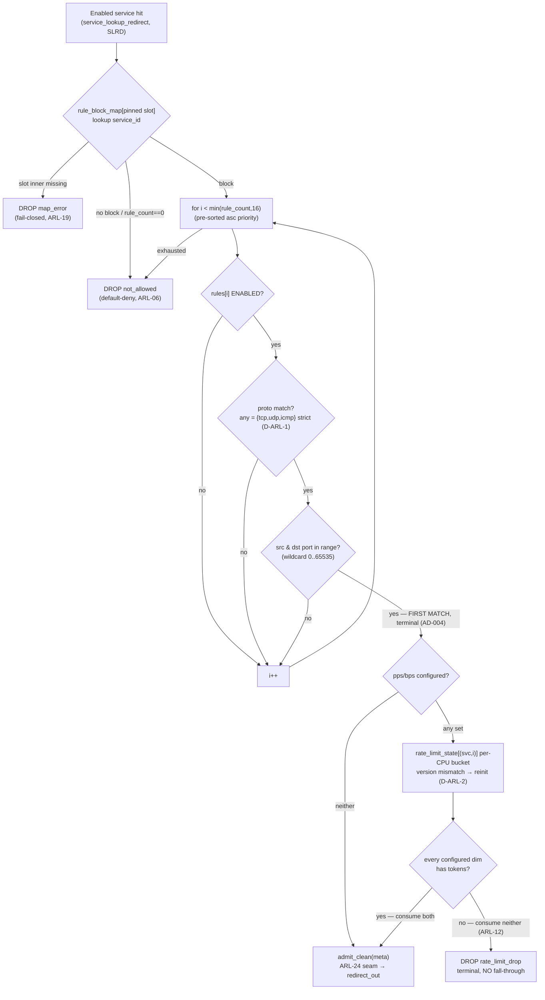

# Allow-Rule Matching & Rate-Limit Design

**Spec**: `.specs/features/allow-rule-ratelimit/spec.md` (ARL-01..25)
**Context**: `.specs/features/allow-rule-ratelimit/context.md` (D-ARL-1 strict `any`; D-ARL-2 reset-on-swap)
**Status**: Approved (2026-07-09) → Tasks

---

## Architecture Overview

The rule stage is one new header (`src/rules.h`) inserted at SLRD's enabled-service hit point
([xdp_gateway.bpf.c](../../../data-plane/src/xdp_gateway.bpf.c) `service_lookup_redirect()`), plus one
slotted config map and one unslotted runtime map:

- **`rule_block_map`** — `ARRAY_OF_MAPS[2]` of `HASH` inners (`service_id → struct rule_block`), the
  same double-buffer shape as `service_map` (AD-005/AD-015). The block's rules are **pre-sorted by
  ascending `priority` at build time**, so the hot path never sees priority: positional order *is*
  match order, and first-match = first array hit. The block carries the service config `version`.
- **`rate_limit_state`** — `PERCPU_HASH` keyed `(service_id, rule_idx)` → per-CPU token bucket
  `{cfg_version, last_ns, pps_tokens, bps_tokens}`. Unslotted (§8.3). **Reset-on-swap (D-ARL-2) is
  implemented lazily**: every bucket touch compares `bucket.cfg_version` against `block.version`; a
  mismatch reinitializes the bucket to full burst. A config swap changes `block.version`, so all the
  service's buckets self-reset on next touch — no worker/loader participation, and the kernel's
  zero-fill of other CPUs' values on element creation (verified, see Research) funnels first-touch
  initialization through the exact same mismatch path (`cfg_version 0 ≠ version ≥ 1`).

Hot path per enabled-service packet:

```
service_lookup_redirect()                            (existing, SLRD)
  └─ enabled hit → allow_rule_stage(ctx, meta, slot) (NEW, rules.h)
       ├─ rule_block_map[slot] lookup fail  → record_drop(DR_MAP_ERROR)      fail-closed  ARL-19
       ├─ no block for service_id           → record_drop(DR_NOT_ALLOWED)    default-deny ARL-06
       ├─ loop i < min(rule_count, 16):                                      ARL-07
       │    skip !ENABLED                                                    ARL-05
       │    proto match (strict any = {6,17,1}, D-ARL-1)                     ARL-03
       │    port match (inclusive, wildcard = 0..65535)                      ARL-04
       │    → first match: meta->rule_idx = i, terminal                      ARL-02/08
       │         no quota configured        → admit                          ARL-11
       │         bucket check (both dims)   → admit / DR_RATE_LIMIT_DROP     ARL-09/10/12
       └─ loop ends, no match               → record_drop(DR_NOT_ALLOWED)    ARL-06
  admit → admit_clean(meta)   /* ARL-24 seam: M3#4 fairness ladder inserts here */
            └─ redirect_out(meta)                    (existing, unchanged)
```



**Rendered diagrams**: `diagrams/rule-stage-flow.{mmd,svg}` (the stage flowchart above) ·
`diagrams/rules-map-layout.{mmd,svg}` (hot-path call chain + slotted-config/unslotted-runtime map split).

---

## Research (verified 2026-07-09; Context7 unavailable, web + kernel docs)

1. **Per-CPU hash semantics from BPF program context** — `bpf_map_update_elem()` / `bpf_map_lookup_elem()`
   on `BPF_MAP_TYPE_PERCPU_HASH` access **only the current CPU's value slot**
   ([kernel map_hash doc](https://docs.kernel.org/bpf/map_hash.html)). With preemption disabled during
   XDP execution, same-CPU access is race-free — no atomics needed in the bucket (same posture as
   `counter_map`/`sample_bucket`).
2. **Other CPUs zero-filled on element creation** — `pcpu_init_value()` (kernel/bpf/hashtab.c) zero-fills
   the non-current CPUs' values when an element is created without `onallcpus` (i.e., from a BPF
   program); holds for prealloc and non-prealloc since the zero-fill fix (≥ v5.10-era; node runs 6.8).
   This is what makes the `cfg_version` lazy-reset scheme sound on every CPU.
3. **Bounded loops** — verifier-supported since 5.3; a `for (i = 0; i < RULE_MAX; i++)` with runtime
   `i >= rule_count` break and constant-bounded array access is standard on 6.8. Confirmed at build/load
   fail-fast in the first task (project convention — de-risk, not assumption), since exact verifier
   behavior with the 520-byte value + loop combination is cheap to prove and expensive to argue.
4. **`ARRAY_OF_MAPS` with `HASH` inner** — SLRD already proved the *harder* case (LPM inner) on this
   kernel; hash inners are the documented common case. Confirmed at the same build/load gate.

---

## Code Reuse Analysis

### Existing Components to Leverage

| Component | Location | How to Use |
| --- | --- | --- |
| Slot double-buffer pattern (`ARRAY_OF_MAPS`[2] + statically declared inners) | `src/xdp_gateway.bpf.c` (`service_map`) | Copy shape for `rule_block_map` (`rule_block_0/1` inners) |
| Pinned `active_slot` in `pkt_meta` | SLRD slot pin | `allow_rule_stage` receives the already-pinned slot — **never re-reads** `active_config` (ARL-01) |
| Token-bucket lazy refill | `src/sample.h` (`sample_drop`) | Same last-ns/refill/cap structure, extended to 2 dims + version reset |
| `record_drop(meta, reason)` | `src/drop_reason.h` | Verdicts 9/10 — exact count + ringbuf sampling for free (ARL-20) |
| `redirect_out(meta)` + `pkt_meta.verdict` + `test_meta_map` | `src/xdp_gateway.bpf.c` | Admit path terminal; tests observe verdict + `rule_idx` device-free |
| Seed helper + pin conventions | `loader/loader.c` | Extend seed with a match-all rule block per seeded service |
| `BPF_PROG_TEST_RUN` harness + packet builders | `tests/test_parse.c`, `tests/pkt_build.h` | All new cases; existing 34 migrated in place |

### Integration Points

| System | Integration Method |
| --- | --- |
| `service_lookup_redirect()` | Enabled-hit branch calls `allow_rule_stage()` instead of `redirect_out()` directly |
| M4 worker (future) | Populates `rule_block_map` inactive inner alongside `service_map`, one `active_slot` flip swaps both; block layout in `rules.h` **is** the contract (rules pre-sorted asc priority, disabled rows included with flag, `version` = service config version, `bps` field in **bytes/sec** — builder converts from the control-plane unit) |
| SRL `allow_rule` rows | Field-for-field mirror: protocol enum → `proto` byte, NULL ranges → `0..65535`, NULL pps/bps → flag bit unset |
| `dpstat` / pinned maps | **Zero change** — indices 9/10 already decode via `drop_reason_name[]` |

---

## Components

### Rule stage — `src/rules.h` — NEW

- **Purpose**: rule-block/bucket map definitions + the whole match/rate-limit stage as one
  `__always_inline` function.
- **Interfaces**:
  - `allow_rule_stage(struct xdp_md *ctx, struct pkt_meta *meta, __u32 slot) -> int (XDP action)` —
    called from the enabled-service hit; internally computes `pkt_len = data_end - data` for `bps`.
  - `admit_clean(struct pkt_meta *meta) -> int` — the ARL-24 seam: today `return redirect_out(meta);`
    with a marked comment; M3 #4 replaces the body with the fairness ladder.
  - Internal: `rule_matches(entry, meta)`, `rl_bucket_admit(block, meta, i, pkt_len)`.
- **Dependencies**: `pkt_meta.h`, `drop_reason.h` (`record_drop`), `service.h` (verdict enum).
- **Reuses**: `sample.h` bucket structure; SLRD map-in-map shape.

### `pkt_meta` extension — `src/pkt_meta.h` — MODIFIED

- `__u8 rule_idx` takes one `_pad` byte (`_pad[3]` → `rule_idx` + `_pad[2]`); `0xFF` = no rule
  (initialized by the stage before the loop). Struct size unchanged — no test-harness ABI churn (A-ARL-8).

### Hot-path wiring — `src/xdp_gateway.bpf.c` — MODIFIED

- `service_lookup_redirect()` enabled branch: `return allow_rule_stage(ctx, meta, slot);` (needs `ctx`
  passed down — signature gains the `xdp_md *`). ARP path untouched (redirects before service lookup).

### Loader seed — `loader/loader.c` — MODIFIED

- Seed inserts, for each seeded service, a `rule_block` `{version = 1, rule_count = 1}` with one
  match-all rule (`any`, wildcard ports, no quotas, enabled) into both `rule_block_0/1` inners — live
  smoke behavior unchanged (clean IPv4 still forwards), demoable without M4 (ARL-21, D-SLRD-1 posture).

### Tests — `tests/test_parse.c` — MODIFIED

- Runner pins itself to CPU 0 at startup (`sched_setaffinity`) so per-CPU bucket assertions are exact
  (`BPF_PROG_TEST_RUN` executes on the calling CPU).
- `seed_rule_block(service_id, block)` helper writing the skeleton's inner maps; existing
  enabled-service cases seed a match-all block (ARL-22 migration); new ARL cases per the test plan below.

### Docs — `TESTING.md` + `data-plane/README.md` — MODIFIED

- TESTING.md: rule-seeding + deterministic-bucket conventions (ARL-25). README: D-ARL-1 note — GRE/ESP
  and all non-TCP/UDP/ICMP IPv4 traffic always drop `not_allowed`; sustained `not_allowed` from tunnel
  traffic is expected, not an anomaly.

---

## Data Models

```c
/* src/rules.h — the M4 build contract (config side) */
#define RULE_MAX 16
#define RULE_PROTO_ANY 0                /* strict: matches only {6, 17, 1} (D-ARL-1) */

enum rule_flags {
    RULE_F_ENABLED = 1 << 0,
    RULE_F_PPS_SET = 1 << 1,            /* unset = unlimited dim (ARL-11); set + 0 = block (ARL-15) */
    RULE_F_BPS_SET = 1 << 2,
};

struct rule_entry {
    __u16 src_lo, src_hi;               /* host order, inclusive; wildcard = 0..65535 (builder */
    __u16 dst_lo, dst_hi;               /*   normalizes NULL and icmp/any ranges to wildcard)  */
    __u64 pps;                          /* packets/sec */
    __u64 bps;                          /* BYTES/sec — builder converts from control-plane unit */
    __u8  proto;                        /* IPPROTO_TCP/UDP/ICMP or RULE_PROTO_ANY */
    __u8  flags;
    __u8  _pad[6];
};                                      /* 32 bytes */

struct rule_block {
    __u32 version;                      /* service config version — bucket reset key (D-ARL-2) */
    __u16 rule_count;                   /* hot path clamps to RULE_MAX (ARL-07) */
    __u16 _pad;
    struct rule_entry rules[RULE_MAX];  /* PRE-SORTED ascending priority; position = match order */
};                                      /* 520 bytes */

/* runtime side (unslotted, §8.3) */
struct rl_key   { __u32 service_id; __u32 rule_idx; };
struct rl_bucket {
    __u32 cfg_version;                  /* != block->version → reinit to full burst; 0 (kernel   */
    __u32 _pad;                         /*   zero-fill on other CPUs) hits the same path         */
    __u64 last_ns;
    __u64 pps_tokens;
    __u64 bps_tokens;
};                                      /* 32 bytes per CPU */
```

**Maps** (all in `rules.h`):

| Map | Type | Size | Notes |
| --- | --- | --- | --- |
| `rule_block_0/1` | `HASH` (inner), key `__u32 service_id`, value `struct rule_block` | 1024 entries | matches `service_inner_*` capacity |
| `rule_block_map` | `ARRAY_OF_MAPS`[2] | 2 | static inner assignment, same as `service_map` |
| `rate_limit_state` | `PERCPU_HASH`, `rl_key → rl_bucket` | 16384 (=1024×16) | **preallocated** (default): no allocator pressure under flood; ~32 B × 16384 × nCPU upfront (≈32 MiB at 64 CPUs) — accepted for a 40G node |
| `rl_config` | `ARRAY`, 1 × `struct rl_config { __u32 test_no_refill; }` | 1 | deterministic test knob (ARL-17); not pinned (test-only, default 0) |

**Bucket math** (per CPU, both dims identical in structure):

- **Split (A-ARL-5 resolved): per-CPU rate = configured rate ÷ nCPU** (`nr_cpus` baked into the block
  by the builder? No — computed once by the loader? Neither: **stored per-entry at build time is wrong**
  and hot-path `bpf_num_possible_cpus` doesn't exist; the stage uses a `const volatile __u32 rl_ncpus`
  **rodata constant set by the loader/test harness before load** — verifier-visible constant, zero
  hot-path cost). Sustained node admit ∈ [rate/nCPU, rate]: **never above the configured rate**
  (fail-closed; undershoot only when matched traffic concentrates on few RSS queues, which aggregate
  rule quotas under distributed flood do not). This is the documented ARL-14 bound. Contrast AD-017
  deliberately chose full-budget-per-CPU for *sampling* (observability must not starve); enforcement
  limits invert the priority.
- **Refill**: remainder-preserving ns-granular refill —
  `grant = min(now − last_ns, 1 s) × rate_percpu / NSEC_PER_SEC`; if `grant > 0`,
  `last_ns += grant × NSEC_PER_SEC / rate_percpu` (fractional time is never discarded, so quotas
  smaller than nCPU still admit at the correct long-run rate: one token per `nCPU/rate` seconds per
  CPU); tokens capped at burst. Two u64 divisions, only on packets that matched a quota'd rule;
  elapsed capped at 1 s before multiply → no u64 overflow (1e9 ns × rate ≤ 2^32 ≈ 4.3e18 < 2^64).
- **Burst** = 1 second of per-CPU rate, floored at 1 token (`max(rate_percpu, 1)`); node-instantaneous
  transient bound = rate + nCPU tokens, documented.
- **Deterministic mode** (`test_no_refill = 1`): bucket init loads `pps`/`bps` values as the *entire*
  token budget and refill is skipped — a rule with `pps = 3` admits exactly 3 packets on the pinned
  CPU, forever (the AD-017 `rate=0, burst=B` pattern expressed through the rule's own quota fields).
- **Admission (ARL-09/12)**: evaluate `pps_ok`/`bps_ok` for configured dims first, consume **both only
  if all pass**; a drop consumes nothing.
- **Miss path**: build the bucket locally (post-consumption state), decide, then
  `bpf_map_update_elem(BPF_ANY)` — current CPU gets the real state, other CPUs zero-fill into the
  version-mismatch reinit path. Update failure (map full — impossible at 1024×16 sizing unless foreign
  interference) → fail closed `DR_MAP_ERROR` (ARL-19 posture).

---

## Error Handling Strategy

| Error Scenario | Handling | Observable As |
| --- | --- | --- |
| `rule_block_map[slot]` inner lookup fails | `record_drop(DR_MAP_ERROR)` | `map_error` counter (fail-closed, ARL-19) |
| No `rule_block` for matched `service_id` | `record_drop(DR_NOT_ALLOWED)` | default-deny (ARL-06) — seed gap ≠ error |
| `rule_count > 16` (corrupt/foreign writer) | clamp to 16, evaluate normally | at most 16 rules considered (ARL-07) |
| No enabled rule matches | `record_drop(DR_NOT_ALLOWED)` | `not_allowed` counter (ARL-06) |
| Matched rule out of quota (any configured dim) | `record_drop(DR_RATE_LIMIT_DROP)` | `rate_limit_drop` counter, terminal (ARL-10) |
| `rate_limit_state` insert fails | `record_drop(DR_MAP_ERROR)` | fail-closed — never "no bucket = free pass" |
| Non-TCP/UDP/ICMP IPv4 (GRE, ESP, …) | unmatchable → `not_allowed` (D-ARL-1) | documented expected behavior (README note) |
| Config swap mid-flood | buckets lazily reinit via version mismatch | one extra burst per apply (D-ARL-2, accepted) |

---

## Test Plan (dp-unit unless noted)

1. **Migration (ARL-22)**: match-all block seeded for the existing enabled-service cases; full previous
   suite green.
2. **First-match order**: UDP:53 against `[tcp/80, udp dst 53]` → admits via index 1; `rule_idx == 1`
   in `test_meta_map`.
3. **Terminal no-fall-through (ARL-02/10)**: quota'd rule at position 0, match-all at 1; exhaust quota →
   `rate_limit_drop`, position-1 admits none of the overflow; counter 10 exact.
4. **Default-deny (ARL-06)**: zero-rule block and absent block → `not_allowed`; counter 9 exact.
5. **Disabled skip (ARL-05)**: disabled specific rule + enabled later rule → later rule matches.
6. **Strict `any` (D-ARL-1)**: GRE-protocol IPv4 packet vs match-all `any` block → `not_allowed`.
7. **Port boundaries (ARL-04)**: dst 79/80/81 vs range 80–80; src-range-only rule; wildcard checks.
8. **Quota semantics**: no-quota rule always admits (ARL-11); `pps=0` + `PPS_SET` always drops (ARL-15);
   `bps` dimension exhausts by bytes; pps-exhausted drop leaves `bps_tokens` untouched (ARL-12).
9. **Deterministic buckets (ARL-17)**: `test_no_refill=1`, `pps=3` → exactly 3 admits then drops (CPU-pinned).
10. **Reset-on-swap (D-ARL-2)**: exhaust quota → rewrite block with `version+1` → next packet admits.
11. **Clamp (ARL-07)**: `rule_count = 99` seeded → behaves as 16.
12. **Fail-closed (ARL-19)**: verify via the existing bad-slot/trigger pattern where feasible.
13. **Live smoke (dp-integration, gated)**: existing `make smoke` unchanged — seed's match-all block keeps
    TTL/checksum forwarding assertions green (ARL-23).

---

## Tech Decisions (non-obvious ones)

| Decision | Choice | Rationale |
| --- | --- | --- |
| Priority representation | **Not in the map** — builder pre-sorts, position = order | Removes a compare + field from 16 hot-path iterations; the DB's `UNIQUE(service_id, priority)` already guarantees a total order; contract documented in `rules.h` |
| Disabled rules | Included in block with `RULE_F_ENABLED` unset, kernel skips | Keeps the M4 builder a dumb row-copier; ARL-05 stays a *data-plane* behavior tests can exercise |
| Bucket reset (D-ARL-2 realization) | `cfg_version` in bucket vs `version` in block, lazy compare | Zero worker plumbing; kernel zero-fill funnels first-touch through the same path; no reset storms (per-touch, per-CPU) |
| Per-CPU split (A-ARL-5) | rate ÷ nCPU via `const volatile` rodata `rl_ncpus`; remainder-preserving refill | Node admit never exceeds configured rate (fail-closed enforcement); small quotas still correct long-run via `last_ns` advance-by-grant; loader sets rodata before load (established `const volatile` idiom) |
| `bps` map unit | bytes/sec in the map; conversion is the builder's job | One multiply-free compare on the hot path; unit note pinned in `rules.h` so M4 can't misread it |
| Bucket storage | `PERCPU_HASH`, preallocated, insert-on-miss from BPF | Verified current-CPU-only semantics; prealloc = no allocator pressure under flood; 16384 sized to the product cap (1000 services × 16) |
| Test determinism | `rl_config.test_no_refill` + runner CPU-pinning | Reuses AD-017's pattern through the rule's own quota fields; pinning makes per-CPU budgets exact |
| Stage placement | Separate `rules.h`, single call from `service_lookup_redirect` | M3 #2/#3 insert *before* the call site, fairness (#4) replaces `admit_clean`'s body — three marked seams, no rewiring |
