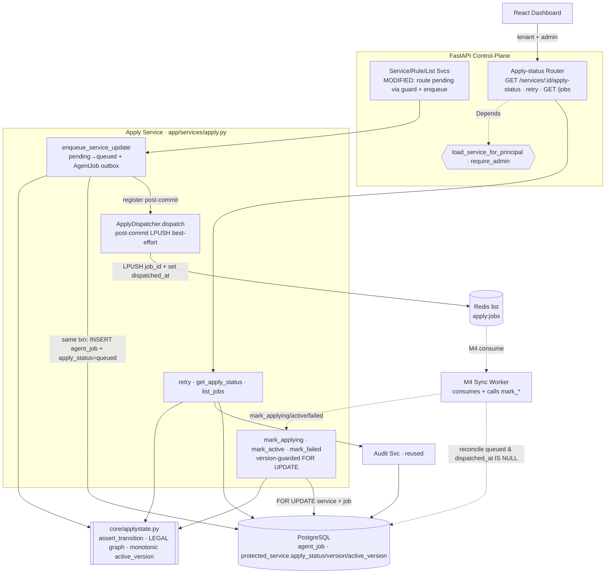
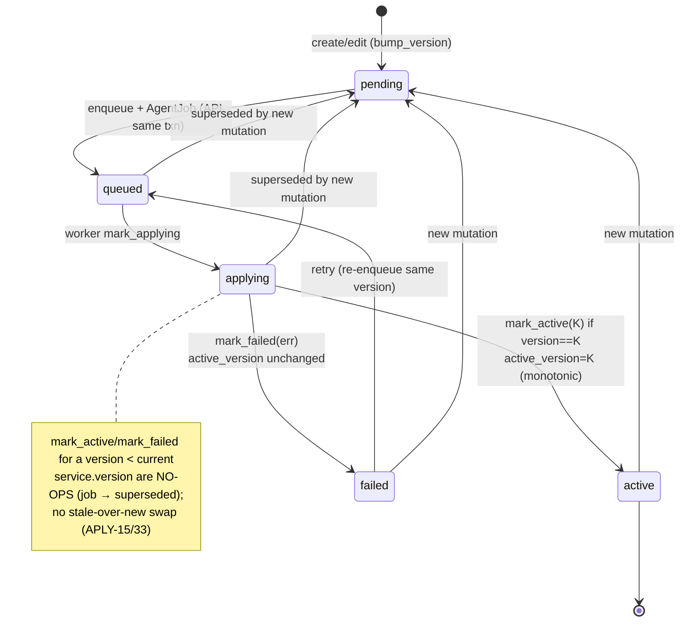
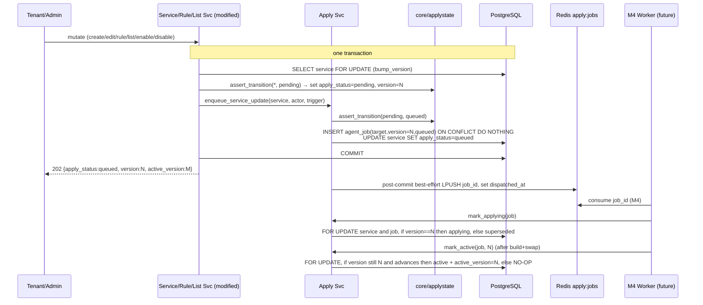

# Apply-status State Machine Design

**Spec**: `.specs/features/apply-status/spec.md` (APLY-01..40)
**Context**: `.specs/features/apply-status/context.md` (D-APLY-1..3, A-APLY-1..6)
**Status**: Draft (awaiting approval → Tasks)
**Depends on**:
- **Service, rule & list management** (`.specs/features/service-rule-list/design.md`) — reuses the
  `ProtectedService.apply_status` / `version` / `active_version` columns and the `ApplyStatus` enum it
  defines; reuses `load_service_for_principal` (deps) and `bump_version(db, service_id)`. **Modifies** its
  `services`/`rules`/`lists` service methods (and `bump_version`) to route the config-version transition
  through the shared guard and to enqueue after the committed write — the same cross-feature-modification
  pattern service-rule-list itself used on tenant-cidr's `revoke`. Requires it executed first.
- **Auth & RBAC** (`.specs/features/auth-rbac/design.md`) — reuses `get_current_user`, `require_admin`,
  `authorize_tenant_resource`/`scope_to_tenant`, `audit.record_event`, and the **Redis client** wired into
  the app lifespan (same instance as the session store; PRD 6.8 namespaced keys).

---

## Architecture Overview

Same layered FastAPI control-plane (**routers → services → stores**). This feature adds **one table**
(`agent_job`), **one pure guard module** (`app/core/applystate.py`), **one stateful service**
(`app/services/apply.py`) with a thin **Redis dispatcher**, **one router**
(`app/api/routers/apply_status.py`), and one Alembic revision. It writes nothing to the data-plane and
runs no worker loop — it owns the **control-plane half** of config propagation (TDD 4.5): the state
machine, the API-side enqueue, and the transition functions the M4 worker will call.

Three ideas carry the whole design:

1. **One guard, two callers (D-APLY-2).** Every apply-status transition — the API's `pending→queued`, a
   mutation's supersede-to-`pending`, and the worker's `applying→active|failed` — routes through a single
   pure function `assert_transition(current, target)` in `app/core/applystate.py`. It is the one place the
   legal graph lives (APLY-01/03), unit-testable with zero I/O, and identical whether the API or the
   (future) M4 worker calls it.
2. **Transactional outbox (A-APLY-1).** The `agent_job` row is written **in the same transaction** as the
   config change + `version` bump, so a rolled-back mutation leaves no job (APLY-08) and a committed one
   can never lose its job (APLY-27). The Redis `LPUSH` is a **post-commit, best-effort notification** — the
   `agent_job` row is the durable queue of record; the M4 worker reconciles undelivered rows from the DB.
3. **Version-guarded terminal transitions (A-APLY-3).** The worker's `mark_active`/`mark_failed` take a
   `SELECT … FOR UPDATE` on the service row — the **same lock** `bump_version` takes — and no-op if the
   service's `version` has moved past the job's version. That single interlock is what enforces "no
   stale-over-new swap" (APLY-13/15/33/34) without any job-cancellation machinery, and `active_version`
   only ever advances (APLY-02).

**Component view** — source: `diagrams/component-architecture.mmd` · rendered: `diagrams/component-architecture.svg`



**State machine** (service `apply_status`) — source: `diagrams/apply-state-machine.mmd` · rendered: `diagrams/apply-state-machine.svg`



**Enqueue + apply sequence (outbox + version guard)** — source: `diagrams/enqueue-apply-sequence.mmd` · rendered: `diagrams/enqueue-apply-sequence.svg`



---

## Research Notes (Knowledge Verification Chain)

- **Step 1 (Codebase):** control-plane not yet executed (auth-rbac / tenant-cidr / service-rule-list are
  "awaiting approval → Execute"). No runtime code to reuse; their **designs** are authoritative and honored
  (layering, guard/audit signatures, `ApplyStatus` enum + service columns, `bump_version`'s `FOR UPDATE`,
  the "modify a prior feature's service" precedent, the shared Redis client in lifespan). No `CONCERNS.md`
  exists — nothing flagged fragile to mitigate.
- **Step 2 (Project docs):** TDD 4.5 (apply-status sequence: DB pending + audit → enqueue [queued] → 202 →
  worker applying → active/failed; reliability: idempotent by job_id/version, no stale-over-new swap, worker
  restart safe), TDD 4.6 (202 body `{apply_status, version, active_version}`), TDD 9.1/9.2 (admin surfaces
  map active version + apply status + worker backlog), AD-005 (double-buffer swap the worker ultimately
  drives — M4), AD-008 (`redis.asyncio`, `compose.test.yml`). All honored.
- **Step 3 (Context7 MCP):** not available in this environment (per prior designs) — skipped.
- **Step 4 (Web / established patterns):** the **transactional outbox** (write the job in the business txn,
  publish to the broker post-commit, reconcile undelivered rows) is a standard, unopinionated reliability
  pattern; version-guarded idempotent consumers are likewise standard. No library API is being invented —
  `assert_transition`, `enqueue_service_update`, `mark_*`, `ApplyDispatcher.dispatch` are **our** contracts.
- **Step 5 (Flagged uncertain):** two are **choices**, not uncertainties, recorded under Tech Decisions —
  (a) Redis **list** (`LPUSH`/`BRPOP`) as the dispatch channel vs a Redis **Stream** (consumer groups):
  chosen a list because the DB `agent_job` ledger is the durable queue of record, so Redis is only a
  low-latency notification; M4 may upgrade to a Stream behind the unchanged `ApplyDispatcher` boundary
  without touching the state machine. (b) `last_error`/`last_applied_at` **derived** from the latest
  `agent_job` on read vs **denormalized** onto `protected_service`: chosen derived, to avoid modifying
  service-rule-list's model/migration.

---

## Code Reuse Analysis

### Existing components to leverage

| Component | Location | How to use |
| --- | --- | --- |
| `ApplyStatus` enum + `apply_status`/`version`/`active_version` columns | `app/db/models.py` (service-rule-list) | The single status store (APLY-05) — no duplicate; this feature drives the transitions |
| `bump_version(db, service_id)` (`SELECT … FOR UPDATE`, `version+=1`, `apply_status=pending`) | `app/services/services.py` | **Modified** to set `pending` via the guard; its `FOR UPDATE` is the serialization point the `mark_*` functions re-take (APLY-13/15) |
| `load_service_for_principal` | `app/core/deps.py` | Ownership + 404-cross-tenant loader for the read/retry routers (APLY-24) |
| `require_admin`, `authorize_tenant_resource` | `app/core/deps.py` | Admin-only `GET /jobs` (APLY-32); tenant scoping on the per-service read |
| `audit.record_event(db, …)` | `app/services/audit.py` | Audit the **retry** action (APLY-29); automatic transitions are recorded on `agent_job`, not audited |
| Redis client (app lifespan) | `app/main.py` / app state | Enqueue-only `apply:jobs` namespace on the same instance (PRD 6.8) |
| `Base`, session/lifespan, Alembic harness | `app/`, `migrations/` | Extend; new revision only |

### This feature establishes (for reuse by later features)

| Primitive | Location | Reused by |
| --- | --- | --- |
| `assert_transition` + `LEGAL_APPLY` graph (pure guard) | `app/core/applystate.py` | **M4 worker** (the same guard governs its transitions); any future apply target |
| `AgentJob` model + `agent_job` table | `app/db/models.py` | **M4 worker** (consume + `mark_*`), M5 telemetry (job status/backlog), M6 alerting (apply failures) |
| `mark_applying` / `mark_active` / `mark_failed` (version-guarded) | `app/services/apply.py` | **M4 worker** — the only new caller; it adds no transition logic |
| `ApplyDispatcher` (dispatch boundary) | `app/services/apply.py` | M4 may swap the Redis list for a Stream without touching the machine |
| `enqueue_service_update` | `app/services/apply.py` | M4 `FEED_SYNC` / global-list apply reuse the enqueue shape (D-APLY-3 targets added there) |

### Integration points

| System | Integration method |
| --- | --- |
| PostgreSQL | One new table `agent_job`; `UNIQUE(target_type,target_id,version)` (idempotency); indexes on `status` and `(target_type,target_id)`; FK `agent_job.target_id → protected_service.id` **ON DELETE CASCADE** (a deleted service's jobs go with it) |
| Alembic | One revision, `down_revision = <service-rule-list head>`; adds `agent_job` + enums |
| Redis | Same instance as sessions; enqueue-only `apply:jobs` list (`LPUSH`); `dispatched_at` marks delivery; **no consumer in M1** (jobs wait for M4) |
| service-rule-list services | **Modified**: `bump_version` sets `pending` via the guard; `create/update/set_enabled/size_plan/delete` (services), rule CRUD, list CRUD call `enqueue_service_update` after the committed bump; routers return **202 queued** for mutations (was 201/200 pending) |
| Auth & RBAC guards / audit | Imported unchanged |
| React dashboard | Per-service apply badge (status + version vs active_version), retry button on `failed`, admin backlog view (M5 wires UI) |

---

## Components

### Apply-state guard — `app/core/applystate.py` (pure, unit-tested) — NEW
- **Purpose**: the single source of truth for legal `apply_status` transitions + the monotonic
  `active_version` rule; zero I/O (APLY-01/03).
- **Interfaces**:
  - `LEGAL_APPLY: dict[ApplyStatus, frozenset[ApplyStatus]]` — the transition table (below).
  - `assert_transition(current: ApplyStatus, target: ApplyStatus) -> None` — raises
    `IllegalTransition` unless `target in LEGAL_APPLY[current]` (APLY-01).
  - `assert_active_version_advances(active_version: int | None, new: int) -> None` — raises
    `NonMonotonicVersion` unless `new > (active_version if not None else -1)` (APLY-02).
  - `is_terminal(job_status: JobStatus) -> bool` — `succeeded`/`failed`/`superseded` (for idempotent
    `mark_*` no-ops, APLY-34).
- **Dependencies**: the enums only. **Reuses**: `ApplyStatus`. **Establishes** the transition contract.

### Apply service — `app/services/apply.py` — NEW
- **Purpose**: the stateful side — enqueue (outbox), the worker-facing transitions, retry, and reads.
- **Interfaces**:
  - `enqueue_service_update(db, service, actor, trigger: ChangeTrigger) -> AgentJob` — called **inside the
    mutation txn** right after `bump_version` (service is `pending`); `assert_transition(pending, queued)`;
    `INSERT agent_job(target='service', target_id, version=service.version, status=queued) ON CONFLICT
    (target_type,target_id,version) DO NOTHING` (idempotent, APLY-26); `service.apply_status = queued`;
    registers `job.id` for **post-commit** dispatch. Returns the job (APLY-06/07/09/10).
  - `mark_applying(db, job_id) -> None` — `FOR UPDATE` service+job; terminal-job → no-op; `version` moved
    on → mark job `superseded` (APLY-15); else `assert_transition(queued, applying)`,
    `service.apply_status=applying`, `job.status=applying`, `started_at`, `attempts+=1` (APLY-12).
  - `mark_active(db, job_id) -> None` — same lock/guards; `assert_transition(applying, active)` +
    `assert_active_version_advances`; sets `service.apply_status=active`, `active_version=job.version`,
    `job.status=succeeded`, `finished_at` (APLY-13/02/17). Stale/terminal → no-op (APLY-15/33/34).
  - `mark_failed(db, job_id, error) -> None` — `assert_transition(applying, failed)`;
    `service.apply_status=failed`, `job.status=failed`, `job.error=error[:LIMIT]`, `finished_at`;
    `active_version` untouched (APLY-14/04/39). Stale/terminal → no-op.
  - `retry(db, service, actor) -> AgentJob` — only if `apply_status==failed` (else 409); `FOR UPDATE`;
    `assert_transition(failed, queued)`; reset the current-version job (`status=queued`, clear
    `error/started_at/finished_at/dispatched_at`); `audit.record_event(action="apply.retry")`; register
    dispatch (APLY-29/30).
  - `get_apply_status(db, service) -> ApplyStatusView` — assembles `{apply_status, version,
    active_version, last_error, last_applied_at, latest_job}` from the service + its latest `agent_job`
    (APLY-22/23).
  - `list_jobs(db, *, status: JobStatus | None) -> Sequence[AgentJob]` — admin backlog view (APLY-31).
- **Dependencies**: models, `core/applystate`, audit, `ApplyDispatcher`. **Reuses**: audit; the service
  row-lock convention from `bump_version`.

### Apply dispatcher — `app/services/apply.py::ApplyDispatcher` — NEW (thin boundary)
- **Purpose**: the post-commit publish + delivery marker; the seam M4 swaps.
- **Interfaces**:
  - `dispatch(job_id) -> None` — `LPUSH apply:jobs job_id`; on success `UPDATE agent_job SET
    dispatched_at=now()`; on Redis error **log and return** (row stays `dispatched_at IS NULL` for M4
    reconcile — APLY-27/36). Never raises into the request path.
- **Dependencies**: Redis client. **Reuses**: app-lifespan Redis. **Establishes** the dispatch boundary.
- **Post-commit ordering**: dispatch runs **after** the mutation txn commits (registered during
  `enqueue_service_update`, flushed by the router/service wrapper) — never before, so a rolled-back
  mutation dispatches nothing (APLY-08).

### API router — `app/api/routers/apply_status.py` — NEW
- **Endpoints** (thin: guards → service call → map domain errors):
  - `GET /services/{id}/apply-status` — per-service view; `load_service_for_principal` (tenant 404,
    admin any) (APLY-22/24/25).
  - `POST /services/{id}/apply-status/retry` — retry a `failed` apply; owner/admin; 409 if not `failed`
    (APLY-29).
  - `GET /jobs?status=` — **`require_admin`**; backlog list (APLY-31/32).
- Response schemas in `app/api/schemas/apply.py` (Pydantic). **Dependencies**: apply service, deps.

### Modifications to service-rule-list — `app/services/{services,rules,lists}.py`
- `bump_version` — set `apply_status` via `assert_transition(current, pending)` then `pending` (routes
  supersede through the guard; APLY-18/03).
- Each mutating method (`create_service`, `update_service`, `set_enabled`, `size_plan`, `delete_service`;
  rule create/update/delete; whitelist/blacklist add/remove) — after `bump_version`, call
  `enqueue_service_update(db, service, actor, trigger=<kind>)` in the same txn, and dispatch post-commit
  (APLY-09/10). `delete_service` is the exception (no enqueue for a hard-deleted service — see Edge below).
- The corresponding routers return **202 Accepted** with `{apply_status, version, active_version}` for
  mutations (was 201/200 `pending`) (APLY-07).

---

## Data Models — `app/db/models.py` (new)

```python
class JobStatus(str, Enum):
    queued = "queued"; applying = "applying"
    succeeded = "succeeded"; failed = "failed"; superseded = "superseded"

class JobType(str, Enum):
    service_update = "SERVICE_UPDATE"          # v1 sole value (A-APLY-2); FEED_SYNC/… are M4

class ChangeTrigger(str, Enum):                # informational: what mutation created the job
    service = "service"; plan = "plan"; rule = "rule"
    whitelist = "whitelist"; blacklist = "blacklist"
    enable = "enable"; disable = "disable"

class AgentJob(Base):
    id: UUID                       # PK uuid4 = job_id
    target_type: str               # "service" (enum kept open for global_list/feed in M4, D-APLY-3)
    target_id: UUID                # FK protected_service.id  ON DELETE CASCADE
    version: int                   # the ProtectedService.version this job materializes
    job_type: JobType              # SERVICE_UPDATE
    trigger: ChangeTrigger         # observability only
    status: JobStatus              # queued → applying → succeeded|failed ; or → superseded
    error: str | None              # populated on failed (truncated)
    attempts: int                  # default 0; +1 on (re)dispatch / mark_applying
    dispatched_at: datetime | None # set when LPUSH succeeds; NULL = needs (re)dispatch (outbox marker)
    created_at: datetime
    started_at: datetime | None    # mark_applying
    finished_at: datetime | None   # mark_active (succeeded) / mark_failed
    __table_args__ = (
        # idempotency: one job per (target, version) — enqueue is ON CONFLICT DO NOTHING (APLY-26)
        UniqueConstraint("target_type", "target_id", "version",
                         name="agent_job_target_version_unique"),
        Index("ix_agent_job_status", "status"),                     # admin backlog (APLY-31)
        Index("ix_agent_job_target", "target_type", "target_id"),   # latest-job lookup (APLY-23)
    )
```

**Reused (unchanged) — `ProtectedService`** (service-rule-list): `apply_status: ApplyStatus`,
`version: int`, `active_version: int | None`. This feature is the writer of the non-`pending` transitions
and `active_version`; `version` remains owned by `bump_version` (A-SRL-3). No new columns on
`protected_service` (`last_error`/`last_applied_at` are **derived** on read).

**Relationships**: `agent_job.target_id → protected_service.id` (**CASCADE** — jobs disappear with a
hard-deleted service, consistent with D-SRL-2 teardown).

---

## The state machine (crux)

**Transition table** (`LEGAL_APPLY`, service `apply_status`):

| From \ To | pending | queued | applying | active | failed |
| --- | :---: | :---: | :---: | :---: | :---: |
| **pending** | (self) | ✅ enqueue | — | — | — |
| **queued** | ✅ supersede | — | ✅ worker start | — | — |
| **applying** | ✅ supersede | — | — | ✅ swap ok | ✅ swap fail |
| **active** | ✅ new mutation | — | — | — | — |
| **failed** | ✅ new mutation | ✅ retry | — | — | — |

Everything not ✅ is rejected by `assert_transition` (e.g. `pending→active`, `queued→active`,
`failed→active`, `active→applying`). Supersede (`→ pending`) is legal from any live state because a new
config version can always be written; it is performed by the (guarded) `bump_version`, and the version
guard below — not cancellation — makes the superseded in-flight job harmless.

**Version guard (the interlock that forbids stale-over-new, APLY-13/15/33/34):**
```
async def mark_active(db, job_id):
    job = await load_for_update(db, AgentJob, job_id)
    if is_terminal(job.status):            # at-least-once re-delivery → idempotent no-op (APLY-34)
        return
    svc = await load_for_update(db, ProtectedService, job.target_id)  # SAME lock bump_version takes
    if svc.version != job.version:         # a newer mutation superseded this job
        job.status = JobStatus.superseded; job.finished_at = now()    # APLY-15/33 — drop the stale result
        return
    assert_transition(svc.apply_status, ApplyStatus.active)           # applying → active
    assert_active_version_advances(svc.active_version, job.version)   # monotonic (APLY-02)
    svc.apply_status = ApplyStatus.active
    svc.active_version = job.version                                  # only forward
    job.status = JobStatus.succeeded; job.finished_at = now()
```
`mark_applying`/`mark_failed` follow the same load→terminal-check→version-check→`assert_transition` shape.
Because mutations and `mark_*` contend on the **same** `protected_service` row lock, a supersede that
commits before a `mark_active` is always observed as `svc.version > job.version` → dropped; one that
commits after finds a fresh `pending/queued` state and its own newer job proceeds. No job is cancelled.

**Transactional outbox (enqueue, APLY-06/08/26/27):**
```
# inside the mutation's transaction, after bump_version (service is 'pending', version=N):
assert_transition(ApplyStatus.pending, ApplyStatus.queued)
INSERT INTO agent_job(id, target_type='service', target_id=:sid, version=N,
                      job_type='SERVICE_UPDATE', trigger=:kind, status='queued')
       ON CONFLICT (target_type, target_id, version) DO NOTHING        # idempotent (APLY-26)
UPDATE protected_service SET apply_status='queued' WHERE id=:sid
register_post_commit_dispatch(job_id)                                  # flushed AFTER commit
# ── COMMIT ──  (job + config change atomic; rollback ⇒ no job, APLY-08)
# post-commit, best-effort:  LPUSH apply:jobs job_id ; UPDATE agent_job SET dispatched_at=now()
#   Redis down ⇒ log, leave dispatched_at NULL; row is the queue of record, M4 reconciles (APLY-27/36)
```

---

## Error Handling Strategy

| Scenario | Handling | Client / caller sees |
| --- | --- | --- |
| Committed mutation | outbox INSERT + `pending→queued`, post-commit dispatch | **202** `{apply_status:queued, version:N, active_version:M}` (APLY-07) |
| Mutation txn rolled back | job is in the same txn | **no** `agent_job` row, no dispatch (APLY-08) |
| Same `(target,version)` enqueued twice | `ON CONFLICT DO NOTHING` | one job (idempotent, APLY-26) |
| Redis unavailable at dispatch | logged; `dispatched_at` stays NULL | mutation still **202** committed; apply recoverable by M4 reconcile (APLY-27/36) |
| Illegal transition requested | `assert_transition` raises `IllegalTransition` | **500** internal (a bug — never a client path; asserted in tests) (APLY-01) |
| `mark_active`/`mark_failed` for superseded version | version guard | **no-op**, job → `superseded` (APLY-15/33) |
| `mark_*` re-delivered for a terminal job | `is_terminal` check | **no-op** (APLY-34) |
| `active_version` would not advance | `assert_active_version_advances` | rejected (`NonMonotonicVersion`) (APLY-02/40) |
| Retry when service not `failed` | `apply_status` precheck | **409** (APLY-29) |
| `tenant_user` reads another tenant's apply-status | `load_service_for_principal` | **404**, zero leak (APLY-24) |
| `tenant_user` calls `GET /jobs` | `require_admin` | **403** (APLY-32) |
| Failed apply | `active_version` unchanged; `apply_status=failed` + `last_error` | last-good config stays live (APLY-04/39); alerted in M6 |
| DB unavailable | fail closed | **503**, no write |

---

## Tech Decisions (non-obvious)

| Decision | Choice | Rationale |
| --- | --- | --- |
| One guard for all callers | Pure `assert_transition` in `core/applystate.py` | Single source of truth (APLY-03); unit-testable with no I/O; identical for API + M4 worker |
| Enqueue durability | **Transactional outbox** — `agent_job` written in the mutation txn; Redis `LPUSH` post-commit | Atomic with the config change: no phantom job (APLY-08), no lost job (APLY-27); decouples persistence from queue availability (A-APLY-1) |
| Dispatch channel | Redis **list** `apply:jobs` (`LPUSH`), DB ledger is the queue of record | Redis is only a low-latency notification; M4 can upgrade to a Stream behind `ApplyDispatcher` unchanged |
| Idempotency | `UNIQUE(target_type,target_id,version)` + `ON CONFLICT DO NOTHING` | At-least-once/retry never double-creates a job (APLY-26); version-per-job = natural key |
| No stale-over-new | Version check under the **same `protected_service` FOR UPDATE lock** `bump_version` uses | One interlock enforces correctness (APLY-15) — no job-cancellation subsystem (A-APLY-3) |
| Superseded job state | Terminal `superseded` on the job | Backlog view isn't polluted by jobs stuck at `applying`; observable drop |
| `mark_*` idempotency | No-op if `is_terminal(job.status)` | Safe under at-least-once redelivery / two workers (APLY-34) |
| `active_version` | Monotonic, set only by `mark_active` | Failed apply keeps prior live config (APLY-04); enables future forward-rollback (OP-05) |
| `last_error`/`last_applied_at` | **Derived** from latest `agent_job` on read | No column churn on service-rule-list's model/migration (A-APLY-5) |
| Read surface | Dedicated `GET /services/{id}/apply-status` + admin `GET /jobs`; base service GET unchanged | Minimizes cross-feature schema modification; base GET already carries status/version/active_version (SRL-05) |
| Transitions & audit | Only **retry** (a user action) is audited; automatic `mark_*` recorded on `agent_job` | The triggering mutation is already audited by service-rule-list; worker transitions are system events (alerted, not audited) |
| Cross-feature wiring | **Modify** service-rule-list's services + `bump_version` (not a wrapper/event bus) | Mirrors the established precedent (service-rule-list modified tenant-cidr `revoke`); explicit and testable |
| `agent_job` FK | `ON DELETE CASCADE` from `protected_service` | A hard-deleted (disabled-first) service takes its jobs with it (D-SRL-2) |

---

## Testing Notes (feeds Tasks / TESTING.md)

- **Unit** (`@pytest.mark.unit`, `[P]`-eligible): `core/applystate` — full `assert_transition` truth table
  (every legal ✅ passes, a representative set of illegal edges raises), `assert_active_version_advances`
  (NULL→N ok, N→N and N→N-1 raise), `is_terminal`. Pure, no DB.
- **Integration** (`compose.test.yml` PG+Redis, sequential): **outbox** (committed mutation → exactly one
  `agent_job(queued)` + service `queued` + 202; rolled-back mutation → zero jobs — APLY-08); **idempotent
  enqueue** (same version twice → one row — APLY-26); **dispatch** (`LPUSH` observed; Redis-down → mutation
  still commits, `dispatched_at` NULL — APLY-27/36); **happy path** (`mark_applying`→`mark_active` →
  `active`, `active_version=N`, `last_applied_at` set — APLY-12/13); **supersede** (enqueue N, mutate→N+1,
  `mark_active(N)` → no-op + job `superseded`, `active_version` still M; `mark_active(N+1)` → advances —
  APLY-15/18/33); **failed keeps active** (`mark_failed` → `failed`+`last_error`, `active_version`
  unchanged — APLY-04/14/39); **at-least-once** (`mark_active` twice → one advance, second no-op —
  APLY-34); **monotonic** (attempt to lower `active_version` → rejected — APLY-02); **retry** (drive
  `failed`, retry → `queued`+re-dispatch+audit; retry when not failed → 409 — APLY-29/30); **isolation**
  (tenant reads own apply-status; cross-tenant → 404; `GET /jobs` tenant → 403 — APLY-24/32); **Alembic
  `upgrade head`** builds `agent_job` + `agent_job_target_version_unique` (assert constraint present).
- **Gate**: the `core/applystate` unit task → **quick**; everything touching PG/Redis → **full**. The
  model/migration task cites the expected constraint name in `Done when`.

---

## Open Questions / Flags (confirm before or during Tasks)

1. **Dispatch channel** = Redis **list** `apply:jobs` (`LPUSH`), DB ledger as queue of record; M4 may
   upgrade to a Stream behind `ApplyDispatcher`. Confirm the list is acceptable for v1 (A-APLY-1 outbox
   makes the choice non-load-bearing).
2. **Post-commit dispatch mechanism** — proposed a request/service-scoped "pending dispatches" list flushed
   right after `await db.commit()` in the (modified) service methods; SQLAlchemy `after_commit` event is the
   alternative. Either keeps dispatch strictly post-commit; pick in Tasks.
3. **`delete_service` enqueues nothing** — a hard-deleted service is gone from `service_map`; the delete's
   propagation (removing it from the data-plane) is the **service's own last** state change. Proposed: the
   *disable* that must precede delete (D-SRL-2) already enqueued a `disable` job that drops its traffic, so
   delete itself needs no apply job. Confirm (vs a tombstone `SERVICE_DELETE` job for M4 map GC).
4. **`error` truncation length** on `agent_job.error` — proposed 2000 chars. Confirm.
5. **`GET /jobs` scope** — admin-only, node-wide (all tenants). A tenant sees only their services' status
   via the per-service read (no tenant job-list in v1). Confirm.
6. **Alembic `down_revision`** pins to the service-rule-list migration head (this feature requires it
   executed first) — confirm the ordering when both are approved for Execute.
