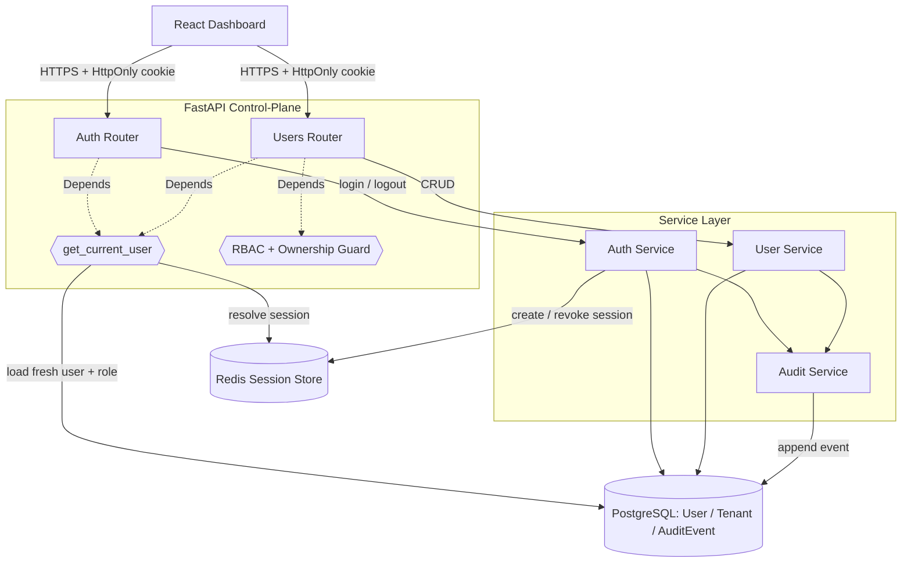

# Auth & RBAC Design

**Spec**: `.specs/features/auth-rbac/spec.md`
**Status**: Implemented (T1-T12 verified)
**Scope note**: Greenfield — this is the **first backend feature**, so it also establishes the control-plane project skeleton and two reusable primitives (RBAC/ownership guard, audit writer) that every later M1+ feature consumes.

---

## Architecture Overview

A layered FastAPI control-plane: **routers → services → stores**. Authentication uses **server-side opaque sessions in Redis** (confirmed default from spec decision #1); authorization is enforced by FastAPI dependencies that run *before* every handler and fail closed. Every mutation flows through a shared **audit writer** in the same DB transaction as the change.

**Component architecture** — source: [diagrams/component-architecture.mmd](diagrams/component-architecture.mmd) · rendered: [component-architecture.svg](diagrams/component-architecture.svg)



**Request-authorization flow** (admin write example) — source: [diagrams/authz-request-sequence.mmd](diagrams/authz-request-sequence.mmd) · rendered: [authz-request-sequence.svg](diagrams/authz-request-sequence.svg). Every protected request passes: resolve session (Redis) → load **fresh** user (DB) → check status/tenant/version → role gate → ownership gate → handler → audit. Any inconclusive step **denies**.

---

## Research Notes (Knowledge Verification Chain)

- **Step 1 (Codebase):** empty — no source exists (`find` confirmed). Nothing to reuse; this feature sets conventions.
- **Step 2 (Project docs):** `PROJECT.md` (FastAPI + PostgreSQL + Redis + argon2/bcrypt), `spec.md` (AUTH-01..39, 4 flagged decisions). Honored below.
- **Step 3 (Context7 MCP):** not available in this environment — skipped.
- **Step 4 (Web / prior knowledge):** design uses only well-established, unopinionated patterns (FastAPI dependency injection, opaque Redis sessions, SQLAlchemy models). No fabricated APIs — interfaces below are our contracts, not library signatures.
- **Step 5 (Flagged uncertain):** the **password-hashing library** choice is time-sensitive. `argon2-cffi` (argon2id) is stable and recommended as the direct dependency; `passlib` is widely used but low-maintenance, and `pwdlib` is the newer FastAPI-aligned wrapper. ⚠️ **Verify current maintenance status at implementation time** before pinning; the *algorithm* (argon2id) is fixed, the wrapper is not.

---

## Control-plane project skeleton (established here)

```
control-plane/
├── pyproject.toml            # FastAPI, SQLAlchemy, alembic, redis, argon2-cffi, pydantic-settings
├── alembic.ini
├── migrations/               # alembic versions
└── app/
    ├── main.py               # FastAPI app factory, router mounting, lifespan (DB/Redis pools)
    ├── core/
    │   ├── config.py         # Settings (env-driven)
    │   ├── security.py       # hash/verify password, session-id generation
    │   ├── sessions.py       # Redis session store
    │   └── deps.py           # get_current_user, require_admin, ownership guard, tenant scoping
    ├── db/
    │   ├── session.py        # engine + session factory
    │   └── models.py         # User, Tenant, AuditEvent
    ├── services/
    │   ├── auth.py           # login, logout, bootstrap_admin
    │   ├── users.py          # user CRUD, reset/change password
    │   └── audit.py          # record_event
    ├── api/routers/
    │   ├── auth.py           # /auth/login, /auth/logout, /auth/me, /auth/password
    │   └── users.py          # /users CRUD (admin)
    └── cli.py                # bootstrap-admin entrypoint
tests/                        # unit + integration (see Testing Notes)
```

*(The `data-plane/`, `worker/`, and `dashboard/` trees are established by their own milestones.)*

---

## Code Reuse Analysis

### Existing Components to Leverage

Greenfield — no existing components. This feature **establishes** the following for reuse:

| Primitive | Location | Reused by |
| --- | --- | --- |
| `get_current_user` / `require_admin` | `app/core/deps.py` | every protected router (M1–M6) |
| `authorize_tenant_resource` + `scope_to_tenant` | `app/core/deps.py` | Service, Rule, List, Telemetry features |
| `audit.record_event` | `app/services/audit.py` | Service/Rule/List/Feed + dangerous admin actions (AUTH-25) |
| Redis session store | `app/core/sessions.py` | bypass/maintenance session checks (M6) |
| Settings, DB/Redis lifespan, migration harness | `app/core/`, `app/db/` | all control-plane features |

### Integration Points

| System | Integration Method |
| --- | --- |
| PostgreSQL | SQLAlchemy models + Alembic migrations; `User.tenant_id → Tenant.id` |
| Redis | Session store now; **same instance** later hosts the worker job queue (PRD 6.8) — namespaced keys (`session:*`, `user_sessions:*`) |
| React dashboard | Cookie-based session (HttpOnly), JSON APIs; CORS if cross-origin (see flags) |

---

## Components

### Security primitives — `app/core/security.py`
- **Purpose**: password hashing/verification and cryptographic session-id generation.
- **Interfaces**:
  - `hash_password(plain: str) -> str` — argon2id hash (per-password salt).
  - `verify_password(plain: str, hashed: str) -> bool` — constant-time via the hash lib (AUTH-08).
  - `new_session_id() -> str` — `secrets.token_urlsafe(32)` (opaque, unguessable).
- **Dependencies**: argon2-cffi (or wrapper — flagged), `secrets`.
- **Reuses**: establishes; satisfies AUTH-06..08.

### Redis session store — `app/core/sessions.py`
- **Purpose**: create/resolve/revoke server-side sessions; enable mass revocation & inventory.
- **Interfaces**:
  - `create(user_id, session_version, ip) -> sid` — sets `session:{sid}` (JSON, TTL=idle) and adds `sid` to set `user_sessions:{user_id}`.
  - `get(sid) -> SessionData | None` — reads + refreshes idle TTL (sliding); enforces absolute-lifetime field.
  - `revoke(sid)` / `revoke_all(user_id)` — delete key(s) + reverse-index (AUTH-19/20/30).
  - `list_for_user(user_id) -> list[SessionData]` — inventory (AUTH-33).
- **Dependencies**: redis client.
- **Reuses**: establishes; satisfies AUTH-03/04/19/20/30/33.

### Auth dependencies / guards — `app/core/deps.py`
- **Purpose**: the RBAC + ownership enforcement point; fail-closed.
- **Interfaces**:
  - `get_current_user(request) -> Principal` — cookie → `sessions.get` → **load fresh User from DB** → assert `status=active`, tenant active, `session_version` match → return `Principal{user_id, role, tenant_id}`; else raise 401. (Fresh load ⇒ AUTH-38.)
  - `require_admin(principal) -> Principal` — 403 if not admin (AUTH-09).
  - `authorize_tenant_resource(principal, resource_tenant_id)` — admin allowed; tenant_user only if equal; else deny (AUTH-12). Missing/unknown scope ⇒ deny (AUTH-10).
  - `scope_to_tenant(stmt, principal)` — appends `WHERE tenant_id = :tid` for tenant_user; no-op for admin (AUTH-13).
- **Dependencies**: sessions, DB, models.
- **Reuses**: establishes; the core primitive for the whole control-plane.

### Audit service — `app/services/audit.py`
- **Purpose**: append a credential-free audit event, atomically with the triggering mutation.
- **Interfaces**:
  - `record_event(db, *, actor, action, target_type, target_id, outcome, ip=None, metadata=None) -> None` — writes within the **caller's** DB session/transaction; strips known secret keys from `metadata` (AUTH-26).
- **Dependencies**: DB session, models.
- **Reuses**: establishes; satisfies AUTH-23..26, mechanism for AUTH-25.

### User service — `app/services/users.py`
- **Purpose**: user lifecycle business logic.
- **Interfaces**: `create_user`, `update_user`, `set_status`, `reset_password`, `delete_user`, `change_own_password`, `get_user`, `list_users`.
- **Rules**: enforce role/tenant validity (AUTH-17), username uniqueness (AUTH-22), last-admin guard (AUTH-35); `set_status(disabled)` / `reset_password` / `delete_user` bump `session_version` **and** call `sessions.revoke_all` (AUTH-19/20/21); every method calls `audit.record_event`.
- **Dependencies**: security, sessions, audit, DB.

### Auth service — `app/services/auth.py`
- **Purpose**: login/logout and first-admin bootstrap.
- **Interfaces**:
  - `login(db, username, password, ip) -> sid` — generic failure (no enumeration, AUTH-02), rejects disabled user / inactive tenant (AUTH-34), updates `last_login_at`, audits.
  - `logout(sid)` — revoke + audit (AUTH-03/24).
  - `bootstrap_admin(db, username, password_source)` — idempotent create-if-none from env/secret (AUTH-27..29).
- **Dependencies**: security, sessions, audit, DB.

### API routers — `app/api/routers/{auth,users}.py`
- **Purpose**: HTTP surface; thin — validation + dependency wiring + service calls.
- **Endpoints**: `POST /auth/login`, `POST /auth/logout`, `GET /auth/me`, `POST /auth/password` (self); `POST/GET/PATCH/DELETE /users`, `POST /users/{id}/reset-password` (admin). Set HttpOnly/Secure/SameSite cookie on login; clear on logout.
- **Dependencies**: services, deps (guards).

---

## Data Models

### User (`app/db/models.py`)
```python
class Role(str, Enum): admin = "admin"; tenant_user = "tenant_user"
class UserStatus(str, Enum): active = "active"; disabled = "disabled"

class User(Base):
    id: UUID                      # PK, uuid4 (non-enumerable)
    tenant_id: UUID | None        # FK Tenant.id; NULL for admin, required for tenant_user
    role: Role
    username: str                 # unique, case-insensitive (citext or unique lower())
    password_hash: str            # argon2id; never plaintext
    status: UserStatus            # active | disabled
    session_version: int          # bumped to mass-revoke sessions
    last_login_at: datetime | None
    created_at: datetime; updated_at: datetime
```
**Relationships**: `tenant_id → Tenant.id` (nullable). CHECK: `(role='admin' AND tenant_id IS NULL) OR (role='tenant_user' AND tenant_id IS NOT NULL)` (AUTH-17).

### Tenant (`app/db/models.py`) — minimal; full CRUD is a separate M1 feature
```python
class TenantStatus(str, Enum): active = "active"; suspended = "suspended"
class Tenant(Base):
    id: UUID; name: str; status: TenantStatus
    created_at: datetime; updated_at: datetime
```
Defined here because `User.tenant_id` requires it; login checks `Tenant.status` (AUTH-34).

### AuditEvent (`app/db/models.py`)
```python
class AuditEvent(Base):
    id: UUID
    actor_user_id: UUID | None    # FK User.id, ON DELETE SET NULL
    actor_username: str           # denormalized snapshot (survives user deletion)
    action: str                   # e.g. "user.create", "auth.login.failed"
    target_type: str | None; target_id: str | None
    outcome: str                  # "success" | "denied" | "error"
    ip_address: str | None
    metadata: dict                # JSONB, secret-scrubbed
    created_at: datetime          # indexed for history queries
```

### Session (Redis, not a table)
- `session:{sid}` → `{user_id, session_version, created_at, absolute_expiry, last_seen, ip}`, TTL = idle timeout (sliding).
- `user_sessions:{user_id}` → SET of active `sid` (reverse index for revoke-all / inventory).

---

## Session & revocation model (key detail)

Two independent revocation guarantees, both cheap:
1. **Redis presence** — `logout`/`revoke_all` delete the key(s) directly.
2. **`session_version`** — every session records the user's version at creation; `disable`/`reset`/`delete` increment `User.session_version`. `get_current_user` rejects any session whose stored version ≠ the DB value. This is defense-in-depth: even if a reverse-index entry is missed, the version check invalidates stale sessions. Satisfies AUTH-04/14/19/20/30/38.

---

## Error Handling Strategy

| Scenario | Handling | Client sees |
| --- | --- | --- |
| Invalid credentials | Generic failure, audit failed-login | 401, no user-exists hint (AUTH-02) |
| No / expired / revoked session | Deny at `get_current_user` | 401 (AUTH-05) |
| Wrong role | `require_admin` denies, no side effect | 403 (AUTH-09) |
| Cross-tenant **read** | Scope filter yields nothing | **404** (anti-enumeration, not 403) |
| Cross-tenant **write** | Ownership guard denies | 403/404, no mutation (AUTH-12) |
| Duplicate username | Unique-constraint violation | 409 (AUTH-22) |
| tenant_user w/o tenant (or admin w/ tenant) | Validation | 422 (AUTH-17) |
| Disable/delete last active admin | Guard refuses | 409 (AUTH-35) |
| Redis or DB unavailable | **Fail closed** (cannot verify → deny) | 503; no unauthenticated access |

---

## Tech Decisions (non-obvious)

| Decision | Choice | Rationale |
| --- | --- | --- |
| Session mechanism | Server-side opaque sessions in Redis | Instant revocation for disable/reset/logout; Redis already in stack (vs JWT needing a denylist) |
| Session id | `secrets.token_urlsafe(32)`, opaque | Unguessable, revocable, no signing-key management |
| Mass revocation | `session_version` counter + reverse-index set | O(1) "log out everywhere" without scanning Redis |
| User loaded per request | Fresh DB read (no long cache) | Role/tenant/status changes take effect immediately (AUTH-38) |
| Cross-tenant read response | 404, not 403 | Avoids confirming resource existence across tenants |
| Password hash | argon2id | Memory-hard; PRD 11.2 "appropriate for password storage" |
| Audit write | Same transaction as mutation | Change + audit commit atomically (no orphan/missing audit) |
| Username uniqueness | Case-insensitive (citext / unique lower) | Prevents `Admin` vs `admin` duplicates (AUTH-22) |
| Primary keys | UUIDv4 | Non-enumerable ids across tenants |
| First admin | Idempotent bootstrap CLI from env/secret | Solves chicken-and-egg without hardcoded creds (AUTH-27..29) |

---

## Testing Notes (feeds Tasks / TESTING.md)

- **Unit**: `hash/verify_password` round-trip + reject; session store create/get/revoke/revoke_all/version; guard decision table (admin vs tenant_user vs cross-tenant vs missing-scope); audit metadata scrubbing.
- **Integration** (test DB + fakeredis/real Redis): login happy/blocked (disabled user, inactive tenant); 401 on no/expired session; 403 on role; **isolation pair** (tenant A cannot touch B, admin can list both); disable/reset → session dies mid-flight; user CRUD audit coverage; bootstrap idempotency; last-admin guard; duplicate-username race (409).
- **Success-criteria checks** map 1:1 to spec Success Criteria (cross-tenant zero-leak, 100% audit coverage, no plaintext in DB/logs, revocation within one request cycle).

---

## Open Questions / Flags (confirm before or during Tasks)

1. ⚠️ **Password-hash library** maintenance (argon2-cffi vs pwdlib vs passlib) — verify at impl time; algorithm argon2id is fixed.
2. **Cookie `SameSite`** — `Lax` if dashboard is same-origin/behind same gateway; if the React SPA is served cross-origin, needs CORS `allow_credentials` + likely `SameSite=None; Secure`. Default assumption: **same-origin, `Lax`**.
3. **Timeout values** — proposed defaults: idle **30 min** (sliding), absolute **12 h**. Confirm or adjust.
4. **AUTH-36 (delete tenant with users)** — final rule (block vs cascade-disable) is owned by the Tenant/CIDR feature; this design only guarantees the guard + audit hook exist.
