# Blacklist (Bloom + LPM) & Deny Filters — Design

**Spec**: `.specs/features/blacklist-filters/spec.md` (BLK-01..26)
**Context**: `.specs/features/blacklist-filters/context.md` (D-BLK-1..2, A-BLK-1..8; AD-022)
**Status**: **APPROVED** (2026-07-09) — AD-023
**Diagrams**: `diagrams/deny-stage-flow.{mmd,svg}`, `diagrams/deny-map-layout.{mmd,svg}`

---

## Architecture Overview

One new header, `src/blacklist.h`, hosts the entire §8.2 deny-filter band as a single
`deny_filter_stage()` that **replaces the seam-B comment inside `whitelist_miss()`**
(`whitelist.h:356`). Order is exactly §8.2: hardcoded amplification ports → bogon check → dynamic
blocked-port bitmap → global blacklist (bloom→LPM) → service blacklist (scoped bloom→LPM) → hand
off to `allow_rule_stage()` unchanged. Everything reads through the `active_slot` pinned at ingress
(AD-005); the two always-on checks (amp ports, bogons) are compile-time code with **no maps at
all**; the five §8.3 config maps follow the established `ARRAY_OF_MAPS[2]` double-buffer (plus one
slot-keyed meta array); bloom false positives land in a new unslotted per-CPU `bloom_stats` map
that `dpstat counters` prints.

The load-bearing scheme decision is the **global** bloom granularity. WLV's per-service
`HAS_BROAD` escape does not translate: a single broad feed entry would disable the bloom for
*all* traffic, and /16 buckets collapse at the 1M envelope (only 65,536 /16s exist — the bloom
would saturate). Design:

- **Bloom keys = /24 buckets** (`src & /24`, 4-byte value). 16.7M possible buckets vs ≤ ~1M
  populated ⇒ the guard stays selective at the full envelope.
- **Bounded expansion band:** entries with prefix **16–23** are expanded by the builder into their
  covered /24 buckets — ≤ 256 keys per entry, so real threat feeds (overwhelmingly /16../32) never
  trigger the escape.
- **Slot-level escape only for < /16 entries:** `gbl_meta[slot].GBL_F_HAS_BROAD` skips the bloom
  and always LPM-confirms. Rare (a < /16 blacklist entry is an operator statement, not feed
  hygiene), observable, and the builder invariant below caps the damage.
- **Builder fill invariant (M4 contract):** if total bloom keys (entries + expansion) would exceed
  `max_entries` (2M), the builder must set `GBL_F_HAS_BROAD` instead of over-filling — a
  saturated bloom is worse than no bloom (FPs make every packet pay the 1M-trie lookup).
- **`GBL_F_ACTIVE` gate:** zero entries ⇒ flag unset ⇒ the global band costs one array lookup —
  the pilot default (empty deny maps) stays near-free.

The service blacklist is a straight AD-021 reuse: composite scoped LPM key (`prefixlen ≥ 32`
guarantees full `service_id` match — BLK-03 by key construction), 8-byte `{svc, src/24}` bloom
keys, and per-service flags — placed in `service_val`'s **remaining pad byte** (`bl_flags`), so the
already-fetched service lookup gates the whole service band at zero cost, mirroring `wl_flags`.




---

## Research Notes (knowledge chain: codebase → docs → web; Context7 unavailable)

Verified 2026-07-09 against kernel docs/source + production benchmarks:

1. **Bloom bitset sizing** (`kernel/bpf/bloom_filter.c`, docs.kernel.org): `nr_bits =
   max_entries × nr_hash_funcs × 7/5`, rounded up to a power of two. For `2M × 5 × 1.4 ≈ 14M` →
   2²⁴ bits = **2 MiB per slot** (global); the 64K service bloom lands at 2¹⁹ bits = 64 KiB.
   Push/peek from XDP, no false negatives, valid inner map — already re-verified and **proven at
   load** by WLV T1 (BTF-static bloom inners in `ARRAY_OF_MAPS`).
2. **LPM trie at 1M entries** (docs.kernel.org, Cloudflare production deep-dive):
   `BPF_F_NO_PREALLOC` is mandatory (already our pattern); nodes are individually kmalloc'd;
   lookups degrade with size — **~1.5M ops/s single-core at 1M entries (~670 ns/lookup)** in
   Cloudflare's benchmark, dcache/dTLB-miss bound. Consequence baked into this design: the 1M trie
   is only ever touched by bloom-hit traffic (confirmed-blacklisted, i.e. drop-bound, plus the FP
   residue that `bloom_hit_lpm_miss` measures). Memory is per-node (header + child pointers + key
   + value ≈ 40–48 B, slab-rounded) with ≤ n−1 intermediate nodes ⇒ **estimate ≤ ~128 MiB/slot at
   1M entries — an estimate to be measured at the gated bulk-load check, not a verified figure**.
3. **`ARRAY` as inner map of `ARRAY_OF_MAPS`**: standard map-in-map composition (AD-015 verified
   "any inner except PROG_ARRAY"); the bitmap inner is the least exotic composition in the file.
   Still proven at the first build/load gate per house posture, with the slot-in-key fallback.

---

## Code Reuse Analysis

| Component | Location | How used |
| --- | --- | --- |
| Seam B host `whitelist_miss()` | `src/whitelist.h:348` | Replace seam comment with `deny_filter_stage()` call; miss semantics unchanged |
| AD-021 scoped key/bloom patterns | `src/whitelist.h` (`wl_lpm_key`, `wl_bloom_key`, `wl_bloom_maybe`, `wl_lpm_hit`) | Mirrored as `sbl_*` for the service blacklist (own structs — separate M4 contract, identical layout) |
| `ARRAY_OF_MAPS[2]` + BTF-static inners | `xdp_gateway.bpf.c` (`service_map`), `whitelist.h`, `rules.h` | Same composition for all 5 new slotted maps |
| `record_drop(meta, reason)` | `src/drop_reason.h` | All four drop paths; indices 4/7/8 already frozen — zero ABI change |
| `sample_stats` pattern | `src/sample.h:32` | Template for `bloom_stats` (PERCPU_ARRAY + `bump` helper) |
| `write_test_meta` / `test_meta_map` | `xdp_gateway.bpf.c` | `bl_state` observability (BLK-09) |
| Loader env-seed pattern | `loader/loader.c` (`prepare_wl_seed`, `XDPGW_SEED_*`) | New `XDPGW_SEED_GBL_CIDR` / `XDPGW_SEED_SBL_CIDR` / `XDPGW_SEED_BLOCKED_PORT`; default = empty (BLK-23) |
| `dpstat` pinned-map readers | `tools/dpstat.c` (`print_counters_once`) | `counters` gains a bloom-FP section reading pinned `bloom_stats` |
| bpffs pin dir | `loader.c` → `/sys/fs/bpf/xdp_gateway/` | `bloom_stats` pinned alongside `counter_map`/`sample_stats` |
| Packet builders | `tests/pkt_build.h` | New UDP-sport/src cases; gains named non-bogon source constants (migration home) |

No CONCERNS.md exists; the fragile area is the hot path itself — mitigations: pad-byte-only struct
changes (both static asserts stay), empty-default seed, and the verdict-preserving fallback ladder.

---

## Components

### 1. `src/blacklist.h` — contracts, maps, and the stage (new)

**Purpose**: the §8.2 deny-filter band + the M4 build contract for its five config maps.
**Include order**: `xdp_gateway.bpf.c`: `rules.h` → `blacklist.h` → `whitelist.h` (blacklist calls
`allow_rule_stage`; whitelist calls `deny_filter_stage` and bumps `bloom_stats`).

**Compile-time sets (no maps):**

```c
/* D-BLK-1: full hardcoded reflection set. Rebuild to change. */
static __always_inline int amp_port_hardcoded(__u16 sport_host)
{
	switch (sport_host) {
	case 17: case 19: case 53: case 111: case 123: case 137:
	case 161: case 389: case 520: case 1900: case 5353: case 11211:
		return 1;
	}
	return 0;
}

/* A-BLK-1: IANA special-purpose IPv4, host-order range compares.
 * 0/8 10/8 100.64/10 127/8 169.254/16 172.16/12 192.0.0/24 192.0.2/24
 * 192.168/16 198.18/15 198.51.100/24 203.0.113/24 224/4 240/4
 * (240/4 covers 255.255.255.255).  */
static __always_inline int bogon_src(__be32 saddr_be);
```

`sport` is stored network-order by `parse.h` → one `bpf_ntohs` then the switch (constants fold);
`bogon_src` does `bpf_ntohl` once then ~14 masked compares. Both branch-only: no map, no verifier
loop.

**Key/flag contracts:**

```c
struct bl_lpm_key   { __u32 prefixlen; __be32 src; };              /* global; ≤32 */
struct sbl_lpm_key  { __u32 prefixlen; __be32 service_id; __be32 src; }; /* 32+len ≥ 32 */
struct sbl_bloom_key{ __be32 service_id; __be32 src24; };          /* 8B, AD-021 shape */
struct gbl_meta     { __u8 flags; __u8 _pad[3]; };                 /* per-slot */

enum gbl_flags       { GBL_F_ACTIVE = 1<<0, GBL_F_HAS_BROAD = 1<<1 };
enum bl_service_flags{ BL_F_ACTIVE  = 1<<0, BL_F_HAS_BROAD  = 1<<1 }; /* service_val.bl_flags */

#define GBL_BLOOM_PREFIX      24
#define GBL_EXPAND_FLOOR      16   /* builder expands 16..23 into /24 keys (≤256/entry) */
#define GBL_BLOOM_MAX_ENTRIES (2u * 1024 * 1024)
#define GBL_BLOOM_HASHES      5
#define GBL_LPM_MAX_ENTRIES   (1024 * 1024)     /* BLK-08 envelope */
#define SBL_BLOOM_MAX_ENTRIES 65536
#define SBL_BLOOM_HASHES      5
#define SBL_LPM_MAX_ENTRIES   65536
#define BLOCKED_PORT_WORDS    1024               /* 1024 × __u64 = 65536 bits */
```

**Maps** (all BTF-static inners, `ARRAY_OF_MAPS[SERVICE_SLOTS]`, same shape as `service_map`):

| Map | Inner type | Key → value | Sizing |
| --- | --- | --- | --- |
| `global_blacklist_bloom` | `BLOOM_FILTER` | value `__be32` (src&/24) | 2M, 5 hashes ≈ 2 MiB/slot |
| `global_blacklist_lpm` | `LPM_TRIE`, `NO_PREALLOC` | `bl_lpm_key` → `__u8` | 1M (≤ ~128 MiB/slot est., measured at gate) |
| `service_blacklist_bloom` | `BLOOM_FILTER` | value `sbl_bloom_key` (8 B) | 64K, 5 hashes ≈ 64 KiB/slot |
| `service_blacklist_lpm` | `LPM_TRIE`, `NO_PREALLOC` | `sbl_lpm_key` → `__u8` | 64K |
| `udp_blocked_port_bitmap` | `ARRAY` | `__u32` word idx → `__u64` | 1024 words = 8 KiB/slot |
| `gbl_meta` | — plain `ARRAY[SERVICE_SLOTS]` keyed by slot (slot-in-key variant, §8.3-sanctioned) | slot → `struct gbl_meta` | 8 B |

`bloom_stats`: unslotted `PERCPU_ARRAY[BLOOM_STAT_MAX=3]` of `__u64`
(`BLOOM_FP_WHITELIST=0, BLOOM_FP_GLOBAL=1, BLOOM_FP_SERVICE=2`) + `bump_bloom_fp(stage)` mirroring
`bump_sample_stat`. Pinned. **Critical correctness rule: bump only when the bloom was actually
consulted** — on the `HAS_BROAD` skip paths an LPM miss is *not* a false positive.

**Stage** (verdicts per the flow diagram):

```c
static __always_inline int deny_filter_stage(struct xdp_md *ctx,
					     struct pkt_meta *meta, __u32 slot,
					     __u8 bl_flags);
```

1. UDP && `amp_port_hardcoded` → `bl_state=AMP_HARDCODED`, `record_drop(DR_UDP_AMPLIFICATION_DROP)`.
2. `bogon_src` → `bl_state=BOGON`, `record_drop(DR_BOGON_DROP)`.
3. UDP → bitmap inner lookup (`slot`); missing inner → `DR_MAP_ERROR`; word = `port>>6`, bit =
   `port&63` (host order); set → `bl_state=AMP_BITMAP`, drop index 7. (ARRAY lookup with idx ≤ 1023
   can't miss; the u16 port bounds the index — verifier-friendly by construction.)
4. Global band: `gbl_meta[slot]` (missing → `DR_MAP_ERROR`); `ACTIVE`? — no → skip. Bloom peek
   unless `HAS_BROAD` (error → `DR_MAP_ERROR`; miss → skip). LPM confirm `{32, src}`: hit →
   `bl_state=GLOBAL_HIT`, drop index 8; miss + bloom-consulted → `bump_bloom_fp(GLOBAL)`.
5. Service band: `bl_flags & BL_F_ACTIVE`? — same shape with `sbl_*` keys and the per-service
   `BL_F_HAS_BROAD`; hit → `bl_state=SERVICE_HIT`, drop index 8; FP → `bump_bloom_fp(SERVICE)`.
6. `bl_state=CLEAN`; `return allow_rule_stage(ctx, meta, slot);`

All drop paths set `bl_state` + `write_test_meta` before `record_drop` (BLK-09), matching the
WLV `HIT_DROP` precedent.

### 2. `service.h` / `pkt_meta.h` — pad-byte extensions (edit, ABI-frozen sizes)

- `service_val`: `_pad[2]` → `__u8 bl_flags; __u8 _pad;` — size stays 8, static assert untouched.
  M4 emits `bl_flags` from the same snapshot as the blacklist inners (atomic with the slot).
- `pkt_meta`: `_pad` → `__u8 bl_state;` — size stays 32. Values: `BL_STATE_NONE=0, CLEAN=1,
  AMP_HARDCODED=2, BOGON=3, AMP_BITMAP=4, GLOBAL_HIT=5, SERVICE_HIT=6`.

### 3. `whitelist.h` — two surgical edits (edit)

- `whitelist_miss()`: seam-B comment → `return deny_filter_stage(ctx, meta, slot, bl_flags);`
  (signature gains `__u8 bl_flags`, threaded from `whitelist_stage`).
- `whitelist_stage()`: signature becomes
  `whitelist_stage(ctx, meta, slot, const struct service_val *service)` so both flag bytes travel
  without a re-lookup; `service_lookup_redirect` passes the pointer it already holds. On the
  bloom-consulted LPM-miss path, add `bump_bloom_fp(BLOOM_FP_WHITELIST)` — the FP counting WLV
  explicitly deferred here (BLK-18). Internal signatures only — **no M4 contract in `whitelist.h`
  changes.**

### 4. `loader/loader.c` — pins + env seed (edit)

- Pin `bloom_stats` under `/sys/fs/bpf/xdp_gateway/bloom_stats`.
- Seed `gbl_meta[0] = {0}` and leave all deny maps empty by default (BLK-23: baseline + smoke
  behavior byte-identical).
- Env-driven demo seed (same idiom as `XDPGW_SEED_WL_CIDR`):
  - `XDPGW_SEED_GBL_CIDR=<cidr>` → LPM entry in slot 0; prefix ≥ 24 → one /24 bloom key +
    `GBL_F_ACTIVE`; prefix < 24 → `GBL_F_ACTIVE|GBL_F_HAS_BROAD` (**the seed does not implement
    the 16..23 expansion — that is M4-builder behavior; documented simplification**).
  - `XDPGW_SEED_SBL_CIDR=<cidr>` → scoped entry for the seeded service; sets
    `BL_F_ACTIVE` (+`BL_F_HAS_BROAD` if prefix < 24) in the seeded `service_val.bl_flags`.
  - `XDPGW_SEED_BLOCKED_PORT=<u16>` → sets that bit in slot 0's bitmap.

### 5. `tools/dpstat.c` — bloom-FP section (edit)

`counters` prints a `bloom_hit_lpm_miss` section (3 per-stage rows + total) from the pinned
`bloom_stats`, summed across CPUs like `sample_stats`; friendly not-loaded error unchanged. New
surface — allowed by BLK-19 (drop-reason rows still need zero changes, BLK-22).

### 6. Tests — suite migration + new cases (edit `tests/test_parse.c`, `tests/pkt_build.h`)

- **BLK-24 migration mechanic**: `pkt_build.h` gains named source constants from clearly-public,
  non-bogon space (e.g. `TEST_SRC_PUBLIC_A/B/C` in `45.45.0.0/16` / `185.0.0.0/8` — matching the
  spec's own examples); every existing case whose source falls in a bogon range moves to a named
  constant in one mechanical, reviewable sweep. Case intent untouched; whitelist-hit cases keep
  whatever sources they seed (hit path bypasses bogon anyway) but migrate too for uniformity.
  The `WL_TEST_BLOOM_*` probe constants are untouched (pre-parse test-hook path, never reaches
  the deny stage).
- New dp-unit cases (targets, exact list at Tasks): amp-port drop / TCP-src-53 pass / bogon per
  representative range / bitmap hit + empty-bitmap pass / global hit both services / scoped
  service hit + no-cross-service / clean miss reaches rules / whitelist-over-blacklist precedence /
  FP induction (seed a bloom key with no LPM entry → verdict unchanged, `bloom_stats` reads 1,
  confirmed hit doesn't bump) / `HAS_BROAD` escape (broad entry hits with bloom skipped, no FP
  bump) / structural failure → `map_error` (deleted inner via test setup, if feasible with static
  inners — else covered by the gbl_meta-missing path).
- **1M gated check (BLK-08/25)**: `tests/bulk_blacklist.c` + `make blbulk` (privileged, gated like
  `smoke`): loads the skeleton, inserts 1M synthetic entries (mixed /24–/32) into slot 0's global
  LPM + blooms the keys, records RSS/memlock delta (the footprint documentation), verifies sample
  hit/miss lookups + a `BPF_PROG_TEST_RUN` verdict, and reports insert failures (allocator
  pressure) as a hard fail. Documented in TESTING.md; never part of `make test`.

### 7. Docs (edit `TESTING.md`, `README.md`)

TESTING.md: deny-map seeding conventions, FP-induction pattern, `blbulk` gate. README: verbatim
amp-port set (D-BLK-1) + bogon set (A-BLK-1), the resolver/NTP whitelisting guidance, the
seed-only bitmap posture (D-BLK-2), and the measured 1M footprint.

---

## Error Handling Strategy

| Scenario | Handling | Observable as |
| --- | --- | --- |
| Slot inner missing (bitmap/bloom/LPM/gbl_meta) | fail-closed `record_drop(DR_MAP_ERROR)` (BLK-07, ARL-19/WLV-07 posture) | `map_error` row |
| Bloom peek unexpected error (≠ -ENOENT) | `DR_MAP_ERROR` | `map_error` row |
| Empty maps / flags unset | clean continue — empty set is not an error (BLK-06/16) | baseline verdicts |
| Bloom false positive | LPM decides; continue; `bump_bloom_fp` | `dpstat` bloom section |
| Bloom saturation risk at build | builder invariant: over-fill ⇒ `GBL_F_HAS_BROAD` escape instead | fill degradation alert = M6 |
| 1M insert allocator failure | gated check hard-fails; M4 builder must treat partial build as failed slot (never swap) | `blbulk` output |

---

## Tech Decisions (non-obvious only)

| # | Decision | Choice | Rationale |
| --- | --- | --- | --- |
| 1 | Global bloom granularity | /24 buckets + 16..23 expansion (≤256 keys/entry) + slot-level `GBL_F_HAS_BROAD` only for </16 + builder fill invariant | /16 buckets saturate at the 1M envelope (65,536 buckets total); per-entry expansion below /16 is unbounded; AD-021's per-service escape has no global analog — slot-level flag is the smallest honest degradation, and real feeds never trigger it |
| 2 | Global LPM sized 1M in-map | `max_entries` 1M, `NO_PREALLOC`; footprint measured (not asserted) at the `blbulk` gate | BLK-08 is a contract, not a dp-unit fixture; kmalloc-per-node memory can't be honestly asserted a priori (Cloudflare data is throughput, not bytes) |
| 3 | Where service-blacklist flags live | `service_val` pad byte → `bl_flags` (size 8 frozen) | Same zero-cost gate trick as `wl_flags` (AD-021c); avoids a per-packet meta-map lookup for the common no-blacklist service |
| 4 | Flag threading to the stage | `whitelist_stage` takes `const struct service_val *`; `whitelist_miss` gains `bl_flags` | No re-lookup, no `pkt_meta` pollution with config state; internal signature, not an M4 contract |
| 5 | Bitmap shape | `ARRAY_OF_MAPS[2]` of `ARRAY` 1024×`__u64`; host-order port indexing | Consistency with every other slotted config map; 8 KiB/slot; u16 port bounds the index so the verifier needs no extra clamp |
| 6 | `gbl_meta` as plain slot-keyed `ARRAY[2]` | Not an `ARRAY_OF_MAPS` of 1-entry inners | 4-byte value doesn't justify inner-map machinery; §8.3 explicitly sanctions slot-in-key; read via pinned slot ⇒ same atomicity |
| 7 | `bloom_hit_lpm_miss` granularity | Per-stage `PERCPU_ARRAY[3]` (whitelist/global/service), dpstat prints rows + total | M6's fill-rate alert needs to localize which bloom degrades; 3 slots cost nothing; aggregate is derivable, the split is not |
| 8 | FP-bump correctness | Bump only on bloom-actually-consulted paths | `HAS_BROAD` skip initializes `maybe=1` without a peek — counting those LPM misses would fabricate FPs and poison the M6 alert signal |
| 9 | Amp/bogon as pure code | switch + range compares, no rodata tables | ~a dozen folded compares beat map lookups at this position (runs on every non-whitelisted packet); PRD says "hardcoded"; changing = rebuild (D-BLK-1) |
| 10 | Drop attribution | `blacklist_drop` shared by global/service (per PRD); `bl_state` disambiguates for tests/debug | §10.2 defines one reason; splitting would break the frozen ABI — pkt_meta observability covers the diagnostic need |

**De-risk ladder (first build/load gate):** (i) bloom-inner composition — already proven by WLV T1,
re-asserted with the new maps; (ii) `ARRAY` inner + 1M-`max_entries` LPM inner accepted at load —
expected-yes, fallback = slot-in-key single maps (same external contract, same §8.3 sanction);
(iii) the 1M *population* is deliberately not load-blocking — it lives in the gated `blbulk` check.

---

## M4 Build Contract (summarized in `blacklist.h` header comment)

- All five deny maps + `gbl_meta` + `service_val.bl_flags` are emitted from **one snapshot** and
  swap together on the single `active_slot` write (BL-06).
- Blooms are replace-only (WLV precedent); bloom ⊇ LPM per slot is a builder invariant (BLK-05).
- Global expansion band: prefix 16..23 → covered /24 keys; prefix < 16 → `GBL_F_HAS_BROAD`;
  computed keys > `GBL_BLOOM_MAX_ENTRIES` → `GBL_F_HAS_BROAD` (never over-fill).
- `enabled=false`/expired rows omitted at build (A-BLK-4); `blacklist_drop` requires no per-entry
  metadata in-kernel (presence-only values).
- Partial/failed builds never swap (§11.3); insert failures at scale = failed build.

---

## Impact on Existing Files

| File | Change | Risk |
| --- | --- | --- |
| `src/blacklist.h` | **new** — contracts + maps + stage | verifier complexity bounded (≤5 extra lookups, no loops) |
| `src/whitelist.h` | seam-B call, signature threading, 1 FP bump | behavior on miss path identical when deny maps empty |
| `src/service.h`, `src/pkt_meta.h` | pad-byte fields, enums | sizes frozen by existing static asserts |
| `xdp_gateway.bpf.c` | include + pass `service` pointer | one-line each |
| `loader/loader.c` | pin + env seeds | default path unchanged |
| `tools/dpstat.c` | bloom-FP section | additive |
| `tests/*` | source migration + new cases + `blbulk` | migration is mechanical via named constants |
| `Makefile` | `blbulk` target | gated, never in `test` |

Baseline expectation: with empty deny maps the post-WLV suite passes **verdict-identical**; the
only expectation churn is the bogon-source migration (BLK-24), done as its own reviewable step.
