# Bypass & Maintenance Mode Design

**Spec:** `.specs/features/bypass-maintenance/spec.md` (BYP-01..33)
**Context:** `.specs/features/bypass-maintenance/context.md` (D-BYP-1..4, A-BYP-1..8)
**Design ID:** **AD-032**
**Status:** Draft (2026-07-10) → awaiting approval → Tasks

---

## Grounding (Knowledge Verification Chain)

Grounded by reading the real tree (Step 1) + TDD (Step 2); no Context7/web needed — every mechanism is
already proven in-repo.

- **Hot path** (`data-plane/src/xdp_gateway.bpf.c`): `xdp_gateway` → `parse_eth` → per-EtherType:
  `ETH_P_IPV6`→drop, `ETH_P_ARP`→`redirect_out`, `ETH_P_IP`→`parse_ipv4`/`parse_l4` (drop
  malformed/fragment) → `service_lookup_redirect`. `redirect_out(meta)` sets verdict, `write_test_meta`,
  **`svc_stat_clean(meta)`**, `bpf_redirect_map(&tx_devmap,0,XDP_DROP)`.
- **`svc_stat_clean` no-ops when `meta->service_id==0`** (`svc_stat.h:52`) — exactly the bypass case
  (bypass short-circuits *before* service lookup, so `service_id` is unset) → bypass needs its **own**
  counted forward, it cannot reuse `redirect_out` and expect separate accounting.
- **`active_config`** = `struct { __u32 active_slot; __u32 version; }` (`service.h:24`), `ARRAY[1]`
  (`xdp_gateway.bpf.c:41`), read once at ingress in `service_lookup_redirect`, seeded by
  `seed_active_config` (`loader.c:490`), pinned `/sys/fs/bpf/xdp_gateway/active_config`. AD-028/DBS
  establishes the slot flip as **one aligned `__u32` write → no torn read** — the same atomicity argument
  this design reuses for the `node_control` map.
- **Loader pin group** (`loader.c:189`): `active_config, counter_map, svc_stat_map, drop_ringbuf,
  sample_config, sample_stats, bloom_stats` — the two new maps join here.
- **`dpstat`** (`tools/dpstat.c`) opens pinned maps; telemetry already added `snapshot --json`. The
  **`TelemetryReader.snapshot()`** (`worker/telemetry_reader.py`) already returns `active_slot /
  active_version / xdp_mode / xdp_prog_id / xdp_ifindex` + node counters → **`/node/health` reuses it**.
- **Worker** (`worker/worker.py`): `Worker.run` runs the BRPOP + reconcile loop and manages the
  `FeedCoordinator` background lane; **`applier` is still `PlaceholderApplier`** → **M4 #2 double-buffer is
  not executed**. `process_job`/`reconcile_once` (`worker/processor.py`) are the apply-dispatch core.
- **CP infra**: `AuditEvent` + `record_event` (`services/audit.py`); `Principal(tenant_id)` +
  `require_admin` + `get_current_user` (`core/deps.py`); `Settings` `worker_*` knobs (`core/config.py`).

### Gating correction (supersedes the spec's "gated on M4 #2")

Because D-032-1 stores the bypass indicator in a **dedicated `node_control` map** written by `dpstat` (not
a field in `active_config` written by the M4 #2 applier), the data-plane bypass path is **independent of
double-buffer** and builds on the executed **packet-parse + service-lookup + loader + dpstat** base. The
maintenance gate lives in the **worker apply-dispatch** (M4 #1, executed). Net:

| Slice | Real gate |
| --- | --- |
| DP bypass pass-through + `bypass_counter` + `node_control` map + dpstat | **None** — executed M2 base |
| Node-control model + `/node/*` API + audit + reconciler lane | **None** — executed M1 + M4 #1 |
| Maintenance dispatch-gate (jobs stay `queued`, drain on exit) | **None** — executed M4 #1 worker (works with `PlaceholderApplier`) |
| Maintenance actually holding a **real slot swap** | Soft: realized when **M4 #2** applier flips — no new bypass code needed (the gate already defers dispatch) |
| `/node/health` router + bypass block in `dpstat snapshot` | Soft: **coordinate with M5 telemetry** (owns `/node/health` + `TelemetryReader`); extend, don't duplicate |
| P2 dashboard banner | Soft: **M5 telemetry SPA shell** (scaffold exists in `control-plane/frontend/`) |
| Chargeback excluding bypass bytes | Forward dep **A-CHG-8** (M5) — this feature only produces the counter |

This is a strictly better posture than feed-sync's hard DP gate; the whole feature is executable on the
current base, with the M4 #2 / M5 relationships being coordination, not blockers.

---

## Architecture Overview

Two independent node-global controls share one desired-state row (`node_control` table), one admin API,
one worker reconcile lane, and one audit trail. **Bypass** reaches the XDP hot path through a dedicated
`node_control` BPF map; **maintenance** never touches the data-plane — it gates the worker's apply
dispatch.



**Bypass path (emergency, hot-path):** `POST /node/bypass` → write `node_control` DB row (desired) + audit
→ the **`NodeControlReconciler`** background lane (fast tick, independent of the BRPOP/apply loop) sees
drift and execs **`dpstat set-bypass 1`** → writes the pinned `node_control` BPF map → the hot path reads
it per-packet and, for parsed IPv4, calls `redirect_out_bypass()` (skips the verdict pipeline, counts the
node-global `bypass_counter`). Because the reconciler is a **separate asyncio task**, a long-running
`process_job` (applier build) never delays the toggle — it jumps the service-apply backlog (D-BYP-3).

**Maintenance path (planned window, no data-plane):** `POST /node/maintenance` → write the row + audit →
the worker's apply-dispatch **maintenance gate** reads `node_control.maintenance_enabled` and, while set,
leaves `SERVICE_UPDATE` jobs in `queued` (never `mark_applying` → no build → no flip). Mutations still
enqueue (M1 auto-enqueue, 202). On clear, the reconciler kicks a reconcile → the queued backlog drains and
flips the latest good config (version-guarded, latest-per-service wins).

**Observability:** `GET /node/health` = desired (`node_control` row) ⊕ effective (`TelemetryReader.snapshot()`
extended with a `bypass` block). Every toggle writes a dangerous-action `AuditEvent`; the M6 *Alerting*
feature consumes those actions + the health state (no dedicated alert table here).

The toggle-propagation and maintenance hold/drain sequence is in
[`diagrams/bypass-sequence.svg`](diagrams/bypass-sequence.svg).

---

## Design Decisions (AD-032)

| # | Decision | Rationale | Resolves |
| --- | --- | --- | --- |
| **D-032-1** | **Bypass indicator = dedicated `node_control` BPF `ARRAY[1]` map** (`struct node_control { __u32 bypass; __u32 _reserved; }`), **not** a field in `active_config`. | `active_config` is the M4 #2 applier's single-writer slot-flip entry; a bypass field there would force *two* writers (applier flip + bypass toggle) to do field-preserving read-modify-write on one struct value — a lost-update race (BPF whole-value update is not per-field atomic). A separate map fully decouples the emergency channel from the swap path and **removes the cross-feature contract A-BYP-3 flagged** for M4 #2 (the applier need preserve nothing). Hot-path cost = one extra `ARRAY[1]` lookup. The read is a single aligned `__u32` → no torn read (AD-028 atomicity argument, BYP-13). | Open-Q1; A-BYP-3 (chooses the map option, drops the field/contract) |
| **D-032-2** | **Hot-path short-circuit = post-parse branch in the `ETH_P_IP` case**: after `parse_l4` OK, `if (node_control_bypass()) return redirect_out_bypass(&meta);` else `service_lookup_redirect`. ARP unchanged (`redirect_out`); IPv6/malformed/fragment already dropped upstream. | Realizes D-BYP-1 exactly (parsed IPv4 + ARP only; unsupported still fail-fast) with a **one-line** hot-path change at the seam before service lookup. Placing it after parse means bypass never resurrects IPv6/fragment forwarding. | D-BYP-1; BYP-09/10/11/14 |
| **D-032-3** | **Bypass accounting = separate `bypass_counter` `PERCPU_ARRAY[1]`** (`struct bypass_stat { __u64 pkts; __u64 bytes; }`), **outside** the frozen `counter_map` drop-reason ABI. `redirect_out_bypass()` increments it; `svc_stat` is never touched (bypass runs with `service_id==0`, so `svc_stat_clean` would no-op anyway). | Bypass is not a drop → must not perturb the frozen `counter_map` ABI (mirrors `bloom_hit_lpm_miss`/`bloom_stats`, A-BYP-6). Node-global (no per-service attribution) is sufficient — bypass is an all-services emergency and chargeback only needs to *exclude* bypass bytes (A-CHG-8). Exact per-CPU via `__sync_fetch_and_add` (the `svc_stat` idiom). | D-BYP-4; BYP-15/16/17 |
| **D-032-4** | **Maintenance = worker apply-dispatch gate**: a `_maintenance_active(db)` check in the `process_job` / `reconcile_once` core, *before* `mark_applying`, leaves `SERVICE_UPDATE` jobs in `queued` while maintenance is on. The `Applier` stays maintenance-agnostic. On clear, the reconciler kicks a reconcile → backlog drains, builds + flips latest (version-guarded). | Refines D-BYP-2 to the **safest** mechanism: holding *before* dispatch (vs "build the slot but hold the flip") avoids a half-applied state, a wrong `active_version`, and any illegal `applying→queued` transition, while producing the **identical observable contract** (no swap mid-window; latest committed config live on exit) — because each apply is a full-node rebuild from current PG state (D-DBS-2), pre-building buys nothing over an exit drain. Gate is in the executed M4 #1 worker → **works today with `PlaceholderApplier`**; the real slot-swap it defers arrives with M4 #2, no new code. | Open-Q2; D-BYP-2; BYP-20/21/22 |
| **D-032-5** | **Propagation = new `NodeControlReconciler` background asyncio lane** spawned as a standalone `asyncio.create_task` in `Worker.run` (feed-lane pattern), fast tick `worker_node_control_interval_seconds` (default **1.0 s**). Each tick: read the `node_control` row; if bypass desired≠asserted, exec the DP writer; on maintenance-clear edge, kick a reconcile. **No `NODE_CONTROL` `JobType`.** Restart re-asserts from the persisted row (BYP-05). | The lane being a *separate task* is what makes bypass jump the service-apply backlog (D-BYP-3): a long `process_job` cannot delay it. DB desired-state + reconcile is naturally restart-surviving + convergent + gives the desired-vs-effective surface (BYP-26). A `JobType` would put the emergency toggle behind the very queue it must bypass. | Open-Q3; D-BYP-3; BYP-04/05 |
| **D-032-6** | **DP write tool = extend `dpstat` with a privileged `set-bypass 0\|1` subcommand** (opens the pinned `node_control` map, writes `bypass`), **not** the M4 #2 `xdpgw-apply` binary. The reconciler execs it (subprocess, like `TelemetryReader`). | `dpstat` is already the audited privileged pinned-map tool (reader today); a tiny writer keeps one tool and **avoids coupling bypass to M4 #2's binary** (which doesn't exist yet). Reuses the exec/parse pattern `TelemetryReader` established. Gateway-not-loaded → `dpstat` returns its existing friendly error → reconciler reports `effective=off`. | Open-Q3 (sub) |
| **D-032-7** | **`NodeControl` = singleton table** (`node_control`, `CheckConstraint` single row) holding desired state: `bypass_enabled`, `maintenance_enabled`, `bypass_reason`, `bypass_activated_at`, `maintenance_activated_at`, `bypass_actor_user_id`, `maintenance_actor_user_id`, `updated_at`. Migration `..._00NN_node_control`, `down_revision` pinned live at Execute (current head `20260710_0007`; telemetry/billing heads will precede). | Single-node Pilot → one row; a `get_or_create` singleton keeps reads/writes trivial and the desired-vs-effective diff simple. Forward-compat to multi-node (GA) by adding a `node_id` key later (documented, not built). Additive model — no M1–M5 schema change. | Open-Q5; A-BYP-4 |
| **D-032-8** | **`/node/health` reader + alert shape**: reuse **`TelemetryReader.snapshot()`** extended with a `bypass` block (from `dpstat snapshot --json`); the `/node/health` handler merges desired (`node_control` row) ⊕ effective (snapshot). **Alerts = `AuditEvent`** (distinct `action` per toggle) + the health state the M6 *Alerting* feature evaluates — **no dedicated alert table** in this feature. | Reader is already built and already surfaces XDP mode/version — extend, don't duplicate (coordinate with M5 telemetry, which owns `/node/health`). Deferring the alert model to the *Alerting* sibling avoids a premature schema and matches feed-sync A-FEED-4. | Open-Q6; Open-Q4; A-BYP-2; BYP-25/26/27 |

---

## Code Reuse Analysis

### Existing components to leverage

| Component | Location | How to use |
| --- | --- | --- |
| `redirect_out` / `tx_devmap` | `xdp_gateway.bpf.c:129` | Model for `redirect_out_bypass` (same verbatim `IN→OUT`, count `bypass_counter` instead of `svc_stat_clean`) |
| `svc_stat.h` per-CPU counter idiom | `data-plane/src/svc_stat.h` | Pattern for `bypass_counter` (`PERCPU_ARRAY`, `__sync_fetch_and_add`) |
| `active_config` ARRAY[1] + `seed_active_config` + pin | `xdp_gateway.bpf.c:41`, `loader.c:490/200` | Template for `node_control` map def, loader seed (bypass=0), and pin |
| Loader pin/unpin group | `loader.c:189-213` | Add `node_control` + `bypass_counter` pins |
| `dpstat snapshot --json` + `open_pinned_map` | `tools/dpstat.c` | Add `bypass` block to snapshot + the new `set-bypass` writer |
| `TelemetryReader.snapshot()` + `TelemetrySnapshot` | `worker/telemetry_reader.py` | Extend with `bypass_active/bypass_pkts/bypass_bytes`; reuse for `/node/health` effective read |
| `FeedCoordinator` background-lane lifecycle | `worker/worker.py:46-51,225-238` | Pattern for spawning/cancelling `NodeControlReconciler` |
| `process_job` / `reconcile_once` | `worker/processor.py` | Add the `_maintenance_active` gate before `mark_applying` |
| `record_event` + `AuditEvent` | `services/audit.py`, `db/models.py:340` | Dangerous-action audit on every toggle |
| `require_admin` / `get_current_user` / `Principal` | `core/deps.py` | Admin-only `/node/*` endpoints |
| `Settings` `worker_*` fields | `core/config.py` | Add `worker_node_control_*`; reuse `worker_telemetry_binary_path`/`ifindex` for the dpstat path |
| `session_scope` UoW | `db/session.py` | Transactional toggle writes with post-commit audit |

### Integration points

| System | Integration |
| --- | --- |
| M4 #2 double-buffer applier | Maintenance dispatch-gate defers the flip the applier performs — **no applier change required** (the applier is never reached while held). Coordination only. |
| M5 telemetry `/node/health` + `TelemetryReader` | This feature **extends** both (bypass block + `bypass`/`maintenance` fields in the health response). Owns the two `POST` toggles. |
| M5 chargeback | Reads `bypass_counter` to exclude bypass bytes (A-CHG-8) — forward dep, not built here. |
| M6 Alerting | Consumes the toggle `AuditEvent` actions + `/node/health` effective state (delivery there). |
| M5 SPA shell | P2 banner reads `/node/health` (≤2 s poll). |

---

## Components & Interfaces

### Data-plane

**`data-plane/src/node_control.h`** *(new)* — the bypass indicator + counter + forward helper.
- `struct node_control { __u32 bypass; __u32 _reserved; };` + `node_control` `ARRAY[1]` map (BPF side).
- `struct bypass_stat { __u64 pkts; __u64 bytes; };` + `bypass_counter` `PERCPU_ARRAY[1]` map.
- `static __always_inline int node_control_bypass(void)` — `bpf_map_lookup_elem(&node_control,&0)`, return
  `cfg && cfg->bypass`.
- `static __always_inline void bypass_count(const struct pkt_meta *meta)` — `__sync_fetch_and_add` pkts/bytes
  (`meta->frame_len`).
- `static __always_inline int redirect_out_bypass(struct pkt_meta *meta)` — set `verdict=REDIRECT`,
  `write_test_meta`, `bypass_count`, `bpf_redirect_map(&tx_devmap,0,XDP_DROP)`.

**`data-plane/src/xdp_gateway.bpf.c`** *(edit)* — include `node_control.h`; in the `ETH_P_IP` case, after
`parse_l4` OK: `if (node_control_bypass()) return redirect_out_bypass(&meta);` before
`service_lookup_redirect`. (`redirect_out_bypass`/`bypass_count`/`node_control` need `tx_devmap` +
`pkt_meta` already visible; forward-declare like `redirect_out`.)

**`data-plane/loader/loader.c`** *(edit)* — pin `node_control` + `bypass_counter` in the pin/unpin group;
`seed_node_control` writes `{bypass=0}` on load (fresh node = enforcing).

**`data-plane/tools/dpstat.c`** *(edit)* —
- `snapshot --json`: add `"node_control": {"bypass": 0|1}` and `"bypass": {"pkts":N,"bytes":N}` (sum the
  `PERCPU_ARRAY`).
- new subcommand `dpstat set-bypass 0|1`: open pinned `node_control`, `bpf_map_update_elem(&0,{bypass})`.

### Control-plane — data model

**`NodeControl`** (`db/models.py`) — singleton desired-state row.

```python
class NodeControl(TimestampMixin, Base):
    __tablename__ = "node_control"
    id: Mapped[int] = mapped_column(SmallInteger, primary_key=True, default=1)  # singleton
    bypass_enabled: Mapped[bool] = mapped_column(default=False, nullable=False)
    maintenance_enabled: Mapped[bool] = mapped_column(default=False, nullable=False)
    bypass_reason: Mapped[str | None] = mapped_column(String(512), nullable=True)
    bypass_activated_at: Mapped[datetime | None]
    maintenance_activated_at: Mapped[datetime | None]
    bypass_actor_user_id: Mapped[uuid.UUID | None]      # FK users SET NULL
    maintenance_actor_user_id: Mapped[uuid.UUID | None]  # FK users SET NULL
    __table_args__ = (CheckConstraint("id = 1", name="ck_node_control_singleton"),)
```
Migration `..._00NN_node_control` (down_revision pinned live). `get_or_create` seeds the row on first read.

### Control-plane — service layer

**`services/node_control.py`** *(new)*
- `get_node_control(db) -> NodeControl` — get-or-create the singleton.
- `set_bypass(db, actor, enabled, reason, ip) -> NodeControl` — idempotent (no-op + no second audit if
  unchanged, BYP-07); set/clear `bypass_activated_at`; `record_event(action="node.bypass.enabled|disabled",
  outcome, metadata={reason})`.
- `set_maintenance(db, actor, enabled, ip) -> NodeControl` — idempotent; audit
  `node.maintenance.enabled|disabled`.
- `maintenance_active(db) -> bool` — the worker gate reads this.

### Control-plane — API

**`api/routers/node.py`** *(new; or extend the telemetry node router if landed)* — all `require_admin`.
- `POST /node/bypass` `{enabled: bool, reason?: str}` → `set_bypass` → `NodeStateResponse`.
- `POST /node/maintenance` `{enabled: bool}` → `set_maintenance` → `NodeStateResponse`.
- `GET /node/health` → merge `get_node_control` (desired) ⊕ `TelemetryReader.snapshot()` (effective bypass,
  xdp_mode, active slot/version, bypass counter) → `NodeHealthResponse` with `bypass`/`maintenance` blocks
  each carrying `desired`, `effective`, `activated_at`, `active_seconds`.

Schemas in `api/schemas/node.py`; register in `main.py::create_app`. `reason` bounded (≤512) → 422 on
overflow (edge case).

### Control-plane — worker

**`worker/node_control_reconciler.py`** *(new)* — `NodeControlReconciler`.
- `__init__(*, session_factory, writer: BypassWriter, interval, on_maintenance_cleared)`.
- `async def run_loop(stop)` — tick every `interval`; `await reconcile_once()`; catch-log-continue.
- `async def reconcile_once()` — read the row; if `bypass_enabled` ≠ last-asserted, `await writer.set(bypass)`
  (on success record asserted state; on "not loaded"/error leave asserted unknown → effective read reports
  drift); detect maintenance-cleared edge → `on_maintenance_cleared()` (kick reconcile).
- `BypassWriter` protocol: `DpstatBypassWriter` (execs `dpstat set-bypass`, like `TelemetryReader`) +
  `FakeBypassWriter` (tests).

**`worker/processor.py`** *(edit)* — `_maintenance_active(db)` check before `mark_applying` in the
`SERVICE_UPDATE` path of `process_job`/`reconcile_once`; when active, leave the job `queued` (no dispatch).

**`worker/worker.py`** *(edit)* — spawn `NodeControlReconciler.run_loop` as a standalone task in `run()`
(alongside the feed lane), cancel/await in `finally`; wire `on_maintenance_cleared` to trigger a reconcile.

**`core/config.py`** *(edit)* — `worker_node_control_enabled: bool = True`,
`worker_node_control_interval_seconds: float = 1.0`; reuse `worker_telemetry_binary_path`/`_ifindex` for the
`dpstat` path.

### Frontend (P2, M5 SPA shell)

**Banner component** in the telemetry SPA shell — polls `/node/health` (TanStack Query, `refetchInterval:
2000`), renders a persistent critical "BYPASS ACTIVE" banner when `bypass.effective`, a "MAINTENANCE"
indicator when `maintenance.effective`, on every route.

---

## Data-plane maps (contract)

| Map | Type | Value | Slotted? | Written by | Read by |
| --- | --- | --- | --- | --- | --- |
| `node_control` | `ARRAY[1]` | `{__u32 bypass; __u32 _reserved}` | No | `dpstat set-bypass` (reconciler) + loader seed | hot path (per-packet) |
| `bypass_counter` | `PERCPU_ARRAY[1]` | `{__u64 pkts; __u64 bytes}` | No | hot path (`redirect_out_bypass`) | `dpstat snapshot` |

Both **unslotted** (runtime-state, untouched by the M4 #2 double-buffer swap, §8.3) and pinned in the
loader group. `node_control` is single-writer from userspace (the reconciler) + a one-time loader seed;
the hot path only reads. A `bpf_map_update_elem` on the single `__u32 bypass` is an aligned word write →
the per-packet reader sees old-or-new, never torn (BYP-13; same atomicity basis as AD-028's slot flip).

---

## Error Handling Strategy

| Scenario | Handling | Effect |
| --- | --- | --- |
| Bypass requested, gateway not loaded / worker down | Row persists (desired=on); `dpstat set-bypass` returns "not loaded" → reconciler cannot assert; `/node/health` shows `bypass.desired=on, effective=off` | Never silently dropped; visible drift (BYP-26); re-asserted on next tick / restart (BYP-05) |
| `dpstat set-bypass` subprocess error/timeout | Catch-log-continue; retry next tick (convergent) | Bounded by tick interval |
| Toggle when already in that state | `set_*` is a no-op (no row change, no second audit, no re-assert churn) | Idempotent (BYP-07) |
| `reason` > 512 chars | Pydantic 422 | Rejected, not truncated |
| Non-admin calls `/node/*` | `require_admin` → 403, no state change | Fail-closed (BYP-03/19) |
| Maintenance on, config mutated | M1 auto-enqueue still runs (202, `queued`); dispatch-gate holds it | Accepted + queued, not lost (BYP-21) |
| Maintenance cleared, nothing changed in window | Kick-reconcile finds no queued work → no-op | No spurious swap (edge case) |
| Worker restart during maintenance | Row persists; gate reads it on the first dispatch | Window survives (BYP-23) |
| Bypass + maintenance both on | Independent: hot path bypasses; gate holds swaps; clearing one leaves the other | (BYP-24) |

---

## Tech Decisions (non-obvious)

| Decision | Choice | Rationale |
| --- | --- | --- |
| Maintenance in the data-plane? | **No** — CP-only gate | The hot path has no reason to know maintenance; it only gates config swaps. Keeps the DP change to bypass alone. |
| Feed-sync swap during maintenance | Same gate at the swap-producing step (documented) | "Blocks stray `ACTIVE_SLOT_SWAP`" covers feed-driven swaps too; feed DB reconcile still runs, its global-deny swap honors the gate. Noted for coordination (feed-sync executed, M4 #2 not). |
| Reconciler tick default | **1.0 s** | Fast enough for an emergency (sub-service-apply class), cheap (one row read + conditional subprocess); tunable. |
| Two toggle actors tracked separately | `bypass_actor_user_id` + `maintenance_actor_user_id` | Bypass and maintenance are independent controls with independent audit attribution. |

---

## Flags for Tasks

1. **`/node/health` ownership** — if M5 telemetry's node router already exists at Execute, extend it +
   `TelemetrySnapshot`; else create a minimal `routers/node.py`. (Design assumes extend; either path is a
   small task.)
2. **dpstat `set-bypass` privilege** — writing a pinned map needs the same privilege as loading; the
   reconciler runs in the worker (colocated on the gateway node, A-BYP-5) which already execs `dpstat` for
   telemetry — same privilege envelope. Confirm at Execute.
3. **Singleton enforcement idiom** — `SmallInteger PK CHECK(id=1)` + `get_or_create` vs an app-level guard;
   pick the repo-idiomatic one at Tasks.
4. **Maintenance gate scope** — v1 gates `SERVICE_UPDATE`; whether to also gate `FEED_SYNC`'s swap in the
   same task or defer to a follow-up (feed-sync is executed) — decide at Tasks.
5. **DP-unit bypass test seam** — the harness sets `node_control.bypass=1` via `bpf_map_update_elem` before
   `BPF_PROG_TEST_RUN` (no new `PKT_TEST_HOOKS` needed — `node_control` is a real map), asserting
   verdict=REDIRECT + `bypass_counter` advance + `svc_stat` unchanged for a would-be-`service_miss` packet.
6. **Migration `down_revision`** — pin live at Execute to the then-current head (telemetry `0008` / billing
   `0009` land first).

---

## Requirement Coverage

| Req | Component |
| --- | --- |
| BYP-01,07,08 | `services/node_control.set_bypass` (idempotent, activated_at/reason) + `POST /node/bypass` |
| BYP-02,23 | `record_event` dangerous-action audit on each toggle |
| BYP-03,19 | `require_admin` on `/node/*` |
| BYP-04 | `NodeControlReconciler` standalone lane (jumps backlog) + `dpstat set-bypass` |
| BYP-05 | Reconciler re-asserts from `node_control` row on startup |
| BYP-06,14 | Clear → reconciler asserts bypass=0 → hot path resumes `service_lookup_redirect` |
| BYP-09,10,11,12 | `node_control_bypass()` + `redirect_out_bypass()` post-parse branch; ARP unchanged; IPv6/malformed/fragment drop upstream |
| BYP-13 | Aligned-`__u32` read of `node_control.bypass` (no torn read) |
| BYP-15,16,17 | `bypass_counter` PERCPU_ARRAY; `svc_stat` untouched; `dpstat snapshot` + `/node/health` |
| BYP-18,24 | `set_maintenance` + independence (gate ⊥ bypass channel) |
| BYP-20,21,22 | `_maintenance_active` dispatch-gate; M1 auto-enqueue; drain-on-clear |
| BYP-25,26 | `GET /node/health` desired ⊕ effective (`TelemetryReader` extended) |
| BYP-27 | `AuditEvent` actions + health state for M6 Alerting |
| BYP-28,29,30 | SPA banner polling `/node/health` (P2) |
| BYP-31 | Audit-event history query |
| BYP-32 | OLA runbook doc |
| BYP-33 | `activated_at` / `active_seconds` in `/node/health` |

**Coverage:** 33/33 mapped. P1 = BYP-01..27, P2 = BYP-28..30, P3 = BYP-31..33.
