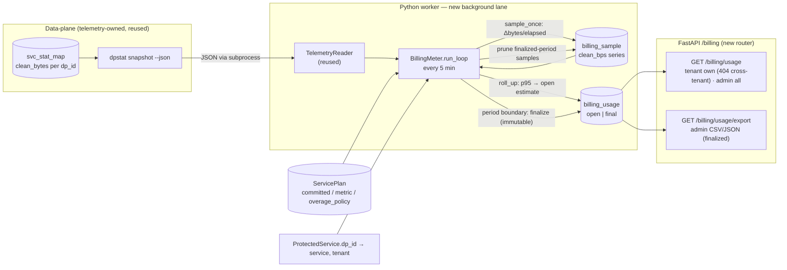

# Chargeback Metering Design

**Spec**: `.specs/features/chargeback-metering/spec.md` (CHG-01..33)
**Context**: `.specs/features/chargeback-metering/context.md` (D-CHG-1..4, A-CHG-1..8)
**Status**: Approved (2026-07-10)
**Decision record**: **AD-031**

---

## Research & Grounding (codebase-verified)

All load-bearing facts below were read from the current tree, not assumed:

- **Billing byte source already designed** (sibling *Telemetry & dashboards*, AD-030): the exact per-CPU
  per-service **`clean_bytes`** counter lives in `svc_stat_map` (`PERCPU_HASH[dp_id]`, incremented at the
  `redirect_out()` choke point). The **`dpstat snapshot --json`** reader emits `services[].clean_bytes`
  (cumulative, summed across CPUs) plus `active.{slot,version}`. Chargeback **reuses this counter and this
  reader** — it adds **no** new data-plane surface (D-CHG-1 / A-CHG-1). Telemetry also introduces
  **`ProtectedService.dp_id`** (Postgres `service_dp_id_seq`, monotonic ≥1) — the u32 key the reader emits;
  chargeback reuses it to map `dp_id → service`.
- **Units are bytes/sec on the wire, gigabits/sec in the plan.** The data-plane rate maps use **bytes/sec**
  (ARL "bps map unit = bytes/sec"; fairness `FAIR_RATE_MAX = 16e9 B/s`, "100 Gbps default" = 1.25e10 B/s =
  100×1e9/8). `ServicePlan.committed_clean_gbps` is **gigabits/sec** (`Numeric(10,2)`,
  `models.py` L459). So `clean_bytes`-derived bytes/sec must be converted to Gbps by **×8 / 1e9** to compare
  with committed. This conversion is load-bearing for correctness and is stated explicitly below.
- **Plan fields already exist** (`db/models.py` L443 `ServicePlan`): `committed_clean_gbps`,
  `ceiling_clean_gbps`, `billing_metric` (default `"p95_clean_bps"`), `overage_policy`
  (`OveragePolicy.{billed,capped}`, enum L125, `overage_policy_enum` L214). **`BillingUsage` does not exist.**
  A `ServicePlan` is created 1:1 with every `ProtectedService` (`services/services.py::create_service`,
  committed/ceiling default `0`).
- **Worker background-lane shape** (`worker/worker.py`): `Worker.run(stop)` builds a `FeedCoordinator`
  lane, runs the main loop, and in `finally` awaits/cancels in-flight work + `dispose_engine()`. Telemetry
  (AD-030 §7) adds a spawned `TelemetryAggregator.run_loop(stop)` task awaited/cancelled in `finally`.
  **Chargeback adds one more spawned lane the same way** (`BillingMeter.run_loop(stop)`).
- **Reader wrapper** (AD-030 §5): `worker/telemetry_reader.py::TelemetryReader.snapshot() ->
  TelemetrySnapshot | None` (runs the dpstat subprocess with a timeout; `None` on gateway-not-loaded), plus
  a `FakeTelemetryReader` for tests. Chargeback **injects the same `TelemetryReader`** (calls `snapshot()`
  independently — reads never consume) and tracks its **own** previous cumulative per `dp_id`.
- **DB idioms** (`db/models.py`, `db/session.py`): `Base` (`DeclarativeBase`), `TimestampMixin`
  (`created_at`/`updated_at` via `utc_now`), `utc_now()` (tz-aware UTC), `SAEnum(..., native_enum=False,
  values_callable=…)` for every enum, `JSONB`, FK `ondelete` idioms, `UUID(as_uuid=True)` PKs
  (`default=uuid.uuid4`), `Numeric(10,2)` for Gbps, `BigInteger` for byte counts. `session_scope()` =
  commit-on-exit UoW (`db/session.py` L62) firing post-commit callbacks.
- **Control-plane reuse** (`core/deps.py`): `Principal{user_id,role,tenant_id,…}`,
  `get_current_user`, `require_admin` (403 for non-admin), `load_service_for_principal(db, id, principal)`
  → **404** on absent/cross-tenant (exactly CHG-20). Routers registered in `main.py::create_app`. Alembic
  migrations `migrations/versions/YYYYMMDD_NNNN_*.py`; the chargeback migration chains **after** telemetry's
  head (telemetry adds `..._0007_service_dp_id` + `..._0008_telemetry`; billing = `..._0009_billing`, exact
  revision pinned at Execute).
- **Settings** (`core/config.py`): `env_prefix="CONTROL_PLANE_"`, `worker_*` float knobs pattern,
  `node_clean_capacity_gbps=Decimal(40)`. Telemetry adds `worker_telemetry_{binary_path,ifindex,
  timeout_seconds,…}` (the dpstat reader settings). Chargeback **reuses those reader settings** and adds
  `worker_billing_*`.
- **Testing gates** (`.specs/codebase/TESTING.md`): CP quick = `ruff+mypy+pytest -m unit`, full = `+pytest`
  on `compose.test.yml`; only **unit** tasks may be `[P]` (integration shares infra).

**Nothing here needed Context7/web** — every fact is grounded in this repo or the approved AD-030 sibling
design. No fabricated APIs.

---

## Architecture Overview

Chargeback is a **control-plane-only** feature layered on the telemetry byte source. One new worker
background lane (`BillingMeter`) reads the exact `clean_bytes` counter on a coarse **5-minute** cadence,
writes a durable per-service `BillingSample` series, continuously refreshes a **running (open)**
`BillingUsage` estimate, and at each **UTC calendar-month** boundary **finalizes** the prior period into an
**immutable** `BillingUsage`. A `/billing` REST surface serves tenant-scoped and admin-wide usage and an
export for the internal chargeback system. `billed_gbps = max(committed_clean_gbps, p95_clean_gbps)`.



Rendered: `diagrams/billing-architecture.{mmd,svg}` (component/data-flow) and
`diagrams/metering-cycle.{mmd,svg}` (sequence: sample tick + period close).

---

## Code Reuse Analysis

### Existing Components to Leverage

| Component | Location | How to Use |
| --- | --- | --- |
| `TelemetryReader.snapshot()` + `FakeTelemetryReader` | `worker/telemetry_reader.py` (telemetry, AD-030 §5) | Inject verbatim; call `snapshot()` for cumulative `clean_bytes` per `dp_id` + `active.version` |
| `svc_stat_map` clean-byte counter + `dpstat snapshot --json` | data-plane (telemetry, AD-030 §1/§4) | The billing byte source — **reused, no new DP surface** |
| `ProtectedService.dp_id` + `service_dp_id_seq` | `db/models.py`, `services/services.py` (telemetry, AD-030 §9) | Map `dp_id → (service, tenant)`; **no `create_service` change here** — chargeback only reads it |
| Worker background-lane lifecycle | `worker/worker.py` (`FeedCoordinator`; telemetry `run_loop`) | Spawn `BillingMeter.run_loop(stop)` before the loop; await/cancel in `finally` |
| `session_scope` UoW | `db/session.py` L62 | Meter DB writes + API reads |
| Auth/ownership guards | `core/deps.py` (`load_service_for_principal`→404, `require_admin`, `get_current_user`, `Principal`) | `/billing` router deps — 404 cross-tenant is already the behavior (CHG-20) |
| `ServicePlan` fields + `OveragePolicy` enum | `db/models.py` L443 / L125 / L214 | `committed_clean_gbps`, `billing_metric`, `overage_policy` snapshotted per period — reused verbatim |
| `TimestampMixin`, `SAEnum(native_enum=False)`, `Numeric(10,2)`, `BigInteger`, FK `ondelete` | `db/models.py` | New `BillingSample`/`BillingUsage` models follow the same idioms |
| Settings + reader knobs | `core/config.py` (`worker_*`; telemetry `worker_telemetry_{binary_path,ifindex,timeout_seconds}`) | Reuse reader knobs; add `worker_billing_*` |
| Alembic migration pattern | `migrations/versions/…` (telemetry head `..._0008`) | New `..._0009_billing.py` (down_revision = telemetry models migration) |
| Router registration | `api/main.py::create_app` | Register the `/billing` router |

### Integration Points

| System | Integration Method |
| --- | --- |
| Telemetry `svc_stat_map` + `dpstat` reader + `dp_id` | **Hard reuse** — the billing byte source. Chargeback is **Execute-gated on telemetry executed** (A-CHG-1); CP model/meter/API build now against `FakeTelemetryReader` |
| M4 #2 double-buffer applier (via telemetry's `dp_id` contract) | No new contract — chargeback rides telemetry's `dp_id`-in-`service_val.service_id` contract; nothing added |
| M6 bypass (future) | When global bypass lands, bypass clean must be excluded from the billable `clean_bytes` interpretation (A-CHG-8) — documented, not built |
| M6 alerting (future) | May consume `BillingUsage.overage_gbps` breaches; not built here |

---

## Components

### 1. `billing_period.py` — UTC calendar-month arithmetic

- **Purpose**: map an instant to its billing period `[start, end)` and to the previous period.
- **Location**: new `control-plane/app/services/billing_period.py` (pure, no I/O — unit-testable).
- **Interfaces**:
  - `month_period(at: datetime) -> tuple[datetime, datetime]` — returns `(period_start, period_end)`, both
    tz-aware UTC, `period_start` = 1st 00:00:00Z of `at`'s month, `period_end` = 1st of the next month
    (exclusive). DST-free (UTC).
  - `previous_period(period_start: datetime) -> tuple[datetime, datetime]`.
- **Dependencies**: stdlib `datetime` only.
- **Reuses**: `utc_now` convention. `worker_billing_period` setting is forward-compat but only `"monthly"`
  is implemented (D-CHG-3); a non-monthly value raises at startup.

### 2. `p95` helper — nearest-rank percentile (pure Python)

- **Purpose**: deterministic 95th-percentile of a sample list with **no numpy dependency**.
- **Location**: `control-plane/app/services/billing_metrics.py`.
- **Interfaces**:
  - `p95_nearest_rank(samples: list[int]) -> int` — sort ascending; return the value at nearest-rank index
    `ceil(0.95 × n) − 1` (the telco/burstable-billing "95th percentile" convention); `[]` → `0`.
  - `bps_to_gbps(bytes_per_sec: int) -> Decimal` — `Decimal(bytes_per_sec) * 8 / 1_000_000_000`, quantized
    to `Numeric(10,2)` (bytes→**bits** ×8, then ÷1e9). **The one unit-conversion choke point.**
- **Dependencies**: stdlib `math`, `decimal`.
- **Reuses**: nothing external. Nearest-rank chosen for determinism/auditability (D-031-2); documented so
  finance can reproduce the number.

### 3. `BillingMeter` — the worker lane (sample + rollup + prune)

- **Purpose**: the whole metering cycle in one background lane.
- **Location**: new `control-plane/app/worker/billing.py`.
- **Interfaces**:
  - `async def run_loop(self, stop: asyncio.Event) -> None` — `while not stop`: `await tick()`, then sleep
    `worker_billing_interval_seconds` (interruptible by `stop`); **catch-log-continue** on any error
    (bounded, never crashes the worker — mirrors telemetry `run_loop`, satisfies CHG-07/CHG-18).
  - `async def tick(self) -> None` — one cycle: `sample_once()` → `refresh_open_periods()` →
    `finalize_due_periods()` → `prune_samples()`, each in its **own** `session_scope`.
  - `async def sample_once(self)` — `snap = await reader.snapshot()`; if `None` (gateway offline) → skip
    (no fabricated sample, CHG-05 note). For each `dp_id` in the snapshot mapped to an active service:
    `delta = clean_bytes − prev[dp_id]`; **reset detection** — if `delta < 0` or `snap.active.version !=
    prev_version` → `is_reset=True`, `delta = clean_bytes` (treat current as post-reset), never negative
    (CHG-03). First tick after (re)start **seeds `prev` and emits no sample** (one skipped sample; state is
    in-memory). `clean_bps = delta // elapsed_seconds`; upsert `BillingSample(service_id, sample_ts=aligned
    tick, clean_bps, window_seconds=elapsed, dp_id, is_reset)` **idempotent** on `(service_id, sample_ts)`
    (CHG-04). Services with no `dp_id` counter this interval get an explicit **`0`-bps** sample (CHG-05).
  - `async def refresh_open_periods(self)` — for each active service, ensure an **open** `BillingUsage`
    row for `month_period(now)` exists; recompute `p95_clean_gbps = bps_to_gbps(p95_nearest_rank(period
    samples))`, `billed_gbps = max(committed, p95)`, `overage_gbps = max(0, p95 − committed)`,
    `sample_count`, snapshotting `committed_clean_gbps`/`billing_metric`/`overage_policy` from the live plan
    (CHG-06/CHG-11).
  - `async def finalize_due_periods(self)` — set `status=final`, `finalized_at=now` for every **open**
    `BillingUsage` whose `period_end ≤ now` (a boundary passed, CHG-09/CHG-13) **or** whose `service_id IS
    NULL` (service deleted mid-period → finalize from last-refreshed values, CHG-16). Idempotent: already
    `final` rows are skipped; `UNIQUE(service_id, period_start)` prevents duplicates.
  - `async def prune_samples(self)` — delete `BillingSample` rows whose owning period is finalized and older
    than `worker_billing_sample_retention_days` (CHG-08).
- **State**: in-memory `prev: dict[int, int]` (cumulative `clean_bytes` per `dp_id`) + `prev_version` — the
  sampler's own delta baseline, independent of the telemetry aggregator's.
- **dp_id → service cache**: `select(ProtectedService.id, dp_id, tenant_id, name,
  ServicePlan.committed_clean_gbps, billing_metric, overage_policy).outerjoin(ServicePlan)` — refreshed each
  tick (≤1000 rows, cheap); unknown `dp_id` (deleted/unmapped) ignored (A-CHG-5). `committed` defaults `0`
  when no plan (billed floor 0 → billed = p95).
- **Dependencies**: `TelemetryReader`, `session_factory`, `Settings.worker_billing_*`.
- **Reuses**: telemetry reader + reset-detection shape; `session_scope`; `FeedCoordinator`/aggregator lane
  lifecycle. Delta/p95/period math is new but pure and unit-testable with `FakeTelemetryReader`.

### 4. Worker integration

- **Purpose**: run the billing lane inside the existing worker process.
- **Location**: `worker/worker.py`, `worker/__main__.py`, `core/config.py`.
- **Change**: `Worker.__init__` gains optional `billing: BillingMeter | None`; `run()` spawns
  `billing_task = asyncio.create_task(self.billing.run_loop(stop_event))` before the main loop and
  awaits/cancels it in `finally` alongside the feed/telemetry lanes. `__main__` builds the reader
  (reused) + `BillingMeter` from settings and injects them when `worker_billing_enabled`. **Not** a Redis
  `JobType`/`AgentJob` (D-031-3 / A-CHG-2).
- **New settings** (`Settings`): `worker_billing_enabled: bool = True`,
  `worker_billing_interval_seconds: float = Field(300.0, gt=0)`,
  `worker_billing_sample_retention_days: int = Field(400, gt=0)` (~13 months, one-year audit + slack),
  `worker_billing_period: Literal["monthly"] = "monthly"` (forward-compat; only monthly implemented).
  Reader knobs reused from telemetry (`worker_telemetry_binary_path/ifindex/timeout_seconds`).
- **Reuses**: the spawn/await/cancel lifecycle; `worker_*` settings convention.

### 5. Data models + migration

- **Purpose**: the transient sample series + the durable per-period record.
- **Location**: `db/models.py`, `migrations/versions/…_0009_billing.py` (down_revision = telemetry models
  migration; pinned at Execute).
- **Reuses**: `TimestampMixin`, `SAEnum(native_enum=False)`, `Numeric(10,2)`, `BigInteger`, FK `ondelete`.
- See **Data Models** below.

### 6. `/billing` API router + schemas

- **Purpose**: the read + export surface (CHG-19..28, CHG-33).
- **Location**: new `app/api/routers/billing.py` + `app/api/schemas/billing.py`; registered in
  `main.py::create_app`.
- **Interfaces**:
  - `GET /billing/usage?service_id=&period=&status=` — **tenant**: rows where `tenant_id ==
    principal.tenant_id` (denormalized column → single query, no service join); if `service_id` given,
    `load_service_for_principal` first (**404** cross-tenant, CHG-20). **admin**: all rows, filterable by
    `tenant_id`/`service_id`/`period`. Returns `BillingUsageResponse[]` (running `open` + `final`),
    `status` per row (CHG-19/21/22). `period` accepts `YYYY-MM` (mapped via `month_period`).
  - Empty → `200` `{ "usage": [], "has_data": false }` (CHG-23).
  - `GET /billing/usage/export?period=&format=csv|json` — `require_admin`; **finalized** rows only for the
    period; CSV via `StreamingResponse`, JSON via the list schema; open periods omitted/marked provisional
    (CHG-26..28).
  - `GET /billing/usage/history?service_id=&limit=` — finalized-period history (P3, CHG-33).
- **Schemas**: `BillingUsageResponse` (`service_id`, `service_name`, `tenant_id`, `period_start/end`,
  `billing_metric`, `committed_clean_gbps`, `p95_clean_gbps`, `billed_gbps`, `overage_gbps`,
  `overage_policy`, `sample_count`, `status`), `BillingUsageListResponse`.
- **Dependencies/Reuses**: `get_current_user`, `get_db`, `require_admin`, `load_service_for_principal`;
  router/schema `Annotated[..., Depends]` conventions from `routers/services.py`. Read-only, no mutation
  (CHG-24). Gbps serialized as `Numeric(10,2)` Decimal (CHG-25).

### 7. Billing showback in the SPA (P2, gated on telemetry SPA)

- **Purpose**: tenant/admin billed-vs-committed view (CHG-29..31).
- **Location**: `control-plane/frontend/` — new `BillingPanel`/route reusing the telemetry SPA shell
  (auth, layout, TanStack Query polling), D-TEL-2.
- **Reuses**: `/auth/me` role routing, `api/client.ts`, chart components. Open periods labeled
  **provisional** (CHG-31). **Gated on telemetry SPA executed.**

---

## Data Models

### `BillingSample` (transient per-service clean-bps series)

```python
class BillingSample(Base):
    __tablename__ = "billing_sample"
    id: uuid (pk, default uuid4)
    service_id: uuid -> protected_service.id (ondelete=CASCADE, nullable=False)  # transient input
    dp_id: int | None                     # raw DP key snapshot (audit/debug)
    sample_ts: datetime(tz)               # aligned tick instant
    clean_bps: BigInteger                 # exact clean-byte delta / elapsed, bytes/sec, >= 0
    window_seconds: int                   # elapsed since previous sample
    is_reset: bool = False                # counter reset detected this interval (CHG-03)
    created_at: datetime(tz)              # TimestampMixin (created_at only; no updated_at)
    __table_args__ = (
        UniqueConstraint("service_id", "sample_ts", name="uq_billing_sample_service_ts"),   # CHG-04
        Index("ix_billing_sample_service_ts", "service_id", "sample_ts"),                    # period scans
    )
```

- **CASCADE**: samples are computation inputs; they drop with the service. The durable record
  (`BillingUsage`) survives via `SET NULL` + snapshots, and `finalize_due_periods` closes a deleted
  service's open period from its last-refreshed values before the samples are gone (CHG-16).

### `BillingUsage` (durable per-service per-period record)

```python
class BillingStatus(StrEnum):
    open = "open"      # running current-period estimate (mutable)
    final = "final"    # settled, immutable

billing_status_enum = SAEnum(BillingStatus, name="billing_status", native_enum=False,
                             values_callable=lambda vs: [v.value for v in vs])

class BillingUsage(TimestampMixin, Base):
    __tablename__ = "billing_usage"
    id: uuid (pk, default uuid4)
    service_id: uuid | None -> protected_service.id (ondelete=SET NULL)   # survives delete (CHG-16)
    tenant_id: uuid | None  -> tenant.id (ondelete=SET NULL)              # denormalized tenant scoping
    service_name: str(255)                # snapshot for attribution after service delete
    period_start: datetime(tz)            # UTC month start (inclusive)
    period_end: datetime(tz)              # UTC next-month start (exclusive)
    billing_metric: str(64)               # snapshot, e.g. "p95_clean_bps" (A-CHG-7)
    committed_clean_gbps: Numeric(10,2)   # snapshot at refresh/close (CHG-11)
    p95_clean_gbps: Numeric(10,2)         # 95th pct of period clean-bps, in Gbps
    billed_gbps: Numeric(10,2)            # max(committed, p95)  (CHG-10)
    overage_gbps: Numeric(10,2)           # max(0, p95 - committed) (CHG-10)
    overage_policy: OveragePolicy         # snapshot (billed | capped) (CHG-12)
    sample_count: int                     # confidence signal (CHG-15)
    status: BillingStatus                 # open | final (CHG-13)
    finalized_at: datetime(tz) | None
    # created_at / updated_at via TimestampMixin
    __table_args__ = (
        UniqueConstraint("service_id", "period_start", name="uq_billing_usage_service_period"),  # CHG-13
        Index("ix_billing_usage_tenant_period", "tenant_id", "period_start"),   # tenant list
        Index("ix_billing_usage_status_end", "status", "period_end"),           # finalize scan
    )
```

**Relationships / lifecycle**:
- `UNIQUE(service_id, period_start)` gives idempotent close and one row per service per period. Postgres
  treats `NULL` service_ids as distinct, so post-deletion `SET NULL` rows never collide (CHG-13/16).
- **Immutability**: only `status=open` rows are updated (each tick). `finalize_due_periods` flips
  `open→final`; a `final` row is never rewritten (CHG-13). `tenant_id` + `service_name` keep a finalized
  row self-attributing after the service/plan is gone.
- Per-service only (**no node scope** — D-CHG-4). VIP/whitelist clean is included because it is already in
  `clean_bytes` at `redirect_out()` (D-CHG-4); bypass exclusion is M6 (A-CHG-8).

---

## Error Handling Strategy

| Scenario | Handling | Impact |
| --- | --- | --- |
| Gateway not loaded / reader `None` | `sample_once` skips the tick (no fabricated sample); open estimate unchanged | Sample gap; `sample_count` exposes it (CHG-05/07) |
| Counter reset / reload (Δ<0 or `active.version` changed) | Reset detection: `is_reset=True`, sample = post-reset value, never negative | No negative/absurd bps (CHG-03) |
| First tick after (re)start | Seed in-memory `prev`, emit no sample | One skipped 5-min sample; then normal |
| Postgres unavailable in a tick | `run_loop` catches, logs, continues; per-method `session_scope` rolls back | Brief gap; next tick resumes (CHG-07/18) |
| Reader subprocess timeout/hang | `asyncio` timeout in `TelemetryReader` → `None` → skip tick | Sample gap; recovers next tick |
| Service created mid-period | Fewer samples; p95 over what exists; no proration | `sample_count` low; billed = max(committed, p95) (CHG-15, D-CHG-3) |
| Service deleted mid-period | `service_id SET NULL`; `finalize_due_periods` closes the open row from last refresh | Durable finalized record survives (CHG-16) |
| Zero clean traffic all period | `0`-bps samples → p95=0 → `billed = committed` | Committed floor billed (CHG-15) |
| `committed` changed mid-period | Snapshot at refresh/close; last snapshot wins at finalize | Documented; no intra-period weighting (CHG-11) |
| Close job re-run for a finalized period | `status=final` skipped; `UNIQUE` blocks dup | Idempotent (CHG-13) |
| Tenant requests another tenant's service | `load_service_for_principal` → **404** | No cross-tenant leak (CHG-20) |
| No usage row yet | `200 {usage:[], has_data:false}` | Empty state, not an error (CHG-23) |
| Double-buffer map swap mid-tick | `svc_stat_map` unslotted runtime state — unaffected | Consistent sampling (A-CHG-5) |

---

## Tech Decisions (AD-031)

| Decision | Choice | Rationale |
| --- | --- | --- |
| **D-031-1** billing byte source | Reuse telemetry's exact `clean_bytes` counter + `dpstat` reader; sampler keeps its **own** cumulative `prev[dp_id]` | No new DP surface (D-CHG-1); reads never consume, so two independent readers coexist; keeps billing decoupled from telemetry retention |
| **D-031-2** p95 method + units | **Nearest-rank** 95th pct (pure Python, no numpy) over period `clean_bps`; convert bytes/sec→Gbps via **×8/1e9** | Deterministic/auditable (finance can reproduce); the ×8 is the load-bearing bytes→bits fix vs `committed_clean_gbps` |
| **D-031-3** metering mechanism | One worker **background asyncio lane** (`BillingMeter.run_loop`), 5-min cadence, sample+rollup+prune per tick; **not** a Redis `JobType`/AgentJob | Periodic maintenance like telemetry aggregation / `reconcile_once`; no version/idempotency/durability semantics needed at billing cadence (A-CHG-2) |
| **D-031-4** `BillingUsage` lifecycle | `open` running estimate refreshed each tick → `final` immutable at boundary; `UNIQUE(service_id, period_start)` | Immutable, auditable settled figure per period; idempotent close; running estimate for showback (D-CHG-2) |
| **D-031-5** deletion handling | `service_id SET NULL` + finalize open rows where `service_id IS NULL`; **no reach into M1 `delete_service`** | Closes a deleted service's period from last-refreshed values without coupling to executed delete code (CHG-16) |
| **D-031-6** period boundaries | UTC calendar-month arithmetic in a pure `billing_period.py`; `worker_billing_period` fixed `"monthly"` | D-CHG-3; UTC is DST-free; p95 tolerates partial periods so no proration |
| **D-031-7** sample FK vs usage FK | `BillingSample` **CASCADE** (transient inputs); `BillingUsage` **SET NULL** + `tenant_id`/`service_name` snapshots (durable) | Inputs die with the service; the billable record must outlive it for chargeback history |
| **D-031-8** API surface | New `/billing` router; tenant filtered by denormalized `tenant_id` (+`load_service_for_principal` on `service_id`), admin all; export admin-only | Reuses session/RBAC + 404 guard verbatim (A-CHG-6); `tenant_id` column avoids a service join per read |

---

## Cross-Feature Dependencies & Execute Gates

- **Execute-gated on *Telemetry & dashboards* executed** (A-CHG-1): the `svc_stat_map` `clean_bytes`
  counter, the `dpstat snapshot --json` reader (`TelemetryReader`/`FakeTelemetryReader`), and
  `ProtectedService.dp_id` all originate there. **The control-plane slice (models + `BillingMeter` against
  `FakeTelemetryReader` + rollup + `/billing` API) is fully buildable and testable now**; true end-to-end
  metering lights up when telemetry (and, for real multi-service `dp_id`, M4 #2) land. Mirrors telemetry's
  own DP-propagation gate.
- **No dependency reversal / no M1 reach**: chargeback adds only additive models + one worker lane + one
  router. Unlike telemetry, it does **not** modify `create_service` (it reads `dp_id`, telemetry assigns it).
- **P2 SPA showback** gated on the telemetry SPA shell executed (D-TEL-2); **P1 API/metering are not**.
- **M6 forward dependency** (A-CHG-8): when global bypass exists, bypass clean must be excluded from the
  billable `clean_bytes` interpretation — noted, not built.

---

## Open Flags for Tasks

1. **Reader sharing** — inject a single `TelemetryReader` shared by the telemetry aggregator and
   `BillingMeter` (chosen), vs a dedicated reader instance for billing. Both just call `snapshot()`.
2. **p95 convention** — nearest-rank (chosen, D-031-2) vs linear-interpolation (`statistics.quantiles`).
   Confirm nearest-rank is the intended "95th percentile" for chargeback.
3. **Sample retention** — `worker_billing_sample_retention_days = 400` default (one-year audit + slack);
   confirm the horizon (or make it "keep N finalized periods").
4. **`tenant_id` FK on `BillingUsage`** — `SET NULL` (chosen) vs plain denormalized UUID (no FK) for
   maximum history durability if a tenant is ever purged (tenants are delete-blocked while active, AD-009).
5. **Cadence coupling** — one 5-min tick drives sample + open-refresh + finalize + prune (chosen). Confirm
   vs finalizing on a separate slower timer.
6. **Export format** — CSV + JSON via `StreamingResponse`/list schema (chosen); confirm the exact CSV
   column order for the finance system, or defer the column contract to that consumer.
7. **`period` query param shape** — `YYYY-MM` (chosen, mapped via `month_period`) vs explicit
   `period_start` ISO timestamp.

---

## Requirement Coverage Map

| Requirement | Component(s) |
| --- | --- |
| CHG-01..08 (billing sample series) | §3 `BillingMeter.sample_once`/`prune_samples`, §2 helpers, §5 `BillingSample`, §4 worker/settings |
| CHG-09..18 (p95 rollup & `BillingUsage`) | §3 `refresh_open_periods`/`finalize_due_periods`, §1 period, §2 p95/units, §5 `BillingUsage` |
| CHG-19..25 (billing API) | §6 `/billing/usage` router + schemas, §5 models, deps guards |
| CHG-26..28 (export) | §6 `/billing/usage/export`, §5 finalized rows |
| CHG-29..31 (SPA showback, P2) | §7 `BillingPanel` (telemetry SPA shell) |
| CHG-32..33 (history/trend, P3) | §6 `/billing/usage/history`, §5 retained finalized rows, §7 chart |

All 33 requirements mapped. **Next: Tasks** (resolve the 7 flags; expect a single CP/worker track —
models → meter (unit, `[P]`) → rollup → API → export, with the SPA panel gated on the telemetry frontend;
DP work is zero — the byte source is telemetry-owned).
