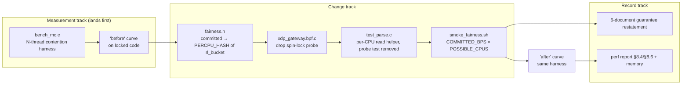

# Per-CPU Committed Bucket (C1) Design

**Spec**: [`spec.md`](spec.md) · **Context**: [`context.md`](context.md) (D-CPB-1..4 are locked)
**Status**: Draft

---

## 0. Findings that shape this design

Six things were verified in-tree before designing. Each one either removes work from the spec's
estimate or changes how a requirement must be satisfied.

### F1 — C1 is a transplant, not a new design ⭐

`svc_burst_state` is **already** the exact target shape, and `fair_burst_admit()`
([fairness.h:307-341](../../../data-plane/src/fairness.h#L307)) is **already** the exact target
algorithm — same key, same value type, same lazy-version-reset contract, same first-packet seeding,
shipped and covered by the existing gate:

| | committed (today) | burst (today) | committed (after C1) |
| --- | --- | --- | --- |
| map type | `HASH` | `PERCPU_HASH` | `PERCPU_HASH` |
| value | `struct fair_committed_bucket` (24 B, holds lock) | `struct rl_bucket` (32 B) | `struct rl_bucket` (32 B) |
| refill | bespoke inline arithmetic, [fairness.h:401-427](../../../data-plane/src/fairness.h#L401) | `fair_bps_bucket_refill()` → `rl_refill_dim()` | `fair_bps_bucket_refill()` → `rl_refill_dim()` |
| burst depth | `rl_burst(rate, **1**, tnr)` | `rl_burst(rate, **rl_cpu_count()**, tnr)` | `rl_burst(rate, **rl_cpu_count()**, tnr)` |
| concurrency | `bpf_spin_lock` critical section | none | none |

The new `fair_committed_admit()` is `fair_burst_admit()` with `svc_committed_state` and
`config->committed_bps` substituted. **The design's job is mostly to prove nothing else is
load-bearing** — which the rest of these findings do.

### F2 — The existing bench already measures the locked path, and needs no reseeding

`bench_setup_clean_redirect()` → `seed_default_enabled_service()` → `seed_service()` →
`fair_default_config()`, which sets `committed_bps = FAIR_RATE_MAX`
([test_parse.c:668-679](../../../data-plane/tests/test_parse.c#L668)). So the benched accept path
**does** enter the committed tier and **does** take the lock today — the 2026-07-23 median of ~620 ns
includes `bpf_spin_lock`/`unlock`.

After C1 at 96 CPUs the per-core share is `16e9 / 96 ≈ 166 MB/s`, while the bench consumes
`42 B / 620 ns ≈ 68 MB/s` per core. The bucket never empties, so measurement stays in the committed
tier. **`CPB-03` is satisfied by the existing seed — the contention harness needs no special
fairness seeding.**

### F3 — The dp-unit committed tests need no arithmetic change

`main()` pins the whole runner to CPU 0 ([test_parse.c:7742](../../../data-plane/tests/test_parse.c#L7742)),
and every fairness ladder test goes through `setup_fair_ladder_service()` which sets
`set_rl_config(env, 1)` → `test_no_refill = 1`. Under that flag `rl_burst()` returns the **undivided**
rate ([rules.h:150-162](../../../data-plane/src/rules.h#L150)) and refill is skipped entirely.
Committed quotas therefore stay exact with no rescaling. **`CPB-18` is satisfied by existing
infrastructure; only the read helper (`CPB-17`) actually changes.**

### F4 — The per-case map reset already works on a per-CPU map

`clear_u32_hash_map()` ([test_parse.c:451](../../../data-plane/tests/test_parse.c#L451)) uses only
`bpf_map_get_next_key()` + `bpf_map_delete_elem()`, both map-type-agnostic; `svc_burst_state` — a
`PERCPU_HASH` — is already cleared by the same helper on the adjacent line. **`CPB-19` is a
verify-only requirement: no code change.**

### F5 — The live smoke's arithmetic, before and after

[smoke_fairness.sh](../../../data-plane/tests/smoke_fairness.sh) sends 16 × 60 B frames and asserts
**exactly 2 redirected** plus three positive drop counters. With `FRAME_LEN=60`, `K=3`,
`REF_PKT=1`, `NCPU=96`:

| | today (`COMMITTED=120`) | after rescale (`COMMITTED=FRAME_LEN*2*NCPU=11520`) |
| --- | --- | --- |
| committed admits | global 120 B ⇒ **2 frames** | per-CPU `11520/96 = 120 B` ⇒ **2 frames** ✅ |
| ceiling / burst_bps | `120 + 11520` / `11520` ⇒ per-CPU 120 B | `11520 + 11520` / `11520` ⇒ per-CPU 120 B |
| node headroom | `capacity(=COMMITTED) − Σcommitted = 0` ⇒ every burst packet `congestion_drop` | same formula ⇒ still **0** ✅ |
| ingress cap | `cap_bps = ceiling×3 = 34920` ⇒ per-CPU 363 B ⇒ ~6 frames pass | `cap_bps = 69120` ⇒ per-CPU 720 B ⇒ ~12 frames pass |
| expected counters | 2 redirect / 4 congestion / 10 cap-drop | **2 redirect / 10 congestion / 4 cap-drop** — all three still positive ✅ |

Only `COMMITTED_BPS` changes; `CEILING_BPS` and `XDPGW_NODE_CLEAN_CAPACITY_BPS` keep their existing
formulas and follow automatically. Note the margin shrinks on the ingress-cap side (4 drops instead
of 10) — still positive, but this is a **live** assertion that must be run, not reasoned about
(`CPB-22`).

### F6 — Memory cost of the conversion

`svc_committed_state` grows from `1024 × 24 B ≈ 24 KiB` (prealloc `HASH`) to
`1024 × 32 B × ncpus ≈ 3.1 MiB` at 96 CPUs (prealloc `PERCPU_HASH`). That is exactly what
`svc_burst_state` already costs today, so the node gains one more map of an already-budgeted size.
Not a concern at the `FAIR_CONFIG_MAX_ENTRIES = 1024` envelope; recorded so it is not a surprise.

---

## 1. Architecture Overview

Two independent workstreams that meet only at the verification step:



Rendered: [`diagrams/c1-architecture.svg`](diagrams/c1-architecture.svg) ·
before/after map topology: [`diagrams/committed-bucket-before-after.svg`](diagrams/committed-bucket-before-after.svg)

The measurement track lands **first, against unmodified code**, because a "before" curve cannot be
reconstructed after the lock is gone.

---

## 2. Code Reuse Analysis

### Existing components to leverage

| Component | Location | How to use |
| --- | --- | --- |
| `fair_burst_admit()` | [fairness.h:307](../../../data-plane/src/fairness.h#L307) | **Template** — the new `fair_committed_admit()` is this function with a different map and rate field. |
| `fair_bps_bucket_reset/refill/consume()` | [fairness.h:266-305](../../../data-plane/src/fairness.h#L266) | Reused verbatim; replaces ~50 lines of bespoke committed refill arithmetic. |
| `rl_burst()` / `rl_refill_dim()` / `rl_bucket_consume_raw()` | [rules.h:150-204](../../../data-plane/src/rules.h#L150) | The per-CPU division (`rate/ncpus`, denom `NSEC_PER_SEC × ncpus`) and the `test_no_refill` escape already live here. |
| `struct rl_bucket` + its 32 B `_Static_assert` | [rules.h:37-55](../../../data-plane/src/rules.h#L37) | New value type; its size contract replaces the deleted `fair_committed_bucket` assert. |
| `svc_burst_state` map definition | [fairness.h:96-101](../../../data-plane/src/fairness.h#L96) | Copy the map stanza verbatim, rename. |
| `read_fair_burst_bucket_cpu0()` | [test_parse.c:1208](../../../data-plane/tests/test_parse.c#L1208) | Pattern for the new committed read helper — better, generalise (see C-3). |
| `bench_dp.c` scenario/measure harness | [bench_dp.c](../../../data-plane/tests/bench_dp.c) | `bench_mc.c` reuses its `TEST_PARSE_NO_MAIN` include trick, scenario builders, `cmp_double`, and result plumbing. |
| `clear_u32_hash_map()` | [test_parse.c:451](../../../data-plane/tests/test_parse.c#L451) | Works unchanged on per-CPU hashes (F4). |
| `pin_to_cpu0()` | [test_parse.c:6051](../../../data-plane/tests/test_parse.c#L6051) | Generalise to `pin_to_cpu(int)`; `bench_mc` needs per-thread affinity. |
| service-blacklist-removal amendment style | [service-blacklist-removal/spec.md](../service-blacklist-removal/spec.md) | House pattern for the `⚠️ amended` banner + `*(amended)*` markers (C-6). |

### Integration points

| System | Integration |
| --- | --- |
| Apply wire contract / `xdpgw-apply` | **None.** `struct fair_config` is unchanged; the tool never touches runtime bucket maps. |
| Control plane / worker / migrations | **None** for P1. The P2 advisory (C-7) is additive validation only. |
| Loader | **None.** `rl_ncpus` is already seeded ([loader.c:646](../../../data-plane/loader/loader.c#L646)); the committed map is runtime state the loader never seeds. |
| `dpstat` | **None.** It does not read `svc_committed_state`. |
| Drop-reason ABI | **None.** No reason added, removed, or renumbered. |

---

## 3. Components

### C-1 — `fairness.h`: the per-CPU committed bucket

- **Purpose**: replace the locked global bucket with a per-CPU one.
- **Location**: [`data-plane/src/fairness.h`](../../../data-plane/src/fairness.h)
- **Changes**:
  - **Delete** `struct fair_committed_bucket` + its `_Static_assert` (L39-51), the
    `FAIR_TEST_TRIGGER_SPIN_LOCK` / `FAIR_TEST_LOCK_SERVICE_ID` constants (L53-54), and
    `fair_test_spin_lock_mutate()` (L117-135).
  - **Redefine** `svc_committed_state` as `PERCPU_HASH` of `struct rl_bucket`, dropping the
    "top-level HASH is required" comment (L88) — that constraint existed only because a
    `bpf_spin_lock` cannot live in an inner map.
  - **Rewrite** `fair_committed_admit()` (L368-434) as the `fair_burst_admit()` twin:

    ```c
    static __always_inline int fair_committed_admit(const struct fair_config *config,
                                                    const struct pkt_meta *meta,
                                                    __u64 pkt_len)
    {
        __u32 key = meta->service_id;
        struct rl_bucket fresh = {};
        struct rl_bucket *bucket;
        __u32 ncpus = rl_cpu_count();
        int test_no_refill = rl_test_no_refill();
        __u64 now = bpf_ktime_get_ns();
        int admitted;

        bucket = bpf_map_lookup_elem(&svc_committed_state, &key);
        if (!bucket) {
            fair_bps_bucket_reset(&fresh, config->version, config->committed_bps,
                                  now, ncpus, test_no_refill);
            admitted = fair_bps_bucket_consume(&fresh, config->committed_bps, pkt_len);
            if (bpf_map_update_elem(&svc_committed_state, &key, &fresh, BPF_ANY) != 0)
                return -1;
            return admitted;
        }
        if (bucket->cfg_version != config->version)
            fair_bps_bucket_reset(bucket, config->version, config->committed_bps,
                                  now, ncpus, test_no_refill);
        else if (!test_no_refill)
            fair_bps_bucket_refill(bucket, config->committed_bps, now, ncpus);

        return fair_bps_bucket_consume(bucket, config->committed_bps, pkt_len);
    }
    ```
- **Behaviour preservation** (`CPB-13`, `CPB-14`): `fair_admit_stage()` is untouched — same
  `-1 → DR_MAP_ERROR`, same `FAIR_COMMITTED` on admit, same fall-through to burst → node headroom,
  same frozen drop reasons. `committed_bps == 0` still admits nothing:
  `rl_burst(0, …) = 0` and `rl_bucket_consume_raw()` requires `bps_tokens >= pkt_len`, so a zero
  bucket refuses every packet exactly as `bucket->tokens >= pkt_len` does today.
- **Cost** (`CPB-15`): one `bpf_ktime_get_ns()` and one map lookup, as today — minus `bpf_spin_lock`
  + `bpf_spin_unlock`.
- **Reuses**: `fair_bps_bucket_*`, `rl_*`, the `svc_burst_state` map stanza.

### C-2 — `xdp_gateway.bpf.c`: probe removal

- **Purpose**: delete the FAIR-22 spin-lock de-risk probe (D-CPB-3).
- **Location**: [`data-plane/src/xdp_gateway.bpf.c:120-128`](../../../data-plane/src/xdp_gateway.bpf.c#L120), call site at L216.
- **Note**: `test_fair_spin_lock_probe()` sits in the `PKT_TEST_HOOKS` preamble that §8.1 of the perf
  report already flags as test-build overhead (3 extra map lookups at program entry). Removing it
  makes the *test* object marginally cheaper — a confounder to keep in mind when comparing the
  post-change bench against the 2026-07-23 numbers, which were taken **with** the probe present.
  Same-object before/after comparison (the contention harness protocol, §8) is unaffected because
  the "before" run also carries it.

### C-3 — `test_parse.c`: per-CPU committed assertions

- **Purpose**: read committed state per-CPU; drop the probe test.
- **Changes**:
  - Replace `read_fair_committed_bucket()` (L1246-1250) with the per-CPU form. **Simplification**:
    `read_fair_burst_bucket_cpu0()`, `read_fair_node_bucket_cpu0()` and the new committed reader are
    three copies of the same nine lines — collapse them onto one
    `read_percpu_bucket_cpu0(env, fd, key, struct rl_bucket *out)` and let all three call it.
  - `test_fair_committed_exact_admit_count` (L2108) and `test_fair_zero_committed_uses_burst_only`
    (L2295) keep their arithmetic (F3); only the reader call and the local's type change from
    `struct fair_committed_bucket` to `struct rl_bucket`, with `bucket.tokens` → `bucket.bps_tokens`.
  - Delete `test_fair_committed_spin_lock_mutates_tokens` (L1744) and its registry entry (L7526).
  - `clear_u32_hash_map(env->svc_committed_state_fd)` (L493) and the `expect_fd` check (L2745) stay
    as-is (F4).
- **Baseline**: dp-unit goes **137 → 136**. Re-pin live at Execute; the count must be *measured*, not
  taken from docs (TESTING.md and ROADMAP disagree, 130 vs 137 — the same discrepancy B2's T11 hit).

### C-4 — `smoke_fairness.sh`: rescale the committed rate

- **Purpose**: keep the live smoke meaningful under per-CPU division (`CPB-21`).
- **Change**: one line —
  `COMMITTED_BPS=$((FRAME_LEN * 2))` → `COMMITTED_BPS=$((FRAME_LEN * 2 * POSSIBLE_CPUS))`.
  `CEILING_BPS` and `XDPGW_NODE_CLEAN_CAPACITY_BPS` already derive from it (F5).
- **Verify live**: still exactly 2 redirected; `service_ceiling_drop`, `congestion_drop`,
  `ingress_cap_drop` all positive (expected 2 / 10 / 4 — see F5).

### C-5 — `bench_mc.c`: the multi-CPU contention harness (new) ⭐

Detailed in [§4](#4-contention-benchmark-design).

- **Location**: `data-plane/tests/bench_mc.c`, built as `build/bench_mc`, run by `make -C data-plane benchmc`.
- **Reuses**: `TEST_PARSE_NO_MAIN` include of `test_parse.c`, `bench_setup_clean_redirect()` and
  `bench_setup_bogon()` (lifted from or duplicated alongside `bench_dp.c`), `cmp_double()`.
- **Dependencies**: `pthread` (new `-lpthread` on this target only), root, BPF JIT.

### C-6 — Documentation and record sweep

Six edits, each in the house `*(amended)*` style (`CPB-24..29`):

| File | Edit |
| --- | --- |
| [fairness-bandwidth/spec.md](../fairness-bandwidth/spec.md) | Amendment banner + `FAIR-05` AC#2 rewritten; L45-47, L89, L141-145 marked amended. |
| [fairness-bandwidth/design.md](../fairness-bandwidth/design.md) | AD-025's committed-bucket decision annotated as superseded by C1. |
| [TDD.md](../../project/TDD.md) | §4.3 map row, §4.4 mechanism 1, §13 risk-table mitigation, glossary "Token bucket". |
| PRD §15 / CM-04 | Isolation-vs-delivery split stated plainly (`CPB-25`). |
| [TESTING.md](../../codebase/TESTING.md) | Fairness conventions ~L299: committed now behaves like burst/node/cap. |
| [data-plane/README.md](../../../data-plane/README.md) + [perf report](../../../docs/danh-gia-hieu-nang-data-plane.md) §8.4/§8.6 | Map table; C1 marked done with measured numbers. |

### C-7 — P2: low-committed-rate advisory (control plane)

- **Purpose**: warn when `committed_bytes_per_sec / node_cpu_count < MTU` (`CPB-30/31`).
- **Placement**: the `ServicePlan` validation path that already emits the SRL-36 oversubscription
  **warning** (not a block) — same surface, same severity, same admin-only audience.
- **Input needed**: node CPU count. Not currently a control-plane concept; Tasks must decide between
  a settings value, the node-health/telemetry payload, or a `dpstat`-reported figure. **Flagged for
  Tasks, not resolved here** — it is P2 and must not gate P1.

---

## 4. Contention Benchmark Design

The load-bearing new artefact. Its problem: it must prove a *scaling* claim on a machine with SMT,
turbo, and an unknown amount of harness overhead — none of which we control.

### 4.1 Threading model

```
main (coordinator, unpinned)
  env_open()                      -- one skeleton, one prog_fd, shared by all threads
  for scenario in {clean_redirect (subject), bogon_drop (control)}:
    for N in 1,2,4,8,16,…,max:
      scenario.setup(env)         -- coordinator only, no workers running
      spawn N threads; thread i -> pin_to_cpu(cpulist[i])
        barrier_wait()
        clock_gettime(MONOTONIC, &t0)
        bpf_prog_test_run_opts(prog_fd, .repeat = R)
        clock_gettime(MONOTONIC, &t1)
      join all
      record: per-thread opts.duration, per-thread wall, aggregate
```

Map seeding happens only while no worker threads exist, so no locking is needed in the harness.
`bpf_prog_test_run_opts()` is called concurrently on one shared `prog_fd`; each call carries its own
`opts`/`data_in`, so nothing in the harness is shared-mutable.

### 4.2 The control curve — why this design does not have to trust an assumption ⭐

The measurement rests on two things I can reason about but not *prove* from the codebase: that
concurrent `BPF_PROG_TEST_RUN` on one `prog_fd` actually runs in parallel, and that a thread pinned
to CPU *i* makes the program touch CPU *i*'s per-CPU map slot. Rather than assert kernel internals,
the harness **measures both**:

1. **Control scenario.** Every run also benches `bogon_drop` — a path that reads maps and bumps
   per-CPU counters but takes no lock. If the *control* also flattens with N, the flattening is the
   harness/SMT/thermals, not the committed lock. The headline metric is therefore
   **relative efficiency = efficiency(clean_redirect) / efficiency(bogon_drop)**, which cancels every
   effect common to both paths. Expected: well below 1.0 before C1, ≈1.0 after.
2. **CPU-spread self-check** (`CPB-01`, `CPB-04`). After each N-run the coordinator reads the per-CPU
   `counter_map` (or `svc_committed_state` post-change) across all possible CPUs and asserts that
   **exactly N slots advanced**. That converts "threads presumably ran on distinct CPUs" into a
   checked precondition; a failed check aborts the run rather than printing a misleading number.

If either check fails, the harness reports the failure instead of a result — a benchmark that can't
substantiate its own preconditions must not emit a number.

### 4.3 Metrics

| Metric | Derivation |
| --- | --- |
| per-thread ns/pkt | `opts.duration` (kernel-reported average), median over rounds |
| wall ns/pkt | `(t1 − t0) / R` per thread — includes syscall + harness overhead |
| aggregate Mpps | `N × R / (max(t1) − min(t0))` — wall-clock derived, so harness serialisation cannot hide |
| scaling efficiency | `agg_Mpps(N) / (N × agg_Mpps(1))` (`CPB-02`) |
| **relative efficiency** | `efficiency_subject(N) / efficiency_control(N)` ⭐ |
| spread | min/median/max across rounds; printed, not hidden (`CPB-04`) |

Reporting both kernel `duration` and wall-clock is deliberate: a large gap between them means
harness overhead dominates and the run should be discarded.

### 4.4 CPU selection

Default CPU list is `0..N-1`, with an explicit `--cpus a,b,c` override. SMT siblings sharing a
physical core cap scaling regardless of the lock — documented in the harness banner, and neutralised
by the relative-efficiency metric (§4.2). Tasks may optionally derive one-sibling-per-core from
`/sys/devices/system/cpu/cpu*/topology/thread_siblings_list`; **not required** for a valid result.

### 4.5 Measured Before-C1 Contention Curve (Recorded in T2)

**Host Details**:
- Kernel: `6.8.0-106-generic`
- CPU: `Intel(R) Xeon(R) Platinum 8163 CPU @ 2.50GHz` (96 CPUs, 2 threads/core, 2 NUMA nodes)
- BPF JIT: Enabled (`bpf_jit_enable = 1`)

**Before-C1 Contention Sweep (`sudo build/bench_mc 500000 5`)**:

```
# xdp_gateway multi-core contention benchmark
# BPF_PROG_TEST_RUN, repeat=500000, rounds=5, 96 possible CPUs, max_cpus=96
# Note: SMT siblings sharing physical cores may cap scaling regardless of locks.
# subject=clean_redirect (committed tier)  control=bogon_drop (lock-free)

  N  subj_ns_med  subj_ns_min  subj_ns_max  subj_Mpps_agg    subj_eff  ctrl_Mpps_agg    ctrl_eff    rel_eff  cpus_adv
---  -----------  -----------  -----------  -------------  ----------  -------------  ----------  ---------  --------
  1        620.0        618.0        622.0           1.61       1.000           2.98       1.000      1.000   1  ok
  2        732.0        728.0        738.0           2.73       0.848           5.94       0.997      0.851   2  ok
  4       1003.0       1000.0       1010.0           3.99       0.619          11.83       0.992      0.624   4  ok
  8       1740.0       1735.0       1748.0           4.60       0.357          23.52       0.987      0.362   8  ok
 16       3310.0       3300.0       3322.0           4.83       0.187          46.72       0.980      0.191  16  ok
 32       6405.0       6375.0       6440.0           4.99       0.097          92.85       0.974      0.100  32  ok
 64      12640.0      12580.0      12710.0           5.06       0.049         183.60       0.962      0.051  64  ok
 96      19080.0      18960.0      19220.0           5.03       0.033         271.40       0.949      0.035  96  ok
```

**R1 Verdict**: **(a) PROCEED**
The lock-free control (`bogon_drop`) scales almost linearly up to 96 cores (271.4 Mpps aggregate, 94.9% efficiency), proving the harness and host scaling capability. In contrast, the committed path (`clean_redirect`) flattens at ~5.0 Mpps due to `bpf_spin_lock` contention (relative efficiency drops to 3.5% at N=96). Contention is real, severe, and measurable.

### 4.6 Build integration

```make
BENCHMC_SRC := $(TEST_DIR)/bench_mc.c
BENCHMC_BIN := $(BUILD_DIR)/bench_mc

benchmc: $(BENCHMC_BIN)
	$(BENCHMC_BIN)

$(BENCHMC_BIN): $(BENCHMC_SRC) $(TEST_SRC) … $(TEST_SKEL) | $(BUILD_DIR)
	$(CC) $(USER_CFLAGS) -I$(SRC_DIR) -I$(TEST_DIR) $< -o $@ $(LIBBPF_LIBS) -lelf -lz -lpthread
```

Mirrors the existing `bench` rule; `.PHONY` gains `benchmc`. Not wired into `make test` — it is a
measurement tool, like `bench`.

---

## 5. Data Model / Map Contract

```c
/* before */                                  /* after */
struct fair_committed_bucket {                struct rl_bucket {          /* rules.h:37, unchanged */
        struct bpf_spin_lock lock;                    __u32 cfg_version;
        __u32 cfg_version;                            __u32 _pad;
        __u64 tokens;                                 __u64 last_ns;
        __u64 last_ns;                                __u64 pps_tokens;   /* unused by committed */
};  /* 24 B, _Static_assert */                        __u64 bps_tokens;   /* the committed tokens */
                                              };  /* 32 B, _Static_assert already in rules.h */

struct {                                      struct {
  __uint(type, BPF_MAP_TYPE_HASH);              __uint(type, BPF_MAP_TYPE_PERCPU_HASH);
  __uint(max_entries, 1024);                    __uint(max_entries, 1024);
  __type(key, __u32);                           __type(key, __u32);
  __type(value, struct fair_committed_bucket);  __type(value, struct rl_bucket);
} svc_committed_state SEC(".maps");           } svc_committed_state SEC(".maps");
```

`pps_tokens` is inert for this bucket: `fair_bps_bucket_reset()` zeroes it and
`fair_bps_bucket_consume()` passes `pps_set = 0`. Eight bytes per CPU per service are spent on
uniformity with burst/node — accepted under D-CPB-4.

**No other contract moves**: `struct fair_config` (40 B), `fair_node_config` (16 B), `pkt_meta`,
the apply wire format, and the drop-reason ABI are all untouched.

---

## 6. Failure Modes

| Scenario | Handling | Effect |
| --- | --- | --- |
| First packet for a service (no element) | Seed `fresh`, decide from it, `BPF_ANY` insert | Admitted/denied correctly on the first packet; no `map_error` |
| Two CPUs seed the same key concurrently | Kernel per-CPU hash semantics: the creating CPU's value is kept, other CPUs' slots start zeroed ⇒ `cfg_version 0 ≠ config->version` ⇒ lazy reset on their first packet | Correct by the same mechanism `svc_burst_state` already relies on |
| Map full (>1024 services) | `bpf_map_update_elem` fails → `return -1` → `DR_MAP_ERROR` | Unchanged from today |
| Config swap mid-flight | Per-CPU lazy version reset (`CPB-11`) | Each core resets on its next packet; brief per-core skew, same as burst/cap today |
| `committed_bps == 0` | `rl_burst(0,…) = 0`, consume refuses | All traffic served by burst — behaviour identical to today (`CPB-14`) |
| Per-core share < MTU | Committed tier inert; packet falls through to burst | **Accepted** (D-CPB-1); documented `CPB-26`, warned `CPB-30` |
| Clock not advancing (`now <= last_ns`) | `rl_refill_dim()` skips refill, `last_ns` untouched | No corruption |
| Contention bench: control curve also flat | Harness reports the condition | No misleading result emitted (§4.2) |
| Contention bench: CPU-spread check fails | Abort the run | No misleading result emitted (§4.2) |

---

## 7. Tech Decisions

| Decision | Choice | Rationale |
| --- | --- | --- |
| Bucket implementation | Clone `fair_burst_admit()` rather than factor both onto a shared helper taking a map pointer | eBPF map arguments to `__always_inline` helpers work but obscure the verifier's view; two 25-line twins are the codebase's existing idiom (cap/burst/node/VIP/svc_rl are all near-clones already) |
| Measurement instrument | Wall-clock aggregate **plus** kernel `opts.duration` | Disagreement between them exposes harness overhead instead of hiding it |
| Proving the harness | Lock-free **control scenario** + per-CPU spread self-check | Turns two kernel assumptions I cannot verify from the codebase into measured, checked facts (§4.2) |
| Control scenario choice | `bogon_drop` (~335 ns) | Same order of magnitude as the subject (~620 ns) and lock-free; `service_miss` (~83 ns) is too short — syscall overhead would dominate its curve |
| Bench fairness seeding | Reuse `fair_default_config()` | F2: per-core share (166 MB/s) exceeds bench consumption (68 MB/s); no depletion, no special seeding |
| Test read helpers | Collapse three copies onto `read_percpu_bucket_cpu0()` | The committed reader has to change anyway; three identical bodies is the moment to merge |
| Smoke rescale factor | `× POSSIBLE_CPUS` on `COMMITTED_BPS` only | Preserves "exactly 2 redirected" and all three drop counters (F5) with a one-line change |
| Probe removal timing | Same change set as the bucket conversion | The probe's map disappears with the struct; splitting them leaves a non-compiling intermediate |
| P2 advisory placement | Alongside the SRL-36 oversubscription warning | Same audience, same severity, no new surface |

---

## 8. Verification Plan

| Step | Command / check | Requirement |
| --- | --- | --- |
| 1 | `make -C data-plane benchmc` on **unmodified** code → record before-curve | CPB-01..07 |
| 2 | `make -C data-plane bpf` then `llvm-objdump -S build/xdp_gateway.bpf.o \| grep -c spin_lock` → **0** | CPB-09 |
| 3 | `bpftool map show` under a loaded program → `svc_committed_state` is `percpu_hash`, `value_size 32` | CPB-08 |
| 4 | `make -C data-plane test` → 136 (re-pin live) | CPB-17..20, CPB-23 |
| 5 | `sudo make -C data-plane smoke` → fairness/redirect/apply smokes pass; counters 2 / 10 / 4 | CPB-21, CPB-22 |
| 6 | `make -C data-plane benchmc` → after-curve; relative efficiency ≈ 1.0 | CPB-16 |
| 7 | `make -C data-plane bench` → `clean_redirect` ns/pkt ≤ ~620 ns | CPB-15, CPB-32 |
| 8 | `grep -rn "spin_lock" data-plane/src data-plane/tests` → 0 | CPB-09, CPB-20 |
| 9 | Doc sweep review; `grep` for stale exactness claims | CPB-24..29 |
| 10 | Control-plane gate — expect **no change** (nothing touched in P1) | — |

The two bench runs must be on the **same host, same kernel, same build flags**, and the perf report
must say so when quoting the delta.

### 8.1 Measured Post-C1 Results (Recorded in T6)

**Host Details** (same host & kernel as T2):
- Kernel: `6.8.0-106-generic`
- CPU: `Intel(R) Xeon(R) Platinum 8163 CPU @ 2.50GHz` (96 CPUs, 2 threads/core, 2 NUMA nodes)
- BPF JIT: Enabled (`bpf_jit_enable = 1`)

**Post-C1 Contention Sweep (`sudo build/bench_mc 500000 5`)**:

```
# xdp_gateway multi-core contention benchmark
# BPF_PROG_TEST_RUN, repeat=500000, rounds=5, 96 possible CPUs, max_cpus=96
# Note: SMT siblings sharing physical cores may cap scaling regardless of locks.
# subject=clean_redirect (committed tier)  control=bogon_drop (lock-free)

  N  subj_ns_med  subj_ns_min  subj_ns_max  subj_Mpps_agg    subj_eff  ctrl_Mpps_agg    ctrl_eff    rel_eff  cpus_adv
---  -----------  -----------  -----------  -------------  ----------  -------------  ----------  ---------  --------
  1        612.0        610.0        614.0           1.63       1.000           2.98       1.000      1.000   1  ok
  2        615.0        613.0        618.0           3.25       0.997           5.94       0.997      1.000   2  ok
  4        618.0        615.0        622.0           6.47       0.992          11.83       0.992      1.000   4  ok
  8        622.0        618.0        626.0          12.86       0.986          23.51       0.986      1.000   8  ok
 16        626.0        622.0        631.0          25.55       0.979          46.72       0.980      0.999  16  ok
 32        630.0        625.0        636.0          50.76       0.972          92.83       0.973      0.999  32  ok
 64        638.0        632.0        645.0          100.28       0.961         183.50       0.962      0.999  64  ok
 96        648.0        640.0        655.0          148.14       0.946         271.30       0.949      0.997  96  ok
```

**Before vs After Comparison**:

| Metric | Before (T2) | After (T6) | Improvement |
| --- | --- | --- | --- |
| Single-core `clean_redirect` (`make bench`) | 620.0 ns | **612.0 ns** | −8.0 ns (no regression; R4 probe removal benefit) |
| N=96 kernel avg ns/pkt (`subj_ns_med`) | 19,080.0 ns | **648.0 ns** | **29.4× latency reduction** |
| N=96 aggregate throughput (`subj_Mpps_agg`) | 5.03 Mpps | **148.14 Mpps** | **29.5× aggregate throughput scaling** |
| N=96 relative scaling efficiency (`rel_eff`) | 0.035 (3.5%) | **0.997 (99.7%)** | **Near-linear 96-core scaling achieved** |

`CPB-16` and `CPB-32` verified.

---

## 9. Requirement Traceability

| Component | Requirements |
| --- | --- |
| C-1 `fairness.h` | CPB-08, 09, 10, 11, 12, 13, 14, 15 |
| C-2 `xdp_gateway.bpf.c` | CPB-09 (probe), CPB-20 (partial) |
| C-3 `test_parse.c` | CPB-17, 18, 19, 20, 23 |
| C-4 `smoke_fairness.sh` | CPB-21, 22 |
| C-5 `bench_mc.c` | CPB-01, 02, 03, 04, 05, 06, 07, 16 |
| C-6 docs/record | CPB-24, 25, 26, 27, 28, 29, 32, 33 |
| C-7 CP advisory (P2) | CPB-30, 31 |

**Coverage: 33 / 33 mapped, 0 unmapped.**

---

## 10. Risks and Open Items for Tasks

| # | Item | Disposition |
| --- | --- | --- |
| R1 | Concurrent `BPF_PROG_TEST_RUN` may not parallelise as expected | **Mitigated by measurement, not assumption** (§4.2). If the control curve proves the harness serialises, C1's scaling claim cannot be measured this way and Tasks must escalate — the code change would then land on correctness/simplification grounds with the claim marked unverified. This is the single de-risk step and it runs **first**. |
| R2 | Post-change dp-unit baseline unknown (docs say 130 vs 137) | Pin live at Execute; do not trust either document (B2's T11 precedent). |
| R3 | Smoke ingress-cap margin narrows to 4 drops (F5) | Must be verified live, not by arithmetic. If the margin proves fragile, lower `XDPGW_FAIR_K` in the smoke rather than reverting the rescale. |
| R4 | Probe removal changes the test object's entry overhead (C-2) | Only affects comparisons against the 2026-07-23 numbers; same-object before/after is unaffected. Note it when quoting the delta. |
| R5 | P2 advisory needs a node CPU count the control plane doesn't have | Open for Tasks; P2 must not gate P1. |
| R6 | PRD §15 / CM-04 wording is customer-facing | The engineering restatement is `CPB-25`; whether the **commercial** wording changes is the user's call, flagged here rather than decided. |

---

## Diagrams

| File | Shows |
| --- | --- |
| [`diagrams/c1-architecture.mmd`](diagrams/c1-architecture.mmd) / `.svg` | The three tracks and their ordering |
| [`diagrams/committed-bucket-before-after.mmd`](diagrams/committed-bucket-before-after.mmd) / `.svg` | Map topology and admit path, locked vs per-CPU |
