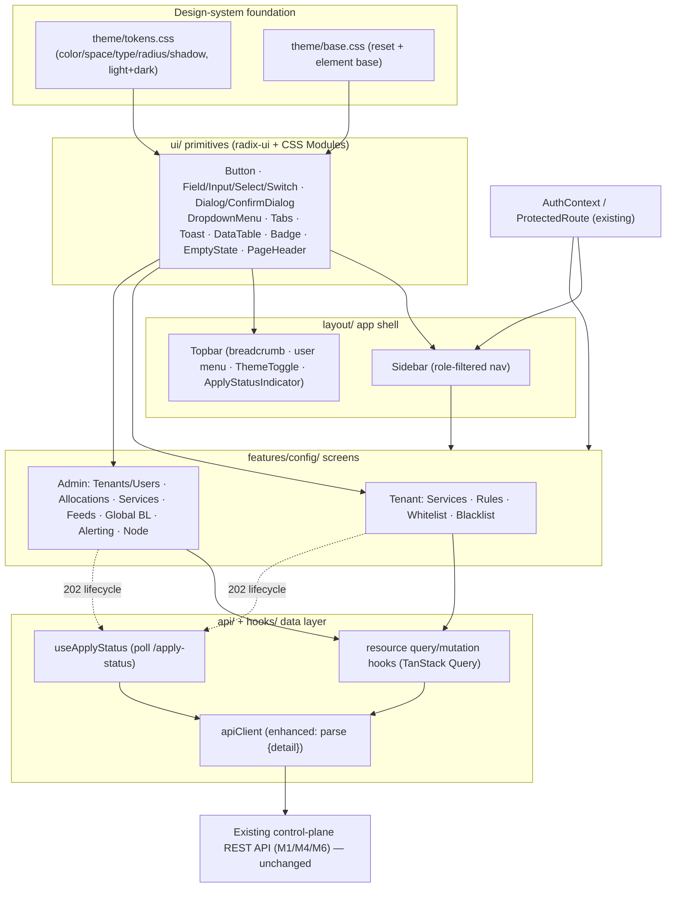

# Configuration Management SPA (Admin & Tenant) Design

**Spec**: `.specs/features/config-management-spa/spec.md` (`CFG-01..53`)
**Architecture Decision**: **AD-034**
**Status**: Draft (awaiting approval → Tasks)
**Design directive**: *dashboard rõ ràng, hiện đại, best UI/UX* — the design introduces a real design system (the SPA has **zero CSS** today) and rebuilds the app shell so the whole dashboard reads as one modern, coherent product.

---

## Architecture Overview

This is a **pure-frontend** feature (zero backend change). It adds four new layers on top of the existing SPA and rebuilds the shell:

1. **Design-system foundation** — CSS-variable design tokens (`theme/tokens.css`) + a base/reset stylesheet (`theme/base.css`), imported once in `main.tsx`. Light + dark.
2. **UI primitives** (`ui/`) — accessible, token-styled components built on the unified **`radix-ui`** package + **CSS Modules** (Vite-native, no runtime cost): Button, Field/Input/Select/Switch, Dialog + ConfirmDialog, DropdownMenu, Tabs, Toast, Tooltip, Card, DataTable, Badge/StatusBadge, EmptyState, Skeleton, Spinner, Pagination, PageHeader.
3. **App shell** (`layout/`) — a modern dashboard shell (left **Sidebar** with role-filtered nav groups + **Topbar** with breadcrumb, user menu, theme toggle, and a global apply-status indicator) that replaces the current bare top `<nav>`. `NodeControlBanner` is retained and restyled.
4. **Data/mutation layer** (`api/` + `hooks/`) — `apiClient` enhanced to parse FastAPI `{detail}` bodies into field-level errors; TanStack Query `useMutation` hooks per resource with cache invalidation; a `useApplyStatus` hook that surfaces the async `pending→queued→applying→active|failed` lifecycle.
5. **Feature screens** (`features/config/`) — the tenant self-service and admin console CRUD screens from the spec.



*(Rendered: `diagrams/config-architecture.svg`, `diagrams/apply-status-ux.svg`.)*

---

## Code Reuse Analysis

### Existing components/patterns to leverage

| Component / pattern | Location | How to use |
| --- | --- | --- |
| `AuthContext` (`Principal{id,username,role,tenant_id}`, `useAuth`) | `frontend/src/auth/AuthContext.tsx` | Role-filter the Sidebar; drive tenant-vs-admin routing; already handles `/auth/me`, login, logout. |
| `ProtectedRoute` (`allowedRoles`) | `frontend/src/routes/ProtectedRoute.tsx` | Guard admin-only routes (→ `/forbidden`); reuse verbatim for the new console routes. |
| `apiClient` + `ApiError` | `frontend/src/api/client.ts` | **Extend** (not replace): keep the 401→login behavior, add `{detail}` parsing + a 422 field-error helper. |
| `AppLayout` | `frontend/src/layout/AppLayout.tsx` | **Replace** with `AppShell` (Sidebar+Topbar); migrate `NodeControlBanner` + logout/user into the new Topbar. |
| Query hook pattern (`useServiceTelemetry`, `useNodeTelemetry`) | `frontend/src/hooks/*` | Mirror the `useQuery`+`apiClient`+exported-TS-interface pattern for the new resource hooks; add `useMutation`. |
| `QueryClient` provider | `frontend/src/main.tsx` | Reuse; add default `mutations` error handling + query invalidation conventions. |
| `theme/thresholds.ts` severity colors | `frontend/src/theme/thresholds.ts` | Fold `#1a7f37/#9a6700/#b42318` into semantic tokens (`--color-success/warning/danger`); keep the helper API. |
| Existing observability panels (Telemetry/Node/Billing/Alerts) | `frontend/src/components/*`, `pages/*` | **Rehome** under the new shell + apply base styling (visual only). Behavior/data unchanged → their tests stay green. |
| Vitest + testing-library + `src/test/setup.ts` | `frontend/vite.config.ts`, `src/test/` | Reuse for primitive unit tests + screen integration tests. |

### Integration points — screen → **existing** endpoint map (nothing new)

| Screen | Endpoints (all already implemented + tested) | Guard |
| --- | --- | --- |
| Tenant services | `GET/POST /services`, `GET/PATCH/DELETE /services/{id}`, `POST /services/{id}/enable\|disable` | `load_service_for_principal` (owner) |
| Tenant rules | `GET/POST /services/{id}/rules`, `PATCH/DELETE .../rules/{rid}`, `POST .../rules/overlap-check` | owner |
| Tenant whitelist/blacklist | `GET/POST/DELETE /services/{id}/whitelist`, `.../blacklist` | owner |
| Apply-status feedback | `GET /services/{id}/apply-status` | owner/admin |
| Admin tenants/users | `/tenants` CRUD + `suspend`/`reactivate`; `/users` CRUD + `reset-password` | `require_admin` |
| Admin allocations | `POST .../allocations`, `GET /allocations`, `POST /allocations/overlap-check`, `POST /allocations/{id}/revoke`; tenant read `GET /me/allocations` | admin (write) / owner (read) |
| Admin service oversight + plan | `GET /services` (all), `PATCH /services/{id}/plan` | admin |
| Admin feeds + global BL | `/feeds` CRUD, `POST /feeds/{id}/sync`, `GET /feeds/{id}/syncs`; `/blacklist` add/list/delete | admin |
| Admin alerting config | `GET/PATCH /alerts/rules[/{key}]`, `/alerts/channels` CRUD, `POST /alerts/channels/{id}/test` | admin |
| Admin node control | `GET /node/health`, `POST /node/bypass`, `POST /node/maintenance` | admin |
| Account | `POST /auth/password` | self |
| Admin job backlog (P3) | `GET /jobs` | admin |

---

## Design System (the UI/UX core)

### Decision: `radix-ui` (unified) + CSS Modules + CSS-variable tokens

Verified (2026-07): Radix Primitives has **full React 19 compatibility** and ships a **single unified `radix-ui` package** (replacing per-component `@radix-ui/react-*`). We get accessible, headless behavior (focus trap, keyboard nav, ARIA, portalling) for the hard widgets — Dialog, DropdownMenu, Select, Tabs, Toast, Tooltip — and style everything ourselves with tokens + CSS Modules for total visual control and zero utility-class lock-in. Exact `radix-ui` version + React 19 peer range are pinned at Execute.

### Design tokens (`theme/tokens.css`)

CSS custom properties on `:root`, with a dark set under `@media (prefers-color-scheme: dark)` **and** a `:root[data-theme="dark"]` override so the Topbar toggle wins in both directions.

- **Color** — neutral scale (`--gray-50..900`), brand/accent (`--accent`, hover/active), semantic `--color-success/warning/danger/info` (seeded from `thresholds.ts`), plus surface roles: `--bg`, `--bg-elevated`, `--surface`, `--border`, `--text`, `--text-muted`, `--focus-ring`.
- **Space** — `--space-1..8` (4px base scale). **Radius** — `--radius-sm/md/lg/full`. **Shadow/elevation** — `--shadow-1/2/3`. **Typography** — system font stack, `--font-size-xs..2xl`, `--font-weight-*`, `--line-height-*`. **Z-index** — `--z-dropdown/sticky/overlay/modal/toast`. **Motion** — `--ease`, `--dur-fast/base`, all wrapped in `@media (prefers-reduced-motion: reduce)`.

### Interaction & layout patterns

- **Shell** — fixed left Sidebar (collapsible → icon rail < 1024px, off-canvas drawer on mobile), sticky Topbar, `max-width` content column with generous whitespace. `NodeControlBanner` pinned above content.
- **Forms** — `Field` wraps label + control + hint + error; inline field-level validation on blur/submit; API `422` errors mapped onto the offending field (see Error Handling); primary/secondary action buttons with pending/disabled states; create/edit happen in a **Dialog**, destructive actions in a **ConfirmDialog** (CFG-06).
- **Tables** — `DataTable` with sticky header, zebra rows, row-hover, per-row action menu (DropdownMenu), sortable columns, and dedicated loading (Skeleton) / empty (EmptyState) / error states.
- **Async apply** — a `StatusBadge` renders the lifecycle state with semantic color; toasts announce transitions; a Topbar `ApplyStatusIndicator` shows in-flight applies (see below).
- **Feedback** — Toast (aria-live polite) for success + async results; ConfirmDialog for destructive ops; Tooltip for terse help; consistent empty/loading/error primitives everywhere.
- **Accessibility (WCAG AA target)** — Radix a11y for interactive widgets; visible `--focus-ring` on every focusable; AA contrast in both themes; `aria-live` regions for toasts + apply-status; full keyboard operability; `prefers-reduced-motion` respected.

---

## Components

### A. Foundation — `theme/tokens.css`, `theme/base.css`
- **Purpose**: Single source of visual truth (tokens) + element reset/base so the whole app is consistent.
- **Location**: `frontend/src/theme/`
- **Interfaces**: CSS variables (documented inline); no JS API. `base.css` resets margins, sets `box-sizing`, base typography, form-element normalization, focus-visible ring.
- **Reuses**: folds `thresholds.ts` severity colors into `--color-*`.
- **Covers**: CFG-01 (visual foundation for all screens).

### B. UI primitives — `ui/`
- **Purpose**: Reusable accessible, token-styled building blocks.
- **Location**: `frontend/src/ui/<Name>/<Name>.tsx` + `<Name>.module.css`, barrel `ui/index.ts`.
- **Interfaces (representative)**:
  - `Button({variant:'primary'|'secondary'|'ghost'|'danger', size, loading, ...})`
  - `Field({label, htmlFor, error, hint, required, children})`, `Input`, `Textarea`, `Select` (Radix), `Switch` (Radix), `NumberInput`
  - `Dialog({open,onOpenChange,title,children})` (Radix Dialog), `ConfirmDialog({title,description,confirmLabel,tone,onConfirm})`
  - `DropdownMenu`, `Tabs` (Radix), `Toast` + `useToast()`, `Tooltip`
  - `Card`, `PageHeader({title,actions,breadcrumb})`, `DataTable<Row>({columns,rows,isLoading,emptyState,...})`, `Badge`, `StatusBadge({status})`, `EmptyState`, `Skeleton`, `Spinner`, `Pagination`
- **Dependencies**: `radix-ui`, tokens.
- **Reuses**: none (new); consumed by every screen.
- **Covers**: CFG-01, CFG-04 (loading/empty/error), CFG-06 (confirm on destructive).

### C. App shell — `layout/AppShell.tsx`, `Sidebar.tsx`, `Topbar.tsx`, `ThemeToggle.tsx`, `ApplyStatusIndicator.tsx`
- **Purpose**: Modern dashboard chrome with role-aware navigation and global apply-status/theme affordances.
- **Location**: `frontend/src/layout/`
- **Interfaces**: `AppShell` (renders Sidebar+Topbar+`<Outlet/>`); `Sidebar` reads `useAuth().principal.role` to render the nav model below; `ApplyStatusIndicator` subscribes to in-flight applies; `ThemeToggle` persists `data-theme` to `localStorage`.
- **Dependencies**: `AuthContext`, `react-router` `NavLink`, ui primitives, `NodeControlBanner`.
- **Reuses**: replaces `AppLayout`; migrates `NodeControlBanner`, username, sign-out.
- **Covers**: CFG-01, CFG-02 (admin-route block via `ProtectedRoute`), CFG-05 (session-expiry re-entry).

**Navigation IA (D-034-6)** — Sidebar groups, role-filtered:
- **Overview** → Dashboard (role landing: `/tenant` | `/admin`)
- **Manage** — tenant: *My Services* (→ service detail with Tabs: Overview · Rules · Whitelist · Blacklist), *Allocations* (read-only). admin: *Services*, *Tenants*, *Users*, *Allocations*, *Threat Feeds*, *Global Blacklist*, *Alerting* (Rules · Channels), *Node Control*.
- **Observe** — *Telemetry* (existing dashboard), *Billing*, *Alerts* (history).
- **User menu** (Topbar) — Account (change password), theme toggle, sign out.

### D. Data layer — `api/client.ts` (enhance), `api/types.ts`, `hooks/useApplyStatus.ts`, `hooks/resources/*`
- **Purpose**: Typed reads/writes to the existing API with cache invalidation + inline error surfacing + async-apply visibility.
- **Location**: `frontend/src/api/`, `frontend/src/hooks/`
- **Interfaces**:
  - `apiClient` gains: on non-2xx, read JSON `{detail}` (string or FastAPI validation array) into `ApiError.detail`; export `fieldErrorsFrom422(detail): Record<string,string>`; retain 401→login and 204 handling.
  - `useApplyStatus(serviceId, {enabled})` → `{data: ApplyStatusView, isSettling}`; `refetchInterval` = 1s while `apply_status ∈ {pending,queued,applying}`, stop at `active|failed`; after a 30s soft-timeout switch to a slower 5s poll and expose a "taking longer than expected" flag (never fabricate `active`).
  - Resource hooks (`useServices`, `useRules`, `useLists`, `useTenants`, `useUsers`, `useAllocations`, `useFeeds`, `useGlobalBlacklist`, `useAlertRules`, `useNotificationChannels`, `useNodeControl`, `useJobs`) each expose list/get queries + create/update/delete mutations that invalidate the relevant query keys and return the raw `ApiError` for inline handling.
- **Dependencies**: TanStack Query, enhanced `apiClient`.
- **Reuses**: existing hook idiom + `QueryClient`.
- **Covers**: CFG-03 (apply-status primitive), CFG-07/13/17/24 (inline API errors), and the data path for every screen.

### E. Tenant self-service screens — `features/config/services/*`
- **Purpose**: The tenant's CRUD surface (services + per-service rules/lists).
- **Location**: `frontend/src/features/config/services/`
- **Key pieces**: `ServicesPage` (DataTable + create Dialog), `ServiceForm` (create/edit; **plan fields read-only for tenants**, D-034-7), `ServiceDetailPage` (Tabs), `RulesTab` (priority-ordered DataTable + form + overlap-check preview), `WhitelistTab`, `BlacklistTab`, and a shared `ApplyStatusCell`/`StatusBadge` + confirm-on-destroy.
- **Reuses**: ui primitives, resource hooks, `useApplyStatus`.
- **Covers**: CFG-07..24.

### F. Admin console screens — `features/config/{tenants,users,allocations,services,feeds,global-blacklist,alerting,node}/*`
- **Purpose**: The admin provisioning + operations surface.
- **Location**: `frontend/src/features/config/*`
- **Key pieces**: `TenantsPage`/`UsersPage` (CRUD + suspend/reactivate + reset-password), `AllocationsPage` (allocate w/ overlap-check + revoke), `AdminServicesPage` (all-tenant table + filter + **admin plan sizing** + create-with-`tenant_id`), `FeedsPage` (CRUD + manual sync + sync-history), `GlobalBlacklistPage`, `AlertingPage` (RulesTab threshold override + ChannelsTab CRUD + **write-only secret** + test-send), `NodeControlPage` (bypass/maintenance toggles w/ confirm + explanation).
- **Reuses**: ui primitives, resource hooks; existing `AlertsPanel`/`NodeControlBanner` unchanged (config vs. history separation).
- **Covers**: CFG-25..50.

### G. Account + backlog — `features/config/account/*`, `features/config/jobs/*`
- **Purpose**: Change-password (P3) + admin apply/job backlog (P3).
- **Covers**: CFG-51, CFG-52..53.

---

## Data Models (TS interfaces — mirror `app/api/schemas`, verified in-tree)

```typescript
// api/types.ts — kept in lockstep with the FastAPI response_model schemas.
export type ApplyStatus = 'pending' | 'queued' | 'applying' | 'active' | 'failed'

export interface ApplyMutationResponse {         // returned by every 202 mutation
  apply_status: ApplyStatus
  version: number
  active_version: number | null
}

export interface ApplyStatusView {               // GET /services/{id}/apply-status
  service_id: string
  tenant_id: string
  tenant_name: string | null
  apply_status: ApplyStatus
  version: number
  active_version: number | null
  last_error: string | null
  last_applied_at: string | null
  latest_job: JobView | null
}

export interface ServiceResponse {               // GET /services, /services/{id}
  id: string; tenant_id: string; tenant_name: string | null
  name: string; cidr_or_ip: string; mode: string; enabled: boolean
  vip_pps: number | null; vip_bps: number | null
  apply_status: ApplyStatus; version: number; active_version: number | null
  plan: ServicePlanResponse; warnings: string[]
  created_at: string; updated_at: string
  creator_username: string | null
}
// RuleResponse, WhitelistEntryResponse, BlacklistEntryResponse, TenantResponse,
// UserResponse, AllocationResponse/AllocationUsageResponse, FeedSourceResponse,
// FeedSyncRunResponse, AlertRuleResponse, NotificationChannelResponse,
// NodeHealthResponse, NodeControlStateResponse, JobView — all mirrored 1:1 from
// their Pydantic schemas at implementation (no invented fields).
```

**No new persisted models.** These are read-only view types over existing endpoints.

---

## Error Handling Strategy

| Scenario | Handling | User sees |
| --- | --- | --- |
| `401` (session expired) | existing `apiClient` redirect to `/login` | Login screen; role-aware entry restored on re-login (CFG-05) |
| `403` (tenant hits admin op) | `ProtectedRoute` blocks route; API fail-closes | `/forbidden` state; no admin data leaked (CFG-02) |
| `404` (cross-tenant deep link) | render not-found state | "Not found" — never another tenant's data |
| `422` (validation) | parse `{detail}` FastAPI array via `fieldErrorsFrom422` | inline error on the offending field (CFG-07/13/24) |
| Domain rejection (CIDR ⊄ allocation, overlap, >16 rules, dup priority, revoke-in-use, disable-first) | surface `ApiError.detail` message | specific inline/toast error, not generic |
| `409`/stale `version` | rely on API version guard; prompt refresh | conflict banner → refresh, no silent overwrite |
| `202` async apply | `useApplyStatus` polls to terminal | StatusBadge + toast; never "done" until `active` |
| Apply `failed` | show `last_error` + still-live `active_version` | error toast + failure detail (CFG edge cases) |
| `5xx` / network | query/mutation error state + retry | error card with retry; no crash |
| Missing endpoint for a screen | drop screen + `SPEC_DEVIATION` note | screen omitted; backend follow-up flagged (never invent an API) |

---

## Tech Decisions (AD-034)

| ID | Decision | Rationale |
| --- | --- | --- |
| **D-034-1** | UI foundation = unified `radix-ui` + CSS Modules + CSS-variable tokens; light+dark | Verified React 19 + unified package; best-in-class a11y for hard widgets, full visual control, minimal dep footprint, fits project's "add deps where justified" pattern |
| **D-034-2** | Rebuild the shell (Sidebar+Topbar) app-wide; rehome + base-restyle existing observability panels (visual-only) | User asked for a coherent modern *dashboard*, not a half-styled app; behavior/data unchanged so existing tests stay green |
| **D-034-3** | Enhance `apiClient` to parse `{detail}` + a `fieldErrorsFrom422` helper | Spec requires inline API errors; current client throws status-only |
| **D-034-4** | Async-apply UX = `useApplyStatus` (1s poll while non-terminal, 30s soft-timeout, stop at terminal) + StatusBadge + toasts + Topbar indicator | Honors the 202/`apply_status` contract; never implies instant application; rule/list mutations reuse the parent service's apply-status |
| **D-034-5** | Forms = dep-free `Field`/controlled inputs + client validators + 422 merge; **no** react-hook-form/zod | Minimal dep; TanStack owns server state; keeps authoring consistent with current code |
| **D-034-6** | Nav IA = left Sidebar (Overview / Manage[role] / Observe); service self-service via Radix Tabs on a service-detail page | Scales to the admin console; keeps rules/lists contextual to their service |
| **D-034-7** | Tenant plan (committed/ceiling) = **display-only**; admin create form may set plan inline; admin edits via `PATCH /plan` | `/plan` is admin-only in the API; create accepts an optional plan |
| **D-034-8** | **Zero** backend change; screen needing a missing endpoint → dropped + flagged | Feature is frontend-only over shipped APIs |
| **D-034-9** | Theme = light+dark tokens via `prefers-color-scheme` + `[data-theme]` toggle (localStorage); fold `thresholds.ts` into tokens | Modern dual-theme dashboard; one severity source of truth |
| **D-034-10** | Testing = Vitest + testing-library; primitives unit-tested, screens integration-tested vs mocked `apiClient`/QueryClient; keep existing panel tests green; a11y via Radix + aria-live | Matches established frontend test conventions (`src/test/setup.ts`) |

---

## Requirement Coverage (all 53 mapped)

| Requirements | Component(s) |
| --- | --- |
| CFG-01..06 (shell & nav) | Foundation (A) + primitives (B) + AppShell/Sidebar/Topbar (C) + `useApplyStatus`/apiClient (D) |
| CFG-07..14 (tenant services) | `ServicesPage`/`ServiceForm`/`ServiceDetailPage` (E) + `useServices` + `useApplyStatus` |
| CFG-15..19 (tenant rules) | `RulesTab` (E) + `useRules` (incl. overlap-check) |
| CFG-20..24 (tenant lists) | `WhitelistTab`/`BlacklistTab` (E) + `useLists` |
| CFG-25..29 (admin tenants/users) | `TenantsPage`/`UsersPage` (F) + `useTenants`/`useUsers` |
| CFG-30..33 (admin allocations) | `AllocationsPage` (F) + `useAllocations` (+ tenant read of `/me/allocations`) |
| CFG-34..37 (admin services/plan) | `AdminServicesPage` (F) + `useServices` plan mutation |
| CFG-38..42 (admin feeds + global BL) | `FeedsPage`/`GlobalBlacklistPage` (F) + `useFeeds`/`useGlobalBlacklist` |
| CFG-43..46 (admin alerting config) | `AlertingPage` (F) + `useAlertRules`/`useNotificationChannels` (test-send) |
| CFG-47..50 (admin node control) | `NodeControlPage` (F) + `useNodeControl`; `NodeControlBanner` unchanged |
| CFG-51 (account) | `account/ChangePassword` (G) |
| CFG-52..53 (backlog / apply timeline) | `jobs/JobBacklogPage` (G) + `useJobs` + `useApplyStatus` |

---

## Testing & Gates (for Tasks)

- **Unit** (Vitest+testing-library): each primitive (roles, keyboard, disabled/loading, dialog focus-trap via Radix), `fieldErrorsFrom422`, `useApplyStatus` state machine (fake timers).
- **Integration** (mocked `apiClient` + `QueryClient`): each screen's happy path + error (422 inline, 404 forbidden, apply failed), tenant-isolation (admin route blocked for tenant), destructive-confirm.
- **Regression**: existing panel/route tests must stay green (they assert text/roles, not pixels); any DOM-structure-coupled assertion touched by the shell rebuild is a flagged, minimal update.
- **Gate**: `npm run lint && npm run typecheck && npm run test` + `vite build`. Baseline `B_fe` (current Vitest total, ≥34) pinned live at Execute.

---

## Open questions resolved (the 5 spec gray areas)

1. **Async-apply UX depth** → D-034-4 (inline StatusBadge + toasts + Topbar indicator; P3 backlog timeline).
2. **Form/validation** → D-034-5 (dep-free Field + 422 merge; no RHF/zod).
3. **Tenant plan visibility** → D-034-7 (display-only).
4. **Admin plan-at-create** → D-034-7 (optional inline at create; edit via `/plan`).
5. **Navigation IA** → D-034-6 (Sidebar Overview/Manage/Observe; service-detail Tabs).

## Notes for Tasks

- Foundation (A) + primitives (B) + shell (C) + data layer (D) are the **P1 critical path** — everything else depends on them; sequence them first, then tenant screens (E) as the demoable P1 slice, then admin console (F), then P3 (G).
- Pin exact `radix-ui` version + React 19 peer range at Execute; verify each Radix component import path against the unified package.
- This design is **independent of the M6 #3 SLA/OLA thread**; its P2 alerting + node-control screens soft-depend on those M6 features being executed (endpoints must exist).
