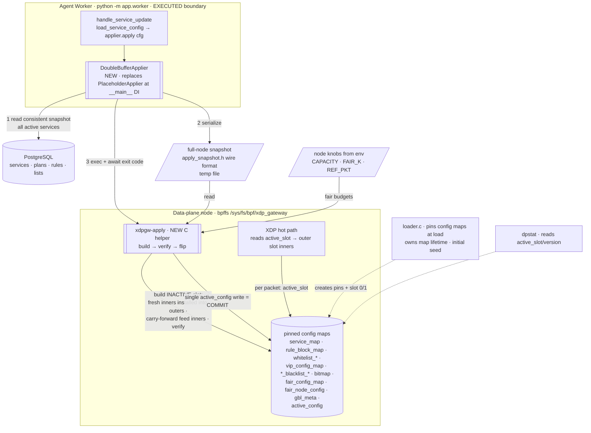
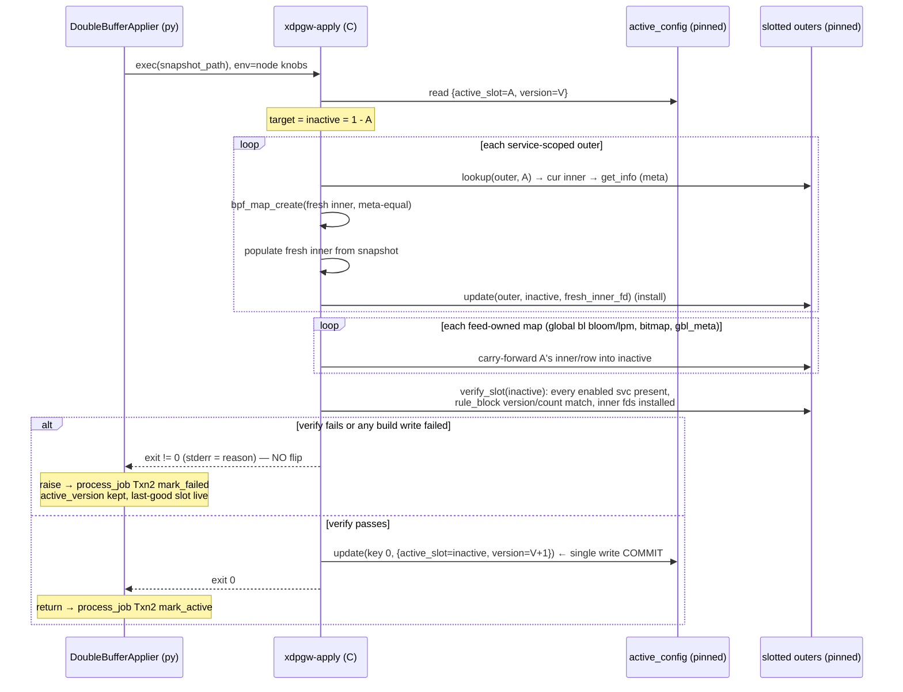

# Double-buffer Map Build/Swap Design

**Spec**: `.specs/features/double-buffer-swap/spec.md` (DBS-01..28)
**Context**: `.specs/features/double-buffer-swap/context.md` (D-DBS-1..3, A-DBS-1..8)
**Status**: Draft (awaiting approval → Tasks)
**Depends on** (agent-worker **executed first** — currently Tasks APPROVED; this feature's Execute is gated on it):
- **Agent worker** (AD-027, `app/worker/{applier,handlers,processor,worker,__main__}.py`) — provides the
  `Applier` protocol (`async def apply(self, config: ServiceConfig) -> None`), `handle_service_update`,
  `process_job`'s two-transaction version guard, and the `PlaceholderApplier` **injection site** in
  `__main__.py`. This feature swaps that one implementation (D-AGW-1 / A-DBS-1); the boundary and
  orchestration are untouched.
- **Data-plane M4 build contracts** (all executed / VERIFIED): `service.h` (`service_map` outer +
  `active_config`), `rules.h` (`rule_block_map`), `whitelist.h` (`whitelist_bloom`/`whitelist_lpm`/
  `vip_config_map`), `blacklist.h` (`global_blacklist_*`/`service_blacklist_*`/`udp_blocked_port_bitmap`/
  `gbl_meta`), `fairness.h` (`fair_config_map`/`fair_node_config`). Each outer is
  `ARRAY_OF_MAPS[SERVICE_SLOTS=2]` with static inner_0/inner_1 wired via BTF `.values`; the headers
  already document the M4 contract ("Bloom inners are replace-only. Build fresh inners and swap them into
  the inactive slot; replacements must keep value_size/max_entries/map_extra equal").
- **Loader** (`data-plane/loader/loader.c`) — the interim env seed (D-SLRD-1). Extended here to **pin the
  config maps** and to route its per-service seed through a shared builder; the fairness budget math
  (`clamp_fair_rate`/`fair_rate_product`/budget derivation) is extracted for reuse.

---

## Architecture Overview

The applier boundary the worker already calls is filled with a **`DoubleBufferApplier`** that does **no
BPF work in Python**. It (1) loads a **consistent full-node config snapshot** from PostgreSQL, (2)
serializes it to a temp file, and (3) execs a new C helper **`xdpgw-apply`** that performs the entire
build → verify → single-write swap against the pinned data-plane maps, returning exit 0 (swapped) or
nonzero (aborted, no swap). All kernel-map manipulation — fresh inner-map creation for the replace-only
blooms + LPM tries, populating ~11 slotted config maps, the atomic `active_config` flip — lives in one
audited C surface that reuses the loader's proven routines (D-DBS-1).

**Why a full-node rebuild per job (D-DBS-2):** a `SERVICE_UPDATE` targets one service at version N, but a
slot flip is node-global. The helper rebuilds **every active service's** service-scoped maps into the
inactive slot and **carries the feed-owned global deny maps forward** (pointer-copy, O(1) — the 1M
blacklist is never rebuilt per job), so the flipped slot is always complete and self-consistent. On flip,
all services go live together; `process_job`'s `mark_active` advances only the triggering service's
per-service `active_version` (state machine per-service; the slot is the physical carrier).

**Why abort-before-flip is the whole rollback story (D-DBS-3):** the helper only ever writes the
**inactive** slot, then commits with a single `active_config.active_slot` write at the very end. Any build
or structural-verify failure returns before that write — the live slot is untouched, so there is no
"flip back" to perform. A crash mid-build leaves a half-built inactive slot that the next apply
overwrites. The flip itself is one aligned `__u32` write, so the hot path (which reads `active_slot` once
per packet and indexes every outer with it) never straddles a swap.

**Component / data-flow** — source: `diagrams/apply-dataflow.mmd` · rendered: `diagrams/apply-dataflow.svg`



**Build-verify-swap sequence** — source: `diagrams/build-verify-swap.mmd` · rendered:
`diagrams/build-verify-swap.svg`



---

## Research Notes (Knowledge Verification Chain)

- **Step 1 (Codebase — authoritative):**
  - Outers are `ARRAY_OF_MAPS[2]` with **static** inner_0/inner_1 wired by BTF `.values`
    (`src/xdp_gateway.bpf.c` `service_map`, and each `*_map` in `rules.h`/`whitelist.h`/`blacklist.h`/
    `fairness.h`). The loader seeds **both** slots identically and sets `active_slot=0`
    (`seed_active_config`, `seed_*` writers, `loader.c`). **Only observability maps are pinned**
    (`set_observability_pin_paths`/`pin_observability_maps`); config maps are reachable only in-process
    today — this feature must pin them (DBS-08).
  - `whitelist.h`/`blacklist.h` headers **explicitly document** the M4 build contract: bloom inners are
    replace-only, "build fresh inners and swap them into the inactive slot", keep
    `value_size`/`max_entries`/`map_extra` equal, bloom contents a per-slot superset of LPM (no false
    negatives = builder invariant). This is the design's north star, not an invention.
  - Reusable leaf writers + fair math already exist in `loader.c`: `seed_rule_block_fd`, `seed_wl_slot`,
    `seed_*_blacklist_*`, `seed_fair_config_slot`, `seed_fair_node_config`, `clamp_fair_rate`,
    `fair_rate_product`, and the budget derivation in `prepare_fair_seed` (`burst=ceiling-committed`,
    `cap_bps=ceiling×k`, `cap_pps=cap_bps/ref_pkt`, `headroom=capacity-Σcommitted` floor 0). Struct
    shapes confirmed: `rule_block` 520 B (`version`,`rule_count`,`rules[RULE_MAX]`), `fair_config` 40 B,
    `fair_node_config` 16 B, `gbl_meta` 4 B, `bl_lpm_key` 8 B, `sbl_lpm_key` 12 B.
  - `active_config` value is `{__u32 active_slot; __u32 version}` in a 1-entry `ARRAY`; the hot path
    (`xdp_gateway.bpf.c` `lookup(active_config, 0)`) reads `active_slot` only — `version` is
    observability. A single aligned `__u32` write to `active_slot` is therefore the atomic swap point.
  - Agent-worker interface (AD-027, executed-to-be): `Applier` protocol `apply(config: ServiceConfig)`,
    injected at `__main__`; `ServiceConfig` is the full per-service snapshot dataclass; `process_job`
    maps applier success→`mark_active`, raise→`mark_failed`, `active_version` kept on failure.
- **Step 2 (Project docs):** ROADMAP M4 #2 ("build full inactive slot, verify, single `active_slot`
  write; rollback = flip back; config maps slotted, runtime-state unslotted §8.3"); D-SLRD-1
  (interim-writer → authoritative build = M4); AD-015/019/021/023/025 (frozen contracts); AD-017 (pin
  pattern under `/sys/fs/bpf/xdp_gateway/`); D-FAIR-2 (node capacity/k/ref-pkt = env, not DB); TDD 4.5 /
  PRD 6.8 / 11.3 (read full config → build → swap-only-on-full-build; restart preserves active state).
- **Step 3 (Context7 MCP):** unavailable in this environment (consistent with all prior designs) — skipped.
- **Step 4 (Web — the one load-bearing new fact):** runtime inner-map replacement in a map-in-map from
  userspace — **verified 2026-07-10** (kernel `map_of_maps.html`, eBPF-docs ARRAY_OF_MAPS, libbpf#834):
  userspace creates an inner with `bpf_map_create` and installs it with `bpf_map_update_elem(outer_fd,
  &slot, &inner_fd)`; **inner maps must match the template's properties** (type/key_size/value_size/
  max_entries/map_flags/map_extra — this is `bpf_map_meta_equal`; BTF is **not** compared, so
  `btf_fd=0` is fine); a **BPF program cannot modify outer entries** — replacement is userspace-only,
  which is exactly our model. A pinned outer is openable from a separate process by `bpf_obj_get`, and a
  fresh inner is kept alive by the outer's reference after install (no pin needed on inners). Bloom/LPM
  inner-in-`ARRAY_OF_MAPS` was already proven at load by WLV T1 / BLK T1.
- **Step 5 (Flagged uncertain):** none fabricated. Two items are **de-risked fail-fast at Execute, not
  assumed**: (a) the first `bpf_map_create`d fresh inner passing `map_meta_equal` on install into the
  pinned outer (meta replicated from `bpf_map_get_info_by_fd`); (b) a separate process installing an
  inner into a pinned outer under the target kernel. Fallback ladder in Tech Decisions.

---

## Code Reuse Analysis

### Existing components to leverage

| Component | Location | How to use |
| --- | --- | --- |
| `Applier` protocol + `ServiceConfig` + `load_service_config` | `app/worker/applier.py` (AD-027) | `DoubleBufferApplier` **implements** the same protocol; reuses `load_service_config` extended to a node loader (see below) |
| `PlaceholderApplier` injection site | `app/worker/__main__.py` (AD-027) | Swap `PlaceholderApplier()` → `DoubleBufferApplier(session_factory=…, apply_bin=…, timeout=…)` — the only worker wiring change (A-DBS-1) |
| `process_job` two-txn guard, `mark_active`/`mark_failed` | `app/worker/processor.py` / `app/services/apply.py` | **Unchanged** — success/raise mapping already correct; `active_version` kept on failure |
| `Settings` (`CONTROL_PLANE_` env) | `app/core/config.py` | Add `worker_apply_binary_path`, `worker_apply_timeout_seconds` |
| Leaf map writers + fresh-inner idioms | `loader.c` `seed_rule_block_fd`/`seed_wl_slot`/`seed_*_blacklist_*`/`seed_fair_config_slot` | Re-authored in the helper for snapshot input + fresh-inner install; layout/key construction copied verbatim |
| Fair budget math | `loader.c` `clamp_fair_rate`/`fair_rate_product`/`prepare_fair_seed` derivation | **Extract** to a shared non-`__BPF__` inline header (`fair_budget.h` or `fairness.h` guard) used by loader **and** helper — single source for `burst`/`cap_bps`/`cap_pps`/`headroom` |
| Contract headers | `service.h`/`rules.h`/`whitelist.h`/`blacklist.h`/`fairness.h` | Helper `#include`s them for struct/flag/const definitions + `_Static_assert` sizes |
| Pin dir + `set_pin_path`/`pin_map` idioms | `loader.c` | Extend to config maps (additive `pin_config_maps`) |
| `dpstat` pinned-map reader | `tools/dpstat.c` | Add an `active_config` section (slot + version) |

### Integration points

| System | Integration method |
| --- | --- |
| PostgreSQL | `DoubleBufferApplier` opens a **read-only session** (injected `session_factory`) and loads a **consistent full-node snapshot** (all `enabled` active services + plan + rules + whitelist + service-blacklist). No schema change, no migration. |
| Worker ↔ helper | `asyncio.create_subprocess_exec(apply_bin, snapshot_path, …)`; await exit code with a timeout; nonzero/timeout → raise `ApplyError(stderr)` |
| Helper ↔ data-plane | `bpf_obj_get` the pinned outers/arrays; `bpf_map_get_info_by_fd` + `bpf_map_create` + `bpf_map_update_elem` for inner replace; single `bpf_map_update_elem(active_config,0,…)` commit |
| Node knobs | Helper reads `XDPGW_NODE_CLEAN_CAPACITY_BPS`/`XDPGW_FAIR_K`/`XDPGW_FAIR_REF_PKT` from env (inherited from the worker process) — same source as the loader (D-FAIR-2), keeps fair math identical |
| Build | New `make apply` → `build/xdpgw-apply` (libbpf + `bpf.h`, **no skeleton** — opens by pin); loader gains config-map pins |

---

## Components

### `DoubleBufferApplier` — `app/worker/applier.py` (extended) — NEW class

- **Purpose**: the real `Applier` — load node snapshot from PG, serialize, exec `xdpgw-apply`, interpret
  the result. No BPF in Python (D-DBS-1).
- **Interfaces**:
  - `__init__(self, *, session_factory, apply_bin: str, timeout_s: float)` — deps injected at
    `__main__` (A-DBS-1).
  - `async def apply(self, config: ServiceConfig) -> None` (satisfies the protocol) —
    1. `async with session_scope-read` load `NodeConfig` (all active enabled services + children) via
       `load_node_config(db)`.
    2. `blob = serialize_node_snapshot(node)` → write to a `tempfile` (0600, unlinked in `finally`).
    3. `rc, stderr = await _run_helper(snapshot_path)` (`create_subprocess_exec`, `wait_for(timeout)`;
       on timeout kill + raise).
    4. `rc == 0` → return (log slot/version/duration, DBS-28); else `raise ApplyError(stderr.strip())`
       → `process_job` Txn 2 `mark_failed` (DBS-07/12). `config.version`/`service_id` used only for the
       structured log line (DBS-28); the physical version stamp is the helper's (DBS-19).
- **`load_node_config(db) -> NodeConfig`** — read-only; `NodeConfig` = `list[ServiceConfig]` of enabled
  services (reuses the AD-027 `ServiceConfig` snapshot shape) read in one session for internal
  consistency. Feed-owned global lists are **not** read (carried forward by the helper).
- **`serialize_node_snapshot(node) -> bytes`** — emits the `apply_snapshot` wire format (below).
- **Dependencies**: `session_factory`, `ServiceConfig`/models (read), stdlib `asyncio`/`tempfile`/
  `struct`/`logging`. **Reuses**: AD-027 `ServiceConfig`, `load_service_config` pattern.

### `xdpgw-apply` — `data-plane/tools/xdpgw-apply.c` — NEW C helper

- **Purpose**: build the inactive slot from a snapshot, structurally verify it, atomically flip
  `active_config`; exit 0 (swapped) or nonzero (aborted, no swap).
- **CLI**: `xdpgw-apply <snapshot-path>` (pin dir fixed `PIN_DIR`, or `--pin-dir`); node knobs from env.
- **Flow** (all-or-nothing; any failure `goto fail` → close fresh fds → exit nonzero, **no flip**):
  1. `parse_snapshot(path)` → in-memory `struct node_cfg { svc[]; counts }` (validates magic + schema
     version + bounds; truncation → fail, DBS-10).
  2. `open_pins()` — `bpf_obj_get` every pinned outer/array + `active_config`.
  3. `read {A=active_slot, V=version}`; `inactive = 1 - A` (DBS-24 — always fresh-read, never cached).
  4. **Build service-scoped inactive slot** — for each of `service_map`, `rule_block_map`,
     `whitelist_bloom`, `whitelist_lpm`, `vip_config_map`, `service_blacklist_bloom`,
     `service_blacklist_lpm`, `fair_config_map`: `new = create_inner_like(outer, A)` (get_info of the
     active inner → `bpf_map_create` meta-equal), populate from the snapshot with the leaf writers, then
     `bpf_map_update_elem(outer, &inactive, &new_fd)`. `fair_node_config[inactive]` + `service_map`
     enabled/`wl_flags`/`bl_flags` derived from the same snapshot; fair budgets via the shared math +
     env knobs.
  5. **Carry-forward feed maps** — `global_blacklist_bloom`/`global_blacklist_lpm`/
     `udp_blocked_port_bitmap`: `id=lookup(outer,A); fd=get_fd_by_id(id); update(outer,inactive,fd)`
     (pointer-copy, O(1)); `gbl_meta[inactive] = gbl_meta[A]` (row copy). (DBS-17, A-DBS-4.)
  6. `verify_slot(inactive)` — read-back: each enabled service present in the inactive `service_map`
     inner with correct `enabled`/flags; each service's `rule_block[inactive]` `version`/`rule_count`
     match; each outer's `lookup(outer,inactive)` returns a valid inner id; `fair_node_config[inactive]`
     + `gbl_meta[inactive]` coherent. Mismatch → fail (DBS-18, D-DBS-3).
  7. **Commit** — `bpf_map_update_elem(active_config, &zero, &{inactive, V+1}, BPF_ANY)` — the single
     write (DBS-03/19). Exit 0.
- **Reuses**: contract headers, loader leaf-writer idioms + key construction, shared fair math.
- **Dependencies**: `libbpf`/`bpf.h` (no skeleton).
- **Fresh-inner lifetime**: kept alive by the outer after install; the previously-inactive inner is
  orphaned and freed on last-ref (its only other holder is the loader skel for the two original static
  inners — a bounded, one-time liability). Helper closes all fds on exit; installed inners persist via
  the pinned outer.

### Loader change — `data-plane/loader/loader.c` (extended) — MODIFIED (additive)

- **Purpose**: pin the config maps so the separate helper can reach them; keep the initial seed as the
  bootstrap of a coherent slot 0/1 (D-SLRD-1 downgraded to initial-slot only, baseline/smoke unchanged).
- **Change**: add `set_config_pin_paths` + `pin_config_maps` for the 14 pinned config maps
  (`service_map`, `rule_block_map`, `whitelist_bloom`/`_lpm`, `vip_config_map`,
  `global_blacklist_bloom`/`_lpm`, `service_blacklist_bloom`/`_lpm`, `udp_blocked_port_bitmap`,
  `fair_config_map`, `fair_node_config`, `gbl_meta`, `active_config`), mirroring the observability
  pin/unpin/rollback structure; unpinned on clean exit like today. Extract `clamp_fair_rate`/
  `fair_rate_product`/budget derivation to the shared header (loader now includes it).
- **Not pinned**: static inner_0/inner_1 (reached via the outer), `tx_devmap`, runtime-state maps
  (§8.3 — untouched by swap, DBS-05).
- **Reuses**: existing `set_pin_path`/`pin_map`/`unpin_map` + `PIN_DIR`.

### `apply_snapshot.h` — `data-plane/src/apply_snapshot.h` — NEW (CP↔DP wire contract)

- **Purpose**: the first control-plane→data-plane data crossing; a versioned, dependency-free binary
  format the Python worker writes and the C helper reads (A-DBS-2).
- **Shape** (explicit little-endian fixed-width fields — **not** raw C-struct dumps, to decouple from
  compiler padding): magic `"XDPGWAP1"` (8 B) · `schema_version: u32` · `service_count: u32` · then per
  service: `{ dst_prefixlen: u32, dst_addr: be32, dp_id: u32, enabled: u8, wl_flags: u8,
  bl_flags: u8, committed_bps: u64, ceiling_bps: u64, vip_pps: u64, vip_bps: u64, vip_flags: u8,
  rule_count: u16, rules[rule_count] (src_lo, src_hi, dst_lo, dst_hi, proto, flags), wl_count: u32,
  wl[]{prefixlen, src_be32}, sbl_count: u32, sbl[]{prefixlen, src_be32} }`. Flags/`wl_flags`/
  `bl_flags`/`WL_F_HAS_BROAD` derivation matches the loader (`prepare_wl_seed`/`prepare_deny_seed`).
  **VIP limits are service-level** (one `vip_config` keyed by `dp_id`, matching `struct vip_config`
  and `ServiceConfig.vip_pps/vip_bps`) — not per whitelist entry; the helper stamps `vip_config.version`.
  **`dp_id`** is the `u32` data-plane surrogate (`ProtectedService.dp_id`, AD-030 D-030-4), **not** the
  service UUID; the serializer sources it from the `ServiceConfig.dp_id` field (added below).
- **Contract discipline**: `schema_version` bumps on any layout change; helper rejects unknown versions
  (fail-closed). A **golden fixture** (bytes) round-trips Python-serialize ↔ C-parse in tests.
- **Reuses**: field semantics from `service.h`/`rules.h`/`whitelist.h`/`blacklist.h`; the Python side
  mirrors it with `struct.pack`.

### `fair_budget.h` — shared fair math — NEW small header (or `fairness.h` non-`__BPF__` guard)

- **Purpose**: single source for `clamp_fair_rate`, `fair_rate_product`, and
  `fair_budget(committed, ceiling, k, ref_pkt) -> {committed_bps, burst_bps, cap_bps, cap_pps}` +
  `node_headroom(capacity, sum_committed)`. Used by loader (initial seed) and helper (per-service).
- **Reuses**: `FAIR_RATE_MAX` (16e9) + existing derivation, verbatim math.

### `dpstat` change — `data-plane/tools/dpstat.c` (extended) — MODIFIED (additive)

- **Purpose**: DBS-27 — surface `active_config.active_slot` + `version`.
- **Change**: read the newly-pinned `active_config`; print `active_slot` / `version` in a small section
  (friendly "gateway not loaded" if the pin is absent, matching the existing dpstat convention).

---

## Data Models

- **No control-plane schema change, no migration.** `DoubleBufferApplier` reads existing `ProtectedService`
  (+ `ServicePlan`, `AllowRule`, whitelist/blacklist rows) through the AD-027 `ServiceConfig` snapshot;
  `NodeConfig` is an in-memory list of them.
- **`ServiceConfig` gains `dp_id: int`** (adopting the AD-030 D-030-4 surrogate `ProtectedService.dp_id`,
  the `service_dp_id_seq` column already landed): a purely additive dataclass field populated in
  `load_service_config`/`load_node_config` and serialized into the wire `dp_id`. The `service_id: UUID`
  field stays for logging; `dp_id` is the on-wire identity the data-plane maps key on.
- **`active_config.version` = node-global map version** (`{active_slot, version}`), incremented by the
  helper on each successful swap — **distinct** from each service's per-service `active_version` (advanced
  by `mark_active`). dpstat/telemetry read the former (A-DBS-5).
- **`apply_snapshot` wire format** — the only new persisted-ish artifact (a transient temp file), defined
  above; versioned, fixture-tested.

---

## The build/verify/swap algorithm (crux)

```
xdpgw-apply(snapshot_path):
    node   = parse_snapshot(snapshot_path)          # validate magic+version+bounds  (DBS-10)
    maps   = open_pins()                            # bpf_obj_get all pinned outers + active_config
    A, V   = read(active_config[0])                 # fresh read every run            (DBS-24)
    inact  = 1 - A

    # ── build service-scoped inactive slot (fresh inners) ───────────────
    for outer in SERVICE_SCOPED_OUTERS:             # service_map, rule_block, wl bloom/lpm,
        meta  = get_info(lookup(outer, A))          #   vip, service-bl bloom/lpm, fair_config
        fresh = bpf_map_create(meta)                # meta-equal (type/key/val/max/flags/extra)
        populate(fresh, node)                       # leaf writers + shared fair math + env knobs
        update(outer, inact, fresh.fd)              # install  (userspace-only; BPF can't)
    write fair_node_config[inact], service_map flags from node

    # ── carry forward feed-owned global deny maps (O(1), no rebuild) ────
    for outer in FEED_OUTERS:                        # global bl bloom/lpm, blocked-port bitmap
        update(outer, inact, get_fd_by_id(lookup(outer, A)))
    gbl_meta[inact] = gbl_meta[A]

    if not verify_slot(inact):  goto fail            # structural read-back            (DBS-18)

    update(active_config[0], {active_slot: inact, version: V+1})   # ← single-write COMMIT (DBS-03/19)
    exit 0

fail:
    close all fresh fds                              # inactive half-build never went live (DBS-11/13/14)
    exit != 0                                        # stderr = reason → mark_failed   (DBS-07/12)
```

The **only** state-changing write visible to the hot path is the final `active_config` update; everything
before it touches only the inactive slot. Crash/kill before it ⇒ live slot unchanged, next apply
overwrites the inactive slot. The flip is one aligned `__u32` (`active_slot`) ⇒ no torn slot read.

---

## Error Handling Strategy

| Scenario | Handling | Result |
| --- | --- | --- |
| Snapshot truncated / bad magic / unknown schema_version | `parse_snapshot` fails before any map write | exit≠0, no flip → `mark_failed`; last-good live (DBS-10) |
| A pinned config map missing (loader not run / stale) | `bpf_obj_get` fails at `open_pins` | exit≠0, no flip; friendly error (DBS-08) |
| `bpf_map_create`/install of a fresh inner fails (ENOMEM at 1M-scale bloom, meta mismatch) | `goto fail`, close fds | exit≠0, no flip; inactive half-build orphaned & freed (DBS-09/11) |
| A leaf write (`bpf_map_update_elem`) errors | `goto fail` | exit≠0, no flip (DBS-11) |
| Structural verify mismatch | `goto fail` before commit | exit≠0, no flip; `active_version` kept (DBS-12/18) |
| `active_config` commit write itself fails | return errno; nothing half-applied (single key) | exit≠0; last-good slot stays live; retry-able (edge case) |
| Helper killed / crashes mid-build | no commit occurred | live slot unchanged; next apply rebuilds inactive (DBS-14) |
| Helper exceeds `worker_apply_timeout_seconds` | `DoubleBufferApplier` kills subprocess, raises | `mark_failed` (timeout); retry-able; ≤5 s budget observable (DBS-25) |
| Node config read races a concurrent mutation | one read session = internally consistent snapshot | benign; the other service's own job rebuilds+flips again (eventual consistency) |
| Triggering service CASCADE-deleted mid-flight | snapshot omits it; job superseded by two-txn guard | absent in new slot, no crash (DBS-16/20) |
| Feed maps empty (no seed/feed yet) | carry-forward is a no-op | new slot has empty global deny maps (baseline, DBS-17) |
| Stray second concurrent writer (unsupported) | single-writer assumed (A-DBS-8); guards keep ledger safe | physical-slot integrity assumes one writer |
| Startup | applier never runs unsolicited; only a job execs the helper | no unsolicited swap (DBS-22, AGW-21) |

---

## Tech Decisions (non-obvious)

| Decision | Choice | Rationale |
| --- | --- | --- |
| Python↔BPF mechanism | **C helper subprocess** `xdpgw-apply`; `apply()` = exec + exit code | D-DBS-1; reuses proven C map routines; keeps replace-only bloom + fresh-inner logic in one audited surface; boundary stays `apply(ServiceConfig)` (A-DBS-1) |
| Inner update strategy | **Uniform fresh-inner replacement** for every `ARRAY_OF_MAPS` service-scoped outer (not in-place clear) | Blooms *cannot* be cleared (header contract) ⇒ replacement is mandatory there; using it everywhere is uniform and dodges stale-service-key deletion; a fresh inner starts empty |
| Fresh-inner meta source | `bpf_map_get_info_by_fd` on the **active** slot's inner → `bpf_map_create` (BTF-less, `btf_fd=0`) | Guarantees `map_meta_equal` without hardcoding; header consts are the documented invariant; BTF not compared by `map_meta_equal` (web-verified) |
| Feed-map carry-forward | **Pointer-copy** the active inner's fd into the inactive index (O(1)); `gbl_meta` row copy | The 1M global blacklist must not be rebuilt per service job (D-DBS-2); M4 #3 owns feed content — this only preserves it across a per-service flip (A-DBS-4) |
| Rebuild scope | **Full node** every job (all active services), not incremental | D-DBS-2; stateless, self-consistent; no fragile active→inactive clone of replace-only blooms |
| Verify gate | **Structural read-back** before flip; abort-before-flip is the entire rollback | D-DBS-3; catches dropped writes / failed installs / truncated snapshot deterministically & offline; no "flip back" path exists because nothing became live |
| Swap atomicity | **Single `active_config` write**; hot path reads only the aligned `__u32 active_slot` | AD-015; one aligned word ⇒ no torn slot; `version` is observability-only |
| Node knobs source | Helper reads capacity/`k`/`ref_pkt` **from env** (inherited); per-service committed/ceiling from the **snapshot** | D-FAIR-2 (node knobs are env, not DB); keeps fair math identical to the loader; snapshot carries only DB-sourced config |
| Helper input channel | **Worker-serialized binary snapshot** (temp file), not helper-reads-PG | A-DBS-2; keeps the helper DB-free + fixture-testable; all PG access stays in Python (A-AGW-5); avoids libpq + DB secrets in the data-plane |
| Snapshot format | Versioned **explicit-LE binary** (`apply_snapshot.h`), not raw struct dump, not JSON | Decouples from compiler padding; no C JSON dependency; `schema_version` + golden-fixture round-trip |
| Map lifetime owner | **Loader** pins config maps + stays running (as today); helper never unpins | Minimal change to the current lifecycle; the attached prog + pins keep maps alive; the helper is short-lived |
| No new `JobType` | Full-rebuild-per-`SERVICE_UPDATE` subsumes `MAP_REBUILD`/`ACTIVE_SLOT_SWAP` | A-AGW-4 / A-DBS-1; a service-triggered node rebuild already covers the need in v1 |
| De-risk (fail-fast) | First `bpf_map_create`→install into a pinned outer from the helper is proven at the **first Execute gate**; fallback ladder below | The one novel composition (separate-process inner replace into pinned outer); everything else is executed code |

**Fallback ladder (de-risk, if separate-process fresh-inner install fails on the target kernel):**
(1) primary — helper opens pinned outers, installs fresh inners (this design); (2) if install into a
pinned outer from a non-owner process is rejected — helper additionally **pins each fresh inner** and/or
the loader **pre-pins the static inners**, helper writes into pinned inners in place (works for LPM/HASH;
blooms still need replace → pin+replace); (3) last resort — the **loader hosts the apply** (worker signals
it via a small IPC), keeping all map ownership in one process. All three keep the boundary + verdict
semantics identical; the choice is made at the first Execute gate (T-first), not assumed.

---

## Testing Notes (feeds Tasks / TESTING.md)

- **Data-plane (`make test` + gated smoke)** — the primary proof surface:
  - **Snapshot round-trip** (`[P]`, pure): a golden `apply_snapshot` byte fixture parses in C to the
    expected `node_cfg`; the Python `serialize_node_snapshot` emits the identical bytes.
  - **Fresh-inner install de-risk** (first gate, fail-fast): from a loaded/`TEST_RUN` map set, the helper
    creates a fresh inner meta-equal to the active inner and installs it into a pinned outer — proves the
    novel composition before building the rest (Tech-decision de-risk).
  - **Build + flip verdict test** (`BPF_PROG_TEST_RUN`, extends the executed 91-case suite): seed slot 0
    (loader/env), run the helper with a snapshot that adds a service / an allow-rule / a whitelist entry,
    assert `active_slot` flipped and the hot path now enforces the change (e.g. newly-allowed flow
    admits; removed service → `service_miss`); assert non-triggering services + carried-forward global
    blacklist **unchanged** (DBS-15/16/17).
  - **Fail-closed / rollback** (dp-unit): inject a build error and a verify mismatch → helper exit≠0,
    `active_slot` + `version` unchanged, prior verdicts intact (DBS-11/12/13); kill mid-build → unchanged
    (DBS-14).
  - **Version/idempotency**: two applies of the same snapshot → `version` increments, verdicts identical
    (DBS-19/21); restart (re-read active_config) targets the opposite slot (DBS-24).
  - **Gated bulk** (`make applybulk`, privileged): 1000-service snapshot → measure rebuild+verify+flip
    wall time; assert < budget (DBS-26); confirms the 1M global blacklist is carried-forward not rebuilt.
- **Control-plane (`compose.test.yml`, integration)**:
  - `DoubleBufferApplier.apply` with a **fake helper binary** (a stub that records argv + snapshot bytes
    and exits 0/1/timeout) — asserts snapshot content, success→return, nonzero→`ApplyError`,
    timeout→kill+raise (no live BPF needed; runs in CI).
  - **End-to-end ≤5 s** (gated, needs a loaded data-plane / privileged runner): enqueue a real
    `SERVICE_UPDATE` → worker → real `xdpgw-apply` → `active_slot` flipped, elapsed ≤ 5 s (DBS-25,
    A-AGW-7 re-validation). Documented as the milestone check; may be manual where BPF isn't available in
    CI.
  - `load_node_config` snapshot shape (all enabled services + children, disabled omitted).
- **dpstat**: `active_config` section prints slot/version; friendly error without the pin (DBS-27).
- **Gate**: dp-unit → `cd data-plane && make test`; dp build → `make bpf skel loader apply dpstat`;
  privileged → `sudo make smoke` / `make applybulk`. control-plane unit+integration → `ruff+mypy+pytest`
  on `compose.test.yml`. TESTING.md gains an `xdpgw-apply` section (snapshot fixture + build/flip
  conventions).

---

## Open Questions / Flags (confirm before or during Tasks)

1. **Loader-refactor depth** — extract only the fair math to `fair_budget.h` (recommended, minimal), vs a
   larger shared `build.c` of leaf writers used by both loader and helper. Proposed: minimal extraction;
   helper re-authors the leaf writers (snapshot+fresh-inner differ enough from the loader's env+static
   writers). Confirm.
2. **Snapshot format authoring** — `apply_snapshot.h` explicit-LE binary + Python `struct` mirror +
   golden fixture (recommended) vs JSON + a tiny C reader. Confirm binary.
3. **End-to-end ≤5 s test placement** — gated/privileged integration vs documented manual check where the
   BPF runner isn't in CI (like the existing live-veth smoke). Confirm scope for v1 (DBS-25).
4. **Fresh-inner de-risk rung** — confirm the fail-fast first-gate proof of separate-process inner
   install into a pinned outer, and which fallback rung (if any) the target kernel needs (Tech Decisions
   ladder). Expected: primary rung passes.
5. **Fair budget input for `fair_node_config` headroom** — Σcommitted computed by the helper across the
   snapshot's services (recommended, single consistent pass) vs carried from a control-plane field.
   Confirm helper-computes.
6. **`worker_apply_timeout_seconds` default** — proposed 5.0 s aligned to the SLA (kill+`mark_failed` on
   exceed, retry heals). Confirm the value + whether timeout counts against `attempts`.
