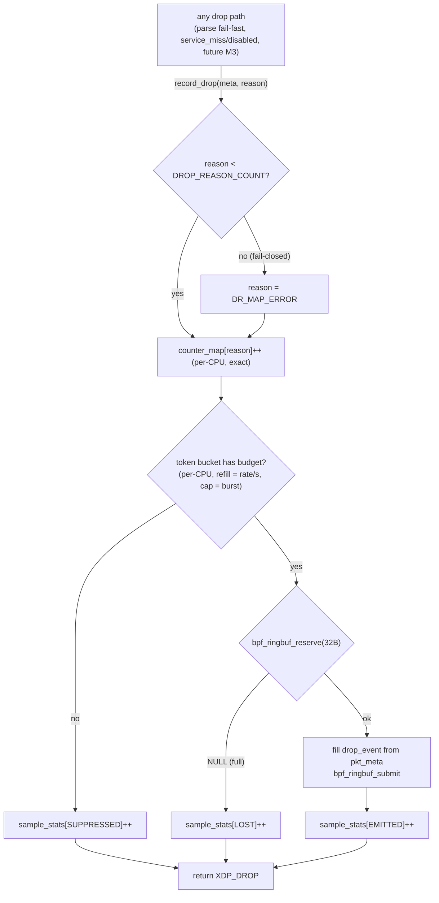

# Drop-reason Counters — Design

**Spec:** `.specs/features/drop-reason-counters/spec.md` (DRC-01..17)
**Context:** `.specs/features/drop-reason-counters/context.md` (D-DRC-1; sampling/rate-limit/CLI = agent discretion, resolved here)
**Status:** Verified — Execute complete (2026-07-08)
**Domain:** modifies the executed `data-plane/` (packet-parse VERIFIED); assumes service-lookup-redirect (SLRD) executes first (D-DRC-1d)

---

## Research notes (Knowledge Verification Chain)

Codebase + project docs covered in Specify/Context. Context7 MCP unavailable in this environment
(consistent with AD-015); load-bearing kernel semantics verified by web search against current docs
(2026-07-08):

- **BPF ringbuf is usable from XDP and non-blocking by construction** — `BPF_MAP_TYPE_RINGBUF`
  (kernel ≥ 5.8) is a single MPSC buffer shared across CPUs; `bpf_ringbuf_reserve()` **returns `NULL`
  when the buffer is full** (never blocks, never stalls the hot path); `bpf_ringbuf_submit()` accepts
  `BPF_RB_NO_WAKEUP`/`BPF_RB_FORCE_WAKEUP` for notification control, default is adaptive notification.
  Buffer size must be a **power of 2 and page-aligned**. (kernel ringbuf doc; docs.ebpf.io
  `bpf_ringbuf_reserve`/`bpf_ringbuf_submit`; Nakryiko's ringbuf post.)
- **`bpf_ktime_get_ns()` is available to XDP** — monotonic ns since boot; this feeds the token-bucket
  refill. (docs.ebpf.io `bpf_ktime_get_ns`.)
- **`BPF_PROG_TEST_RUN` and ringbuf delivery — high confidence, fail-fast verified in T-early:**
  the kernel doc says test_run has no *packet* side effects (no real redirect/drop — already known from
  AD-015); **map writes do persist** (the entire existing 21-test suite asserts `counter_map`/
  `test_meta_map` written during test_run). Ringbuf submission is a helper write into map memory, so
  events should be consumable via `ring_buffer__consume()` after test_run — but this exact combination
  is not explicitly documented. **Not fabricated:** the test-harness task proves it first (mirror of
  SLRD-T2 de-risk); documented fallback below if it fails.

**Fallback (if test_run does not deliver consumable ringbuf events):** dp-unit asserts the sampling
*accounting* only (`sample_stats` emitted/suppressed/lost — plain per-CPU array, guaranteed to work),
and event *content* is asserted in the privileged live-veth smoke (`make smoke`, dp-integration)
instead. External contracts unchanged.

---

## Architecture Overview

> Rendered diagrams: [`diagrams/drop-path-flow.svg`](diagrams/drop-path-flow.svg) (drop path:
> count → rate-limit → sample) and [`diagrams/counters-component-layout.svg`](diagrams/counters-component-layout.svg)
> (maps, pinning, consumers). Sources in `diagrams/*.mmd`.

Every drop keeps flowing through **one helper** — `record_drop()` grows a `pkt_meta *` parameter and
becomes the single choke point that (1) bumps the exact per-CPU `counter_map[reason]` (unchanged
semantics, now over the finalized 16-reason ABI), then (2) consults a per-CPU token bucket and, if
budget allows, reserves a `struct drop_event` in a shared **ringbuf** and submits it. Counting is
unconditional and exact; sampling is best-effort and bounded. Clean/redirected packets touch none of
this (drop-path-only cost).



Userspace: the **loader pins** all observability maps under `/sys/fs/bpf/xdp_gateway/`, so the new
`dpstat` CLI (and later the M4 worker) opens pinned paths without holding the skeleton — counters dump,
sample tail, and budget tuning all work against a running gateway.

---

## Code Reuse Analysis

### Existing Components to Leverage

| Component | Location | How to Use |
| --- | --- | --- |
| `enum drop_reason` + `counter_map` + `record_drop` | `data-plane/src/drop_reason.h` | **Rewrite in place**: finalize enum to §9.2 order (one move: `map_error` 4→15), keep map type/size, extend helper signature |
| `struct pkt_meta` (incl. SLRD's `service_id`) | `data-plane/src/pkt_meta.h` | Read-only source for `drop_event` fields — no changes to the struct |
| Drop call sites | `data-plane/src/xdp_gateway.bpf.c` | Mechanical update: `record_drop(r)` → `record_drop(&meta, r)` (6 sites + SLRD's) |
| `BPF_PROG_TEST_RUN` harness + frame builders | `data-plane/tests/test_parse.c`, `pkt_build.h` | Extend the same binary with sampling cases; existing per-reason assertions migrate via enum symbols (no hardcoded indices) |
| Loader skeleton lifecycle | `data-plane/loader/loader.c` | Add `bpf_map__set_pin_path` before load + unpin on detach; seed `sample_config` |
| Data-plane gates | `.specs/codebase/TESTING.md` (A-PKT-2) | Same build/quick/full gates; add ABI + sampling conventions |
| Verified libbpf ring API | libbpf `ring_buffer__new/poll/consume` | `dpstat tail` + test consumer |

### Integration Points

| System | Integration Method |
| --- | --- |
| SLRD (M2 #2, executes first) | Its `DR_SERVICE_MISS`/`DR_SERVICE_DISABLED` land at 5/6 (already §9.2-correct); its drop sites adopt the new helper signature; its `pkt_meta.service_id` feeds `drop_event` |
| M3 features | Add a drop path = one `record_drop(&meta, DR_x)` call — counter slot + sampling come free (DRC-15) |
| M4 worker | Reads pinned `counter_map` (deltas; reset-on-reload documented) + consumes the pinned ringbuf for `TELEMETRY_AGGREGATE`; may retune `sample_config` at runtime |
| `.specs/codebase/TESTING.md` | ABI freeze note + sampling determinism convention (Tasks-phase edit) |

---

## Components

### `drop_reason.h` — finalized ABI + exact counters (DRC-01..08, 15)

- **Purpose**: the frozen reason vocabulary, its name table (single source of truth), the exact per-CPU
  counter, and the one drop helper every path calls.
- **Location**: `data-plane/src/drop_reason.h` (rewrite in place)
- **Interface**:
  ```c
  enum drop_reason {                      /* FROZEN ABI — §9.2 doc order (D-DRC-1) */
      DR_IPV6_UNSUPPORTED     = 0,
      DR_UNSUPPORTED_ETHERTYPE = 1,
      DR_MALFORMED_IPV4       = 2,
      DR_FRAGMENT_UNSUPPORTED = 3,
      DR_BOGON_DROP           = 4,   /* M3 */
      DR_SERVICE_MISS         = 5,   /* SLRD */
      DR_SERVICE_DISABLED     = 6,   /* SLRD */
      DR_UDP_AMPLIFICATION_DROP = 7, /* M3 */
      DR_BLACKLIST_DROP       = 8,   /* M3 */
      DR_NOT_ALLOWED          = 9,   /* M3 */
      DR_RATE_LIMIT_DROP      = 10,  /* M3 */
      DR_SERVICE_CEILING_DROP = 11,  /* M3 */
      DR_CONGESTION_DROP      = 12,  /* M3 */
      DR_INGRESS_CAP_DROP     = 13,  /* M3 */
      DR_VIP_CEILING_DROP     = 14,  /* M3 */
      DR_MAP_ERROR            = 15,  /* moves 4 → 15 */
      DROP_REASON_COUNT       = 16,  /* append-only after this (post-v1: 16, 17, …) */
      DROP_REASON_CAP         = 32,  /* counter_map width — unchanged */
  };

  #ifndef __BPF__                          /* userspace: single source of truth for names */
  static const char *const drop_reason_name[DROP_REASON_COUNT] = {
      "ipv6_unsupported", "unsupported_ethertype", /* … §9.2 strings, index-aligned … */ "map_error",
  };
  #endif

  /* BPF side (unchanged map + extended helper): */
  struct { ... } counter_map;              /* PERCPU_ARRAY, max_entries = DROP_REASON_CAP, u64 */
  static __always_inline int record_drop(const struct pkt_meta *meta, enum drop_reason r);
  /* r >= DROP_REASON_COUNT → r = DR_MAP_ERROR (fail-closed, DRC-07);
     counter_map[r]++ (always, exact); then sample_drop(meta, r) (best-effort); returns XDP_DROP */
  ```
- **Dependencies**: `pkt_meta.h`, `sample.h` (BPF side), `<bpf/bpf_helpers.h>`.
- **Reuses**: existing map + helper shape; §9.2 strings verbatim.
- **Note**: a `_Static_assert(DROP_REASON_COUNT <= DROP_REASON_CAP, ...)` guards headroom; the enum
  block carries a `/* FROZEN ABI — append only, never renumber */` banner (DRC-02).

### `drop_event.h` — the sample event contract (DRC-09)

- **Purpose**: the one struct both the BPF producer and every userspace consumer (tests, `dpstat`,
  M4 worker) compile against.
- **Location**: `data-plane/src/drop_event.h` (new; plain header, no BPF deps — safe for userspace)
- **Interface**:
  ```c
  struct drop_event {            /* 32 bytes, explicit layout */
      __u64 ts_ns;               /* bpf_ktime_get_ns at drop */
      __u32 src_ip, dst_ip;      /* network order, as in pkt_meta */
      __u32 service_id;          /* 0 if unknown (drop before service match) */
      __u16 sport, dport;        /* network order; 0 if n/a */
      __u8  reason;              /* enum drop_reason */
      __u8  ip_proto;            /* 0 if drop before IPv4 parse */
      __u8  _pad[2];
  };
  struct sample_config { __u64 rate_per_sec; __u64 burst; };   /* per-CPU budget knobs */
  enum sample_stat { SAMPLE_EMITTED = 0, SAMPLE_SUPPRESSED, SAMPLE_LOST, SAMPLE_STAT_MAX };
  ```
- **Dependencies**: `<linux/types.h>` only.
- **Reuses**: field semantics/endianness from `pkt_meta.h` (values copied verbatim).

### `sample.h` — ringbuf + rate limiter (DRC-10..12)

- **Purpose**: bounded, non-blocking drop-event emission; all sampling state in one header.
- **Location**: `data-plane/src/sample.h` (new; BPF-only)
- **Maps**:
  | Map | Type | Shape | Purpose |
  | --- | --- | --- | --- |
  | `drop_ringbuf` | `RINGBUF` | `max_entries = 256 KiB` (power-of-2, page-aligned ⇒ ~8K events) | MPSC event channel, all CPUs |
  | `sample_config` | `ARRAY` ×1 | `struct sample_config` | runtime-tunable budget (loader seeds; tests/worker retune) |
  | `sample_bucket` | `PERCPU_ARRAY` ×1 | `{ __u64 tokens; __u64 last_ns; }` | per-CPU token bucket (no cross-CPU atomics) |
  | `sample_stats` | `PERCPU_ARRAY` ×`SAMPLE_STAT_MAX` | `__u64` | emitted / suppressed / lost accounting (DRC-11) |
- **Interface**: `static __always_inline void sample_drop(const struct pkt_meta *meta, enum drop_reason r);`
  — refill bucket from `bpf_ktime_get_ns()` elapsed × `rate_per_sec` (capped at `burst`); no token →
  `SUPPRESSED++`, return; else `bpf_ringbuf_reserve(sizeof(struct drop_event))`; `NULL` (full) →
  `LOST++`, return; else fill from `meta` + submit (flags 0 = adaptive wakeup) + `EMITTED++`.
- **Budget semantics (decision):** `rate_per_sec`/`burst` are **per-CPU**; the node-level bound is
  `rate × online CPUs` — documented in README. Keeps the hot path free of shared-cacheline atomics
  (same posture as `counter_map`). **Defaults:** rate 256/s, burst 64 per CPU.
- **Determinism for tests:** `rate_per_sec = 0, burst = B` ⇒ exactly B tokens, no refill ⇒ fire M > B
  drops, expect exactly B emitted + (M−B) suppressed (DRC-16, no timing dependence).
- **Dependencies**: `drop_event.h`, `pkt_meta.h`, `<bpf/bpf_helpers.h>`.
- **Reuses**: verified ringbuf/ktime semantics (Research notes).

### `loader/loader.c` — pinning + seeding (extends existing)

- **Purpose**: make observability maps reachable by decoupled consumers; seed the default budget.
- **Location**: `data-plane/loader/loader.c` (extend)
- **Changes**: before load, `bpf_map__set_pin_path()` for `counter_map`, `drop_ringbuf`,
  `sample_config`, `sample_stats` under **`/sys/fs/bpf/xdp_gateway/<map>`**; after load, write the
  default `sample_config`; on signal detach, unpin + existing teardown. Fail-loud on pin errors
  (consistent with D-PKT-1 posture).
- **Reuses**: existing skeleton lifecycle, signal handling.

### `tools/dpstat.c` — operator CLI (DRC-13..14)

- **Purpose**: pre-M5 visibility: counter dump + live sample tail.
- **Location**: `data-plane/tools/dpstat.c` (new directory; own Makefile target `make dpstat`)
- **Interfaces** (CLI):
  - `dpstat counters [-w <sec>]` — open pinned `counter_map` + `sample_stats`, aggregate per-CPU
    values, print `index  name  total` rows (names from `drop_reason_name[]`) + emitted/suppressed/lost
    footer; `-w` = clear+redraw loop (watch).
  - `dpstat tail` — open pinned `drop_ringbuf`, `ring_buffer__new(fd, cb)` + `ring_buffer__poll()`
    loop; print `ts  reason  src:port → dst:port  proto  service_id` human-readably until SIGINT.
  - `dpstat rate <per_cpu_rate> <burst>` — write `sample_config` (operator tuning; also what tests use).
- **Dependencies**: libbpf (pinned-path `bpf_obj_get`), `drop_event.h`, `drop_reason.h` (userspace side).
- **Reuses**: name table (no duplicated strings); verified `ring_buffer__*` API.

### `tests/test_parse.c` — migration + sampling cases (DRC-03, 16)

- **Purpose**: keep the one-binary suite; prove the ABI migration and the sampling bounds.
- **Location**: `data-plane/tests/test_parse.c` (extend; `pkt_build.h` unchanged)
- **Changes**:
  - **Migration**: existing assertions already use enum symbols (verified — no hardcoded indices), so
    the `map_error` move compiles through; the reason-iteration loop bound becomes `DROP_REASON_COUNT`.
    New assertion: all 16 slots readable, unwired M3 reasons == 0 after the full corpus (DRC-04).
  - **De-risk case (first)**: submit one event via a drop under `rate=0,burst=1`, then
    `ring_buffer__consume()` — proves test_run→ringbuf delivery (Research notes); if it fails, switch
    suite to the documented stats-only fallback and record the finding.
  - **Sampling cases**: budget bound (M drops, burst B ⇒ exactly B events, M−B suppressed, counters
    exactly M — DRC-10/12); event-content check (fields match the injected frame + reason — DRC-09);
    fail-closed reason (test hook invoking an out-of-range reason → `map_error`++ — DRC-07, via a
    `-DPKT_TEST_HOOKS`-gated path like `test_meta_map`).
- **Reuses**: harness env, frame builders, per-case counter reset pattern.

---

## Data Models

No database. In-kernel maps after this feature (all **runtime-state, unslotted** per §8.3 — none are
config, none double-buffered):

| Map | Type | Key → Value | Pinned | Owner |
| --- | --- | --- | --- | --- |
| `counter_map` | `PERCPU_ARRAY` (32) | reason idx → u64 | ✔ | existing — semantics unchanged, ABI finalized |
| `drop_ringbuf` | `RINGBUF` (256 KiB) | — → `struct drop_event` | ✔ | this feature |
| `sample_config` | `ARRAY` (1) | 0 → `{rate, burst}` | ✔ | this feature |
| `sample_bucket` | `PERCPU_ARRAY` (1) | 0 → `{tokens, last_ns}` | ✖ (internal) | this feature |
| `sample_stats` | `PERCPU_ARRAY` (3) | stat idx → u64 | ✔ | this feature |

---

## Error Handling Strategy

| Scenario | Handling | Impact |
| --- | --- | --- |
| Ringbuf full (no/slow consumer) | `reserve` returns NULL → `SAMPLE_LOST++`, drop verdict + exact count unaffected | Bounded memory, zero stall — safe with no reader (M2 normal state) |
| Drop rate ≫ budget | Token bucket → `SAMPLE_SUPPRESSED++`, no ringbuf traffic | Hard events/sec bound (§11.1) |
| Out-of-range reason value | Clamped to `DR_MAP_ERROR`, packet still dropped | Fail-closed (DRC-07); visible on the critical `map_error` metric |
| Program reload | All maps recreated → counters restart at 0 | Documented: consumers compute deltas (DRC-08); README + TESTING.md |
| Pin path exists from a stale run | Loader fails loud (no silent reuse); operator removes `/sys/fs/bpf/xdp_gateway/` | Consistent fail-loud posture |
| test_run doesn't deliver ringbuf events | De-risk case fails → documented stats-only dp-unit fallback; content asserted in smoke | External contracts unchanged |
| `dpstat` run with no gateway loaded | `bpf_obj_get` fails → clear "gateway not loaded / maps not pinned" error | Operator-friendly |

---

## Tech Decisions (non-obvious)

| Decision | Choice | Rationale |
| --- | --- | --- |
| Sampling channel | **Ringbuf** (not perf event array) | Single shared MPSC buffer (no per-CPU memory × nCPU), event ordering, non-blocking reserve with explicit full signal, simpler libbpf consumer API; kernel ≥5.8 already required by the stack. TDD §9.1 allows either. |
| Rate limiter | **Per-CPU token bucket, knobs in a 1-entry `ARRAY` map** | No cross-CPU atomics on the drop path; runtime-tunable without reload (operator via `dpstat rate`, worker in M4, tests for determinism). Budget defined per-CPU; node bound = rate × CPUs (documented). |
| Sampling accounting | **Separate `sample_stats` map** (not `counter_map` slots) | `counter_map` indices are the frozen drop-reason ABI — suppressed/lost samples are not drop reasons; mixing would pollute the ABI. |
| Helper API | **`record_drop(meta, reason)` — one call, counting + sampling fused** | DRC-15: M3 features get both behaviors from the single existing idiom; verdict policy stays in `.bpf.c`. |
| Map access for CLI/worker | **Pin under `/sys/fs/bpf/xdp_gateway/`** | Decouples consumers from the loader process lifetime; standard bpffs pattern; M4 worker reuses the same paths. |
| Ringbuf notification | **Default adaptive wakeup (flags 0), not `BPF_RB_NO_WAKEUP`** | Consumer-friendly (`poll` just works); wakeup cost is already bounded by the token bucket upstream. |
| Test determinism | **`rate=0, burst=B` config in dp-unit** | Removes `ktime` refill from assertions — exact emitted/suppressed counts, parallel-safe. |
| Event size | **Fixed 32-byte `drop_event`** | Cache-line-friendly, 8K events in 256 KiB; spec minimum fields (DRC-09) all fit; extend by append post-v1 if a consumer needs more. |

---

## Open Questions (resolve in Tasks/Execute, do not block design)

1. **test_run → ringbuf delivery** — de-risk case runs first in the test task; fallback documented
   (Research notes). Fail-fast, not assumed.
2. **Pin path lifecycle vs multiple loader instances** — v1 assumes one gateway per node (PRD);
   loader fails loud on an existing pin dir. Revisit if multi-attach ever appears.
3. **`dpstat` output format** — plain text v1; JSON flag deferred until the M4 worker decides what it
   consumes (it reads maps directly anyway).

---

## Requirement coverage (design → spec)

All 17 DRC reqs placed: DRC-01..04 (ABI) → `drop_reason.h` enum + name table + static assert + test
migration; DRC-05..08 (counters) → `counter_map` semantics + `record_drop` clamp + README/TESTING
reset-on-reload docs; DRC-09..12 (sampling) → `drop_event.h` + `sample.h` (bucket, ringbuf, stats);
DRC-13..14 (CLI) → `tools/dpstat.c` + loader pinning; DRC-15 (single helper) → `record_drop` fusion;
DRC-16 (tests) → `test_parse.c` extension incl. de-risk + determinism convention; DRC-17 (docs) →
TESTING.md + README edits. Ready to break into tasks.
