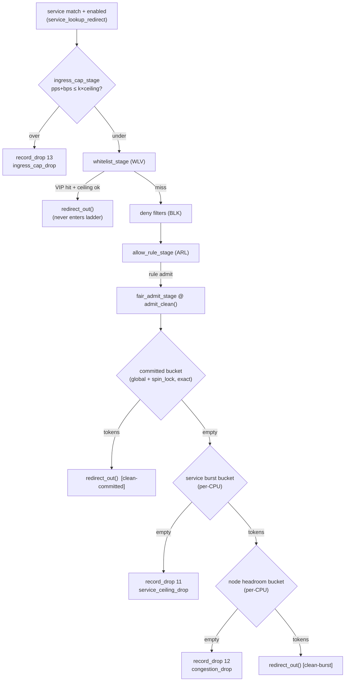

# Fairness & Bandwidth Reservation (§8.4) — Design

**Spec**: `.specs/features/fairness-bandwidth/spec.md` (FAIR-01..27)
**Context**: `.specs/features/fairness-bandwidth/context.md` (D-FAIR-1..2, A-FAIR-1..8; AD-024)
**Status**: Approved (2026-07-10)
**Design decision record**: **AD-025** (STATE.md) *(amended by C1 / AD-042: committed bucket is per-CPU `PERCPU_HASH`)*

---

## Research Findings (Knowledge Verification Chain, verified 2026-07-10)

Codebase + project docs first; Context7 unavailable (no MCPs configured); kernel semantics
verified against the primary sources (web). Three claims, all load-bearing:

1. **`bpf_spin_lock` in XDP is in-spec** (the A-FAIR-8 novel claim). From the introduction patch
   (Starovoitov, kernel 5.1) and eBPF docs: available to **all program types except tracing and
   socket-filter** ("insufficient preemption checks") — XDP qualifies; lock behaves like
   `spin_lock_irqsave`. Target kernel 6.8 ≫ 5.1.
2. **Hard constraints on the lock's home and critical section:**
   - The value struct must contain **exactly one** top-level `struct bpf_spin_lock` field, in a
     map with **mandatory BTF** (libbpf `__type()` gives us this).
   - Only `BPF_MAP_TYPE_HASH` / `BPF_MAP_TYPE_ARRAY` values may hold it — **and never inside a
     map-in-map inner** (`map_value_has_spin_lock(inner_map) → -ENOTSUPP`). Our committed bucket
     is an **unslotted top-level runtime HASH** (§8.3), so this composes.
   - **No function/helper calls inside the critical section** (only `bpf_spin_unlock`), no packet
     access, no direct load/store to the lock field. Consequence: `bpf_ktime_get_ns()` is called
     **before** the lock; everything between lock/unlock is straight-line inlined ALU
     (version-check, refill arithmetic, consume) — divisions are fine.
   - Syscall/program `map_update` never touches the lock field → kernel-side lazy element
     creation (`BPF_NOEXIST` then re-lookup) and userspace seeding are both safe.
3. **Refill-math overflow bound (codebase-derived):** `rl_refill_dim` computes
   `grant = elapsed × rate / denom` with `elapsed ≤ 1e9 ns`; `u64` overflows at
   `rate > ~1.8 × 10^10` bytes/s (~147 Gbps). All builder/seed-emitted rates are clamped at
   **`FAIR_RATE_MAX = 16e9` bytes/s (128 Gbps)** — far above the 40 Gbps node envelope, and the
   "generous default" seed (FAIR-23) uses `1.25e10` bytes/s (100 Gbps), inside the bound.

**Fallback ladder for claim 1 (FAIR-22, proven fail-fast at the first build/load gate):**
- **Rung 1 (primary):** BTF-annotated HASH + `bpf_spin_lock` as designed.
- **Rung 2:** lock-free global HASH bucket using `__sync_fetch_and_sub`/`__sync_fetch_and_add`
  on the token counter (near-exact; refill races bounded to one refill quantum — documented
  skew).
- **Rung 3:** per-CPU committed bucket with the AD-019 rate÷nCPU split (ARL-14-style bound:
  node admit ∈ [rate/nCPU, rate]) — verdict-identical structure, accuracy deviation documented.
Rungs are verdict-preserving; only the committed-accuracy statement in docs changes.

---

## Architecture Overview

Two insertion points, one new header, zero changes to any M4-contract struct that already
shipped:

1. **`src/fairness.h`** — all fairness maps + two stage functions:
   - `ingress_cap_stage(ctx, meta, slot)` — fills **WLV-24 seam A** (in
     `xdp_gateway.bpf.c`'s `service_lookup_redirect`, between the `enabled` check and
     `whitelist_stage`). Dual pps+bps per-CPU bucket from precomputed cap budgets; over-cap →
     `record_drop(meta, DR_INGRESS_CAP_DROP)`; under-cap → continue (gate, never an admit).
   - `fair_admit_stage(ctx, meta, slot)` — fills the **ARL-24 seam**: `admit_clean()` becomes a
     one-line call into the ladder, then `redirect_out(meta)` on admit. Ladder: committed
     (global, spin-locked, exact) → burst (per-CPU) dual-drawing node headroom (per-CPU) →
     `service_ceiling_drop` / `congestion_drop`.
2. **Config flows down, state stays flat.** Per-service budgets ride a new slotted
   `fair_config_map` (HASH inner per slot, `service_id` key) — **all budgets precomputed by the
   builder/seed** (committed_bps, burst_bps = ceiling−committed, cap_pps, cap_bps); the kernel
   does zero derivation (AD-019 dumb-row-copier posture). Node headroom rides a slot-keyed
   `fair_node_config` ARRAY[2] (AD-023 `gbl_meta` precedent). The four bucket-state maps are
   unslotted runtime, lazily version-reset (D-ARL-2).



Rendered diagrams: `diagrams/fairness-ladder-flow.{mmd,svg}`,
`diagrams/fairness-map-layout.{mmd,svg}`.

---

## Code Reuse Analysis

| Component | Location | How used |
| --- | --- | --- |
| `struct rl_bucket` + `rl_burst`/`rl_refill_dim`/`rl_bucket_consume` | `src/rules.h` | Reused **verbatim** for burst, node, and cap buckets (the WLV `vip_bucket_*` precedent) — `rules.h` itself untouched except `admit_clean()`. |
| `rl_config.test_no_refill` + `rl_ncpus` rodata + CPU-pinned runner | `src/rules.h`, tests | The shared determinism knob and per-CPU split; committed bucket honors `test_no_refill` too (and is exact regardless of pinning — global). |
| Lazy version-reset pattern (D-ARL-2) | `rl_bucket_admit` | Same compare-`cfg_version`-then-reset flow for all four bucket states; committed does it inside its critical section (pure ALU). |
| `ARRAY_OF_MAPS`[2] of HASH inners | `rule_block_map`, `vip_config_map` | `fair_config_map` is the identical composition (proven at load since ARL T1). |
| Slot-keyed plain `ARRAY[2]` for slot metadata | `gbl_meta` (AD-023) | `fair_node_config` uses the same sanctioned §8.3 slot-in-key shape. |
| `record_drop(meta, reason)` | `src/sample.h` | Wires indices 11/12/13 — count + sampling fused, dpstat zero-change (FAIR-21). |
| `redirect_out(meta)` | `src/service.h` path | The ladder's admit terminal, same as VIP's. |
| Env-driven seed helpers (`parse_u64_env`, …) | `loader/loader.c` | Extended with the FAIR env family; default-seed posture identical to WLV/BLK. |
| Stage-outcome test observability | `test_meta_map` (`-DPKT_TEST_HOOKS`) | `pkt_meta.fair_state` rides the existing hook — no new harness machinery. |

**CONCERNS.md:** not present (no flagged-fragility input).

---

## Components

### 1. `src/fairness.h` — contracts + maps + both stages (new)

- **Purpose:** single home for the fairness map contract (M4 build contract) and the two hot-path
  stages.
- **Interfaces:**
  - `int ingress_cap_stage(struct xdp_md *ctx, struct pkt_meta *meta, __u32 slot)` — returns a
    verdict (`XDP_DROP` via `record_drop`) or `FAIR_CONTINUE` sentinel; called from
    `service_lookup_redirect` at seam A.
  - `int fair_admit_stage(struct xdp_md *ctx, struct pkt_meta *meta, __u32 slot)` — returns the
    final verdict (redirect or drop); called from `admit_clean()`.
  - Internal: `fair_committed_admit()` (spin-locked), `fair_burst_admit()` (service per-CPU),
    `fair_node_admit()` (node per-CPU), `fair_cap_admit()` (dual-dim per-CPU) — all reusing the
    `rl_*` arithmetic helpers.
- **Hot-path flow details:**
  - Both stages start with one `fair_config_map[slot]` HASH lookup by `service_id`. Two lookups
    per clean packet total (one per stage) — accepted over threading a pointer through the
    WLV/BLK/ARL signatures (those files are mid-execution; localized cost, documented).
  - Missing `fair_config` entry for a **matched enabled** service, or missing must-exist map →
    `DR_MAP_ERROR` (FAIR-07/19; builder invariant: every service row emits a fair row).
  - Committed critical section: `now = bpf_ktime_get_ns()` **before** lock → `bpf_spin_lock` →
    version-check/reset, refill (pure ALU, `ncpus = 1`), consume → `bpf_spin_unlock`. Lazy
    element creation via `BPF_NOEXIST` + re-lookup **before** the lock sequence.
  - Burst dual-draw ordering (A-FAIR-6 resolved): consume **service burst first, then node**;
    a node-miss does not refund the service-burst token (per-CPU burst is approximate by
    charter; the packet did consume classification). Reason attribution follows: service burst
    empty → `service_ceiling_drop` (node never consulted); node empty → `congestion_drop`.
- **Dependencies:** `service.h` (slots), `rules.h` (rl helpers + `rl_config`/`rl_ncpus`),
  `sample.h` (`record_drop`), `pkt_meta.h`.

### 2. Seam edits (surgical)

- **`xdp_gateway.bpf.c`:** the seam-A comment at `service_lookup_redirect` becomes
  `ret = ingress_cap_stage(...); if (ret != FAIR_CONTINUE) return ret;` before
  `whitelist_stage(...)`.
- **`src/rules.h`:** `admit_clean(meta)` → `admit_clean(ctx, meta, slot)` (internal signature —
  callers are in the same translation unit; the `rule_block` M4 contract is untouched); body =
  `return fair_admit_stage(ctx, meta, slot);` (which ends in `redirect_out`). The ARL-24 comment
  is replaced by the call.
- **`src/pkt_meta.h`:** first deliberate struct growth — 32 → **40 bytes**: append
  `__u8 fair_state; __u8 _pad2[7];` and migrate the static assert (its purpose is to force
  exactly this deliberate step; A-FAIR-7's pad-byte assumption is void — 32/32 bytes were
  occupied). All consumers compile from the header; `test_meta_map` value size follows via the
  skeleton. 7 spare bytes become the new growth headroom.

### 3. Loader/seed extension (`loader/loader.c`)

- New env family (all optional; D-FAIR-1/2 values live **userspace-side** — the kernel only sees
  precomputed budgets):
  - `XDPGW_FAIR_COMMITTED_BPS`, `XDPGW_FAIR_CEILING_BPS` — bytes/sec for the seeded service
    (defaults: committed = ceiling = `1.25e10` = 100 Gbps ⇒ burst 0, everything admits
    clean-committed, caps never trigger — post-BLK baseline verdict-identical, FAIR-23).
  - `XDPGW_NODE_CLEAN_CAPACITY_BPS` — default `5e9` (40 Gbps, D-FAIR-2). Headroom =
    `max(0, capacity − Σ committed)`; with the generous default committed > capacity the
    headroom floors at 0 — harmless (burst rate is 0 too) and exactly the FAIR-13 semantics.
  - `XDPGW_FAIR_K` (default **3**), `XDPGW_FAIR_REF_PKT` (default **512** bytes) —
    `cap_bps = k × ceiling`, `cap_pps = cap_bps / ref_pkt` (D-FAIR-1 derivation, computed here,
    clamped at `FAIR_RATE_MAX`).
- Seed writes `fair_config` rows for every seeded service + `fair_node_config` per slot; pins
  nothing new (runtime maps auto-pinned with the existing set under `/sys/fs/bpf/xdp_gateway/`).

### 4. Tests (`tests/test_parse.c` + smoke)

- De-risk case first (FAIR-22): load gate proves rung 1 (HASH + spin_lock BTF value under DRV).
- Deterministic ladder cases via `test_no_refill` + constrained seeds (committed exact-count —
  no pinning needed; burst/node/cap CPU-pinned as ARL).
- Fairness scenario (FAIR-24): A flooded past cap/ceiling with small packets (pps dimension
  exercised per D-FAIR-1), interleaved B committed traffic admits 100%; gated smoke variant
  drives the same shape over two-veth.

---

## Data Models — the M4 build contract (new)

```c
/* fairness.h — sizes frozen once executed */

#define FAIR_CONFIG_MAX_ENTRIES 1024      /* = RULE_BLOCK_MAX_ENTRIES */
#define FAIR_RATE_MAX 16000000000ULL      /* 128 Gbps in bytes/s; builder clamp (overflow bound) */

struct fair_config {                      /* slotted: fair_config_map[slot] : service_id -> */
    __u32 version;                        /* = service config version (lazy bucket reset key) */
    __u32 _pad;
    __u64 committed_bps;                  /* bytes/s, from ServicePlan.committed_clean_gbps */
    __u64 burst_bps;                      /* bytes/s, = ceiling - committed (precomputed) */
    __u64 cap_bps;                        /* bytes/s, = k * ceiling (precomputed, clamped) */
    __u64 cap_pps;                        /* pkts/s, = cap_bps / ref_pkt (precomputed) */
};                                        /* 40 B */

struct fair_node_config {                 /* plain ARRAY[2], key = slot (gbl_meta precedent) */
    __u32 version;
    __u32 _pad;
    __u64 headroom_bps;                   /* bytes/s, = max(0, capacity - sum(committed)) */
};                                        /* 16 B */

struct fair_committed_bucket {            /* unslotted HASH : service_id -> ; BTF mandatory */
    struct bpf_spin_lock lock;            /* one per value, top-level (kernel rule) */
    __u32 cfg_version;
    __u64 tokens;                         /* bytes */
    __u64 last_ns;
};
```

| Map | Type | Group | Notes |
| --- | --- | --- | --- |
| `fair_config_map` | `ARRAY_OF_MAPS`[2] of `HASH` (1024, `u32 → fair_config`) | config (slot) | The M4 build contract; builder emits one row per service (invariant). |
| `fair_node_config` | `ARRAY`[2] (`slot → fair_node_config`) | config (slot-keyed) | Worker recomputes `headroom_bps` on every plan build (D-FAIR-2). |
| `svc_committed_state` | `HASH` (1024, `u32 → fair_committed_bucket`) | runtime | Global + `bpf_spin_lock` = exact (§8.3 `service_agg_rate_state`, committed half). Prealloc'd. |
| `svc_burst_state` | `PERCPU_HASH` (1024, `u32 → rl_bucket`) | runtime | Burst half; rate÷nCPU split (AD-019). |
| `node_burst_state` | `PERCPU_ARRAY`[1] (`0 → rl_bucket`) | runtime | §8.3 name kept; headroom÷nCPU. |
| `service_ingress_cap_state` | `PERCPU_HASH` (1024, `u32 → rl_bucket`) | runtime | Dual pps+bps from `cap_pps`/`cap_bps`. |

**`pkt_meta.fair_state` values:** `FAIR_NONE=0, FAIR_CAP_DROP, FAIR_COMMITTED, FAIR_BURST,
FAIR_CEILING_DROP, FAIR_CONGESTION_DROP, FAIR_ERR` (FAIR-08; cap outcome shares the field —
stages are mutually exclusive terminals for a given packet).

---

## Error Handling Strategy

| Scenario | Handling | Reason |
| --- | --- | --- |
| `fair_config_map[slot]` inner missing / node-config slot missing | `DR_MAP_ERROR` | Must-exist config (FAIR-07/19), fail-closed. |
| No `fair_config` row for a matched **enabled** service | `DR_MAP_ERROR` | Builder invariant broken = structural, not "unlimited". |
| Committed bucket create/re-lookup fails (map full) | `DR_MAP_ERROR` | 1024 prealloc'd entries = service envelope; exhaustion is structural. |
| Over cap / over ceiling / node headroom out | `record_drop` 13 / 11 / 12 | The three designed terminals (FAIR-16/04/11). |
| `now ≤ last_ns` (clock step) | No refill this packet (existing `rl_bucket_refill` guard) | Same posture as ARL. |
| Oversubscribed node (`Σ committed > capacity`) | `headroom_bps` floored to 0 at build ⇒ all burst sheds `congestion_drop` | FAIR-13 documented consequence. |
| Verifier rejects spin_lock composition | Fail the T1 gate loudly → fallback rung 2/3 | FAIR-22; never silently degrade. |

---

## Tech Decisions (non-obvious)

| Decision | Choice | Rationale |
| --- | --- | --- |
| Where k/ref-size/capacity live | **Userspace only** (seed/worker env); kernel sees precomputed budgets | AD-019 dumb-copier posture: no kernel derivation, no rodata for policy values that the builder can bake; "node-tunable at load" satisfied by env at seed/build time. |
| One config map or two | One `fair_config` struct (cap + ladder budgets), looked up once per stage (2 lookups/packet) | Threading a pointer through WLV→BLK→ARL signatures churns three mid-flight files; 40 B row keeps cache locality; documented trade-off. |
| Committed bucket creation | Kernel-lazy (`BPF_NOEXIST` + re-lookup) like `rl_bucket_admit` | No M4 plumbing for runtime state (D-ARL-2 spirit); update ignores lock field (verified semantics). |
| Burst dual-draw order | Service burst first, node second, **no refund** on node-miss | Correct reason attribution per spec edge case; per-CPU burst approximate by charter (A-FAIR-6). |
| `pkt_meta` growth | 32 → 40 B, `fair_state` + 7 spare bytes, assert migrated | Zero pad left (A-FAIR-7 void); the assert exists to force deliberate growth; spare bytes = future headroom (M5/M6). |
| Generous-default magnitude | 100 Gbps (`1.25e10` B/s), builder clamp `FAIR_RATE_MAX` 128 Gbps | `elapsed×rate` u64 overflow bound at ~147 Gbps (codebase-derived); defaults must stay provably inside it. |
| Committed refill inside lock | Version-check + refill + consume all in CS, `now` captured outside | Kernel forbids helper calls in CS; single CS keeps token accounting exact (no check-then-act window). |
| §8.3 name mapping | `service_agg_rate_state` realized as `svc_committed_state` + `svc_burst_state` | One TDD row, two kernel map types (global-locked vs per-CPU) — physically inseparable; documented mapping. |

---

## Test Strategy

- **Gate shape:** build (`make bpf skel loader dpstat`) → quick (`make test`, post-BLK baseline +
  FAIR cases) → full (adds `sudo make smoke` incl. fairness smoke variant). Baseline count pinned
  at Tasks time (post-BLK execute).
- **De-risk first:** spin-lock load case is the first new test (rung selection fail-fast).
- **Determinism:** `test_no_refill` across all four buckets; committed cases exact without
  pinning (global bucket); burst/node/cap cases CPU-pinned (ARL convention). Quota == exact
  admit count everywhere.
- **Stage progression:** cap-drop cases assert `wl_state == NONE && bl_state == NONE &&
  rule_idx == NONE` + `fair_state == FAIR_CAP_DROP` (proves "before expensive lookups",
  FAIR-14/16).
- **Fairness scenario (FAIR-24):** small-packet flood on A (pps cap dimension per D-FAIR-1) +
  interleaved B committed packets → B admits 100%, A shows 13/11/12 at each exhaustion point.
- **Migration:** none expected — default seed keeps every post-BLK verdict; only the `pkt_meta`
  assert moves (header-driven recompile).
