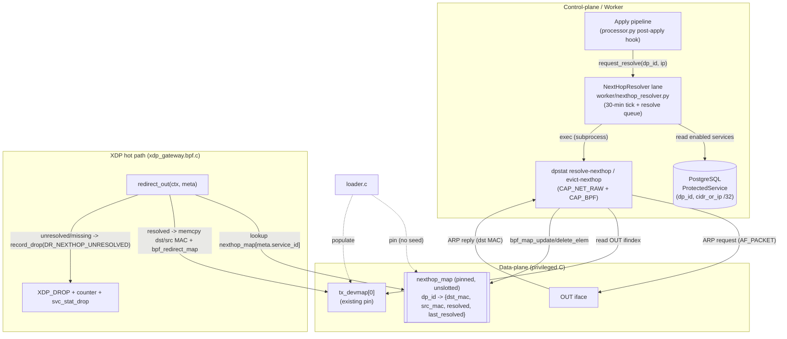

# Static Next-Hop L2 (MAC) Rewrite from a BPF Map — Design

**Spec:** `.specs/features/nexthop-mac-rewrite/spec.md`
**Context:** `.specs/features/nexthop-mac-rewrite/context.md`
**Design ID:** AD-035
**Status:** Approved (2026-07-20)

---

## Architecture Overview

The next-hop MAC is resolved **out of band** by a worker lane and stored in a **pinned, unslotted BPF
hash map** keyed by `dp_id`. The XDP hot path does a single map lookup + `memcpy`, with **no
`bpf_fib_lookup` and no verbatim fallback** — an unresolved service drops fail-closed.

Three cadences drive the map:
1. **Immediate at apply** — after the worker applies a `SERVICE_UPDATE`, it requests an out-of-band
   resolve for that service (sub-second).
2. **Periodic** — a 30-minute lane re-probes every enabled service and reconciles the map (resolve
   enabled, evict the rest).
3. **Fail-closed** — a failed probe (after bounded retries) marks the entry unresolved; the hot path
   drops `nexthop_unresolved` until the next success.



Diagrams (rendered): `diagrams/nexthop-architecture.{mmd,svg}` (component/data-flow),
`diagrams/resolve-and-rewrite-sequence.{mmd,svg}` (apply→resolve + hot-path sequence).

---

## Code Reuse Analysis

### Existing Components to Leverage

| Component | Location | How to Use |
| --------- | -------- | ---------- |
| `l3_rewrite_nexthop()` bounds-checked eth `memcpy` | `data-plane/src/xdp_gateway.bpf.c:148` | **Replace** its body — keep the `memcpy` idiom, drop the `bpf_fib_lookup` call; source MACs from the map instead. |
| `node_control.h` map+helper module shape | `data-plane/src/node_control.h` | Mirror for `nexthop.h` (value struct + pinned map + `__always_inline` helper, guarded by `#ifdef __BPF__`). |
| Frozen drop-reason ABI (append-only) | `data-plane/src/drop_reason.h` | Append `DR_NEXTHOP_UNRESOLVED = 16` + name; `record_drop()` choke point already counts + `svc_stat_drop` + samples. |
| `dpstat set-bypass` C writer | `data-plane/tools/dpstat.c:803` (`cmd_set_bypass`) + `open_pinned_map()` | Same skeleton for `resolve-nexthop`/`evict-nexthop`/`set-nexthop`: `open_pinned_map` + `bpf_map_update/delete_elem`. |
| `snapshot --json` reader | `dpstat.c:427` (`cmd_snapshot`) | Add a `"nexthop"` block (per-`dp_id` MACs + resolved + age). |
| Loader pin/unpin registry | `loader.c` `set_*_pin_paths` / `pin_map` / `unpin_map` (lines ~170–260, 319) | Add `NEXTHOP_MAP_PIN_PATH` to a runtime-map pin set; unpin on cleanup. `tx_devmap[0]` already holds OUT ifindex. |
| `NodeControlReconciler` + `DpstatBypassWriter` + `FakeBypassWriter` | `control-plane/app/worker/node_control_reconciler.py` | **Template** for `NextHopResolver` + `DpstatNextHopWriter` + `FakeNextHopWriter` (subprocess-exec, timeout, Protocol seam). |
| Worker lane wiring | `worker/worker.py` (`*Lane` Protocols + `asyncio.create_task(lane.run_loop(stop))` at 96–106) | Add `NextHopLane` Protocol + spawn; mirror `worker_node_control_*` settings. |
| Post-apply hook site | `worker/processor.py` / `worker/handlers.py` (`handle_service_update`) | After `mark_active`, call `resolver.request_resolve(dp_id, ip)`; on disable/delete apply, `request_evict(dp_id)`. |
| `dp_id` surrogate = `service_val.service_id` = `meta.service_id` | `service.h`, `xdp_gateway.bpf.c:213` (D-030-4) | The hot-path key is already in `meta` before `redirect_out`; VIP admit also reaches `redirect_out` with `service_id` set. |
| Service create/update validation | `control-plane/app/services/…` service layer | Add single-IPv4-host check (reject non-`/32`), reusing existing `core/cidr` helpers + 422 field-error pattern. |
| `/node/health` via `TelemetryReader.snapshot()` | M5/M6 telemetry reader | Surface an `unresolved_services` count from the new snapshot `"nexthop"` block. |

### Integration Points

| System | Integration Method |
| ------ | ------------------ |
| Apply state machine (M1/M4) | Post-apply hook requests an immediate resolve/evict; **no change** to the apply transition logic. |
| Double-buffer applier (M4 #2 `xdpgw-apply`) | **Untouched** — `nexthop_map` is unslotted runtime state, not rebuilt by the slot swap. |
| Worker runtime | New background lane alongside telemetry/billing/node-control/alerting. |
| `dpstat` binary | Reused as the single privileged writer; gains ARP-probe + nexthop map subcommands. |

---

## Components

### DP-1 · `data-plane/src/nexthop.h` (new)
- **Purpose**: next-hop map + value contract + hot-path rewrite helper.
- **Interfaces**:
  - `struct nexthop { __u8 dst_mac[6]; __u8 src_mac[6]; __u8 resolved; __u8 _pad; __u64 last_resolved_ns; }`
  - `nexthop_map` — `BPF_MAP_TYPE_HASH`, `BPF_F_NO_PREALLOC`, `max_entries = 1024` (matches the service inner LPM cap), key `__u32 dp_id`, value `struct nexthop`.
  - `static __always_inline int nexthop_rewrite(struct xdp_md *ctx, struct pkt_meta *meta)` → `0` = rewritten, `<0` = caller must drop. Looks up `meta->service_id`; if `!nh || !nh->resolved` → `-1`; else bounds-check eth and `memcpy` `h_dest←dst_mac`, `h_source←src_mac`.
- **Dependencies**: `pkt_meta.h`. **Reuses**: `node_control.h` module shape.

### DP-2 · `data-plane/src/drop_reason.h` (edit)
- Append `DR_NEXTHOP_UNRESOLVED = 16`; `DROP_REASON_COUNT` 16→17 (cap 32, `_Static_assert` holds); `drop_reason_name[DR_NEXTHOP_UNRESOLVED] = "nexthop_unresolved"`. Append-only; existing indices unchanged.

### DP-3 · `data-plane/src/xdp_gateway.bpf.c` (edit)
- `#include "nexthop.h"`; **delete** `l3_rewrite_nexthop` (fib version) + its forward decl.
- Rewrite `redirect_out()` — **resolve-first, fail-closed**, and only count clean on success:
  ```c
  static __always_inline int redirect_out(struct xdp_md *ctx, struct pkt_meta *meta) {
      if (nexthop_rewrite(ctx, meta) != 0)
          return record_drop(meta, DR_NEXTHOP_UNRESOLVED);   // counts drop + svc_stat_drop
      meta->verdict = PKT_VERDICT_REDIRECT;
      write_test_meta(meta);
      svc_stat_clean(meta);
      return bpf_redirect_map(&tx_devmap, 0, XDP_DROP);
  }
  ```
  (Ordering change vs today: rewrite/resolve moves **before** `svc_stat_clean` so an unresolved frame is never counted clean.)

### DP-4 · `data-plane/src/node_control.h` (edit)
- `redirect_out_bypass()` **drops** the `l3_rewrite_nexthop(ctx, meta)` call → **verbatim** bypass (see Decision D-035-B). `ctx` param may become unused — keep the signature or `(void)ctx` to preserve the include order.

### DP-5 · `data-plane/loader/loader.c` (edit)
- Add `#define NEXTHOP_MAP_PIN_PATH PIN_DIR "/nexthop_map"`; `set_pin_path`/`pin_map`/`unpin_map` for `nexthop_map`. **No seed** (empty = all-unresolved = fail-closed until the resolver runs). `tx_devmap[0]` already carries OUT ifindex — no OUT-MAC seed needed.

### DP-6 · `data-plane/tools/dpstat.c` (edit)
- `NEXTHOP_MAP_PIN_PATH` + subcommands:
  - `dpstat resolve-nexthop <dp_id> <service_ipv4>` — read OUT ifindex from `tx_devmap[0]` → `if_indextoname` → `SIOCGIFHWADDR` (src_mac) + `SIOCGIFADDR` (spa); open `AF_PACKET`/`SOCK_RAW`/`ETH_P_ARP`, `bind(sockaddr_ll{sll_ifindex})`, send `ARPOP_REQUEST` (tha=0, tpa=service_ip), `recv` filtering `ARPOP_REPLY` with `spa==service_ip`; **bounded** `retries × timeout`. On reply → `bpf_map_update_elem(nexthop_map, dp_id, {dst=reply.sha, src=src_mac, resolved=1, last_resolved_ns=now}, BPF_ANY)` → exit 0. On exhaustion → write/mark the entry `resolved=0` (or leave absent) → exit non-zero.
  - `dpstat evict-nexthop <dp_id>` — `bpf_map_delete_elem`.
  - `dpstat set-nexthop <dp_id> <dst_mac> [<src_mac>]` — no-ARP manual writer (ops + a deterministic seed for the privileged smoke; unit correctness is proven by `BPF_PROG_TEST_RUN` seeding the map directly).
  - `dpstat nexthop` — dump entries; add a `"nexthop"` array to `snapshot --json` (`dp_id`, `dst_mac`, `src_mac`, `resolved`, `age_s`) + node `nexthop_unresolved` count.
- **Privilege**: needs `CAP_NET_RAW` (ARP) in addition to `CAP_BPF`/root, isolated in this binary (worker stays unprivileged).

### DP-7 · `data-plane/tests/…` (edit)
- `BPF_PROG_TEST_RUN`: (a) seed a resolved entry → SYN to the service → `XDP_REDIRECT`, dst=dst_mac, src=src_mac, IP/port/**TTL** intact; (b) no/`resolved=0` entry → `XDP_DROP` + `counter_map[16]`==1 + `svc_stat` drop bucket; (c) recovery after seeding. Reuse `test_meta_map`/`pkt_build.h`.

### CP-1 · Service single-IPv4-host validation (edit)
- In the service create/update service layer: reject a destination whose network is not a single host (`ip_network(dest, strict=False).num_addresses != 1`) with a 422 field error; existing overlap + `cidr_in_tenant_allocation` guards unchanged. Ship a read-only report (CLI/admin) listing any **existing** non-`/32` services — **no auto-conversion** (Decision D-035-M).

### CP-2 · `control-plane/app/worker/nexthop_resolver.py` (new)
- **Purpose**: out-of-band ARP resolution + reconciliation.
- **Interfaces** (mirror `NodeControlReconciler`):
  - `class NextHopWriter(Protocol): async def resolve(dp_id, ip) -> bool; async def evict(dp_id) -> bool`
  - `DpstatNextHopWriter` — `subprocess_exec(dpstat, "resolve-nexthop", dp_id, ip)` / `"evict-nexthop"` with timeout; returns success. `FakeNextHopWriter` for tests.
  - `NextHopResolver.request_resolve(dp_id, ip)` / `request_evict(dp_id)` — enqueue onto an `asyncio.Queue` drained promptly (immediate path).
  - `NextHopResolver.resolve_once()` — read enabled services (`dp_id`, `cidr_or_ip`) from DB, resolve each, **evict** map entries not in the enabled set (reconcile).
  - `NextHopResolver.run_loop(stop)` — drain the resolve queue continuously + `resolve_once()` every `interval` (default 1800 s); immediate `resolve_once()` on start.
- **Dependencies**: `session_factory`, `NextHopWriter`, settings. **Reuses**: node-control lane structure verbatim.

### CP-3 · Worker wiring + post-apply hook (edit)
- `worker/worker.py`: `NextHopLane` Protocol + `asyncio.create_task(nexthop.run_loop(stop))`; construct with `DpstatNextHopWriter` + `worker_nexthop_*` settings.
- `worker/processor.py` (or `handlers.py`): after a successful `SERVICE_UPDATE` apply, `nexthop.request_resolve(dp_id, ip)`; on a disable/delete apply, `request_evict(dp_id)`.

### CP-4 · Settings (edit)
- `worker_nexthop_resolve_interval_seconds` (1800), `worker_nexthop_probe_timeout_seconds` (e.g. 1.0), `worker_nexthop_probe_retries` (e.g. 3), reuse the existing `dpstat` binary path setting.

### CP-5 · `/node/health` unresolved count (P2, edit)
- Extend the node-health assembly to read the snapshot `"nexthop"` block and report `unresolved_services` (enabled services currently `resolved=0`/absent) — a blackhole indicator; a resolved↔unresolved transition is log/telemetry-observable for M6 Alerting to bind to.

---

## Data Models

### BPF value (wire/ABI)
```c
struct nexthop {          /* nexthop_map value; keyed by u32 dp_id */
    __u8  dst_mac[6];     /* backend/next-hop MAC (ARP-resolved)   */
    __u8  src_mac[6];     /* node-global OUT port MAC (live)       */
    __u8  resolved;       /* 0 = fail-closed drop; 1 = rewrite      */
    __u8  _pad;
    __u64 last_resolved_ns; /* observability only (age); hot path ignores */
};
```
- **Consistency**: the writer always sets the **full value** in one `bpf_map_update_elem`; hash-map replacement is RCU-atomic (`hlist_nulls_replace_rcu`), so the XDP reader sees old-or-new whole values — the `{MACs, resolved}` triple never tears. `BPF_F_NO_PREALLOC` matches the codebase's userspace-written/XDP-read maps.

### DB
- **No schema change.** `ProtectedService.cidr_or_ip` (CIDR) already stores a `/32`; the change is service-layer validation. No new table — resolution state lives in the BPF map, surfaced via `dpstat` snapshot.

---

## Error Handling Strategy

| Scenario | Handling | Impact |
| -------- | -------- | ------ |
| Service declared, not yet resolved | Hot path `record_drop(DR_NEXTHOP_UNRESOLVED)` | Clean traffic dropped (counter rises) until the immediate resolve lands (seconds) — never wrong-MAC. |
| ARP probe lost once, neighbor up | `resolve-nexthop` retries `N×timeout` **before** marking unresolved | No blackhole from a single lost ARP. |
| Neighbor genuinely down | After retries → entry `resolved=0`/evicted → fail-closed drop | Blackhole surfaced via `nexthop_unresolved` counter + `/node/health`. |
| Backend MAC changed | Next resolve (≤30 min, or immediate on apply/manual) overwrites (RCU-atomic); gap frames drop, never sent to old MAC. |
| OUT MAC/IP changed | `resolve-nexthop` reads them live each probe → self-heals on the next write. |
| `dpstat`/subprocess fails or times out | Lane logs + returns false (like `DpstatBypassWriter`); retried next tick; entry stays as-is. |
| Global bypass active | Bypass forwards **verbatim** (no rewrite, no map dependency) — Decision D-035-B. |
| Loader reload → empty map | All-unresolved → fail-closed until the resolver's start-up `resolve_once()`/next apply repopulates (ops note). |

---

## Tech Decisions

| Decision | Choice | Rationale |
| -------- | ------ | --------- |
| D-035-1 Map type/home | `HASH` + `NO_PREALLOC`, unslotted runtime state, keyed by `dp_id` | RCU-atomic replace = tear-free; survives config double-buffer swaps (async resolution ≠ config cadence). |
| D-035-2 MAC layout | Store **both** dst+src MAC per entry | One hot-path lookup yields the whole L2 rewrite; no second node-global read. |
| D-035-3 OUT src MAC/IP | Read **live** from `tx_devmap[0]`→ifindex via `ioctl` at probe time | No new seed map; auto-tracks OUT MAC/IP changes; reuses an existing pin. |
| D-035-4 Privileged writer | ARP probe **and** map write in the C `dpstat` tool; worker execs it | Concentrates `CAP_NET_RAW`+`CAP_BPF` in one binary (mirrors `set-bypass`); worker stays unprivileged. |
| D-035-5 Resolver lane | **New** `NextHopResolver` worker lane (30-min tick + resolve queue) | Separate concern/cadence/privilege from node-control; reuses that lane's exact shape. |
| D-035-6 Immediate resolve | Post-apply hook `request_resolve(dp_id, ip)` | Reuses the apply path the worker already runs; sub-second, no new signaling infra. |
| **D-035-B Bypass L2** | Bypass forwards **verbatim** (no rewrite) | Bypass is a break-glass pass-through with **no per-service context** to key the map; keeps `bpf_fib_lookup` fully removed. *Tradeoff:* on a routed multi-backend deploy, bypass frames carry the ingress dst MAC — documented emergency-mode limitation; a node-global bypass next-hop is a deferred option. |
| **D-035-M Existing non-/32 rows** | Validate single-host on create/update; **report** existing non-`/32`, **no auto-convert** | Silent CIDR→host conversion could redirect a range to one host; fail-safe manual remediation (pilot has few services). |
| D-035-7 Fail-closed only checks `resolved` | Hot path ignores `last_resolved_ns`; the lane owns staleness (invalidate on failed refresh) | Keeps the hot path branch-minimal; staleness policy stays tunable in userspace. |

### De-risk (fail-fast, with fallback)
- **T-first load probe**: verify `nexthop_map` loads + the `redirect_out` rewrite verifier-passes on the first DP task; if `NO_PREALLOC HASH` update visibility disappoints on the target kernel, fall back to `ARRAY`-indexed-by-`dp_id` (dp_id is a dense small seq) — same value struct, same hot path.
- **ARP probe**: prove `resolve-nexthop` against a known neighbor in the privileged smoke before wiring the lane.

---

## Requirement Coverage

All 21 `NHR-` requirements map to components:

| Req | Component(s) |
| --- | ------------ |
| NHR-01..02 (static map rewrite, no fib, TTL) | DP-1, DP-3 |
| NHR-03 (fail-closed drop) | DP-3 |
| NHR-04 (ARP/non-matched not rewritten) | DP-3 (IPv4 clean path only), DP-4 (bypass verbatim) |
| NHR-05 (drop-reason ABI append) | DP-2 |
| NHR-06 (live recovery) | DP-1 (RCU-atomic), CP-2 |
| NHR-07..08 (single-IPv4-host + guards) | CP-1 |
| NHR-09 (node-global OUT src MAC) | DP-6 (live read), DP-1 |
| NHR-10 (immediate resolve at apply) | CP-3, CP-2 |
| NHR-11 (30-min ARP refresh, configurable) | CP-2, CP-4 |
| NHR-12 (probe success → write) | DP-6 |
| NHR-13 (probe fail bounded-retry → unresolved) | DP-6, CP-2 |
| NHR-14 (disable/delete → evict) | CP-2 (reconcile), CP-3 (immediate) |
| NHR-15 (pinned, unslotted, survives swap) | DP-5, D-035-1 |
| NHR-16 (privileged DP writer, not hot path) | DP-6, D-035-4 |
| NHR-17 (dpstat dump + counter) | DP-6 |
| NHR-18 (/node/health unresolved count) | CP-5 |
| NHR-19 (transition observable) | CP-5 |
| NHR-20 (manual resolve) | DP-6 (`resolve-nexthop`), CP-2 (`request_resolve`) |
| NHR-21 (resolve metrics) | CP-2, DP-6 (age/last_resolved) |
