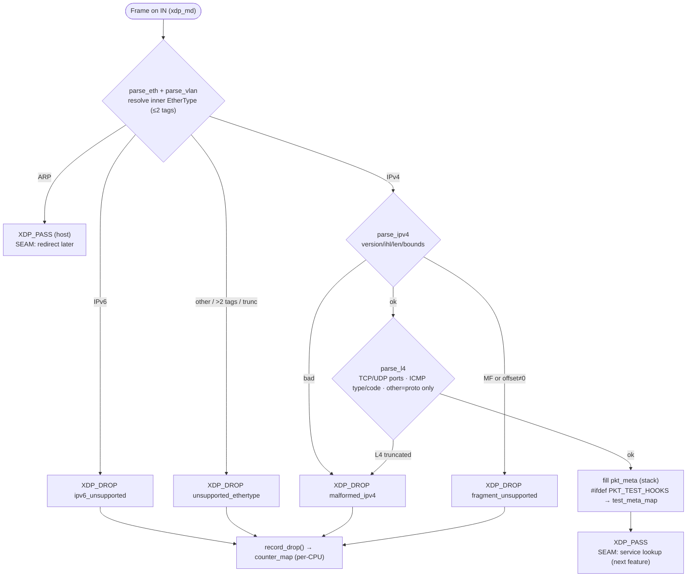

# Packet Parse & Fail-Fast — Design

**Spec:** `.specs/features/packet-parse/spec.md` (PKT-01..24)
**Context:** `.specs/features/packet-parse/context.md` (D-PKT-1..4, A-PKT-1..7)
**Status:** Verified — Execute complete (2026-07-08)
**Domain:** first C / XDP / eBPF code in the repo (bootstraps `data-plane/`)

---

## Research notes (Knowledge Verification Chain)

Codebase (no data-plane code) and project docs (PRD §8, §10.2, §11, §12.4; `TESTING.md`) covered in
Specify. Context7 MCP unavailable in this environment; the two load-bearing libbpf APIs were verified
by web search against current libbpf docs (2026-07-08):

- **`bpf_prog_test_run_opts(prog_fd, struct bpf_test_run_opts *opts)`** — `opts.data_in` /
  `opts.data_size_in` supply the raw frame (starting at the Ethernet header); `opts.retval` receives the
  XDP action; for `BPF_PROG_TYPE_XDP`, `data`/`data_end` are derived automatically from `data_in`. This
  is the test mechanism for every verdict assertion. (docs.ebpf.io — `bpf_prog_test_run_opts`.)
- **`bpf_xdp_attach(int ifindex, int prog_fd, __u32 flags, const struct bpf_xdp_attach_opts *opts)`** —
  passing `XDP_FLAGS_DRV_MODE` forces native/driver mode; mode flags are mutually exclusive and the call
  returns a **negative error** if the driver lacks native XDP (no silent SKB fallback). This is exactly
  the fail-loud behavior D-PKT-1 mandates. Detach via `bpf_xdp_detach(ifindex, flags, opts)`; actual mode
  read back via `bpf_xdp_query`. (docs.ebpf.io — `bpf_xdp_attach` / `bpf_xdp_query`.)

Not fabricated / still open (pinned in Tasks): exact minimum kernel + `libbpf`/`bpftool` versions for CI;
whether CI runners can run `BPF_PROG_TEST_RUN` (needs a BPF-capable kernel + privileges). Flagged in
`Error Handling` and `Open Questions`.

---

## Architecture Overview

> Rendered diagrams: [`diagrams/parse-fail-fast-flow.svg`](diagrams/parse-fail-fast-flow.svg)
> (verdict decision tree) and [`diagrams/component-layout.svg`](diagrams/component-layout.svg)
> (`data-plane/` components + build/test flow). Sources in `diagrams/*.mmd`.

A single native-XDP program on `IN` parses each frame **once** into a stack-resident `pkt_meta`, applies
the four fail-fast drops, and returns `XDP_PASS` at a marked service-lookup seam. Parsing is a chain of
**inlined** header helpers advancing a bounds-checked cursor — no tail calls, no per-packet maps on the
production path (D-PKT-3 rejected the tail-call stub; keeping `pkt_meta` on the stack lets the next
feature inline service lookup and receive the same struct by pointer). Two real maps only: a per-CPU
`counter_map` (minimal drop-reason counter, A-PKT-3) and a **test-only** `test_meta_map` compiled in
under `-DPKT_TEST_HOOKS` so `BPF_PROG_TEST_RUN` can read back `pkt_meta` without a production hot-path
cost.



Every drop routes through `record_drop(reason)` which bumps `counter_map[reason]`; `XDP_PASS` paths
(clean IPv4, ARP) bump no counter. Bounds are checked before every field read (`data_end`), so the
verifier accepts the program and truncated input fails closed (PKT-10, §11.3).

---

## Project layout (`data-plane/`)

```
data-plane/
├── Makefile                  # bpf → skeleton → loader → test; clean
├── README.md                 # build / load / test instructions
├── src/
│   ├── xdp_gateway.bpf.c      # SEC("xdp") entry: parse chain + fail-fast + seam
│   ├── parse.h               # inline helpers: hdr_cursor + parse_eth/vlan/ipv4/l4
│   ├── pkt_meta.h            # struct pkt_meta — the single-parse contract
│   └── drop_reason.h         # enum drop_reason + counter_map + record_drop()
├── loader/
│   └── loader.c              # skeleton open/load + bpf_xdp_attach(DRV) + signal detach
├── tests/
│   ├── pkt_build.h           # synthetic frame builders (eth/vlan/ipv4/tcp/udp/icmp/arp/ipv6)
│   └── test_parse.c          # BPF_PROG_TEST_RUN: one assert block per verdict
└── build/                    # generated: *.bpf.o, *.skel.h, loader, test bins (gitignored)
```

Headers are **plain kernel uapi** (`<linux/if_ether.h>`, `<linux/ip.h>`, `<linux/in.h>`,
`<linux/udp.h>`, `<linux/tcp.h>`, `<linux/icmp.h>`) + `<bpf/bpf_helpers.h>` — the program reads only
packet bytes via its own header structs, so **no `vmlinux.h` / CO-RE** is needed (simpler, one fewer
generation step). See Tech Decisions.

---

## Code Reuse Analysis

### Existing Components to Leverage

| Component | Location | How to Use |
| --- | --- | --- |
| Drop-reason names | PRD §10.2 | Source of truth for `enum drop_reason` string/index mapping |
| Parse decision tree | PRD §8.2 (mermaid) | This feature = the sub-tree up to `service match` (exclusive) |
| Single-parse / zero-init / bounds principles | PRD §8.1, §11.1, §11.3 | Design invariants (stack `pkt_meta`, `data_end` checks, no per-source state) |
| Control-plane testing pattern | `.specs/codebase/TESTING.md` (AD-008) | Parallel it: define data-plane gate commands + parallel-safety in the same file |
| xdp-tutorial `hdr_cursor` bounds-check idiom | libbpf/xdp community pattern (referenced, not vendored) | `parse.h` cursor-advance-with-`data_end`-check style |

No existing C is vendored — this is greenfield for the data-plane. The reuse that matters is **contract
reuse**: `pkt_meta` and `enum drop_reason` become the shared vocabulary every later data-plane feature
imports.

### Integration Points

| System | Integration Method |
| --- | --- |
| *Service lookup & redirect* (M2 #2) | Replaces the `XDP_PASS` **service-lookup seam** (reads the stack `pkt_meta` by pointer) and the **ARP seam** (`XDP_PASS` → `XDP_REDIRECT IN→OUT`) |
| *Drop-reason counters* (M2 #3) | Extends `enum drop_reason` to the full §10.2 set and `counter_map` (sized with headroom now, A-PKT-3) + adds ringbuf sampling |
| M4 worker / config maps | None yet — this feature loads a **static** program with no config/double-buffer maps |
| `.specs/codebase/TESTING.md` | New **Data-plane** section added (build/quick/full gates for C/XDP) — a Tasks-phase edit |

---

## Components

### `pkt_meta.h` — the single-parse contract (PKT-13, PKT-16, PKT-18)

- **Purpose**: the one struct every downstream stage reads; produced by exactly one parse.
- **Location**: `data-plane/src/pkt_meta.h`
- **Interface** (fields; final byte layout + padding fixed in code, zero-init per §8.1):
  ```c
  struct pkt_meta {
      __u32 src_ip;       /* IPv4, network byte order */
      __u32 dst_ip;       /* IPv4, network byte order */
      __u16 eth_proto;    /* resolved inner EtherType, host order */
      __u16 sport;        /* TCP/UDP source port, network order; 0 if n/a */
      __u16 dport;        /* TCP/UDP dest port,   network order; 0 if n/a */
      __u16 l3_off;       /* offset of IPv4 header from frame start */
      __u16 l4_off;       /* offset of L4 header from frame start */
      __u8  ip_proto;     /* IPPROTO_TCP/UDP/ICMP/... */
      __u8  vlan_depth;   /* 0, 1, or 2 */
      __u8  icmp_type;    /* ICMP only */
      __u8  icmp_code;    /* ICMP only */
      __u8  is_fragment;  /* diagnostic (set on the fragment drop path) */
      __u8  _pad[3];      /* explicit padding to a 4-byte boundary */
  };
  ```
- **Dependencies**: none (pure header).
- **Reuses**: field semantics from PRD §8.2 (what downstream stages will key on).
- **Note**: VLAN **ids** are not stored (only `vlan_depth`) — tags are preserved on the wire for the
  transparent bridge (A-PKT-1); the redirect feature forwards the frame verbatim, so parse need not
  retain tag values. Add `vlan_ids[2]` later only if a stage needs them.

### `drop_reason.h` — reason enum + minimal counter (PKT-12; counter observability for PKT-07..10)

- **Purpose**: the shared drop-reason vocabulary + the per-CPU counter that makes verdicts observable.
- **Location**: `data-plane/src/drop_reason.h`
- **Interface**:
  ```c
  enum drop_reason {                 /* this feature: 4 fail-fast + map_error */
      DR_IPV6_UNSUPPORTED = 0,
      DR_UNSUPPORTED_ETHERTYPE,
      DR_MALFORMED_IPV4,
      DR_FRAGMENT_UNSUPPORTED,
      DR_MAP_ERROR,
      DROP_REASON_CAP = 32,          /* counter_map width — headroom for the full §10.2 set */
  };
  struct { ... } counter_map;        /* BPF_MAP_TYPE_PERCPU_ARRAY, max_entries = DROP_REASON_CAP, u64 */
  static __always_inline int record_drop(enum drop_reason r); /* counter_map[r]++, returns XDP_DROP */
  ```
- **Dependencies**: `<bpf/bpf_helpers.h>`.
- **Reuses**: PRD §10.2 reason names. `counter_map` is sized to `DROP_REASON_CAP` so the *Drop-reason
  counters* feature adds reasons **without resizing** (A-PKT-3).
- **Design choice**: `record_drop` returns `XDP_DROP` so call sites read `return record_drop(DR_...);`.

### `parse.h` — inlined header helpers (PKT-09, PKT-10, PKT-11, PKT-14, PKT-15, PKT-19..22)

- **Purpose**: advance a bounds-checked cursor through Eth → VLAN(≤2) → IPv4 → L4, filling `pkt_meta`.
- **Location**: `data-plane/src/parse.h`
- **Interfaces** (all `static __always_inline`, cursor + `data_end` in, status out):
  - `parse_eth(cur, data_end, *meta) → PARSE_OK | PARSE_TRUNC`, sets `eth_proto`, advances past Eth.
  - `parse_vlan(cur, data_end, *meta) → OK | TRUNC | TOO_DEEP`, unwraps ≤2 `802.1Q`/`802.1AD` tags to
    inner `eth_proto`, sets `vlan_depth`; **bounded** `for (i<2)` loop (verifier-friendly, PKT-19).
  - `parse_ipv4(cur, data_end, *meta) → OK | MALFORMED | FRAGMENT`, checks `version==4`, `ihl>=5`,
    `tot_len`/option bounds; flags fragment on `MF | frag_off` (A-PKT-7); sets `src_ip/dst_ip/ip_proto/
    l3_off/l4_off`.
  - `parse_l4(cur, data_end, *meta) → OK | MALFORMED`, for TCP/UDP sets `sport/dport`, for ICMP sets
    `icmp_type/code`, for other protocols leaves ports 0 and returns `OK` (A-PKT-5); `MALFORMED` on a
    truncated L4 header (A-PKT-4).
- **Dependencies**: `pkt_meta.h`, kernel uapi headers.
- **Reuses**: the `hdr_cursor` + `if (cur.pos + sizeof(*h) > data_end) return TRUNC;` idiom.
- **Contract**: helpers **never** decide XDP verdicts — they return status; only `xdp_gateway.bpf.c`
  maps status → `record_drop(reason)` / `XDP_PASS`. Keeps verdict policy in one place.

### `xdp_gateway.bpf.c` — the XDP entry program (PKT-06..07, PKT-15, PKT-23..24)

- **Purpose**: orchestrate the parse chain into verdicts + the seam.
- **Location**: `data-plane/src/xdp_gateway.bpf.c`
- **Interface**: `SEC("xdp") int xdp_gateway(struct xdp_md *ctx)` — returns an XDP action.
- **Flow**: `struct pkt_meta meta = {};` → `parse_eth` → `parse_vlan` → switch on `eth_proto`
  {`ETH_P_IPV6`→`record_drop(DR_IPV6_UNSUPPORTED)`; `ETH_P_ARP`→`XDP_PASS` (marked ARP seam);
  `ETH_P_IP`→continue; else→`record_drop(DR_UNSUPPORTED_ETHERTYPE)`} → `parse_ipv4`
  (MALFORMED/FRAGMENT → `record_drop`) → `parse_l4` (MALFORMED → `record_drop`) →
  `#ifdef PKT_TEST_HOOKS: test_meta_map[0] = meta;` → `return XDP_PASS;` (marked **service-lookup seam**).
- **Dependencies**: `parse.h`, `drop_reason.h`, `pkt_meta.h`.
- **Reuses**: —. Holds no per-source-IP state (PKT-17, §11.1).

### `loader/loader.c` — native-mode loader (PKT-02..05)

- **Purpose**: load the skeleton, attach to `IN` in native mode (fail-loud), detach on exit.
- **Location**: `data-plane/loader/loader.c`
- **Interfaces** (CLI): `xdp_gateway_loader <ifname>` (also `IN_IFACE` env; A-PKT-6).
  - open/load: `xdp_gateway_bpf__open_and_load()` (generated skeleton).
  - `if_nametoindex(ifname)` → ifindex.
  - `bpf_xdp_attach(ifindex, prog_fd, XDP_FLAGS_DRV_MODE, NULL)`; on `< 0` → `fprintf(stderr, ...)` +
    `exit(1)` (**no** SKB fallback, D-PKT-1 / PKT-03).
  - `bpf_xdp_query(ifindex, ...)` → log the **actual** attach mode (PKT-04).
  - `signal(SIGINT/SIGTERM)` → `bpf_xdp_detach(ifindex, XDP_FLAGS_DRV_MODE, NULL)` + skeleton destroy
    (PKT-05).
- **Dependencies**: `libbpf`, generated `xdp_gateway.skel.h`.
- **Reuses**: verified libbpf attach/detach/query APIs (Research notes).

### `tests/pkt_build.h` + `tests/test_parse.c` — verdict tests (PKT-06, PKT-01)

- **Purpose**: establish the data-plane test loop; assert one verdict per synthetic frame.
- **Location**: `data-plane/tests/`
- **Interfaces**:
  - `pkt_build.h`: `size_t build_eth(buf, ethertype)`, `build_vlan`, `build_qinq`, `build_ipv4(...,
    proto, frag, ihl)`, `build_tcp/udp/icmp`, `build_arp`, `build_ipv6`, composable into a frame buffer.
  - `test_parse.c`: for each case → `bpf_prog_test_run_opts(prog_fd, &opts)` with the frame as
    `data_in` → assert `opts.retval == XDP_DROP|XDP_PASS`, read `counter_map`/`test_meta_map` and assert
    reason/`pkt_meta` values. Test BPF object compiled with `-DPKT_TEST_HOOKS`.
- **Dependencies**: `libbpf`, generated skeleton (test variant), kernel with `BPF_PROG_TEST_RUN`.
- **Reuses**: verified `bpf_prog_test_run_opts` API (Research notes).

---

## Data Models

No database. The "models" are the two in-kernel maps:

| Map | Type | Key → Value | Slot? | Owner |
| --- | --- | --- | --- | --- |
| `counter_map` | `PERCPU_ARRAY` | `drop_reason` (u32 idx) → `u64` count | unslotted (runtime state, §8.3) | this feature (minimal); extended by counters feature |
| `test_meta_map` | `ARRAY` (1 entry) | `0` → `struct pkt_meta` | n/a — **`-DPKT_TEST_HOOKS` only** | this feature (test observability) |

No config maps (`service_map`, blacklist, etc.) exist yet — they arrive with their owning features and
the double-buffer slot model (§8.3, M4).

---

## Verdict → reason mapping (authoritative table)

| Input condition | Verdict | Reason / counter | Req |
| --- | --- | --- | --- |
| Inner EtherType = IPv6 | `XDP_DROP` | `DR_IPV6_UNSUPPORTED` | PKT-07 |
| Inner EtherType ∉ {IPv4, ARP, VLAN}, or >2 tags, or truncated tag | `XDP_DROP` | `DR_UNSUPPORTED_ETHERTYPE` | PKT-08, PKT-21 |
| IPv4 `version≠4` / `ihl<5` / header/`tot_len`/options truncated | `XDP_DROP` | `DR_MALFORMED_IPV4` | PKT-09 |
| IPv4 `MF` set or `frag_off≠0` | `XDP_DROP` | `DR_FRAGMENT_UNSUPPORTED` | PKT-10 |
| L4 header truncated (TCP/UDP/ICMP) | `XDP_DROP` | `DR_MALFORMED_IPV4` (A-PKT-4) | PKT-09, PKT-11 |
| Any field read past `data_end` | `XDP_DROP` | nearest applicable reason (fail-closed) | PKT-11 |
| EtherType = ARP | `XDP_PASS` | none (marked ARP seam) | PKT-23, PKT-24 |
| Valid IPv4 (any L4, incl. GRE/ESP with ports 0) | `XDP_PASS` | none (marked service-lookup seam) | PKT-15, PKT-16, A-PKT-5 |

---

## Error Handling Strategy

| Scenario | Handling | Impact |
| --- | --- | --- |
| Verifier rejects the program | Build/`test` gate fails (loud); fix before merge | Caught in CI, never loaded |
| Driver lacks native XDP | Loader prints clear error + `exit(1)`; **no** SKB fallback (PKT-03) | Operator sees "native XDP unsupported"; M6 will add an alert |
| Truncated / runt / jumbo frame | Bounds check → `record_drop(malformed/unsupported)` | Failed closed, no OOB read (PKT-10) |
| >2 VLAN tags | `record_drop(DR_UNSUPPORTED_ETHERTYPE)` | Deep-stacked frames dropped (A-PKT-1) |
| `counter_map` update failure | `PERCPU_ARRAY` lookups don't fail for valid idx; `DR_MAP_ERROR` reserved for future map paths | None in v1 |
| CI kernel lacks `BPF_PROG_TEST_RUN` | Tasks pins min kernel/CI image; gate documents the requirement | Build-env problem surfaced early |

---

## Tech Decisions (non-obvious)

| Decision | Choice | Rationale |
| --- | --- | --- |
| Load/attach library | **libbpf + `bpftool` skeleton** (not libxdp) | Minimal deps for a scaffold; `bpf_xdp_attach(DRV)` gives the exact fail-loud native attach (verified). libxdp reconsidered when the redirect/`tx_devmap` feature needs its dispatcher. |
| Kernel struct access | **Plain uapi headers, no `vmlinux.h`/CO-RE** | Program reads only packet bytes via its own header structs; skips BTF/vmlinux generation. Revisit if a later feature reads kernel structs. |
| `pkt_meta` plumbing | **Stack struct, inlined helpers** (no tail call, no scratch map) | D-PKT-3 rejected the tail-call stub; stack `pkt_meta` lets the next feature inline service lookup and take it by pointer; best hot-path cost. |
| Test observability | **`test_meta_map` under `-DPKT_TEST_HOOKS`** | Keeps the production hot path free of a per-packet debug write while giving `BPF_PROG_TEST_RUN` full `pkt_meta` visibility; parse logic is identical in both builds. |
| Verdict policy location | **Only in `xdp_gateway.bpf.c`** | `parse.h` returns status, not verdicts — one place owns reason mapping; easy to audit vs §10.2. |
| `counter_map` width | **`DROP_REASON_CAP = 32`** | Counters feature adds reasons without a map resize/migration (A-PKT-3). |

---

## Data-plane test conventions (to add to `.specs/codebase/TESTING.md`)

Establishes the pattern (paralleling AD-008 for the control-plane); actual `TESTING.md` edit is a task.

| Gate | Command (from `data-plane/`) | When |
| --- | --- | --- |
| **build** | `make bpf skel loader` (compile XDP obj, gen skeleton, link loader) | scaffold / wiring |
| **quick** | `make test` = build test obj (`-DPKT_TEST_HOOKS`) + run `BPF_PROG_TEST_RUN` suite | parse/verdict tasks |
| **full** | `make test` + (optional, privileged) live-veth attach smoke | pre-merge on a BPF-capable runner |

- Test type **dp-unit**: `BPF_PROG_TEST_RUN` synthetic packets, no NIC. **Parallel-safe** (each
  `test_run` is independent; no shared kernel state beyond per-test map reset).
- A future **dp-integration** (live veth/NIC attach) would need `CAP_NET_ADMIN`/root and is **not**
  parallel-safe — deferred (candidate `full`-gate addition).
- Each test asserts an exact `retval` **and** the expected `counter_map`/`test_meta_map` value; the
  synthetic-packet corpus includes adversarial frames (runt, jumbo, triple-VLAN, truncated-L4, first &
  later fragment).

---

## Open Questions (resolve in Tasks, do not block design)

1. **CI kernel/toolchain pin** — minimum kernel for `BPF_PROG_TEST_RUN` + `libbpf`/`bpftool` versions,
   and whether the CI runner can load BPF (privileges). → Tasks T1 (scaffold) documents in README.
2. **`eth_proto` storage endianness** — host order in `pkt_meta` (readability) vs network order (fewer
   byteswaps on the hot path). Leaning host order; final call at implementation, documented in the header.
3. **Live-veth smoke test** — include a minimal privileged attach test now (behind a make target) or
   defer entirely to the redirect feature? Leaning: loader has a manual `make run IFACE=…` target now;
   automated veth test deferred.

---

## Requirement coverage (design → spec)

All 24 PKT reqs are placed: PKT-01/04/06 (scaffold + test harness) → Makefile + tests; PKT-02/03/05
(loader) → `loader.c`; PKT-06..12 (fail-fast + enum/counter) → `drop_reason.h` + `xdp_gateway.bpf.c` +
verdict table; PKT-13..18 (pkt_meta / single parse) → `pkt_meta.h` + `parse.h`; PKT-19..22 (VLAN/QinQ) →
`parse_vlan`; PKT-23..24 (ARP) → ARP seam in `xdp_gateway.bpf.c`. Ready to break into tasks.
