# Service-Blacklist Removal (B2) Design

**Spec**: [.specs/features/service-blacklist-removal/spec.md](spec.md)
**Status**: Draft — contains one finding that amends the spec (see §0)

---

## 0. Finding that reframes this feature ⚠️

**The service-scoped blacklist has never been enforced in production.** The gate flag that arms it is
hardcoded to zero by the only component that writes it.

```python
# control-plane/app/worker/applier.py:278-279
wl_flags = _list_flags(whitelist, active=bool(whitelist))
bl_flags = 0                       # ← the sole writer of the wire field, always 0
```

```c
/* data-plane/src/blacklist.h:457 */
if (bl_flags & BL_F_ACTIVE) {      /* ← never true for any real snapshot */
```

### Evidence chain

| Link | Location | Fact |
| --- | --- | --- |
| Only producer of `bl_flags` on the wire | [applier.py:279](../../../control-plane/app/worker/applier.py#L279) | Literal `0`. No branch, no config, no feature flag. In place since `6c6a532` "feat(worker): DoubleBufferApplier build/swap via xdpgw-apply". |
| Consumer that arms the branch | [blacklist.h:457](../../../data-plane/src/blacklist.h#L457) | `BL_F_ACTIVE` is bit 0 of that byte. Zero ⇒ branch skipped ⇒ `goto clean`. |
| Rows still travel the full pipeline | [applier.py:315](../../../control-plane/app/worker/applier.py#L315), [xdpgw-apply.c:760-785](../../../data-plane/tools/xdpgw-apply.c#L760) | `sbl[]` is serialized, parsed, and **written into the sbl bloom + LPM maps on every apply** — then never read. |
| Non-zero `bl_flags` exists only in tests | [test_parse.c:826](../../../data-plane/tests/test_parse.c#L826) `set_service_bl_flags()`, [loader.c:566](../../../data-plane/loader/loader.c#L566) `XDPGW_SEED_SBL_CIDR` | dp-unit writes the map value directly; the loader arms it only from a test-only env var. |
| The benchmark never measured it | [bench_dp.c:62-70](../../../data-plane/tests/bench_dp.c#L62) | The only blacklist bench case (`S2`) seeds the **global** map. There is no service-blacklist bench path. |

### Four consequences

1. **The perf premise of B2 is void.** With `BL_F_ACTIVE` unset, the "extra bloom+LPM pair" is never
   executed. What the packet actually pays today is one `test` on a byte already loaded from
   `service_val` — unmeasurable. `make -C data-plane bench` **will show no delta beyond noise**, and
   the §8.6 table's "~15–25% (A4 + B1/B2)" is carried entirely by A4 and B1.
2. **There is a live correctness defect, and it is the real reason to do this work.** A tenant can
   `POST /services/{id}/blacklist`; the entry is validated, stored, audited, serialized, and
   programmed into BPF maps — and never enforced. The UI shows it in a table that reads as active
   policy. An operator believing a source is blocked is worse than one who knows it is not.
   This feature converts a silent no-op into an explicit `404`.
3. **D2's stated risk disappears.** The spec's edge case "sources blocked only by a service-scoped
   entry become unblocked at the next apply" is **wrong** — no such source was ever blocked. Deleting
   the rows cannot change any packet's fate. This removes the only real hazard from the migration.
4. **The genuine savings are apply-time and complexity**, not per-packet: every service apply creates
   two fresh inner maps (`SBL_BLOOM_MAX_ENTRIES` 65536, `SBL_LPM_MAX_ENTRIES` 65536) and populates
   them with rows nothing reads, on the critical path of a config swap under attack.

### Spec amendments this forces

| Spec item | Amendment |
| --- | --- |
| Goals bullet 1 | Restate: the win is deleting an unenforced code path and its apply-time cost, **not** a measurable ns/packet reduction. |
| SBR-25 (P3) | Restate from "record the ns/packet win" to "**confirm no regression** vs the 2026-07-23 baseline, and correct §8.3/§8.6 of the perf doc to state that B2's per-packet saving is zero as configured." |
| Edge case "sources become unblocked" | Replace with: deletion is verdict-neutral by construction; note it explicitly in the release note so nobody hunts for a traffic change. |
| Success criteria "measurable reduction" | Replace with "no regression beyond ±1% bench noise". |
| Release note framing | Primary line becomes "a non-functional API surface is removed", not "a feature is withdrawn". |

**This does not change any of D1–D4.** Full-stack removal, row deletion, admin-only blocking, and
route removal are all *more* justified by this finding, not less. The one thing it would change is if
the intent had been "tenants should be able to block sources" — in that case the correct project is
to **build** that (set `bl_flags` from the blacklist, mirroring `wl_flags`), not to remove it. The
decisions on record say remove; this design proceeds on that basis.

---

## 1. Architecture Overview

The change is a pure subtraction along one seam: the second half of `deny_filter_stage`, and
everything that exists only to feed it.





Nothing is added except a schema-version bump and a reserved byte. No new component, no new pattern,
no behaviour change on any packet.

**Layer-by-layer effect:**

| Layer | Before | After |
| --- | --- | --- |
| XDP hot path | global bloom→LPM, then a dead `bl_flags` branch | global bloom→LPM only |
| Config maps | 8 slotted service outers | 6 slotted service outers |
| Apply wire | v3 record ends `wl_count/wl[] + sbl_count/sbl[]` | v4 record ends `wl_count/wl[]` |
| Apply work | 2 extra fresh inners + N writes per service | none |
| DB | `blacklist_entry` with 2 scopes | `blacklist_entry`, global only |
| API | 3 service routes + 3 global routes | 3 global routes |
| SPA | Blacklist tab on service detail | tab gone |

---

## 2. Decisions

### D-SBR-1 — GA-3 resolved: **keep the `scope` column, narrow it to `global`**

Rejected: dropping `scope`. `feed_reconcile.py` filters `scope = 'global'` in eight raw-SQL
statements (lines 249, 265, 316, 333, 355, 370, 393, 430) and `uq_blacklist_global_source_cidr` is a
**partial** index whose `index_where` is `scope = 'global'`. Dropping the column means rewriting all
of that for zero runtime benefit — pure risk on the one pipeline this feature must not disturb.

**Implementation:**

- Keep the PostgreSQL enum type `blacklist_scope` with **both labels intact**. Narrowing a PG enum
  requires recreating the type and rewriting dependent columns; there is no `DROP VALUE`. Not worth
  it for a label no row can hold.
- Narrow the **Python** `BlacklistScope` to a single `global_ = "global"` member — SQLAlchemy then
  refuses to write `service` at the ORM layer.
- Add `CheckConstraint("scope = 'global'", name="ck_blacklist_scope_global_only")` so the database
  enforces it independently of the ORM.
- Record "drop the `scope` column and unconditionalize the unique index" as a deferred cleanup in
  STATE.md.

### D-SBR-2 — GA-4 resolved: **keep the byte, rename to `reserved0`, require it to be zero**

`struct service_val` is exactly 8 bytes with a static assert calling that size "part of the M4 map
contract" ([service.h:21](../../../data-plane/src/service.h#L21)). `bl_flags` is at offset 6 with
`_pad` at 7 — so removing the field would just grow `_pad` to 2 bytes and change nothing about the
layout. Keeping it as a named reserved byte is therefore free **and** leaves a slot for A4's
per-slot "feature active" bitmask, which the perf doc proposes next.

- `struct service_val { __u32 service_id; __u8 enabled; __u8 wl_flags; __u8 reserved0; __u8 _pad; }`
  — size assert unchanged at 8.
- Wire field stays a `u8` at the same offset; `APPLY_SNAPSHOT_SERVICE_FIXED_SIZE` stays **67**.
- **Reader requires zero**: `xdpgw-apply` rejects a service record with `reserved0 != 0` as `EINVAL`
  before any map write. Fail-closed and consistent with the codebase's fail-loud posture — a future
  writer cannot silently arm a semantic that this version does not implement. When A4 gives the byte
  meaning, it bumps to v5 and defines it there.
- The verify pass compares `value.reserved0 == 0` in place of today's `value.bl_flags != service->bl_flags`
  ([xdpgw-apply.c:1127](../../../data-plane/tools/xdpgw-apply.c#L1127)).

### D-SBR-3 — Wire contract v4: the only delta is the dropped tail section

`APPLY_SNAPSHOT_SCHEMA_VERSION` 3 → 4. The service record loses `sbl_count: le32` and `sbl[]`; every
other field keeps its offset and meaning. `GLOBAL_DENY` is byte-identical (it shares only the 16-byte
common header, and the version there moves in lockstep).

The bump is non-negotiable: `sbl_count` is a **variable-length trailing section**, so a v3 writer's
bytes parsed as v4 would consume the *next* service's `dst_prefixlen` as this service's `wl_count`
and desynchronize the entire remaining stream. The existing check at
[xdpgw-apply.c:745](../../../data-plane/tools/xdpgw-apply.c#L745) (`node->schema_version !=
APPLY_SNAPSHOT_SCHEMA_VERSION` → `EINVAL`) already gives us wholesale rejection before
`apply_read_active`; no new guard is needed, only the constant change and a test that proves it.

### D-SBR-4 — Rollout: version guard makes ordering safe, not correct-by-luck

Control plane and data plane must ship together, but neither order can corrupt state:

- **New CP → old DP**: `xdpgw-apply` sees version 4, rejects, exits non-zero. The applier marks the
  job `failed` and retries; the previously applied snapshot stays active. Traffic is unaffected.
- **Old CP → new DP**: same, mirrored (version 3 rejected).

So a partial rollout degrades to "config changes stop landing, alarms fire" — never to a
half-written map or a wrong verdict. This must be stated in the release note; operators need to know
that apply failures during the window are expected and self-healing on completion.

### D-SBR-5 — Outer-map enum shrinks 8 → 6

`APPLY_SERVICE_BLACKLIST_BLOOM` / `_LPM` leave `enum apply_service_outer`
([xdpgw-apply.c:178-186](../../../data-plane/tools/xdpgw-apply.c#L178)), renumbering
`APPLY_FAIR_CONFIG_MAP` from 7 to 5 and `APPLY_SERVICE_OUTER_COUNT` from 8 to 6. This is a
**process-local array index**, not a persisted ABI — the `outers[]`/`fresh[]`/`inners[]` arrays are
built and consumed in one call. Safe to renumber; verified there is no pin, no map key, and no
control-plane constant carrying these values.

### D-SBR-6 — `BLOOM_STAT_MAX` 3 → 2, indices 0 and 1 unchanged

`BLOOM_FP_WHITELIST = 0` and `BLOOM_FP_GLOBAL = 1` keep their values; only `BLOOM_FP_SERVICE = 2`
and the array bound go. Because the surviving indices do not move, `dpstat` needs no remap and the
control plane needs no migration of stored telemetry — the `bloom_stats` PERCPU_ARRAY simply has one
fewer slot.

### D-SBR-7 — Keep `service_blacklist` in the UI's bloom label map

`BloomFpPanel` iterates `Object.entries(bloomStats)` and already falls back to the raw key
(`BLOOM_LABELS[name] ?? name`), so historical `node_health.bloom_stats` rows cannot crash it
(SBR-14 is satisfied by existing code). But **deleting** the label would make old rows render the
raw string `service_blacklist` instead of "Service blacklist bloom". Keep the entry with a comment
marking it legacy-only; it costs one line and keeps historical dashboards readable.

---

## 3. Code Reuse Analysis

This feature adds no new pattern. It reuses established ones:

| Pattern | Existing example | How this feature uses it |
| --- | --- | --- |
| Schema-version rejection before map writes | [xdpgw-apply.c:745](../../../data-plane/tools/xdpgw-apply.c#L745) | Bump the constant; the guard already exists. |
| Reserved-byte-must-be-zero | `struct gbl_meta._pad[3]`, `service_val._pad` | Same posture for `reserved0`, now enforced on read. |
| Alembic data-then-schema migration | [20260722_0013_blocked_udp_port.py](../../../control-plane/migrations/versions/20260722_0013_blocked_udp_port.py) | `0014` follows the same file/naming/revision-chain shape. |
| Admin-only router dependency | [global_blacklist.py:17](../../../control-plane/app/api/routers/global_blacklist.py#L17) `get_admin_principal` | Becomes the only blacklist auth path; unchanged. |
| Feed carry-forward on service apply | [xdpgw-apply.c `carry_forward_feed`](../../../data-plane/tools/xdpgw-apply.c#L900) | Untouched — it copies global bloom/LPM/bitmap inners and is deliberately not part of this diff. |

### Integration points left deliberately untouched

| System | Why it must not move |
| --- | --- |
| `feed_reconcile.py` | The whole feed pipeline is global-scope by construction; D-SBR-1 exists specifically so this file needs zero edits. |
| `carry_forward_feed` / `gbl_meta` | Global blacklist rebuild semantics are M4 contract; a change here would be indistinguishable from a B2 regression during bisect. |
| Drop-reason ABI | `blacklist_drop` stays index 8, now global-only. Frozen per AD-016. |
| Whitelist/VIP scoping | Stays service-scoped; only the `bl_flags` argument threading through `whitelist_miss` changes. |

---

## 4. Components

### 4.1 Data plane — `data-plane/src/blacklist.h`

- **Purpose after change**: hardcoded amp + bogon + blocked-port bitmap + **global** blacklist only.
- **Delete**: `SBL_BLOOM_PREFIX`, `SBL_BLOOM_MAX_ENTRIES`, `SBL_BLOOM_HASHES`, `SBL_LPM_MAX_ENTRIES`
  (lines 14-17); `BL_STATE_SERVICE_HIT` (27); `enum bl_service_flags` (34-37); `BLOOM_FP_SERVICE`
  (42); `struct sbl_lpm_key` / `struct sbl_bloom_key` (51-59) and their two `_Static_assert`s
  (69-72); the four inner map defs + two `ARRAY_OF_MAPS` outers (149-192); `sbl_bloom_key()`,
  `sbl_bloom_maybe()`, `sbl_lpm_hit()` (303-312, 353-392); the `service_blacklist:` label and its
  branch (456-481).
- **Change**: `BLOOM_STAT_MAX` 3→2; `deny_filter_stage(ctx, meta, slot)` drops the `bl_flags`
  parameter; `goto service_blacklist` at line 442 becomes `goto clean`; the M4 build-contract comment
  (76-92) loses its service-scope bullet and the `BL_F_ACTIVE` half of the flags bullet.
- **Interfaces**: `deny_filter_stage(struct xdp_md *ctx, struct pkt_meta *meta, __u32 slot)`.

### 4.2 Data plane — `service.h`, `whitelist.h`

- `service.h`: `bl_flags` → `reserved0` (D-SBR-2). Size assert unchanged.
- `whitelist.h`: `whitelist_miss(ctx, meta, slot, record_state)` drops `bl_flags`; `whitelist_stage`
  drops the local `__u8 bl_flags = service->bl_flags;` (line 359) and updates its five
  `whitelist_miss(...)` call sites (366, 373, 382, 389) plus the pass-through at 347.

### 4.3 Apply contract — `apply_snapshot.h`

- `APPLY_SNAPSHOT_SCHEMA_VERSION` 3 → 4.
- Record doc: `bl_flags: u8` → `reserved0: u8  -- must be written 0; readers reject non-zero`.
- Delete the `sbl_count` / `sbl[]` lines (62-63) and
  `APPLY_SNAPSHOT_SERVICE_BLACKLIST_ENTRY_SIZE` (77).
- `APPLY_SNAPSHOT_SERVICE_FIXED_SIZE` **stays 67** (D-SBR-2).

### 4.4 Apply tool — `tools/xdpgw-apply.c`

| Site | Change |
| --- | --- |
| 69-70 | Delete both pin-path macros. |
| 99 | `struct cfg_service.bl_flags` → `reserved0`. |
| 112, 116-117 | Delete `sbl_count`, `sbl` from `cfg_service`. |
| 137-138 | Delete both fds from `struct apply_fds`. |
| 178-186 | Enum shrinks (D-SBR-5). |
| 309 | Read into `reserved0`; add `if (svc->reserved0 != 0) return -1;`. |
| 338 | Delete the second `parse_source_list` call. |
| 671-672, 685 | `apply_write_service` drops `sbl_bloom_fd`/`sbl_lpm_fd` params; `service_val.bl_flags` → `.reserved0 = 0`. |
| 760-785 | Delete the whole `sbl` programming loop. |
| 834-835, 912-913 | Delete both `outers[...] =` assignments (2 sites). |
| 1127 | `value.bl_flags != service->bl_flags` → `value.reserved0 != 0`. |
| free path | Drop `svc->sbl` from the per-service cleanup alongside `svc->wl`. |

### 4.5 Loader — `loader/loader.c`

Delete: pin-path macros (38-39), `set_pin_path` calls (196-198), `unpin_map` calls (255-256),
`pin_map` calls (308-312), the `XDPGW_SEED_SBL_CIDR` fragment of the usage string (134), the env
parse block (540, 558-569), `seed_service_blacklist_from_env()` (843-884) and its call (1046), the
`deny_seed->sbl_enabled` disjunct at 994, `val.bl_flags = deny_seed->sbl_flags` (1023), and the
`sbl_enabled`/`sbl_cidr`/`sbl_flags` fields of the seed struct (70-76).
`XDPGW_SEED_GBL_CIDR` and `XDPGW_SEED_BLOCKED_PORT` are untouched.

### 4.6 Observability — `tools/dpstat.c`

Two `[BLOOM_FP_SERVICE] = "service_blacklist"` name-table entries (186-189, 650-654) and the
`BLOOM_STAT_MAX`-sized arrays shrink automatically with the enum. The JSON key set becomes exactly
`{whitelist, global_blacklist}`.

### 4.7 Control plane — models + migration `0014`

**`db/models.py`**: `BlacklistScope` → single `global_` member; `BlacklistEntry.service_id` column,
the `ck_blacklist_scope_service_id` check constraint, and the `uq_blacklist_service_source_cidr`
index all deleted; `ProtectedService.blacklist_entries` relationship (539) deleted; add
`ck_blacklist_scope_global_only`.

**`migrations/versions/20260723_0014_drop_service_blacklist.py`** — `down_revision = "20260722_0013"`:

```
upgrade():
  1. SELECT count(*) ... WHERE scope='service'  → log at INFO with the (service_id, source_cidr) pairs
  2. DELETE FROM blacklist_entry WHERE scope='service'
  3. DROP INDEX uq_blacklist_service_source_cidr
  4. DROP CONSTRAINT ck_blacklist_scope_service_id
  5. DROP COLUMN service_id           (drops its FK to protected_service with it)
  6. ADD CONSTRAINT ck_blacklist_scope_global_only CHECK (scope = 'global')
downgrade():
  reverse 6→3, re-add service_id nullable + FK ondelete=CASCADE.
  Docstring states plainly: deleted rows are NOT restored.
```

Ordering matters: delete rows **before** adding the check constraint, or the constraint fails on
existing data. `feed_blacklist_assertion` needs no attention — every assertion references a
global-scope entry by construction (`feed_reconcile.py` joins `entry.scope = 'global'` on insert).

### 4.8 Control plane — service layer, routers, schemas, applier

- **`services/lists.py`**: `add_blacklist`, `remove_blacklist`, `list_blacklist`,
  `_require_blacklist_entry` lose their `scope`/`service_id` parameters entirely — with only the
  admin caller left, keeping a one-valued parameter is dead weight. Each drops its
  `if scope == BlacklistScope.service:` branch (125, 199, 251, 310) and keeps
  `_require_admin_actor(actor)` unconditionally. Audit recording via `record_event` is unchanged.
  Feed-managed-entry protections (409 on deleting a `feed` entry, assertion re-marking) are
  unchanged.
- **`api/routers/lists.py`**: delete the three routes (79-140) plus the now-unused
  `_blacklist_response` helper (160) and the `BlacklistEntry`/`BlacklistScope` imports. Whitelist
  routes stay.
- **`api/routers/global_blacklist.py`**: only the updated `list_service.*` call signatures.
- **`api/schemas/lists.py`**: `BlacklistEntryResponse` drops `service_id`; `scope` becomes a literal
  `'global'`.
- **`worker/applier.py`**: drop `ServiceConfig.blacklist` (68), both
  `selectinload(ProtectedService.blacklist_entries)` (224, 248), the `blacklist=` line in
  `_service_config` (356), the `blacklist` local and the trailing
  `_append_source_list(payload, blacklist)` (275, 315), and the `"blacklist_count"` build-log field
  (85). `bl_flags = 0` stays as `reserved0 = 0` in the struct-pack — same byte, same value, new name.
  Update the docstring "v3" → "v4".

### 4.9 Frontend

- **Delete** `features/config/services/BlacklistTab.tsx`.
- **`ServiceDetailPage.tsx`**: import (16), `Tabs.Trigger` (111), `Tabs.Content` + child (180-181),
  and the word "blacklists" in the page description (71).
- **`hooks/resources/useLists.ts`**: `useBlacklist`, `useAddBlacklist`, `useRemoveBlacklist` (56-101)
  and the `BlacklistEntryResponse` import if unused after.
- **`api/types.ts`**: `BlacklistScope` → `'global'`; `BlacklistEntryResponse.service_id` removed.
- **`components/BloomFpPanel.tsx`**: keep the `service_blacklist` label, add a legacy comment
  (D-SBR-7).
- **Tests**: remove the three Blacklist-tab cases from `ServiceDetailPage.test.tsx` (248, 427, 471);
  `useLists.test.ts` blacklist cases; keep `BloomFpPanel.test.tsx`'s three-key case as an explicit
  legacy-row regression test; `preview-main.tsx` fixture may keep its three-key object for the same
  reason.

### 4.10 Tests — data plane

| File | Change |
| --- | --- |
| `tests/test_parse.c` | Delete `test_blacklist_service_scoped_hit_does_not_cross_service` (4181), `test_blacklist_service_bloom_false_positive_counts` (4394), `test_blacklist_missing_service_lpm_inner_fails_closed` (4507); rewrite `test_blacklist_global_precedes_service_attribution` (4320) as a plain global-attribution case; delete helpers `set_service_bl_flags` (826), `seed_service_blacklist_bloom_key`, and the two `env` fds; unregister the deleted cases. ~58 `sbl`-referencing lines total. |
| `tests/test_snapshot.c` | `svc0 bl_flags` assert (50) → `reserved0 == 0`; delete both `sbl_count` asserts (66, 83). |
| `tests/fixtures/gen_apply_snapshot_golden.py` | `bl_flags` kwarg → `reserved0`; drop the trailing `sbl` source list from both fixtures (66, 78); regenerate the golden blob. |
| `tests/apply_smoke.py`, `smoke_*.sh` | Drop `bl_flags=0` → `reserved0=0` and any `XDPGW_SEED_SBL_CIDR`; retarget affected assertions at the global scope. |
| `tests/bulk_blacklist.c`, `bench_dp.c` | **No change** — both are global-only already. |
| **New** | One case asserting a v3 snapshot is rejected with maps untouched (SBR-09), and one asserting `reserved0 != 0` is rejected (D-SBR-2). |

---

## 5. Error Handling Strategy

| Scenario | Handling | Operator impact |
| --- | --- | --- |
| v3 snapshot reaches v4 `xdpgw-apply` | Existing header guard rejects with `EINVAL` before `apply_read_active`; no map touched, active slot unchanged | Apply job → `failed`, retried; previously applied config keeps serving |
| `reserved0 != 0` in a service record | Parse fails, whole snapshot rejected | Same as above; fail-closed against a future writer arming an unimplemented semantic |
| Migration `0014` on a DB with service rows | Rows logged then deleted; constraint added after | INFO log lists what was removed for manual re-add to the global list |
| Migration run twice / on a clean DB | Idempotent: delete affects 0 rows, `DROP ... IF EXISTS` on index/constraint | Deleted count 0 |
| Client calls a removed route | FastAPI returns `404` (no route) | Indistinguishable from an unknown `service_id` — accepted per D4, called out in the release note |
| Historical `bloom_stats` with 3 keys | `BLOOM_LABELS[name] ?? name` + retained legacy label | Renders correctly, labelled |
| Downgrade of `0014` | Schema restored; rows are **not** | Docstring says so; irreversible by decision D2 |

---

## 6. Tech Decisions Summary

| Decision | Choice | Rationale |
| --- | --- | --- |
| `scope` column | Keep, narrow to `global` via Python enum + CHECK | Avoids rewriting 8 feed-reconcile SQL sites and a partial index for zero runtime gain (D-SBR-1) |
| PG enum labels | Leave both in the type | PG has no `DROP VALUE`; recreating the type is disproportionate |
| `bl_flags` byte | Keep as `reserved0`, must be 0 | `service_val` stays 8 bytes; leaves A4 its flag slot (D-SBR-2) |
| Reserved-byte policy | Reject non-zero, don't ignore | Fail-closed; A4 bumps to v5 when it defines meaning |
| Schema version | 3 → 4 | `sbl` is a trailing variable-length section; misparse would desync the whole stream (D-SBR-3) |
| `APPLY_SNAPSHOT_SERVICE_FIXED_SIZE` | Unchanged at 67 | Follows from keeping the reserved byte |
| Outer-map enum | Renumber freely | Process-local index, not persisted ABI (D-SBR-5) |
| Bloom stat indices | Keep 0/1, drop 2 | No remap needed anywhere (D-SBR-6) |
| Service-layer signatures | Drop `scope`/`service_id` params | One caller remains; a one-valued parameter is dead weight |
| UI legacy bloom label | Retain | Historical rows stay readable for one line of code (D-SBR-7) |

---

## 7. Risks

| Risk | Likelihood | Mitigation |
| --- | --- | --- |
| The `sbl` tail removal desyncs a straggler writer | Low | Version guard is the whole mitigation; add an explicit v3-rejection test rather than trusting the constant |
| `deny_filter_stage` signature change ripples into the verifier's instruction budget | Very low | Strictly fewer instructions and fewer map references; `make -C data-plane test` loads the object |
| dp-unit case deletion hides a global-path regression | Low | Rewrite (not delete) `global_precedes_service_attribution` so global attribution stays covered |
| Migration ordering (constraint before delete) | Low | Explicit step order in §4.7; integration test seeds both scopes |
| Someone later "fixes" tenant blocking by re-adding the scope | Medium | §0 and AD-039 record that the branch was inert; the correct project would be to build it, and that decision is the user's |

---

## 8. Verification Plan

| Gate | Command | Expectation |
| --- | --- | --- |
| DP build + unit | `make -C data-plane test` | Green; 137 → ~134 passed after the 3 deletions, +2 new = ~136. Exact count recorded at execute time, not asserted here. |
| DP bench (regression check) | `make -C data-plane bench` | Within ±1% of the 2026-07-23 baseline. **A win is not expected** (§0). |
| DP smoke (root) | `smoke_apply.sh`, `smoke_global_apply.sh` | Global blacklist drop + clean pass unchanged; no `service_blacklist_*` pin created |
| CP suite | `control-plane/.venv` pytest | Green except the 6 pre-existing reds on record |
| CP migration | `alembic upgrade head` then `downgrade -1` on a both-scopes DB | Service rows gone, global rows + feed assertions intact, downgrade clean |
| FE | lint / typecheck / vitest / build | Green; test count drops by the removed cases |
| Residue | `grep -rn "sbl_\|service_blacklist\|BlacklistScope.service\|XDPGW_SEED_SBL_CIDR"` over `data-plane/`, `control-plane/app/`, `control-plane/frontend/src/` | Only the retained legacy UI label + its comment |

---

## 9. Sizing Confirmation

Still **Large**: ~30 files across 5 languages, one versioned cross-component contract, one
destructive migration. Tasks phase required. Suggested task seams (for the Tasks phase, not binding):
DP core (blacklist/service/whitelist headers) → wire contract + apply tool + loader → DP tests +
fixtures → CP models + migration → CP service/router/schema/applier → FE → docs → bench + verify.

The DP core and the CP/FE work are **not** independently shippable: the wire version bump couples
them. Task ordering must land them in one change set.
