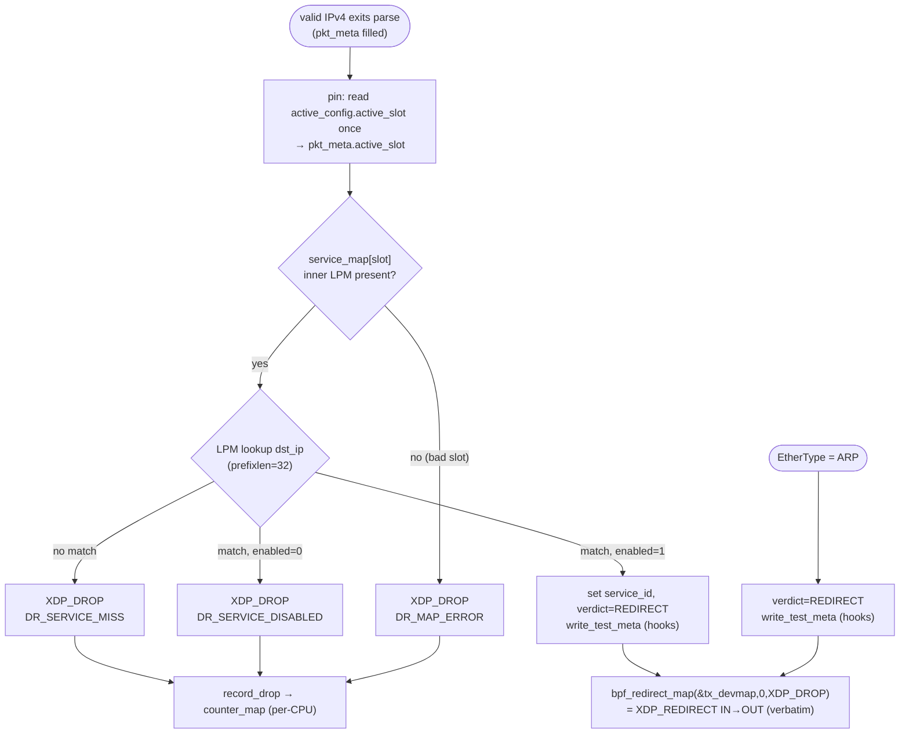

# Service Lookup & Transparent Redirect — Design

**Spec:** `.specs/features/service-lookup-redirect/spec.md` (SLRD-01..26)
**Context:** `.specs/features/service-lookup-redirect/context.md` (D-SLRD-1..3, A-SLRD-1..8)
**Status:** Draft — `tasks.md` drafted (T1–T7); awaiting approval → Execute
**Domain:** second data-plane feature; **extends the executed `data-plane/`** (packet-parse, VERIFIED). First
**config maps** + the per-packet `active_slot` pin.

> Rendered diagrams: [`diagrams/service-verdict-flow.svg`](diagrams/service-verdict-flow.svg) (the
> service-lookup → redirect decision tree, replacing both seams) and
> [`diagrams/config-map-architecture.svg`](diagrams/config-map-architecture.svg) (the slot-aware config
> maps, `tx_devmap`, seed path, and the M4 handoff). Sources in `diagrams/*.mmd`.

---

## Research notes (Knowledge Verification Chain)

Step 1–2 (codebase + project docs): the executed `data-plane/` (`xdp_gateway.bpf.c` seams at the ARP and
service-lookup branches; `pkt_meta.h`/`drop_reason.h`/`parse.h` contracts; `loader.c` `IN`-only attach;
`test_parse.c` `BPF_PROG_TEST_RUN` harness) and TDD §4.2/§4.3 (pipeline + map contract), PRD §6.2/§8.1–8.3.
Context7 MCP unavailable (as in packet-parse); the three load-bearing kernel semantics were **web-verified**
against current kernel/eBPF docs (2026-07-08) — not assumed:

- **`bpf_redirect_map(map, key, flags)` fail-closed return.** Returns `XDP_REDIRECT` on a successful devmap
  lookup, else **the low 2 bits of `flags`** as the fallback XDP action. So
  `bpf_redirect_map(&tx_devmap, 0, XDP_DROP)` drops (fail-closed) when `OUT` is unpopulated, and redirects
  when it is — no separate guard needed on the hot path. (docs.ebpf.io `bpf_redirect_map`; kernel
  `map_devmap.rst`; LWN 791085.)
- **Map-in-map inner type.** `ARRAY_OF_MAPS`/`HASH_OF_MAPS` accept **any inner map type except
  `PROG_ARRAY`**; one nesting level; the outer holds instances of a single inner type. `LPM_TRIE` is
  therefore valid as the inner, and an `LPM_TRIE` **must** carry `BPF_F_NO_PREALLOC`. (kernel
  `map_of_maps.html`; `map_lpm_trie.html`.) *Not found:* an explicit `ARRAY_OF_MAPS`-of-`LPM_TRIE` example
  — so a **fallback** (two named top-level LPM maps selected by slot, same external contract) is documented
  under Tech Decisions and confirmed at build/load (fail-fast), never assumed to "just work".
- **`BPF_PROG_TEST_RUN` does not process `XDP_REDIRECT`.** Kernel/eBPF docs and the devmap-programs series
  state the test-run infrastructure "does not handle `XDP_REDIRECT`" (it does not step into the devmap
  egress path). ⇒ the redirect **forwarding** and even a reliable `retval==XDP_REDIRECT` cannot be asserted
  by `BPF_PROG_TEST_RUN`; they belong to the **gated live-veth** path (D-SLRD-2). The **decision** is made
  observable device-free via `test_meta_map`. (docs.ebpf.io `BPF_PROG_TEST_RUN` / `BPF_PROG_TYPE_XDP`;
  netdev devmap-programs series.)

Still open (pinned in Tasks, fail-fast — never fabricated): the exact `ARRAY_OF_MAPS`-of-`LPM_TRIE`
libbpf/skeleton ergonomics (init `.values` with two inner instances); whether any environment yields
`retval==XDP_REDIRECT` under test-run (treated as **not** relied upon). See Open Questions.

---

## Architecture Overview

This feature drops the service decision + redirect into the two `XDP_PASS` seams packet-parse left in
`xdp_gateway.bpf.c`. After `parse_l4` succeeds, the program **pins `active_slot` once** (reads
`active_config`), selects that slot's `service_map` (an `ARRAY_OF_MAPS` of `LPM_TRIE`), does a
longest-prefix lookup on `pkt_meta.dst_ip`, and branches: no entry → `record_drop(DR_SERVICE_MISS)`;
entry with `enabled=0` → `record_drop(DR_SERVICE_DISABLED)`; enabled → set `pkt_meta.{service_id,
active_slot, verdict=REDIRECT}`, `write_test_meta`, and `bpf_redirect_map(&tx_devmap, 0, XDP_DROP)`. The ARP
seam changes from `XDP_PASS` to the same redirect (verbatim). Header preservation is inherent: the program
mutates **no** packet bytes (no TTL/checksum touch), and `bpf_redirect_map` forwards the frame as-is.



The whole config side is **slot-aware and double-buffer-ready** but written only by a **userspace seed
helper** in v1 (loader for demo, test harness for tests). The M4 worker replaces the seed helper with the
Postgres→map build + the atomic `active_slot` flip; the hot path and map contract do not change.

---

## Project layout (`data-plane/` — delta over packet-parse)

```
data-plane/
├── Makefile                  # MODIFY: service.h prereq; `run` gains OUT; new `smoke` target
├── README.md                 # MODIFY: OUT arg, seeding, redirect/veth smoke
├── src/
│   ├── xdp_gateway.bpf.c      # MODIFY: config-map defs + slot pin + service verdicts + redirect; ARP redirect
│   ├── service.h             # NEW: struct service_key/service_val/active_config + verdict enum (shared)
│   ├── pkt_meta.h            # MODIFY: + service_id, active_slot, verdict
│   ├── drop_reason.h         # MODIFY: + DR_SERVICE_MISS, DR_SERVICE_DISABLED (appended; indices stable)
│   └── parse.h               # unchanged
├── loader/
│   └── loader.c              # MODIFY: OUT arg/env; populate tx_devmap (fail-loud); seed active_config + demo service
├── tests/
│   ├── pkt_build.h           # unchanged (ARP/IPv4/L4 builders already present)
│   ├── test_parse.c          # MODIFY: seed helpers; new SLRD tests; migrate parse-verdict expectations
│   └── smoke_redirect.sh     # NEW: privileged two-veth IN↔OUT forward + TTL/csum assert (make smoke)
└── build/                    # generated (gitignored)
```

---

## Code Reuse Analysis

### Existing components to leverage

| Component | Location | How to use |
| --- | --- | --- |
| `pkt_meta` (dst_ip, ports, offsets) | `src/pkt_meta.h` | Read `dst_ip` for the LPM key; **extend** with `service_id`/`active_slot`/`verdict` |
| `enum drop_reason` + `record_drop()` + `counter_map` | `src/drop_reason.h` | **Append** `DR_SERVICE_MISS`/`DR_SERVICE_DISABLED`; reuse `record_drop()` verbatim (fits `DROP_REASON_CAP=32`) |
| The two marked seams | `src/xdp_gateway.bpf.c` (ARP `return XDP_PASS`; service `return XDP_PASS`) | **Replace** both with the redirect decision |
| `write_test_meta()` + `test_meta_map` (`-DPKT_TEST_HOOKS`) | `src/xdp_gateway.bpf.c` | Reuse as the **device-free decision observability** (write `verdict`/`service_id`/`active_slot`) |
| Loader open/load/attach/query/detach | `loader/loader.c` | **Extend**: add `OUT`, populate `tx_devmap`, seed slot 0; keep attach/detach flow |
| `test_env`/`run_frame`/`reset_maps`/`expect_*` harness | `tests/test_parse.c` | Reuse; add map fds + seed helpers; the `run_frame`(reset→test_run) loop is unchanged |
| Frame builders (`build_eth/ipv4/tcp/udp/icmp/arp`, VLAN) | `tests/pkt_build.h` | Reuse as-is for SLRD frames (no new builders needed) |
| `dp-unit` / `dp-integration` test-type + gates | `.specs/codebase/TESTING.md` | `dp-integration` was reserved for exactly this live-veth redirect smoke; **populate** it |

### Integration points (what this feature *changes* in existing code)

| System | Integration method |
| --- | --- |
| `xdp_gateway.bpf.c` clean-IPv4 terminal | `XDP_PASS` seam → service decision + `bpf_redirect_map`. **Behavioral change:** clean IPv4 no longer `XDP_PASS`es |
| `xdp_gateway.bpf.c` ARP terminal | `XDP_PASS` seam → `bpf_redirect_map` (D-SLRD-3). **Behavioral change:** ARP now redirects |
| **Existing packet-parse tests** (`test_parse.c`) | The clean-IPv4 (TCP/UDP/ICMP/VLAN/QinQ/GRE/ESP) and ARP tests asserted `retval==XDP_PASS`; that terminal is gone. **Each must be migrated** to seed an enabled service for its `dst_ip` and assert `meta.verdict==PKT_VERDICT_REDIRECT` (parse-field asserts on `sport`/`dport`/`ip_proto`/… are preserved). ARP test → assert `verdict==REDIRECT` + no drop counter. This is a required, enumerated Tasks step, not optional churn. |
| M4 worker (future) | Consumes the map contract (`service_map` inner LPMs + `active_config`); replaces the userspace seed helper; adds the atomic `active_slot` flip + rollback |
| M3 policy features (future) | Insert stages between the enabled-hit and the redirect, all reading `pkt_meta.active_slot` (the pin this feature establishes) |

No `CONCERNS.md` exists; the only fragility to manage is the **behavioral change to a green test suite** —
handled by migrating expectations in the same change (below), keeping the suite green.

---

## Components

### `service.h` — shared config structs + verdict enum (SLRD-01, SLRD-15, SLRD-16, A-SLRD-1)

- **Purpose**: the plain structs the BPF program, loader, and tests all agree on (the config-map contract).
- **Location**: `data-plane/src/service.h`
- **Interface**:
  ```c
  #define SERVICE_SLOTS 2                 /* double-buffer */

  struct service_key {                    /* LPM_TRIE key */
      __u32 prefixlen;                    /* 0..32; lookups use 32 */
      __be32 addr;                        /* dst IPv4, network order (LPM matches MSB-first) */
  };
  struct service_val {                    /* LPM_TRIE value — only what lookup+redirect need (A-SLRD-1) */
      __u32 service_id;                   /* control-plane ProtectedService id */
      __u8  enabled;                      /* 0 → service_disabled; 1 → redirect */
      __u8  _pad[3];
  };
  struct active_config {                  /* active_config[0] */
      __u32 active_slot;                  /* 0/1 — the atomic swap field (M4 writes) */
      __u32 version;                      /* config version (telemetry/observability) */
  };
  enum pkt_verdict { PKT_VERDICT_NONE = 0, PKT_VERDICT_REDIRECT = 1 };
  ```
- **Dependencies**: `<linux/types.h>` only (plain header, no maps).
- **Reuses**: mirrors packet-parse's "plain shared header" style (`pkt_meta.h`).

### Config maps + `tx_devmap` (in `xdp_gateway.bpf.c`) (SLRD-07, SLRD-13, SLRD-15, SLRD-16, SLRD-17)

Declared inline in the program TU (as `test_meta_map` already is), so the skeleton exposes them to loader
and tests. **Not** behind `PKT_TEST_HOOKS` (production needs them).

- **`service_inner_0`, `service_inner_1`** — two `BPF_MAP_TYPE_LPM_TRIE` (`key=struct service_key`,
  `value=struct service_val`, `max_entries≈1024`, `map_flags=BPF_F_NO_PREALLOC`). The two double-buffer
  slots, separately fillable by fd.
- **`service_map`** — `BPF_MAP_TYPE_ARRAY_OF_MAPS`, `max_entries=SERVICE_SLOTS`, initialized
  `.values = {[0]=&service_inner_0, [1]=&service_inner_1}` so libbpf installs both inners at load. Hot path
  selects the inner by `active_slot`.
- **`active_config`** — `BPF_MAP_TYPE_ARRAY`, `max_entries=1`, `value=struct active_config`. Index 0 always
  present (arrays are zero-init) ⇒ empty config reads `active_slot=0, version=0` and fails closed to
  `SERVICE_MISS` via an empty slot-0 LPM (spec edge case), not a null.
- **`tx_devmap`** — `BPF_MAP_TYPE_DEVMAP`, `max_entries=1`. Key 0 → `OUT` ifindex, populated by the loader.
  Runtime-state (unslotted, §8.3).

### `drop_reason.h` — two new reasons (SLRD-05, A-SLRD-2)

- **Change**: **append** after `DR_MAP_ERROR` (indices stay stable — tests/counters key on numeric value):
  ```c
  DR_MAP_ERROR,            /* 4 (existing) */
  DR_SERVICE_MISS,         /* 5 (new) */
  DR_SERVICE_DISABLED,     /* 6 (new) */
  DROP_REASON_CAP = 32,    /* unchanged — 6 ≪ 32, no resize (A-PKT-3 headroom) */
  ```
- **Reuses**: `record_drop()` and `counter_map` unchanged. The full §10.2 set + sampling stay
  *Drop-reason counters* (M2 #3).

### `pkt_meta.h` — pin + decision fields (SLRD-04, SLRD-13, SLRD-18)

- **Change**: add `service_id`/`active_slot`/`verdict`, keeping every existing field/name (parse tests read
  them by name) and 4-byte alignment:
  ```c
  struct pkt_meta {
      __u32 src_ip;
      __u32 dst_ip;
      __u32 service_id;    /* matched enabled service; 0 otherwise (NEW) */
      __u16 eth_proto; __u16 sport; __u16 dport; __u16 l3_off; __u16 l4_off;
      __u8  ip_proto; __u8 vlan_depth; __u8 icmp_type; __u8 icmp_code; __u8 is_fragment;
      __u8  active_slot;   /* pinned config slot (NEW) */
      __u8  verdict;       /* enum pkt_verdict — test-observable decision (NEW) */
      __u8  _pad;          /* pad to 4-byte boundary */
  };
  ```
- **Note**: still a small stack struct; `= {}` zero-inits the new fields. `sizeof` grows (test_meta_map
  value) — skeleton regenerates.

### `xdp_gateway.bpf.c` — the hot path (SLRD-01..14, SLRD-19..22)

- **Purpose**: replace both seams with the pin → lookup → verdict → redirect sequence.
- **Design-level flow** (final in code; `parse_*` chain unchanged above it):
  ```c
  /* ARP seam → redirect (D-SLRD-3) */
  case ETH_P_ARP:
      meta.verdict = PKT_VERDICT_REDIRECT;
      write_test_meta(&meta);
      return bpf_redirect_map(&tx_devmap, 0, XDP_DROP);

  /* service-lookup seam → decision (after parse_l4 == PARSE_OK) */
  __u32 cfg_key = 0;
  struct active_config *cfg = bpf_map_lookup_elem(&active_config, &cfg_key);
  __u32 slot = cfg ? cfg->active_slot : 0;
  meta.active_slot = (__u8)slot;

  void *inner = bpf_map_lookup_elem(&service_map, &slot);
  if (!inner)
      return record_drop(DR_MAP_ERROR);                 /* bad/uninstalled slot (SLRD-06) */

  struct service_key skey = { .prefixlen = 32, .addr = meta.dst_ip };
  struct service_val *sv = bpf_map_lookup_elem(inner, &skey);
  if (!sv)
      return record_drop(DR_SERVICE_MISS);              /* SLRD-02 */
  if (!sv->enabled)
      return record_drop(DR_SERVICE_DISABLED);          /* SLRD-03 (drop-all, AD-002) */

  meta.service_id = sv->service_id;                      /* SLRD-04 */
  meta.verdict = PKT_VERDICT_REDIRECT;
  write_test_meta(&meta);
  return bpf_redirect_map(&tx_devmap, 0, XDP_DROP);      /* SLRD-07/08/09/10/12 */
  ```
- **Header preservation** (SLRD-08/09): the program touches no packet bytes; `bpf_redirect_map` forwards the
  frame verbatim (L2 + VLAN tags + IPv4 TTL/checksum unchanged). Nothing to prove in code — proven on the
  wire by the live smoke.
- **Dependencies**: `service.h`, `drop_reason.h`, `pkt_meta.h`, `bpf_helpers.h`. Holds **no per-source-IP
  state** (stateless lookup, §11.1).

### `loader/loader.c` — OUT + populate + seed (SLRD-11, SLRD-17)

- **Change**: accept `OUT` (`argv[2]` or `OUT_IFACE`), resolve its ifindex, and **before/after attach**:
  - `bpf_map_update_elem(bpf_map__fd(skel->maps.tx_devmap), &k0, &out_ifindex, BPF_ANY)`; on failure (OUT
    lacks native XDP-TX / bad index) → clear error + `exit(1)` (**fail-loud**, mirrors the `IN` attach
    policy, SLRD-10/11 caught at load time).
  - seed for demo (A-SLRD-5): write one `service_val` (`enabled=1`) for an env-provided `SERVICE_DEST`
    (`cidr_or_ip`) into `service_inner_0`, and `active_config[0] = {active_slot=0, version=1}` — so
    `make run` actually forwards. Absent `SERVICE_DEST`, maps stay empty (everything `service_miss`) —
    still a valid, safe load.
- **Usage**: `xdp_gateway_loader <IN> <OUT>` (or `IN_IFACE`/`OUT_IFACE`).
- **Reuses**: the entire open/load/attach/query/signal-detach flow; only adds map population.

### Test harness — seed helpers, SLRD tests, migrated expectations (SLRD-01..06, SLRD-13..14, SLRD-19..24)

- **`test_parse.c` additions**: extend `test_env` with `active_config_fd`, `service_inner0_fd`,
  `service_inner1_fd` (from the test skeleton). Helpers:
  - `seed_service(env, slot, be32 addr, u32 prefixlen, u32 service_id, u8 enabled)` — LPM insert into the
    slot's inner.
  - `set_active(env, u32 slot, u32 version)` — write `active_config[0]`.
  - `reset_config(env)` — clear both inners + `active_config` between tests (extends `reset_maps`).
- **New dp-unit cases** (device-free, assert counters + `test_meta_map.verdict`):
  | Test | Setup | Assert |
  | --- | --- | --- |
  | service miss drops | active slot 0, empty inner | `DR_SERVICE_MISS==1` |
  | service disabled drops | seed `dst` enabled=0 | `DR_SERVICE_DISABLED==1` |
  | enabled service → redirect decision | seed `dst /32` enabled=1 | `meta.verdict==REDIRECT`, `meta.service_id==N`, `meta.active_slot==0`, drop counters 0 |
  | CIDR service matches host | seed `10.0.0.0/24` enabled=1, frame → `10.0.0.2` | redirect decision |
  | slot pin honored on flip | slot0 enabled, slot1 disabled, `active=0`→decision REDIRECT; `active=1`→same frame `DR_SERVICE_DISABLED` | both |
  | ARP → redirect decision | ARP frame | `meta.verdict==REDIRECT`, all drop counters 0 |
  | empty config fails closed | no seed | `DR_SERVICE_MISS` (slot 0 inner empty) |
- **Migrated existing cases** (see Integration Points): the ~10 clean-IPv4/ARP tests re-pointed from
  `retval==XDP_PASS` to seed-service + `verdict==REDIRECT`, preserving their parse-field assertions;
  `expect_all_drop_counters_zero` upper bound extended to `DR_SERVICE_DISABLED`.
- **Note**: no test asserts `retval==XDP_REDIRECT` (test-run can't produce it, Research) — that assertion
  lives only in the smoke.

### `smoke_redirect.sh` + `make smoke` — live forward + header preservation (SLRD-24, SLRD-25, A-SLRD-8)

- **Purpose**: the first `dp-integration` test — prove real `IN→OUT` forwarding with TTL/checksum intact.
- **Shape** (privileged, `CAP_NET_ADMIN`/root; **not** in `make test`): create two veth pairs across two
  netns as `IN`/`OUT`, run the loader (`IN`,`OUT`), seed one enabled service, send a crafted IPv4 frame into
  `IN` from one ns, capture on `OUT` in the other, and assert the received frame's **TTL and IPv4 checksum
  are byte-identical** to the sent frame. Exit non-zero on mismatch/no-delivery.
- **Gate**: `full` (`make test` + `make smoke` on a BPF+veth-capable runner). Documented in `TESTING.md` as
  the first populated `dp-integration`.

### `.specs/codebase/TESTING.md` — data-plane section update (SLRD-26, A-SLRD-8)

- **Change**: populate the previously-"Future" **dp-integration** row with the concrete
  `make smoke` two-veth redirect/TTL-csum convention; add `make smoke` to the gate table's `full` row with
  its privilege/parallel-safety caveats. A Tasks-phase edit (parallels A-PKT-2).

---

## Data Models (in-kernel maps)

| Map | Type | Key → Value | Slot? | Populated by (v1) → (M4) | Req |
| --- | --- | --- | --- | --- | --- |
| `service_map` | `ARRAY_OF_MAPS`[2] | `slot(u32)` → inner LPM | **config (slotted)** | seed helper → worker build | SLRD-15 |
| `service_inner_0/1` | `LPM_TRIE` (`NO_PREALLOC`) | `service_key{prefixlen,addr}` → `service_val{service_id,enabled}` | the two slots | seed helper → worker build | SLRD-01, A-SLRD-1 |
| `active_config` | `ARRAY`[1] | `0` → `active_config{active_slot,version}` | — (the swap pointer) | seed helper → worker atomic flip | SLRD-16 |
| `tx_devmap` | `DEVMAP`[1] | `0` → `OUT` ifindex | unslotted (runtime) | loader | SLRD-07, SLRD-11 |
| `counter_map` | `PERCPU_ARRAY`[32] | `drop_reason` → `u64` | unslotted (runtime) | (existing) | SLRD-05 |
| `test_meta_map` | `ARRAY`[1] `-DPKT_TEST_HOOKS` | `0` → `pkt_meta` | n/a (test-only) | (existing) | SLRD-23 |

---

## Verdict → action / reason mapping (authoritative)

| Condition (after parse OK) | Action | Reason / observ. | Req |
| --- | --- | --- | --- |
| `service_map[slot]` inner missing (bad slot) | `XDP_DROP` | `DR_MAP_ERROR` | SLRD-06 |
| LPM: no match for `dst_ip` | `XDP_DROP` | `DR_SERVICE_MISS` | SLRD-02 |
| LPM: match, `enabled==0` | `XDP_DROP` | `DR_SERVICE_DISABLED` | SLRD-03 |
| LPM: match, `enabled==1` | `bpf_redirect_map` → `XDP_REDIRECT` (or `XDP_DROP` if `tx_devmap` empty) | `verdict=REDIRECT`, `service_id` | SLRD-04/07/10 |
| EtherType ARP | `bpf_redirect_map` → `XDP_REDIRECT` (verbatim) | `verdict=REDIRECT`, no counter | SLRD-19..22 |
| (redirect, live) received on `OUT` | forwarded | TTL & IPv4 csum unchanged | SLRD-08/09/24 |

---

## Error Handling Strategy

| Scenario | Handling | Impact |
| --- | --- | --- |
| `OUT` interface lacks native XDP-TX / bad ifindex | Loader `tx_devmap` populate fails → clear error + `exit(1)` (fail-loud, load-time) | Operator sees it before any traffic (SLRD-10/11) |
| `tx_devmap` empty at runtime (shouldn't happen post-load) | `bpf_redirect_map(...,XDP_DROP)` fallback → drop, no leak | Fail-closed (SLRD-10) |
| `active_slot` out of range / inner uninstalled | `record_drop(DR_MAP_ERROR)` | Fail-closed + observable (SLRD-06) |
| Empty config (no services seeded) | slot-0 LPM miss → `DR_SERVICE_MISS` | Correct fail-closed default (edge case) |
| Overlapping LPM prefixes | LPM returns most-specific | Deterministic; control-plane already forbids active-dest overlap (SRL-04) |
| Existing parse tests break on the new terminal | Migrate expectations in the same change (enumerated) | Suite stays green (no silent skips) |
| `ARRAY_OF_MAPS`-of-`LPM_TRIE` unsupported by toolchain/verifier | Build/load fails loud → fall back to two named LPM maps + slot branch (Tech Decisions) | Caught at build, not runtime |

---

## Tech Decisions (non-obvious)

| Decision | Choice | Rationale |
| --- | --- | --- |
| Slotting representation | **`ARRAY_OF_MAPS`[2] of `LPM_TRIE`** (map-in-map), inner selected by `active_slot` | Matches TDD §4.3; one write (`active_slot`) flips all config atomically (M4); scales to M3's other 8 config maps. Verified: any inner type except `PROG_ARRAY` allowed. |
| Fallback if map-in-map+LPM fails | **Two named top-level LPM maps** (`service_map_0/1`) + `if (slot==0)…else…` branch | Same external contract + M4 flip; verifier-friendly literal map refs. Documented so Tasks isn't blocked; chosen only if the primary fails at build/load. |
| Redirect fail-closed | **`bpf_redirect_map(&tx_devmap, 0, XDP_DROP)`** | Verified: low 2 bits of `flags` are the miss/fallback action ⇒ drop when `OUT` unpopulated, redirect when populated — no extra hot-path guard. |
| Decision observability | **`pkt_meta.verdict` via `test_meta_map` (`-DPKT_TEST_HOOKS`)** | Verified: `BPF_PROG_TEST_RUN` can't process `XDP_REDIRECT`; the decision must be observable device-free. Reuses the existing hook; production hot path adds only a struct field. |
| Real forwarding + header preservation | **Gated `make smoke` two-veth** (D-SLRD-2) | The only place `XDP_REDIRECT` + TTL/csum are truly observable; privileged/not-parallel ⇒ `full` gate. |
| `OUT` misconfig detection | **Load-time** (loader populates + fails loud) | The useful place to catch it; runtime keeps the fail-closed drop as backstop. |
| LPM key endianness | **`addr` network order** (`meta.dst_ip` as-is) | LPM matches MSB-first; network-order IPv4 gives correct prefix semantics — no byteswap. |
| Drop-reason numbering | **Append** `SERVICE_MISS`/`DISABLED` after `MAP_ERROR` | Keeps existing counter indices stable (tests/telemetry); fits `DROP_REASON_CAP=32`. |

---

## Test strategy

- **dp-unit (quick gate, `make test`, device-free, parallel-safe as infra):** all four verdicts —
  `service_miss`/`service_disabled`/`map_error` by counter + `retval==XDP_DROP`; enabled-hit and ARP by
  `test_meta_map.verdict==REDIRECT` (+ `service_id`, `active_slot`); the slot-pin flip; CIDR/LPM match; plus
  the **migrated** parse-field tests. Expected passing count is stated in the task (extends the current 21).
- **dp-integration (full gate, `make smoke`, privileged, not parallel-safe):** real `IN→OUT` delivery +
  TTL/checksum-unchanged. First populated `dp-integration`.
- **build gate (`make bpf skel loader`):** compiles the new maps + loader; verifier accepts the program;
  this is also where the `ARRAY_OF_MAPS`-of-`LPM_TRIE` feasibility is confirmed (fail-fast).

---

## Open Questions (resolve in Tasks, do not block design)

1. **`ARRAY_OF_MAPS`-of-`LPM_TRIE` skeleton ergonomics** — initializing `.values={[0]=&inner0,[1]=&inner1}`
   and reading each inner fd via the skeleton. Confirm at the scaffold task; fall back to two named LPM maps
   if it doesn't build/load (contract unchanged).
2. **`tx_devmap` value type** — plain `int` ifindex vs `struct bpf_devmap_val`. Use the ifindex form unless
   a devmap-prog is needed (it isn't here); confirm the update call shape at the loader task.
3. **Smoke harness mechanism** — two netns + veth vs a single-ns veth pair; sender/capture tool (raw socket
   vs scapy). Pick the lightest that runs unprivileged-except-root; documented in the smoke task.
4. **Min kernel for `ARRAY_OF_MAPS` + devmap redirect in CI** — pin alongside the packet-parse
   kernel/toolchain pin (still open from PKT design).

---

## Requirement coverage (design → spec)

All 26 SLRD reqs are placed: SLRD-01..06 (lookup + verdicts) → `service.h` + `xdp_gateway.bpf.c` hot path +
`drop_reason.h`; SLRD-07..12 (redirect) → `tx_devmap` + `bpf_redirect_map` + loader `OUT`; SLRD-13..18 (pin +
config maps + seed) → `active_config`/`service_map`/`service_inner_*` + loader/test seed helpers +
`pkt_meta` fields; SLRD-19..22 (ARP) → ARP redirect branch; SLRD-23..26 (verification) → dp-unit decision
tests + `make smoke` + `TESTING.md`. Ready to break into tasks.

---

## Design amendment — L2 next-hop rewrite (2026-07-20, AD-DP-01, SLRD-27..29)

The header-preservation assumption in "Architecture Overview" ("the program mutates **no** packet bytes")
held only for a **pure L2 transparent bridge**. The first routed deployment broke it (ingress dst MAC =
gateway IN MAC, not the backend's), so the redirect now conditionally rewrites the L2 addresses. See
spec Amendment (SLRD-27..29) for the requirements and the empirical root cause.

**Implementation (in `xdp_gateway.bpf.c`):**

```c
static __always_inline void l3_rewrite_nexthop(struct xdp_md *ctx, struct pkt_meta *meta)
{
    struct ethhdr *eth = (void *)(long)ctx->data;
    struct bpf_fib_lookup fib = {};
    if (meta->eth_proto != ETH_P_IP) return;               /* ARP → verbatim (SLRD-29) */
    if ((void *)(eth + 1) > (void *)(long)ctx->data_end) return;
    fib.family = AF_INET;
    fib.ipv4_src = meta->src_ip; fib.ipv4_dst = meta->dst_ip;
    fib.ifindex = ctx->ingress_ifindex;
    if (bpf_fib_lookup(ctx, &fib, sizeof(fib), BPF_FIB_LOOKUP_DIRECT) != BPF_FIB_LKUP_RET_SUCCESS)
        return;                                            /* transparent-bridge fallback (SLRD-28) */
    __builtin_memcpy(eth->h_dest, fib.dmac, ETH_ALEN);     /* next-hop / backend MAC (SLRD-27) */
    __builtin_memcpy(eth->h_source, fib.smac, ETH_ALEN);   /* OUT MAC */
}
```

`redirect_out` and `redirect_out_bypass` now take `struct xdp_md *ctx` and call `l3_rewrite_nexthop`
immediately before `bpf_redirect_map`. `ctx` is threaded from `xdp_gateway` → `service_lookup_redirect`
→ `whitelist_stage`/`fair_admit_stage` (the VIP-admit and committed/burst-admit redirect sites) and the
bypass site — all already carried `ctx`, so no new plumbing on the hot path beyond the parameter.

**Design decisions added to "Tech Decisions":**

| Decision | Choice | Rationale |
| --- | --- | --- |
| Next-hop resolution | **`bpf_fib_lookup(BPF_FIB_LOOKUP_DIRECT)`** per packet | Uses the live kernel FIB/neigh, so it tracks route/ARP changes with zero control-plane plumbing; `DIRECT` skips policy rules (we already decided to forward). |
| Fallback on non-SUCCESS | **Forward verbatim** (no rewrite) | Preserves pure-transparent-bridge and veth-smoke behavior (FIB has no route there) and rides out transient `NO_NEIGH` during ARP warmup. Keeps existing tests green. |
| TTL | **Not decremented** even in routed mode | Honors SLRD-08 header-preservation intent; avoids TTL=1 drops and the incremental-checksum cost; hop stays L3-invisible. |
| Egress on ixgbe-class NIC | **Requires `XDP_PASS` on OUT** (devmap TX rings) | `ndo_xdp_xmit` needs an attached XDP prog on the target; loader attaches IN only. Documented in `README.md`; loader auto-attach is a follow-up. |

**Test note:** contrary to the original Research note ("`BPF_PROG_TEST_RUN` does not process
`XDP_REDIRECT`"), the current kernel **does** return `retval=XDP_REDIRECT` under test-run and reflects
the pre-redirect packet **data** mutation in `data_out`. The MAC rewrite is therefore now assertable
device-free (the devmap xmit itself is still not executed), which is how SLRD-27 was verified.
</content>
