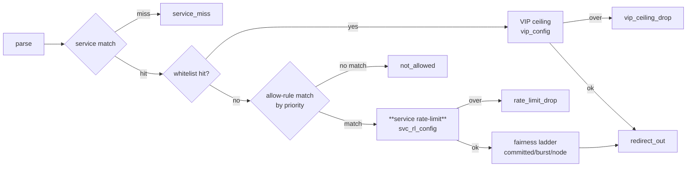

# Service-Level Rate-Limit — Design (AD-SVR)

Mirrors the **VIP ceiling** implementation (whitelist.h) — a proven slotted-config + unslotted-per-CPU-
state token bucket — but on the **clean (non-VIP) allowed path**. Removes the dead per-rule bucket.

## Pipeline placement (§8.2)



New stage **SRL** occupies exactly the seam the per-rule bucket used to (ARL admit→redirect seam). VIP
and fairness are untouched. (Render with `mermaid-studio` if richer output is wanted.)

## Data-plane

### New maps (mirror `vip_config_map` / `vip_ceiling_state`)
- `struct svc_rl_config { __u8 flags; __u8 _pad[7]; __u64 pps; __u64 bps; }` — **identical layout to
  `struct vip_config`** (24 B, `_Static_assert`). Flags: `SVC_RL_F_PPS_SET = 1<<0`, `SVC_RL_F_BPS_SET = 1<<1`.
- `svc_rl_config_map` — `ARRAY_OF_MAPS` slotted (inners `svc_rl_config_0/1`), inner `HASH` key `__u32`
  dp_id → `svc_rl_config`. **Config** (double-buffered, read via pinned `active_slot`). Rebuilt+flipped by
  `xdpgw-apply` alongside the other slotted maps (M4 #2 contract).
- `svc_rl_state` — unslotted `PERCPU_HASH` key `__u32` service_id → `struct rl_bucket`. **Runtime state**
  (survives config swaps), lazily populated, `NO_PREALLOC`-style like `vip_ceiling_state`.

### New hot-path stage (clone of `vip_bucket_*`)
- `svc_rl_config_lookup(slot, service_id)` → `bpf_map_lookup_elem(&svc_rl_config_map, &slot)` then inner
  lookup by service_id (mirrors `vip_config_lookup`).
- `svc_rl_admit(service_id, cfg, pkt_len)` — clone of `vip_bucket_admit`: no flag set → admit; else
  lazy version-reset / refill / consume on `svc_rl_state[service_id]`, reusing `rl_burst()` and the
  `rl_bucket` struct. Returns 1 (admit) / 0 (drop).
- Wire into `rules.h::allow_rule_stage`: when a rule matches, replace the current
  `rl_bucket_admit(block, rule, …)` call with the service check —
  `if (!svc_rl_admit(service_id, cfg, pkt_len)) return record_drop(meta, DR_RATE_LIMIT_DROP);`
  then `return admit_clean(ctx, meta, slot);`. The service check runs **once per packet** on match, not
  per-rule (it is service-scoped).

### Removals (per-rule machinery)
- `struct rule_entry`: drop `pps`, `bps` (32 B → 16 B); update `_Static_assert(sizeof(rule_entry))` and
  `sizeof(rule_block)`; delete `RULE_F_PPS_SET`/`RULE_F_BPS_SET` (keep `RULE_F_ENABLED`).
- Delete per-rule bucket code: `rate_limit_state` map, `rl_key`, `rl_config` (`test_no_refill`),
  `rl_bucket_admit/consume/refill/reset`, `rl_bucket_admit` callers.
- **Keep** `struct rl_bucket` and `rl_burst()` — shared with VIP and the new SVR stage.
- **Task-0 check:** grep that nothing but per-rule code references the deleted symbols; if the ARL
  deterministic test knob (`rl_config.test_no_refill`) is reused by VIP/dp-unit, re-home it as a shared
  `bucket_test_no_refill` rodata rather than deleting.

### Loader
- Pin `svc_rl_config_map` + `svc_rl_state` (mirror the `vip_config_map`/`vip_ceiling_state` pin lines).
- Seed helper: optional `XDPGW_SEED_SVC_PPS`/`XDPGW_SEED_SVC_BPS` to write a `svc_rl_config` row for
  `SERVICE_DEST` (mirror the VIP seed) so the stage is loadable/testable standalone.

## Apply wire format v3 (`apply_snapshot.h`)

- `APPLY_SNAPSHOT_SCHEMA_VERSION 2 → 3`. Reader rejects v2 (hard gate, existing behavior).
- Service record, **additive** — inserted after `vip_flags`, before `rule_count`:
  ```
  ... committed_bps le64, ceiling_bps le64, vip_pps le64, vip_bps le64, vip_flags u8,
      service_pps le64, service_bps le64, svc_rl_flags u8,     <-- NEW (17 bytes)
      rule_count le16, rules[rule_count] { ...10 bytes, unchanged... }
  ```
- `APPLY_SNAPSHOT_SERVICE_FIXED_SIZE 50 → 67`. `APPLY_SNAPSHOT_RULE_SIZE` stays **10**.
- Update the header note added in commit `49b7c91`: per-rule pps/bps are now **gone entirely** (not just
  "don't set flags"); rate-limit lives in the service record.

## Control-plane

| Area | Change |
| --- | --- |
| `db/models.py` | `ProtectedService` += `service_pps`, `service_bps` (`BigInteger`, nullable). `AllowRule` −= `pps`, `bps`. |
| Alembic | New revision off current head: `add_column protected_service.service_pps/service_bps`; `drop_column allow_rule.pps/bps`. Downgrade reverses. |
| `worker/applier.py` | `ServiceConfig` snapshot += `service_pps`/`service_bps`; `AllowRule` snapshot −= pps/bps. `serialize_node_snapshot` pack string `"<I4sIBBBQQQQBH"` → `"<I4sIBBBQQQQBQQBH"` (add `service_pps or 0`, `service_bps or 0`, `_svc_rl_flags(service)`). Add `_svc_rl_flags()` mirroring `_vip_flags()`. `_rule_flags` already returns `ENABLED` only (commit `49b7c91`) — now no pps/bps exist to consider. |
| `api/schemas/services.py` | Service create/patch += `service_pps`/`service_bps: int|None` (ge=0). AllowRule schemas −= pps/bps. |
| `services/services.py` | `create_service`/`update_service` accept + persist `service_pps`/`service_bps` (mirror `vip_pps/vip_bps`). Rule create/replace stops reading pps/bps. Validation: `0 ≤ value` or NULL. |
| `tools/xdpgw-apply.c` | `parse_service`: read `service_pps`/`service_bps`/`svc_rl_flags` after vip fields; validate. Build + write `svc_rl_config` inner (clone the vip_config write path); add `svc_rl_config_map` to the slotted rebuild/flip + structural read-back. Accept schema v3. |
| SPA | Service form += rate-limit fields (mirror VIP inputs); rule form −= pps/bps. |

## Drop reason
`DR_RATE_LIMIT_DROP` (index 10) **unchanged** — now emitted by `svc_rl_admit` failure. No enum
renumber, `DROP_REASON_COUNT` unchanged. Telemetry/label copy relabels it "service rate-limit".

## Key decisions
- **AD-SVR-1** Clone the VIP ceiling machinery (slotted config + unslotted per-CPU `rl_bucket`), not the
  per-rule buckets — lowest-risk, proven pattern; keeps rate÷nCPU aggregate accounting (AD-019).
- **AD-SVR-2** Reuse `DR_RATE_LIMIT_DROP` — no drop-reason ABI append; identical operator meaning.
- **AD-SVR-3** Seam = clean-path allow→admit (rules.h), strictly before the fairness ladder; VIP/Plan
  paths untouched (D-SVR-3).
- **AD-SVR-4** Wire v3 additive to the **service** record; rule record byte-identical (10 B); hard
  version gate; writer+reader ship together (A-SVR-3).
- **AD-SVR-5** Delete `rule_entry.pps/bps` + per-rule bucket machinery; keep `rl_bucket`/`rl_burst`
  (shared). Verify no stragglers first (Task-0 grep).
- **AD-SVR-6** Migration discards old rule pps/bps (documented breaking change, A-SVR-2).

## Test strategy
- **DP (`make test`, BPF_PROG_TEST_RUN):** service under-budget = `clean`; over-budget = `rate_limit_drop`
  (deterministic no-refill bucket); both dimensions NULL = never rate-limited; whitelist hit unaffected
  (VIP only); pps-only and bps-only variants; program loads native + verifier-clean; `rule_entry`/
  `rule_block` size asserts updated. Amend the ARL 34-case suite: drop per-rule-rate cases, add
  service-rate cases.
- **CP (`pytest -q`):** model + migration up/down; `serialize_node_snapshot` **golden fixture regenerated**
  for v3 (service_pps/bps present, rule 10 B unchanged); schema/validation (ge=0, NULL); service
  create/update round-trip; rule schema rejects pps/bps.
- **Contract test:** a CP-emitted v3 snapshot parses in the C reader’s `test_parse.c`/`test_snapshot.c`
  fixtures (mirror how vip fields are asserted there).
