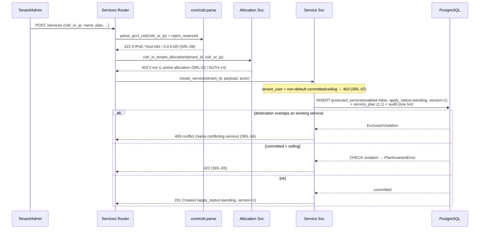

# Service, Rule & List Management (API) Design

**Spec**: `.specs/features/service-rule-list/spec.md` (SRL-01..44)
**Context**: `.specs/features/service-rule-list/context.md` (D-SRL-1..4, A-SRL-1..6 — A-SRL-1/3 confirmed)
**Status**: Draft (awaiting approval → Tasks)
**Depends on**:
- **Auth & RBAC** (`.specs/features/auth-rbac/design.md`) — reuses `get_current_user`, `require_admin`, `authorize_tenant_resource`, `scope_to_tenant`, `audit.record_event`, and the `Base`/`User`/`Tenant`/`AuditEvent` models unchanged.
- **Tenant & CIDR allocation** (`.specs/features/tenant-cidr/design.md`) — reuses `AllocatedCIDR`, `cidr_in_tenant_allocation` / `require_within_allocation`, and `app/core/cidr.py` unchanged; **completes** the dependency-count hook `revoke()` stubbed for `TCA-16`.

---

## Architecture Overview

Same layered FastAPI control-plane as auth-rbac and tenant-cidr (**routers → services → stores**). This
feature adds **five tables** (`protected_service`, `service_plan`, `allow_rule`, `whitelist_entry`,
`blacklist_entry`), **three service modules** (`services`, `rules`, `lists`), **four routers**, one pure
port/overlap helper, and one Alembic revision. It writes nothing to the data-plane and enqueues no jobs —
it is the config **source of truth** that M2/M3 build maps from and the Apply-status feature propagates.

Two invariants are pushed **down to the database** so correctness does not depend on app-level races:

1. **Destination non-overlap (D-SRL-3):** a partial-free GiST **exclusion constraint** on
   `protected_service.cidr_or_ip` makes two overlapping service destinations physically impossible
   (satisfies SRL-04 / SRL-40 by construction) — the same `inet_ops WITH &&` mechanism verified for
   `AllocatedCIDR` (AD-010), no `btree_gist`.
2. **Unique rule priority (SRL-16):** `UNIQUE (service_id, priority)`.

Two invariants stay at the **application layer** because SQL constraints can't express them cleanly:

3. **≤16 rules/service (SRL-17):** enforced by locking the parent service row (`SELECT … FOR UPDATE`)
   and counting inside the same transaction — race-proof, and it doubles as the serialization point for
   the `version` bump.
4. **Destination ⊆ allocation (SRL-02, AUTH-14):** the reused `cidr_in_tenant_allocation` primitive.

**Component view** — source: `diagrams/component-architecture.mmd` · rendered: `diagrams/component-architecture.svg`

```mermaid
flowchart TD
    dashboard[React Dashboard]
    subgraph api [FastAPI Control-Plane]
        svcRouter[Services Router /services]
        ruleRouter[Rules Router /services/:id/rules]
        listRouter[Lists Router /services/:id/whitelist·/blacklist]
        gblRouter[Global Blacklist Router /blacklist]
        adminGuard{{require_admin}}
        ownerGuard{{authorize_tenant_resource · scope_to_tenant}}
        allocGuard{{require_within_allocation}}
    end
    subgraph svc [Service Layer]
        serviceSvc[Service Svc<br/>+ bump_version · services_in_cidr]
        ruleSvc[Rule Svc<br/>FOR UPDATE + count ≤16]
        listSvc[List Svc<br/>whitelist · service/global blacklist]
        allocSvc[(reused) Allocation Svc<br/>cidr_in_tenant_allocation]
        auditSvc[(reused) Audit Svc]
    end
    subgraph core [Core helpers]
        cidrHelper[core/cidr.py<br/>reused: parse/reject-reserved]
        ruleMatch[core/rulematch.py<br/>NEW: port-range · overlap]
    end
    postgres[(PostgreSQL<br/>protected_service · service_plan · allow_rule<br/>whitelist_entry · blacklist_entry)]
    dashboard -->|tenant + admin: HTTPS + cookie| svcRouter
    dashboard --> ruleRouter
    dashboard --> listRouter
    dashboard -->|admin only| gblRouter
    svcRouter -.->|Depends| ownerGuard
    svcRouter -.->|create/edit dest| allocGuard
    svcRouter -.->|plan sizing| adminGuard
    ruleRouter -.-> ownerGuard
    listRouter -.-> ownerGuard
    gblRouter -.->|Depends| adminGuard
    svcRouter --> serviceSvc
    ruleRouter --> ruleSvc
    listRouter --> listSvc
    gblRouter --> listSvc
    serviceSvc --> allocSvc
    serviceSvc -->|EXCLUDE gist · dest no-overlap| postgres
    ruleSvc --> ruleMatch
    ruleSvc -->|UNIQUE(service_id,priority) · FOR UPDATE| postgres
    listSvc --> cidrHelper
    serviceSvc --> cidrHelper
    serviceSvc --> auditSvc
    ruleSvc --> auditSvc
    listSvc --> auditSvc
    allocSvc -. TCA-16: revoke calls services_in_cidr .-> serviceSvc
    dpFeatures[M2/M3 map build · M4 feed · Apply-status] -.->|read config| postgres
```

**Service-create flow (scope + overlap arbitration)** — source: `diagrams/service-create-sequence.mmd` · rendered: `diagrams/service-create-sequence.svg`



---

## Research Notes (Knowledge Verification Chain)

- **Step 1 (Codebase):** control-plane not yet executed (auth-rbac + tenant-cidr are "awaiting approval →
  Execute"). No code to reuse; the **conventions/skeleton** from their designs are authoritative and
  honored below (layer hygiene, guard/audit signatures, `core/cidr`, exclusion-constraint idiom).
- **Step 2 (Project docs):** PROJECT.md, TDD 4.2/4.6/4.7 (endpoint sketch + model constraints), PRD
  6.3/6.4/6.5/7.2/11.2, spec.md, context.md. All honored.
- **Step 3 (Context7 MCP):** not available (per prior designs) — skipped.
- **Step 4 (Web — reused, verified 2026-07-07 in AD-010):** `inet_ops` is a **core built-in** GiST
  opclass supporting `&&`; no `btree_gist` for a single-column `cidr_or_ip WITH &&` exclusion; the opclass
  **must be named explicitly** in SQLAlchemy `ExcludeConstraint(ops={"cidr_or_ip":"inet_ops"})`. Reused
  directly — same mechanism as `allocated_cidr_active_no_overlap`.
- **Step 5 (Flagged uncertain):** none. The two open items are *choices*, not uncertainties: (a) port
  storage as `integer lo/hi` columns vs Postgres `int4range` — chosen `lo/hi` so the overlap **warning**
  is a pure Python computation (unit-testable, no DB round-trip); (b) ≤16 enforcement as an app row-lock
  vs a DB trigger — chosen row-lock for testability. Both recorded under Tech Decisions.

---

## Code Reuse Analysis

### Existing components to leverage

| Component | Location | How to use |
| --- | --- | --- |
| `get_current_user`, `require_admin` | `app/core/deps.py` | Gate all routers; global blacklist + plan sizing are admin-only (SRL-07/29) |
| `authorize_tenant_resource`, `scope_to_tenant` | `app/core/deps.py` | Ownership + list scoping on every service/rule/list read/write (SRL-31) |
| `require_within_allocation` / `cidr_in_tenant_allocation` | `app/core/deps.py`, `app/services/allocations.py` | Destination-scope check on service create/edit (SRL-02/33, AUTH-14) — imported unchanged |
| `audit.record_event(db, ...)` | `app/services/audit.py` | Every mutation + dangerous action, same txn (SRL-34/35) |
| `core/cidr.parse_ipv4_cidr`, `reject_reserved` | `app/core/cidr.py` | Validate `cidr_or_ip` **and** list `source_cidr` (IPv4 canonical, reject IPv6/host-bits/`/0`) (SRL-08/23/27) |
| `AllocatedCIDR` model | `app/db/models.py` | Containment target for scope check; revoke dependency (SRL-32) |
| `Base`, `User`, `Tenant`, `AuditEvent`, Settings, session/lifespan, Alembic harness | `app/`, `migrations/` | Extend; new revision only |

### This feature establishes (for reuse by later features)

| Primitive | Location | Reused by |
| --- | --- | --- |
| `ProtectedService` / `ServicePlan` / `AllowRule` / `WhitelistEntry` / `BlacklistEntry` models + `protected_service_dest_no_overlap` | `app/db/models.py` | M2 `service_map`, M3 `rule_block_map`/bloom/LPM, M5 telemetry/billing, Apply-status |
| `services_in_cidr(db, cidr) -> Sequence[ProtectedService]` | `app/services/services.py` | tenant-cidr `revoke` (TCA-16); any future CIDR-dependency check |
| `bump_version(db, service_id)` | `app/services/services.py` | Apply-status feature (reads `version`); rule/list services |
| `core/rulematch.py` (validate port range, overlap) | `app/core/rulematch.py` | M3 rule-loop reference; dashboard rule editor |

### Integration points

| System | Integration method |
| --- | --- |
| PostgreSQL | 5 new tables; partial-free GiST exclusion on `cidr_or_ip`; `UNIQUE(service_id,priority)`; CHECKs (`committed ≤ ceiling`, port ranges, scope↔service_id); FKs with `ON DELETE CASCADE` (children) |
| Alembic | One revision, `down_revision = <tenant-cidr head>`; adds tables + constraints |
| tenant-cidr `allocations.revoke` | **Modified** to call `services_in_cidr` (lazy import to avoid a module cycle) → 409 when non-empty (SRL-32, closes TCA-16) |
| Auth & RBAC guards | Imported unchanged |
| React dashboard | Tenant service/rule/list CRUD + overlap dry-run; admin cross-tenant + global blacklist + plan sizing (M5 wires UI) |

---

## Components

### Rule-match helper — `app/core/rulematch.py` (pure, unit-tested) — NEW
- **Purpose**: single source of truth for port-range validity and rule overlap; keeps the warning a pure computation.
- **Interfaces**:
  - `validate_port_range(lo: int | None, hi: int | None) -> None` — raises `PortRangeError` unless `0 ≤ lo ≤ hi ≤ 65535` (or both `None` for icmp/any) (SRL-19).
  - `rules_overlap(a: RuleView, b: RuleView) -> bool` — true iff protocols intersect (equal, or either is `any`) AND src-port ranges intersect AND dst-port ranges intersect.
  - `find_overlaps(existing: Sequence[RuleView], candidate: RuleView) -> list[RuleView]` — powers both the create-time warning (SRL-18) and the dry-run (SRL-37).
- **Dependencies**: stdlib only. **Reuses**: nothing. **Establishes** the rule-overlap contract.

### Service service — `app/services/services.py` — NEW
- **Purpose**: `ProtectedService` + 1:1 `ServicePlan` lifecycle, the version bump, and the cross-feature dependency query.
- **Interfaces**:
  - `create_service(db, tenant_id, payload, actor) -> ProtectedService` — asserts caller may size the plan (else committed/ceiling forced to defaults, SRL-07); INSERTs service (`enabled=false`, `apply_status=pending`, `version=1`) + plan; maps `ExclusionViolation → OverlapError` (SRL-04) and plan CHECK → `PlanInvariantError` (SRL-03); audits.
  - `list_services(db, principal)` / `get_service(db, id, principal)` — admin any (annotate owner, AUTH-15), tenant_user scoped (SRL-05/31).
  - `update_service(db, id, payload, actor)` — re-checks dest ⊆ allocation + non-overlap; `bump_version`; `apply_status=pending`; audits (SRL-06/44).
  - `set_enabled(db, id, enabled, actor)` — idempotent no-op on non-change (SRL-11); disable/enable audited (disable = dangerous, AD-002); `bump_version` + `pending` on change (SRL-09/10).
  - `size_plan(db, id, committed, ceiling, actor)` — **admin-only** path; enforces `committed ≤ ceiling`; returns oversubscription warning when `Σ active committed > node_clean_capacity` (SRL-36); audits.
  - `delete_service(db, id, actor)` — refuse 409 if `enabled` (SRL-12); else hard-delete (children cascade) + dangerous audit (SRL-13/14).
  - `bump_version(db, service_id)` — `SELECT … FOR UPDATE` the service, `version += 1`, `apply_status='pending'`. Called by rule/list services.
  - `services_in_cidr(db, cidr) -> Sequence[ProtectedService]` — `WHERE cidr_or_ip << :cidr OR cidr_or_ip = :cidr`; the TCA-16 dependency source.
- **Dependencies**: models, audit, `core/cidr`, allocation service (scope). **Reuses**: audit, `cidr_in_tenant_allocation`.

### Rule service — `app/services/rules.py` — NEW
- **Purpose**: `AllowRule` CRUD with the ≤16 / unique-priority / overlap-warning rules.
- **Interfaces**:
  - `create_rule(db, service_id, payload, principal) -> tuple[AllowRule, list[Overlap]]` — `_lock_service(FOR UPDATE)`; reject if count ≥ 16 (`RuleLimitError`, SRL-17); `validate_port_range` (SRL-19); INSERT (maps unique violation → `DuplicatePriorityError`, SRL-16); compute `find_overlaps` warning (SRL-18); `bump_version`; audit.
  - `update_rule` / `delete_rule` / `get_rule` / `list_rules` — scoped to owning service; `bump_version` + audit on write (SRL-20/21).
  - `overlap_dry_run(db, service_id, candidate, principal) -> list[Overlap]` — read-only (SRL-37).
- **Dependencies**: models, `core/rulematch`, service service (`bump_version`), audit.

### List service — `app/services/lists.py` — NEW
- **Purpose**: whitelist + service/global blacklist CRUD.
- **Interfaces**:
  - `add_whitelist(db, service_id, source_cidr, principal)` / `remove_whitelist` / `list_whitelist` — source via `parse_ipv4_cidr` (arbitrary IPv4, reject IPv6/host-bits, D-SRL-1, SRL-22/23); keyed `(service_id, source_cidr)`; `bump_version` + audit.
  - `add_blacklist(db, service_id | None, scope, source_cidr, principal)` — `scope='service'` (owned service) or `scope='global'` (`service_id=NULL`, `source='manual'`, **admin-only** enforced at router, SRL-28/29); `bump_version` for service scope; audit (SRL-26/30).
  - `remove_blacklist` / `list_blacklist` — scoped (service → owning service; global → admin).
- **Dependencies**: models, `core/cidr`, service service (`bump_version`), audit.

### Deps addition — `app/core/deps.py` (+ small addition)
- **Interface**: `load_service_for_principal(service_id, principal) -> ProtectedService` — loads the service, applies `authorize_tenant_resource`, 404 on cross-tenant (anti-enumeration, matches auth-rbac). Reusable by rule/list routers so they stay declarative.
- **Reuses**: service service, existing guard pattern.

### API routers — `app/api/routers/{services,rules,lists,global_blacklist}.py` — NEW
- **Endpoints** (thin: schema validation → guards → service call → map domain errors):
  - `services.py`: `POST/GET/PATCH/DELETE /services`, `POST /services/{id}/enable`, `POST /services/{id}/disable`, `PATCH /services/{id}/plan` (**require_admin**).
  - `rules.py`: `POST/GET/PATCH/DELETE /services/{id}/rules`, `POST /services/{id}/rules/overlap-check`.
  - `lists.py`: `POST/GET/DELETE /services/{id}/whitelist`, `POST/GET/DELETE /services/{id}/blacklist`.
  - `global_blacklist.py`: `POST/GET/DELETE /blacklist` (**require_admin**).
- Request/response schemas in `app/api/schemas/{services,rules,lists}.py` (Pydantic; CIDR fields validated through `core/cidr`).
- **Dependencies**: services, deps.

---

## Data Models — `app/db/models.py` (all new)

```python
class ApplyStatus(str, Enum):
    pending = "pending"; queued = "queued"; applying = "applying"
    active = "active"; failed = "failed"           # this feature only ever writes `pending`

class ServiceMode(str, Enum):
    allow_rule_only = "allow-rule-only"            # v1 sole value (A-SRL-2)

class Protocol(str, Enum):
    tcp = "tcp"; udp = "udp"; icmp = "icmp"; any = "any"

class BlacklistScope(str, Enum): service = "service"; global_ = "global"
class BlacklistSource(str, Enum): manual = "manual"; feed = "feed"   # feed rows added by M4
class OveragePolicy(str, Enum): billed = "billed"; capped = "capped"

class ProtectedService(Base):
    id: UUID                       # PK uuid4
    tenant_id: UUID                # FK tenant.id  ON DELETE RESTRICT
    name: str                      # unique per tenant (UNIQUE(tenant_id, lower(name)))
    cidr_or_ip: CIDR               # postgresql CIDR, IPv4 canonical (/32 ok); ⊆ AllocatedCIDR (app)
    mode: ServiceMode              # allow-rule-only
    enabled: bool                  # default False
    vip_pps: BigInteger | None     # VIP-ceiling aggregate (enforced M3)
    vip_bps: BigInteger | None
    apply_status: ApplyStatus      # this feature sets `pending`
    version: int                   # monotonic; bumped on every mutation (owned here, A-SRL-3)
    active_version: int | None     # set by worker/apply-status; NULL here
    created_at: datetime; updated_at: datetime
    __table_args__ = (
        # D-SRL-3 GLOBAL destination non-overlap across ALL services (enabled or not); inet_ops core.
        ExcludeConstraint(("cidr_or_ip", "&&"), using="gist",
                          ops={"cidr_or_ip": "inet_ops"},
                          name="protected_service_dest_no_overlap"),
        Index("ix_protected_service_tenant", "tenant_id"),
        UniqueConstraint(...),     # UNIQUE(tenant_id, lower(name))
    )

class ServicePlan(Base):          # 1:1 with ProtectedService
    id: UUID
    service_id: UUID               # FK protected_service.id  ON DELETE CASCADE, UNIQUE (1:1)
    committed_clean_gbps: Numeric  # admin-only to set/raise (SRL-07); default 0
    ceiling_clean_gbps: Numeric    # default configurable
    billing_metric: str            # default "p95_clean_bps"
    overage_policy: OveragePolicy  # default "billed"
    created_at: datetime; updated_at: datetime
    # CHECK (committed_clean_gbps >= 0 AND committed_clean_gbps <= ceiling_clean_gbps)

class AllowRule(Base):
    id: UUID
    service_id: UUID               # FK protected_service.id  ON DELETE CASCADE
    priority: int                  # UNIQUE(service_id, priority); ascending = first-match (AD-004)
    protocol: Protocol
    src_port_lo: int | None; src_port_hi: int | None   # NULL for icmp/any
    dst_port_lo: int | None; dst_port_hi: int | None
    pps: BigInteger | None; bps: BigInteger | None      # per-rule aggregate limits
    enabled: bool                  # default True
    created_at: datetime; updated_at: datetime
    # CHECK port ranges within 0..65535 and lo<=hi; ≤16/service enforced in app (row-lock)

class WhitelistEntry(Base):
    id: UUID
    service_id: UUID               # FK protected_service.id  ON DELETE CASCADE (AD-003 scoped)
    source_cidr: CIDR              # arbitrary IPv4 (D-SRL-1); UNIQUE(service_id, source_cidr)
    created_by: UUID | None        # FK user.id ON DELETE SET NULL
    created_at: datetime

class BlacklistEntry(Base):
    id: UUID
    service_id: UUID | None        # FK protected_service.id ON DELETE CASCADE; NULL for global
    scope: BlacklistScope          # service | global
    source: BlacklistSource        # manual (here) | feed (M4)
    source_cidr: CIDR              # arbitrary IPv4 (D-SRL-1)
    created_by: UUID | None        # FK user.id ON DELETE SET NULL
    created_at: datetime
    # CHECK (scope='service' AND service_id IS NOT NULL) OR (scope='global' AND service_id IS NULL)
    # partial UNIQUE(service_id, source_cidr) WHERE scope='service'; UNIQUE(source_cidr) WHERE scope='global'
```

**Relationships**: `protected_service.tenant_id → tenant.id` (RESTRICT); `service_plan/allow_rule/whitelist_entry/blacklist_entry.service_id → protected_service.id` (**CASCADE** — D-SRL-2 teardown). `active_version` and non-`pending` `apply_status` transitions are written by the Apply-status feature / worker, not here.

---

## Two enforced invariants (crux)

**Destination non-overlap (D-SRL-3)** — emitted DDL:
```sql
ALTER TABLE protected_service
  ADD CONSTRAINT protected_service_dest_no_overlap
  EXCLUDE USING gist (cidr_or_ip inet_ops WITH &&);   -- no WHERE: every service reserves its space
```
- **No partial predicate.** Services are hard-deleted (not soft-revoked), and a **disabled** service is
  still present in the data-plane `service_map` as `service_disabled` drop-all — so it still *owns* its
  destination. The row disappears only on delete (which requires disable-first), which frees the space.
  This differs from `AllocatedCIDR` (partial on `status='active'`) precisely because CIDRs soft-revoke and
  services don't.
- **Global** (no tenant column) → one destination IP maps to exactly one service node-wide; deterministic
  `service_map`. Race-proof via predicate locks (SRL-40).

**≤16 rules (SRL-17)** — app-level, race-proof:
```
BEGIN;
  SELECT id FROM protected_service WHERE id = :sid FOR UPDATE;   -- serialize writers on this service
  SELECT count(*) FROM allow_rule WHERE service_id = :sid;       -- reject if >= 16
  INSERT INTO allow_rule (...);                                  -- UNIQUE(service_id,priority) arbitrates SRL-16/38
  UPDATE protected_service SET version = version+1, apply_status='pending' WHERE id = :sid;
COMMIT;
```
The same `FOR UPDATE` lock is the single serialization point for the `version` bump, so concurrent
rule/list writes to one service produce a consistent monotonic `version`.

**TCA-16 wiring (SRL-32)** — completing tenant-cidr's stub:
```python
# in app/services/allocations.py :: revoke(...)  — modified by this feature
from app.services.services import services_in_cidr   # lazy import inside the function (avoid cycle)
blocking = await services_in_cidr(db, alloc.cidr)
if blocking:
    raise InUseError(blockers=blocking)               # → 409 naming the service(s)
```

---

## Error Handling Strategy

| Scenario | Handling | Client sees |
| --- | --- | --- |
| Destination overlaps another service (incl. race) | `ExclusionViolation` → `OverlapError` | **409** + conflicting service (SRL-04/40/44) |
| `cidr_or_ip` not ⊆ tenant allocation | `require_within_allocation` | **403** (SRL-02, AUTH-14) |
| IPv6 / malformed / host-bits `cidr_or_ip` or list source | `core/cidr` in Pydantic | **422** + canonical hint (SRL-08/23/27) |
| `committed > ceiling` | CHECK → `PlanInvariantError` | **422** (SRL-03) |
| tenant_user sets committed/ceiling | `require_admin` on plan path | **403** (SRL-07) |
| Duplicate rule priority (incl. race) | unique → `DuplicatePriorityError` | **409** (SRL-16/38) |
| 17th rule | row-lock count guard | **409** (SRL-17) |
| Invalid port range / protocol | `validate_port_range` in Pydantic/service | **422** (SRL-19) |
| Overlapping rule | `find_overlaps` → warning body | **200/201** + `warnings[]` (SRL-18) |
| Delete an enabled service | `set`-check | **409** "disable first" (SRL-12) |
| Delete a disabled service | cascade delete + dangerous audit | **204** (SRL-13) |
| Revoke CIDR containing a service | `services_in_cidr` in tenant-cidr revoke | **409** + blockers (SRL-32) |
| tenant_user on admin endpoint (global BL / plan) | `require_admin` | **403** (SRL-29) |
| tenant_user reads other tenant's resource | `scope_to_tenant` / 404 loader | **404**, zero leak (SRL-31) |
| Oversubscription (`Σ committed > capacity`) | non-blocking warning | **200** + `warnings[]` (SRL-36) |
| DB unavailable | Fail closed | **503**, no write |

---

## Tech Decisions (non-obvious)

| Decision | Choice | Rationale |
| --- | --- | --- |
| Destination non-overlap | GiST `EXCLUDE (cidr_or_ip inet_ops WITH &&)`, **no** partial predicate | Disabled services still reserve `service_map` space; only delete frees it. DB-level, race-proof; reuses verified `inet_ops` (AD-010) |
| Column type | `CIDR` (like `AllocatedCIDR`) | Canonical IPv4; `/32` = single host; `&&`/`<<`/`>>=` operators for overlap & containment |
| ≤16 rules | App row-lock (`FOR UPDATE`) + count, not a trigger | Testable in the async stack; also the version-bump serialization point |
| Rule priority uniqueness | `UNIQUE(service_id, priority)` | DB-arbitrated, race-proof (SRL-16/38) |
| Port storage | `integer lo/hi` columns + CHECK, overlap in Python (`core/rulematch`) | Keeps the overlap **warning** a pure, unit-testable computation; no `int4range`/DB round-trip |
| Rule overlap | **Warning, not block** | First-match by priority is terminal (AD-004); overlap is advisory |
| `version` ownership | This feature increments on every mutation; `active_version`/non-pending left to Apply-status | Confirmed A-SRL-3; single writer for the config version |
| Plan sizing | Admin-only path (`PATCH /services/{id}/plan`, `require_admin`) | Commercial/capacity commitment `Σ committed ≤ node_clean_capacity` (A-SRL-1) |
| Child teardown | FK `ON DELETE CASCADE` + service-must-be-disabled precheck | D-SRL-2: disable-first, then children cascade with the service |
| Blacklist model | One table, `scope`+nullable `service_id`+`source` | Service/global/manual/feed in one place; M4 adds `source='feed'` rows, no schema churn (D-SRL-4) |
| List source validation | `parse_ipv4_cidr` + `reject_reserved`, **no** allocation-containment | Sources are external/arbitrary IPv4 (D-SRL-1); only reject IPv6/host-bits/`/0` |
| TCA-16 wiring | Modify `allocations.revoke` with a **lazy import** of `services_in_cidr` | Completes the anticipated stub without a module-level import cycle |
| Cross-tenant read | 404 (not 403) | Anti-enumeration, matches auth-rbac convention |

---

## Testing Notes (feeds Tasks / TESTING.md)

- **Unit** (`@pytest.mark.unit`, `[P]`-eligible): `core/rulematch` — `validate_port_range` table
  (reject lo>hi, >65535, negative), `rules_overlap`/`find_overlaps` truth table (protocol `any`, disjoint
  vs touching vs nested port ranges); plan-invariant pure check (`committed ≤ ceiling`); oversubscription
  arithmetic.
- **Integration** (`compose.test.yml`, sequential): the **destination exclusion constraint** (overlapping
  service insert → violation; disabled service still blocks; delete frees space); `UNIQUE(service_id,
  priority)` + **≤16 row-lock** (concurrent 16→17 → exactly one 409; concurrent same-priority → one wins);
  **scope** (`cidr_or_ip` outside allocation → 403; inside → 201) via the reused primitive; **isolation
  pair** (tenant_user cannot see/modify another tenant's service/rule/list — 404/403 zero-leak); disable
  (drop-all) confirm+audit + idempotent no-op; delete-enabled→409, disable→delete cascades children;
  **TCA-16** — revoke CIDR with a live service → 409, delete service → revoke succeeds; whitelist/blacklist
  arbitrary IPv4 accepted, IPv6/host-bits rejected; global blacklist admin-only (403 for tenant_user);
  audit coverage (one row per mutation, correct outcome, credential-free); Alembic `upgrade head` builds
  all constraints (assert `protected_service_dest_no_overlap` present).
- **Gate**: `core/rulematch` unit task → **quick**; everything touching PG/constraints → **full**. The
  model/constraint task cites the expected constraint names in `Done when`.

---

## Open Questions / Flags (confirm before or during Tasks)

1. **Protocol set** = `{tcp, udp, icmp, any}` with ports NULL/ignored for icmp/any. Confirm this is the v1
   set (PRD lists UDP/TCP-SYN/ICMP).
2. **Default `ceiling_clean_gbps`** for a tenant-created service before admin sizing — proposed `0`
   (best-effort only until sized). Confirm vs a configured non-zero default.
3. **`node_clean_capacity` source** for the oversubscription warning (A-SRL-4) — proposed a `Settings`
   value now; may move to a node/DB config when M6 node-config lands. Confirm.
4. **Service `name` uniqueness scope** — proposed **per-tenant** case-insensitive (`UNIQUE(tenant_id,
   lower(name))`), matching auth-rbac's username convention. Confirm vs global.
5. **`ProtectedService.tenant_id` on-delete = RESTRICT** — consistent with tenant-cidr's block-on-delete;
   a service is one of the dependents that blocks tenant delete (reinforces TCA-07). Confirm no conflict.
```
