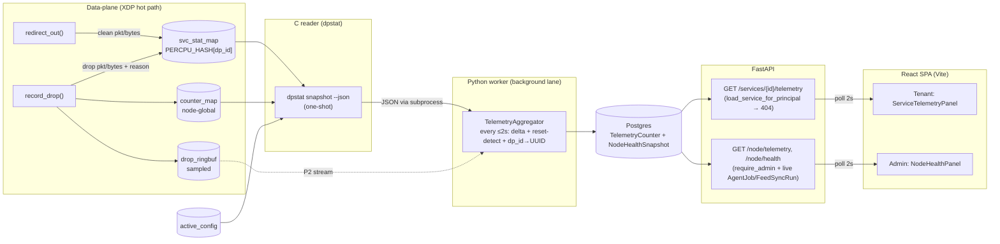

# Telemetry & Dashboards Design

**Spec**: `.specs/features/telemetry-dashboards/spec.md`
**Context**: `.specs/features/telemetry-dashboards/context.md` (D-TEL-1..4, A-TEL-1..8)
**Status**: Draft
**Decision record**: **AD-030**

---

## Research & Grounding (codebase-verified)

All load-bearing facts below were read from the current tree, not assumed:

- **Hot-path choke points** (`data-plane/src/xdp_gateway.bpf.c`): every clean packet exits through `redirect_out(meta)` (L134) and every drop through `record_drop(meta, reason)` (`drop_reason.h` L66). Both already receive `struct pkt_meta *` — the natural single insertion points for per-service accounting. `service_lookup_redirect` resolves `meta->service_id = service->service_id` (L167) after the LPM match.
- **`service_val.service_id` is `__u32`** (`service.h`), but **`ProtectedService.id` is a UUID** (`db/models.py` L378) with **no numeric surrogate** — the applier's `ServiceConfig.service_id` is a UUID (`applier.py` L24). This u32↔UUID gap is the central data-model problem; resolved by **D-030-4 (`dp_id`)** below.
- **`counter_map`** = `PERCPU_ARRAY[DROP_REASON_CAP=32]` of `__u64`, pinned at `/sys/fs/bpf/xdp_gateway/counter_map`; the per-service map mirrors this pattern. `active_config` = `{active_slot, version}` (`service.h`) — the "map version" health signal.
- **Per-service state maps precedent**: `rate_limit_state`, `svc_committed_state`, `vip_ceiling_state` are already per-service `PERCPU_HASH`/HASH keyed by `service_id`, prealloc, lazily populated on the hot path (STATE line 107: rate_limit_state prealloc ~32 MiB @ 64 CPU). `svc_stat_map` follows this exact, proven pattern.
- **Loader pin pattern** (`loader/loader.c`): `set_observability_pin_paths` / `pin_observability_maps` / `unpin_observability_maps` groups + `PIN_DIR "/sys/fs/bpf/xdp_gateway"`. Adding one map = one line per group.
- **dpstat reader idioms** (`tools/dpstat.c`): `open_pinned_map(path)`, `read_percpu_u64(fd,key,ncpus,&sum)`, `libbpf_num_possible_cpus()`, ring-buffer reader via `ring_buffer__new`+poll (in `tail`). Reused verbatim by the new JSON snapshot subcommand.
- **Worker runtime** (`worker/worker.py`): single asyncio loop with a `next_reconcile` monotonic-timer periodic task and a **background feed-fetch lane** (`FeedCoordinator`, spawned task, awaited/cancelled in `finally`). Telemetry aggregation reuses the **background-lane** shape.
- **Control-plane reuse**: `core/deps.py` gives `load_service_for_principal` (returns **404** on cross-tenant — exactly TEL-16), `require_admin`, `get_current_user`, `Principal`; `db/session.py::session_scope` UoW; `core/config.py::Settings` (`env_prefix=CONTROL_PLANE_`, has `node_clean_capacity_gbps=40`, `worker_*` knobs); `api/routers/auth.py` already exposes **`GET /auth/me` → role** (SPA role routing); routers registered in `main.py::create_app`; Alembic migrations `migrations/versions/YYYYMMDD_NNNN_*.py` (head = `20260710_0006`).
- **Testing gates** (`.specs/codebase/TESTING.md`): CP quick = `ruff+mypy+pytest -m unit`, full = `+pytest` on `compose.test.yml`; only **unit** tasks may be `[P]` (integration shares infra). DP quick = `make test` (dp-unit via `BPF_PROG_TEST_RUN`), full = `+ sudo make smoke` (dp-integration veth).

**Two facts flagged for web-verification at Execute** (not fabricated — reasoning noted): (1) libbpf `bpf_xdp_query(ifindex, XDP_FLAGS_*, &info)` reports attach mode (native/generic) — used for the XDP-mode health signal; (2) a fresh short-lived process re-opening a **pinned ringbuf** resumes from the shared kernel consumer position (relevant only to P2 top-talkers; **fallback** = long-lived streaming reader lane, which `dpstat tail` already proves). Neither blocks P1.

---

## Architecture Overview

Four layers, one direction of data flow. The XDP hot path writes exact per-CPU counters; a C reader snapshots them as JSON; a Python background task in the existing worker computes windowed deltas and persists them; the FastAPI read surface serves the latest window; the React SPA polls it every ≤2 s.



Rendered: `diagrams/telemetry-architecture.{mmd,svg}` (component/data-flow) and `diagrams/aggregation-tick.{mmd,svg}` (sequence).

---

## Code Reuse Analysis

### Existing Components to Leverage

| Component | Location | How to Use |
| --- | --- | --- |
| `redirect_out` / `record_drop` choke points | `data-plane/src/xdp_gateway.bpf.c`, `src/drop_reason.h` | Insert `svc_stat_clean` / `svc_stat_drop` calls (guarded by `service_id != 0`) |
| Per-service `PERCPU_HASH` pattern | `src/rules.h` (`rate_limit_state`), `src/fairness.h` | Copy prealloc-hash-keyed-by-service_id idiom for `svc_stat_map` |
| `counter_map` sizing/ABI | `src/drop_reason.h` (`DROP_REASON_CAP`) | Size `drop_by_reason[DROP_REASON_CAP]` so value size is ABI-stable |
| Loader pin group | `loader/loader.c` (`*_observability_*`) | Add `svc_stat_map` pin/unpin (one line each) |
| dpstat map readers | `tools/dpstat.c` (`open_pinned_map`, `read_percpu_u64`, `libbpf_num_possible_cpus`, ringbuf) | New `snapshot --json` subcommand reuses them; iterate hash via `bpf_map_get_next_key` |
| Worker background lane + periodic timer | `worker/worker.py` (`FeedCoordinator`, `next_reconcile`) | Model `TelemetryAggregator` as a spawned task awaited/cancelled in `finally` |
| `session_scope` UoW | `db/session.py` | Aggregator + API DB access |
| Auth/ownership guards | `core/deps.py` (`load_service_for_principal`, `require_admin`, `get_current_user`) | Telemetry router deps — **404 cross-tenant is already the behavior** |
| `/auth/me` | `api/routers/auth.py` | SPA fetches role for role-aware routing |
| Settings + capacity | `core/config.py` (`node_clean_capacity_gbps`, `worker_*`) | Add `worker_telemetry_*`; use capacity for throughput-vs-capacity |
| Alembic migration pattern | `migrations/versions/20260710_0006_*` | New `20260710_0007_telemetry.py` (down_revision `20260710_0006`) |
| Health source tables | `db/models.py` (`AgentJob`, `FeedSyncRun`, `ThreatFeedSource`) | API reads live backlog/feed status (not persisted in snapshots) |

### Integration Points

| System | Integration Method |
| --- | --- |
| M4 #2 double-buffer applier | **Must write `ProtectedService.dp_id` into `service_val.service_id`** (shared contract this feature introduces) — see Cross-Feature Dependencies |
| Loader env-seed (D-SLRD-1 interim) | Seeds `service_val.service_id = dp_id` so telemetry attributes counters before M4 #2 lands |
| M1 `create_service` | Additive: assign `dp_id` at creation (small change to executed code) |
| M4 worker runtime | `Worker.run` spawns the aggregator lane; `__main__` wires the reader + settings |
| M6 alerting (future) | Consumes `TelemetryCounter`/threshold breaches; not built here |

---

## Components

### 1. `svc_stat.h` — per-service counter map + helpers (DP)

- **Purpose**: exact per-CPU per-service clean/drop packet & byte counters + per-reason drop breakdown.
- **Location**: new `data-plane/src/svc_stat.h`, included by `xdp_gateway.bpf.c` and `drop_reason.h`.
- **Interfaces** (`__always_inline`, `__BPF__` only):
  - `struct svc_stat { __u64 clean_pkts, clean_bytes, drop_pkts, drop_bytes; __u64 drop_by_reason[DROP_REASON_CAP]; }` (36 × u64 = 288 B/CPU).
  - map `svc_stat_map`: `BPF_MAP_TYPE_PERCPU_HASH`, `max_entries = 1024`, key `__u32 dp_id`, value `struct svc_stat`, **prealloc** (no `NO_PREALLOC`). ≈ 288 B × 1024 × nCPU ≈ 19 MB @ 64 CPU (documented, comparable to `rate_limit_state`).
  - `svc_stat_clean(const struct pkt_meta *meta)` — if `meta->service_id != 0`: lookup-or-init entry, `clean_pkts++`, `clean_bytes += meta->frame_len`.
  - `svc_stat_drop(const struct pkt_meta *meta, __u32 reason)` — if `meta->service_id != 0`: `drop_pkts++`, `drop_bytes += meta->frame_len`, `drop_by_reason[reason]++`.
- **Dependencies**: `pkt_meta.h` (`service_id`, new `frame_len`), `drop_reason.h` (`DROP_REASON_CAP`).
- **Reuses**: the `rate_limit_state` prealloc-hash idiom; `__sync_fetch_and_add` per-CPU increment style from `record_drop`.
- **Note on init**: hash `lookup`→`if null: bpf_map_update_elem(BPF_NOEXIST, &zero)`→re-lookup. `dp_id == 0` is the reserved "no service" sentinel (ARP, `service_miss`) → never counted per-service (TEL-03).

### 2. `pkt_meta.frame_len` + hot-path wiring

- **Purpose**: carry L2 frame length to the counting choke points (billing-grade byte counts).
- **Location**: `data-plane/src/pkt_meta.h`, `xdp_gateway.bpf.c`, `drop_reason.h`.
- **Change**: repurpose 2 of `_pad2[7]` → `__u16 frame_len` (struct stays **40 B**, `_Static_assert` holds; `_pad2[5]` remains). Set `meta.frame_len = (__u16)(data_end - data)` at the top of `xdp_gateway` (before test hooks). Call `svc_stat_clean(meta)` inside `redirect_out` (before `bpf_redirect_map`); call `svc_stat_drop(meta, key)` inside `record_drop` (after the `counter_map` bump). Move `meta->service_id = service->service_id` **above** the `enabled` check in `service_lookup_redirect` so `service_disabled` drops attribute to the service.
- **Reuses**: existing meta plumbing; the fairness feature's precedent for a deliberate `pkt_meta` field addition.
- **Test impact**: dp-unit expectations for `service_disabled` gain a per-service counter assertion; `pkt_meta` golden output gains `frame_len`.

### 3. Loader pin (additive)

- **Purpose**: expose `svc_stat_map` to the userspace reader.
- **Location**: `data-plane/loader/loader.c`.
- **Change**: `SVC_STAT_PIN_PATH PIN_DIR "/svc_stat_map"`; add to `set_observability_pin_paths` / `pin_observability_maps` / `unpin_observability_maps`. Loader env-seed sets `service_val.service_id = dp_id` for seeded services (so pre-M4#2 demos attribute correctly).
- **Reuses**: the observability pin group verbatim.

### 4. dpstat `snapshot --json` — C reader (one-shot)

- **Purpose**: emit a single machine-readable snapshot of all telemetry maps for the worker.
- **Location**: `data-plane/tools/dpstat.c` (new subcommand), optional shared reader header.
- **Interfaces**: `dpstat snapshot --json [--ifindex N]` → stdout JSON:
  ```json
  { "ts_ns": 0, "active": {"slot": 0, "version": 7},
    "xdp": {"mode": "native", "prog_id": 42, "ifindex": 3},
    "node": {"counters": {"<reason_name>": <u64>, ...},
             "sample_stats": {...}, "bloom_stats": {...}},
    "services": [ {"dp_id": 1, "clean_pkts": N, "clean_bytes": N,
                   "drop_pkts": N, "drop_bytes": N,
                   "drop_by_reason": {"<reason_name>": N, ...}} ] }
  ```
  - Iterates `svc_stat_map` with `bpf_map_get_next_key` + `read_percpu_*` (sum across CPUs); maps reason index→name via `drop_reason_name[]`.
  - XDP mode via `bpf_xdp_query(ifindex,...)` when `--ifindex` given, else `"unknown"`; no pins → exit with a friendly "gateway not loaded" (mode `offline`).
- **Dependencies**: libbpf, pinned maps, frozen `drop_reason.h`.
- **Reuses**: `open_pinned_map`, `read_percpu_u64`, `libbpf_num_possible_cpus`. Top-talkers (P2) reuse `dpstat tail` (add `--json` line mode) as a **streaming** reader lane.

### 5. `TelemetryReader` — Python subprocess wrapper

- **Purpose**: run the C reader and parse its JSON into typed snapshots.
- **Location**: new `control-plane/app/worker/telemetry_reader.py`.
- **Interfaces**:
  - `async def snapshot(self) -> TelemetrySnapshot | None` — `asyncio.create_subprocess_exec(self.binary, "snapshot", "--json", "--ifindex", str(ifindex), timeout=...)`, parse stdout; on nonzero/"not loaded" return `None` (mode offline). Dataclasses `TelemetrySnapshot`, `ServiceCounters`, `NodeCounters`.
  - `FakeTelemetryReader` (tests) returns canned snapshots — lets the whole CP pipeline run under `make`/pytest without a live kernel.
- **Dependencies**: `Settings.worker_telemetry_binary_path`, `worker_telemetry_ifindex`, `worker_telemetry_timeout_seconds`.
- **Reuses**: the `asyncio.create_subprocess_exec` + timeout pattern from the M4 #2 apply helper (`DoubleBufferApplier`) and the `Fetch`/DI seam from `FeedCoordinator`.

### 6. `TelemetryAggregator` — windowed delta + persist + prune

- **Purpose**: turn cumulative snapshots into windowed `TelemetryCounter` + `NodeHealthSnapshot` rows.
- **Location**: new `control-plane/app/worker/telemetry.py`.
- **Interfaces**:
  - `async def aggregate_once(self) -> None` — read snapshot; if `None` (gateway offline) persist an `offline` health row and return; else compute per-key **deltas** vs the in-memory previous snapshot (reset detection: if `current < previous` or `active.version` changed → treat `current` as the delta, i.e. previous←0); map `dp_id → (service UUID, tenant)` via a cached `dp_id` lookup; persist rows; prune windows older than retention. First tick after (re)start **seeds the baseline** and marks that window `baseline` (no deltas emitted).
  - `async def run_loop(self, stop: asyncio.Event) -> None` — `while not stop`: `await aggregate_once()`, sleep `interval` (interruptible by `stop`), log-and-continue on error (bounded, never crashes the worker — TEL-14).
- **Data flow**: pps/bps = delta ÷ `window_seconds`. Node row = node `scope` (service_id NULL). Health = xdp mode/slot/version/map_error + node clean_bps vs `node_clean_capacity_gbps`.
- **Dependencies**: `TelemetryReader`, `session_factory`, `Settings.worker_telemetry_*`.
- **Reuses**: `session_scope`; `reconcile_once`'s "own session per pass" shape; delta/reset math is new but self-contained (unit-testable with `FakeTelemetryReader`).
- **dp_id→UUID cache**: `select(ProtectedService.dp_id, id, tenant_id)`; refreshed each tick (≤1000 rows, cheap) or on cache miss. Unknown `dp_id` (service deleted / not yet mapped) → counters dropped from per-service rows (still in node totals). Stale `svc_stat_map` keys are evicted by the reader/loader on reload; the aggregator simply ignores unknown dp_ids (TEL-06 graceful).

### 7. Worker integration

- **Purpose**: run the aggregator lane inside the existing worker process.
- **Location**: `control-plane/app/worker/worker.py`, `worker/__main__.py`, `core/config.py`.
- **Change**: `Worker.__init__` gains an optional `telemetry: TelemetryAggregator | None`; `run()` spawns `telemetry_task = asyncio.create_task(self.telemetry.run_loop(stop_event))` before the main loop and awaits/cancels it in `finally` (mirrors the feed lane). `__main__._run_worker` builds `TelemetryReader` + `TelemetryAggregator` from settings and injects them. **Not** a Redis `JobType** (see D-030-6).
- **New settings** (`Settings`): `worker_telemetry_enabled: bool = True`, `worker_telemetry_interval_seconds: float = 2.0 (gt=0)`, `worker_telemetry_retention_seconds: int = 7*24*3600`, `worker_telemetry_binary_path: str = "…/dpstat"`, `worker_telemetry_ifindex: int | None = None`, `worker_telemetry_timeout_seconds: float = 5.0`.
- **Reuses**: the background-lane spawn/await/cancel lifecycle; `worker_*` settings convention.

### 8. Data models + migration

- **Purpose**: persist windowed counters and node health.
- **Location**: `control-plane/app/db/models.py`, `migrations/versions/20260710_0007_telemetry.py`.
- **Reuses**: `TimestampMixin`, `JSONB`, enum-as-`native_enum=False` pattern, FK `ondelete` idioms.

### 9. `ProtectedService.dp_id` — u32 surrogate (cross-cutting)

- **Purpose**: the stable u32 key shared by DP maps and telemetry (resolves the u32↔UUID gap).
- **Location**: `db/models.py` (`ProtectedService`), `services/services.py::create_service`, migration.
- **Design**: `dp_id: Mapped[int] = mapped_column(Integer, unique=True, nullable=False)`, assigned from a dedicated Postgres sequence `service_dp_id_seq` at create time (monotonic, **never reused** — avoids cross-delete counter attribution). Values 1..N (N ≤ 1000) fit u32; `0` reserved. Migration creates the sequence, adds the column, backfills existing services (`nextval` per row).
- **Contract**: the M4 build path (loader seed now; M4 #2 applier later) **writes `dp_id` into `service_val.service_id`** and all per-service map keys. Documented in Cross-Feature Dependencies.

### 10. Telemetry API router + schemas

- **Purpose**: the read surface the SPA polls.
- **Location**: new `app/api/routers/telemetry.py` + `app/api/schemas/telemetry.py`; registered in `main.py::create_app`.
- **Interfaces**:
  - `GET /services/{service_id}/telemetry` — dep `load_service_for_principal(db, id, principal)` (**404 cross-tenant/absent**, TEL-16); returns latest service-scope `TelemetryCounter` → `ServiceTelemetryResponse` (clean/drop pkts+bytes, `drop_by_reason`, pps/bps, `window_start`, `window_seconds`, `stale: bool`); no row → 200 zeroed `{ "has_data": false }` (TEL-19).
  - `GET /node/telemetry` — `require_admin`; latest node `TelemetryCounter` + `NodeHealthSnapshot` + **live** `AgentJob` backlog (count by status) + `FeedSyncRun`/`ThreatFeedSource` last status → `NodeTelemetryResponse`.
  - `GET /node/health` — `require_admin`; lean health (xdp mode, active slot/version, map_error, backlog, feed status, throughput-vs-capacity, `stale`).
- **Dependencies**: `get_current_user`, `get_db`, deps guards.
- **Reuses**: the router/schema/`Annotated[..., Depends]` conventions from `routers/services.py`; `staleness` computed from `window_start` age vs `2 × interval`.

### 11. Frontend SPA

- **Purpose**: the tenant/admin dashboards (first frontend in the repo, D-TEL-2).
- **Location**: new `control-plane/frontend/` (Vite + React + TypeScript).
- **Stack** (latest stable, pinned at scaffold): Vite, React, TypeScript, **React Router** (routing), **TanStack Query** (polling via `refetchInterval: 2000` — clean ≤2 s, TEL-25), **Recharts** (drop-reason/clean-vs-drop charts). Session auth via the existing **httpOnly cookie**: `fetch(..., { credentials: "include" })`; a 401 interceptor → redirect to login (TEL-30). Dev: Vite proxy `/services,/node,/auth → FastAPI`. Prod: `vite build` → static assets served by FastAPI `StaticFiles` or a static host.
- **Component tree**:
  - `main.tsx` → `QueryClientProvider` + `BrowserRouter`.
  - `auth/AuthContext` (`useAuth`: login via `POST /auth/login`, role via `GET /auth/me`, logout), `ProtectedRoute` (role-aware).
  - `LoginPage`; `AppLayout` (nav, staleness/XDP-mode banner).
  - Tenant: `TenantDashboard` → `ServiceList` (own services) + `ServiceTelemetryPanel` (`useServiceTelemetry(id)` query) → `CleanVsDropChart`, `DropReasonChart`, `RateTiles(pps/bps)`, `StalenessBadge`.
  - Admin: `AdminDashboard` → `NodeHealthPanel` (XDP mode flagged critical if generic/off — TEL-27; map version, map_error, backlog, feed status, throughput gauge) + `NodeTelemetryPanel`.
  - `api/client.ts` (typed fetch wrapper), `hooks/usePolling` (thin wrapper over TanStack `refetchInterval`).
- **Reuses**: `/auth/login`, `/auth/me`, the telemetry endpoints. No existing FE to reuse — this establishes the shell (D-TEL-2) later CRUD screens inherit.
- **States**: loading/empty/error per panel (TEL-28); tenant never sees others' services (API-enforced + own-services list).

---

## Data Models

### `TelemetryCounter` (windowed, per-service **and** node)

```python
class TelemetryScope(StrEnum):
    service = "service"
    node = "node"

class TelemetryCounter(Base):
    __tablename__ = "telemetry_counter"
    id: uuid (pk)
    scope: TelemetryScope                       # 'service' | 'node'
    service_id: uuid | None  -> protected_service.id  (ondelete=SET NULL; NULL for node)
    dp_id: int | None                            # raw DP key snapshot (audit/debug)
    window_start: datetime(tz)                   # aligned tick start
    window_seconds: int
    clean_pkts / clean_bytes / drop_pkts / drop_bytes: BigInteger   # deltas in the window
    drop_by_reason: JSONB                         # {reason_name: count} (delta)
    pps: BigInteger; bps: BigInteger              # derived = delta / window_seconds
    top_dst_ports: JSONB | None                   # P2 [{port,count}]
    top_src: JSONB | None                         # P2 [{ip,count}] (PII, CM-08)
    is_baseline: bool = False                     # first tick after (re)start
    created_at: datetime(tz)
    # Index(scope, service_id, window_start desc), Index(scope, window_start desc)
```

### `NodeHealthSnapshot` (windowed node health from the DP snapshot)

```python
class XdpMode(StrEnum):
    native = "native"; generic = "generic"; offline = "offline"; unknown = "unknown"

class NodeHealthSnapshot(Base):
    __tablename__ = "node_health_snapshot"
    id: uuid (pk)
    captured_at: datetime(tz)
    window_seconds: int
    xdp_mode: XdpMode
    active_slot: int | None
    map_version: BigInteger | None                # active_config.version
    map_error_count: BigInteger                    # counter_map[DR_MAP_ERROR]
    node_clean_bps: BigInteger                     # delta-derived
    node_capacity_bps: BigInteger                  # from node_clean_capacity_gbps
    bloom_stats: JSONB | None                      # P2 hit/FP surfacing
    # Index(captured_at desc)
```

**Relationships**: `TelemetryCounter.service_id` → `ProtectedService` (SET NULL on delete so historical windows survive service deletion). Node-scoped rows + `NodeHealthSnapshot` have no service FK. Apply backlog + feed status are **not** stored — the API reads them live from `AgentJob` / `FeedSyncRun` / `ThreatFeedSource`.

### `ProtectedService.dp_id`

```python
dp_id: Mapped[int] = mapped_column(Integer, nullable=False, unique=True)  # from service_dp_id_seq, >=1
```

---

## Error Handling Strategy

| Scenario | Handling | User impact |
| --- | --- | --- |
| Gateway not loaded / reader nonzero | Reader returns `None`; aggregator writes `xdp_mode=offline` health, no service rows | Admin sees "XDP offline"; tenant sees "no data yet" |
| Counter reset / reload (delta < 0 or version changed) | Reset detection: treat current as delta, reseed baseline | No negative/absurd spikes (TEL-09) |
| First tick after (re)start | Seed baseline, mark window `is_baseline`, emit no deltas | One skipped window; then normal |
| Postgres unavailable in a tick | Log + skip tick, retain in-memory baseline, resume next tick | Brief staleness; SPA staleness badge |
| Reader subprocess timeout/hang | `asyncio` timeout → treat as failed tick | Staleness; recovers next tick |
| Unknown `dp_id` (deleted/unmapped service) | Ignore for per-service rows; still in node totals | Graceful (TEL-06) |
| `svc_stat_map` full (>1024) | Hash insert fails on hot path → not counted (fail-open, no drop) | Rare (>envelope); bounded memory |
| Tenant requests another tenant's service | `load_service_for_principal` → **404** | No cross-tenant leak (TEL-16) |
| No telemetry row yet | 200 `{has_data:false}` zeroed | Empty state, not an error (TEL-19) |
| Session expired (SPA) | 401 interceptor → redirect login | Re-login (TEL-30) |
| Worker aggregator task raises | `run_loop` catches, logs, continues | Worker + job processing unaffected (TEL-14) |

---

## Tech Decisions (AD-030)

| Decision | Choice | Rationale |
| --- | --- | --- |
| **D-030-1** per-service map type | `PERCPU_HASH[dp_id]`, prealloc, `max_entries=1024`, value `svc_stat` (288 B) | Exact lock-free per-CPU (billing-grade, D-TEL-1); mirrors proven `rate_limit_state` prealloc-hash |
| **D-030-2** byte source | `pkt_meta.frame_len` (repurpose pad, size stays 40 B) set at ingress | Choke points lack `ctx`; avoids churning every `record_drop` call site |
| **D-030-3** drop-reason array width | `drop_by_reason[DROP_REASON_CAP=32]` | ABI-stable value size across append-only reason growth (matches `counter_map`) |
| **D-030-4** u32↔UUID mapping | new `ProtectedService.dp_id` (sequence, monotonic, ≥1) written into `service_val.service_id` | The gap has no existing solution; a stable surrogate is the clean shared key |
| **D-030-5** userspace reader | extend **dpstat** with `snapshot --json` (+ `tail --json` for P2) | Max reuse of dpstat map readers; no new binary; human `dpstat` unaffected |
| **D-030-6** aggregation mechanism | **background asyncio task** in the worker, **not** a Redis `JobType`/AgentJob | Periodic maintenance like `reconcile_once`; no version/idempotency/durability semantics; avoids ledger writes at 2 s cadence. **Supersedes A-TEL-2's "new JobType"** (TDD's `TELEMETRY_AGGREGATE` intent honored as a worker task) |
| **D-030-7** node health composition | DP-derived fields persisted (`NodeHealthSnapshot`); backlog/feed read **live** from existing tables | Keeps DB-authoritative data live; only DP-map-derived data is snapshotted |
| **D-030-8** realtime transport | REST polling via TanStack Query `refetchInterval=2000` (D-TEL-3) | Simplest that meets ≤2 s; no streaming/fan-out state |
| **D-030-9** FE stack | Vite + React + TS + React Router + TanStack Query + Recharts, cookie auth | Current stable, minimal; TanStack gives polling/staleness for free |
| **D-030-10** top-talkers reader (P2) | `dpstat tail --json` **streaming** lane (fallback if one-shot ringbuf drain unsafe) | Isolates the ringbuf-consumer-pos uncertainty to P2; `dpstat tail` already proves streaming |

---

## Cross-Feature Dependencies & Execute Gates

- **`dp_id` contract → M4 #2 (double-buffer, not yet executed)**: the applier must write `service_val.service_id = dp_id` (and key per-service maps by `dp_id`). This feature introduces `dp_id`; the loader env-seed adopts it immediately, and M4 #2 must adopt it when executed. **P1 core (DP counters + aggregation + API + SPA) is buildable and testable now** against loader-seeded services / `FakeTelemetryReader`; true multi-service end-to-end lights up when M4 #2 lands. This mirrors feed-sync's DP-propagation gate.
- **P2 admin panels** (feed status, fairness "committed honored") depend on threat-feed-sync + fairness executed (A-TEL-7); **P1 does not**.
- **No dependency reversal**: nothing in M1–M4 must change except the additive `dp_id` column + `create_service` assignment and the additive `svc_stat_map` pin.

---

## Open Flags for Tasks

1. **`dp_id` sequence vs identity** — dedicated `service_dp_id_seq` (monotonic, no-reuse) is proposed; confirm vs a plain autoincrement.
2. **`create_service` reach** — assigning `dp_id` touches executed M1 code; confirm this small additive change is acceptable here (vs a separate migration-only backfill + trigger).
3. **Reader home** — extend `dpstat` (chosen, D-030-5) vs a new `xdpgw-telemetry` binary.
4. **XDP-mode source** — `bpf_xdp_query(ifindex)` needs the IN ifindex in `Settings`; confirm the setting name / whether the loader should instead pin a small "mode" value.
5. **Frontend build/serve** — FastAPI `StaticFiles` (single deployable) vs separate static host; and exact chart lib (Recharts proposed).
6. **`svc_stat` value width** — `drop_by_reason[32]` (~19 MB) vs `[16]` (~10.5 MB); confirm the ABI-stability-vs-memory trade.
7. **Aggregation-as-task (D-030-6)** — confirm dropping the `TELEMETRY_AGGREGATE` `JobType` in favor of a background task.
8. **P2 top-talker lane** — one-shot ringbuf drain (needs the consumer-pos verification) vs the streaming fallback.

---

## Requirement Coverage Map

| Requirement | Component(s) |
| --- | --- |
| TEL-01..06 (per-service counters) | §1 `svc_stat.h`, §2 wiring, §3 loader pin, §9 `dp_id` |
| TEL-07..15 (aggregation) | §4 dpstat snapshot, §5 reader, §6 aggregator, §7 worker, §8 models |
| TEL-16..21 (API) | §10 telemetry router + schemas, §8 models, §7 (`node_clean_capacity`) |
| TEL-22..30 (SPA) | §11 frontend, `/auth/me` reuse |
| TEL-31..35 (richer admin, P2) | §6/§8 (bloom, backlog, feed, fairness), §11 panels |
| TEL-36..38 (top-talkers, P2) | §4 `dpstat tail --json`, §6 rolling top-N, §8 JSONB fields |
| TEL-39..40 (trend/export, P3) | §8 retained windows, §10 export endpoint |

All 40 requirements mapped. **Next: Tasks** (resolve the 8 flags; expect a DP track + a CP/worker track + a frontend track with explicit `[P]`/serial marking per TESTING.md).
