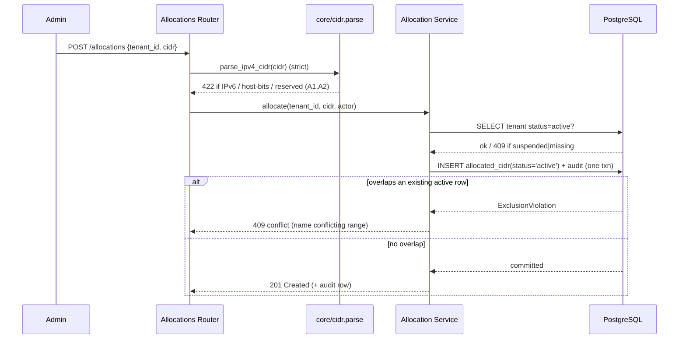

# Tenant & CIDR Allocation Design

**Spec**: `.specs/features/tenant-cidr/spec.md` (TCA-01..32)
**Context**: `.specs/features/tenant-cidr/context.md` (D-TCA-1..3)
**Status**: Draft (awaiting approval → Tasks)
**Depends on**: Auth & RBAC (`.specs/features/auth-rbac/design.md`) — extends its `Tenant`/`AuditEvent` models and reuses `require_admin`, the ownership guard, and `audit.record_event` unchanged.

---

## Architecture Overview

Same layered FastAPI control-plane as auth-rbac (**routers → services → stores**). This feature adds two service modules, two routers, one new table (`allocated_cidr`), a pure CIDR-validation helper, and — its reusable contribution — a **DB-backed CIDR-scope primitive** that later features import to enforce `AUTH-14`.

The non-overlap guarantee is pushed **down to the database**: a partial GiST **exclusion constraint** makes overlapping active allocations physically impossible, so correctness does not depend on application-level check-then-insert races (satisfies TCA-11 / TCA-27 by construction).

**Component view** — source: `diagrams/component-architecture.mmd` (render via mermaid-studio → `.svg`)

```mermaid
flowchart TD
    dashboard[React Dashboard]
    subgraph api [FastAPI Control-Plane]
        tenantsRouter[Tenants Router /tenants]
        allocRouter[Allocations Router /allocations]
        adminGuard{{require_admin}}
        ownerGuard{{authorize_tenant_resource}}
    end
    subgraph svc [Service Layer]
        tenantSvc[Tenant Service]
        allocSvc[Allocation Service<br/>+ cidr_in_tenant_allocation]
        auditSvc[(reused) Audit Service]
    end
    subgraph core [Core helpers]
        cidrHelper[core/cidr.py<br/>parse / validate / reject-reserved]
    end
    postgres[(PostgreSQL<br/>tenant · allocated_cidr · user · audit_event)]
    dashboard -->|admin: HTTPS + cookie| tenantsRouter
    dashboard -->|admin + tenant self-view| allocRouter
    tenantsRouter -.->|Depends| adminGuard
    allocRouter -.->|admin ops| adminGuard
    allocRouter -.->|self-view| ownerGuard
    tenantsRouter --> tenantSvc
    allocRouter --> allocSvc
    allocSvc --> cidrHelper
    tenantsRouter -. validate .-> cidrHelper
    tenantSvc --> auditSvc
    allocSvc --> auditSvc
    tenantSvc --> postgres
    allocSvc -->|EXCLUDE gist · >>= containment| postgres
    auditSvc --> postgres
    laterFeatures[Service / Whitelist / Blacklist features] -.->|import| allocSvc
```

**Allocation flow (with DB-enforced overlap arbitration)** — source: `diagrams/allocate-sequence.mmd`



---

## Research Notes (Knowledge Verification Chain)

- **Step 1 (Codebase):** control-plane not yet executed (auth-rbac is "awaiting approval → Execute"). Nothing to reuse in code; the **conventions/skeleton** from auth-rbac's design are authoritative and honored below.
- **Step 2 (Project docs):** PROJECT.md ("PostgreSQL native inet/cidr types for CIDR allocation & overlap checks"), PRD 6.1/7.1/7.2/11.2/12.1, spec.md, context.md. All honored.
- **Step 3 (Context7 MCP):** not available (per auth-rbac design) — skipped.
- **Step 4 (Web — official docs, verified 2026-07-07):**
  - **`inet_ops` is a core built-in GiST operator class** for `inet`/`cidr` supporting `&&`, `>>`, `>>=`, `<<`, `<<=`. **No extension** (`btree_gist` not required) for a single-column `cidr WITH &&` constraint. It is *not* the default opclass for historical reasons, so it **must be named explicitly** (default only from PG 19). Source: PostgreSQL docs, GiST Built-in Operator Classes.
  - **SQLAlchemy** `ExcludeConstraint` supports a named opclass via `ops={...}` (since 1.3.21) and a partial `where=`. The `inet`/`cidr` column *requires* `ops={'cidr':'inet_ops'}` ("data type inet has no default operator class for access method gist").
- **Step 5 (Flagged uncertain):** none — the constraint mechanism and SQLAlchemy surface are confirmed against primary docs. The only open *choices* (not uncertainties) are A1/A2 policy and tenant-name case-sensitivity, listed under Open Questions.

---

## Code Reuse Analysis

### Existing Components to Leverage (from Auth & RBAC)

| Component | Location | How to Use |
| --- | --- | --- |
| `require_admin`, `get_current_user` | `app/core/deps.py` | Gate all `/tenants` + admin `/allocations` endpoints (TCA-06) |
| `authorize_tenant_resource`, `scope_to_tenant` | `app/core/deps.py` | Tenant self-view isolation (TCA-23/24) |
| `audit.record_event(db, ...)` | `app/services/audit.py` | Every tenant/CIDR mutation, same txn (TCA-25/26) |
| `Tenant`, `User`, `AuditEvent` models + `Base` | `app/db/models.py` | Extend `Tenant`; FK `allocated_cidr → tenant/user` |
| Settings, DB session/lifespan, Alembic harness | `app/core/`, `app/db/`, `migrations/` | New revision only |

### This feature establishes (for reuse by later features)

| Primitive | Location | Reused by |
| --- | --- | --- |
| `cidr_in_tenant_allocation(db, tenant_id, target) -> bool` | `app/services/allocations.py` | Service (`cidr_or_ip ⊆ AllocatedCIDR`), Whitelist, Blacklist — satisfies AUTH-14 / PRD 7.2 |
| `require_within_allocation(...)` (thin guard) | `app/core/deps.py` | routers of the above features |
| `AllocatedCIDR` model + `allocated_cidr_active_no_overlap` constraint | `app/db/models.py` | anything scoping to allocated space |
| `core/cidr.py` (parse/validate/reject-reserved) | `app/core/cidr.py` | any router accepting a CIDR/IP field |

### Integration Points

| System | Integration Method |
| --- | --- |
| PostgreSQL | New `allocated_cidr` table; **partial GiST exclusion** constraint; FKs to `tenant`/`user`; containment via `>>=` |
| Alembic | One new revision `down_revision = <auth-rbac head>`; adds table + constraint + `tenant.name` unique |
| Auth & RBAC guards | Imported unchanged; suspend relies on auth-rbac's fresh-user + `Tenant.status` check (AUTH-34) for TCA-04 |
| React dashboard | Admin tenant/CIDR CRUD + overlap-check dry-run; tenant read-only allocations view (M5 wires UI) |

---

## Components

### CIDR helpers — `app/core/cidr.py` (pure, unit-tested)
- **Purpose**: validate/normalize a user-supplied CIDR before it reaches the DB; single source of CIDR truth.
- **Interfaces**:
  - `parse_ipv4_cidr(value: str) -> IPv4Network` — `ipaddress.ip_network(value, strict=True)`; raises `CidrValidationError` on IPv6, host-bits-set (names canonical form — A1/TCA-13), or malformed (TCA-12).
  - `reject_reserved(net: IPv4Network) -> None` — rejects `0.0.0.0/0` and unspecified/reserved (A2/TCA-28).
  - `is_subnet(target: IPv4Network, container: IPv4Network) -> bool` — pure containment helper (mirrors SQL `>>=`).
- **Dependencies**: stdlib `ipaddress`. **Reuses**: nothing. **Establishes** the CIDR-field validator.

### Tenant service — `app/services/tenants.py`
- **Purpose**: tenant lifecycle business logic.
- **Interfaces**: `create_tenant`, `list_tenants` (with allocation/user counts — TCA-05), `get_tenant`, `update_tenant` (name/status — TCA-03), `set_status` (suspend/reactivate — TCA-04/31), `delete_tenant`.
- **Rules**: `delete_tenant` **pre-checks** for any user or non-revoked CIDR → raises 409 with the blocker list (TCA-07); hard-delete only when empty (TCA-08); FK `RESTRICT` is the race-proof backstop. Every method calls `audit.record_event`; delete/suspend are dangerous actions (TCA-09/26). Case-insensitive name uniqueness (TCA-02).
- **Dependencies**: models, audit. **Reuses**: audit writer, `Tenant` model.

### Allocation service — `app/services/allocations.py`
- **Purpose**: allocate/revoke ranges, usage/overlap views, and the reusable scope primitive.
- **Interfaces**:
  - `allocate(db, tenant_id, cidr, actor) -> AllocatedCIDR` — asserts tenant active (TCA-14); `INSERT status='active'`; **ExclusionViolation → 409** naming the conflicting range (TCA-10/11/27); audits.
  - `revoke(db, alloc_id, actor)` — dependency-count hook (0 today; cross-table when Service/List ship) → **409 if in use** (TCA-16); else `status='revoked'` + audit (TCA-15); freed space re-allocatable (TCA-17).
  - `list_for_tenant(db, tenant_id, principal) -> list[Alloc+usage]` — admin any tenant / tenant_user own only (TCA-18/23/24).
  - `overlap_check(db, candidate) -> {overlaps: bool, conflicts: [...]}` — read-only dry-run via `&&` (TCA-19).
  - **`cidr_in_tenant_allocation(db, tenant_id, target) -> bool`** — `EXISTS(... status='active' AND tenant_id=:t AND cidr >>= :target)`; fail-closed false on unknown tenant / partial / revoked (TCA-20/21/22). **The AUTH-14 primitive.**
- **Dependencies**: models, audit, `core/cidr`. **Reuses**: audit writer.

### Deps extension — `app/core/deps.py` (+ small addition)
- **Interface**: `require_within_allocation(tenant_id, target)` — awaits `cidr_in_tenant_allocation`, raises 403 on false. Thin FastAPI-friendly wrapper so later routers stay declarative (mirrors `authorize_tenant_resource`).
- **Reuses**: allocation service; existing guard pattern.

### API routers — `app/api/routers/{tenants,allocations}.py`
- **Purpose**: thin HTTP surface — Pydantic validation (CIDR field → `core/cidr`) + guard wiring + service calls. Request/response schemas in `app/api/schemas/{tenants,allocations}.py`.
- **Endpoints**:
  - `POST/GET/PATCH/DELETE /tenants`, `POST /tenants/{id}/suspend`, `/reactivate` — **admin** (`require_admin`).
  - `POST /allocations`, `GET /allocations?tenant_id=`, `POST /allocations/{id}/revoke`, `POST /allocations/overlap-check` — **admin**.
  - `GET /me/allocations` — **tenant_user** self-view (`get_current_user` + `scope_to_tenant`).
- **Dependencies**: services, deps.

---

## Data Models

### AllocatedCIDR — `app/db/models.py` (new)
```python
class CIDRStatus(str, Enum):
    active = "active"
    revoked = "revoked"

class AllocatedCIDR(Base):
    id: UUID                       # PK, uuid4
    tenant_id: UUID                # FK tenant.id  ON DELETE RESTRICT  (block-delete guard)
    cidr: CIDR                     # postgresql CIDR type — IPv4, canonical (host bits rejected at DB too)
    status: CIDRStatus             # active | revoked  (soft-revoke)
    allocated_by: UUID | None      # FK user.id  ON DELETE SET NULL   (admin who allocated)
    created_at: datetime
    updated_at: datetime           # set on revoke

    __table_args__ = (
        # D-TCA-1 GLOBAL non-overlap across ACTIVE rows; core inet_ops, no extension.
        ExcludeConstraint(
            ("cidr", "&&"),
            using="gist",
            where=text("status = 'active'"),
            ops={"cidr": "inet_ops"},
            name="allocated_cidr_active_no_overlap",
        ),
        Index("ix_allocated_cidr_tenant_active", "tenant_id",
              postgresql_where=text("status = 'active'")),
    )
```
**Relationships**: `tenant_id → Tenant.id` (RESTRICT); `allocated_by → User.id` (SET NULL). Overlap containment queries use `>>=` / `&&` against this table.

### Tenant — `app/db/models.py` (extended from auth-rbac stub)
- Adds **case-insensitive unique** on `name` (citext or `UNIQUE(lower(name))`, matching auth-rbac's username convention — TCA-02). Fields (`id,name,status,created_at,updated_at`) and `TenantStatus{active,suspended}` already exist. `back_populates` to `allocations`, `users`.
- **No new status values**; `suspended` is the reversible off-switch driving TCA-04/31 (login block inherited from AUTH-34).

### Cross-feature FK note (coordination with auth-rbac)
`User.tenant_id → Tenant.id` must be **`ON DELETE RESTRICT`** so a tenant with users cannot be hard-deleted (TCA-07's hard backstop). auth-rbac's design left the on-delete unspecified → **this feature pins it to RESTRICT** in its migration if auth-rbac hasn't. (Flagged below.)

---

## Non-overlap: the exclusion constraint (crux)

Emitted DDL (Alembic), verified against PostgreSQL docs:
```sql
ALTER TABLE allocated_cidr
  ADD CONSTRAINT allocated_cidr_active_no_overlap
  EXCLUDE USING gist (cidr inet_ops WITH &&)
  WHERE (status = 'active');
```
- **Global** (no tenant column in the constraint) → forbids overlap across *all* active rows, same-or-different tenant (D-TCA-1). Superset of PRD 7.2.
- **Partial** (`WHERE status='active'`) → revoked rows are ignored, so revoke frees the space and re-allocation of an equal/overlapping range succeeds (TCA-17). This is why revoke is soft, not a delete.
- **Race-proof** (TCA-27): concurrent overlapping inserts are arbitrated by the constraint's predicate locks — one commits, the other raises `ExclusionViolation` → mapped to 409. No app-level locking needed.
- **`btree_gist` NOT required** — single-column `&&` uses the core `inet_ops` opclass.

**Scope primitive query** (TCA-20):
```sql
SELECT EXISTS (
  SELECT 1 FROM allocated_cidr
  WHERE tenant_id = :tenant_id AND status = 'active' AND cidr >>= :target
);   -- true iff target is fully contained in ONE active allocation of the tenant
```

---

## Error Handling Strategy

| Scenario | Handling | Client sees |
| --- | --- | --- |
| Overlapping allocation (incl. concurrent race) | Caught `ExclusionViolation` | **409** + conflicting range (TCA-11/27) |
| IPv6 / malformed / host-bits CIDR | `core/cidr.parse_ipv4_cidr` in Pydantic | **422** + canonical hint (TCA-12/13) |
| `0.0.0.0/0` or reserved | `reject_reserved` | **422** (TCA-28) |
| Allocate to suspended / missing tenant | Service pre-check | **409 / 404** (TCA-14) |
| Revoke a range still in use | Dependency-count hook refuses | **409** + blockers (TCA-16) |
| Revoke already-revoked | Idempotent guard | **409**, no double-audit (TCA-29) |
| Delete tenant with users / active CIDRs | App pre-check + FK RESTRICT | **409** + blockers (TCA-07) |
| tenant_user on admin endpoint | `require_admin` | **403**, no side effect (TCA-06) |
| tenant_user reads other tenant's alloc | `scope_to_tenant` yields nothing | **404**, zero leak (TCA-24) |
| Scope primitive: unknown tenant / partial / revoked | Fail closed | deny / false (TCA-21/22) |
| DB unavailable | Fail closed | **503**, no allocation |

---

## Tech Decisions (non-obvious)

| Decision | Choice | Rationale |
| --- | --- | --- |
| Non-overlap enforcement | Partial GiST `EXCLUDE (cidr inet_ops WITH &&) WHERE status='active'` | DB-level guarantee, race-proof; verified `inet_ops` is core built-in |
| `btree_gist` extension | **Not used** | Single-column `&&` needs only core `inet_ops` |
| Column type | `CIDR` (not `INET`) | Canonical storage; DB also rejects host bits (defense in depth for A1) |
| API CIDR validation | `ipaddress.ip_network(strict=True)` in Pydantic | Clean 422 + canonical hint *before* DB; rejects IPv6/reserved |
| Revoke semantics | Soft (`status='revoked'`) | Frees the partial constraint → re-allocatable; retains custody history |
| Scope containment | SQL `cidr >>= :target`, `EXISTS` | Single-allocation containment; fail-closed default false |
| Delete/revoke guards | App pre-check (friendly 409 + blockers) **and** FK `RESTRICT` | UX message + race-proof hard guarantee |
| Tenant name uniqueness | Case-insensitive | Matches auth-rbac username convention (Admin vs admin) |
| Primitive placement | Query in `services/allocations.py`, raising wrapper in `deps.py` | Services return data; routers/deps raise HTTP (layer hygiene) |

---

## Testing Notes (feeds Tasks / TESTING.md)

- **Unit** (`@pytest.mark.unit`, `[P]`-eligible): `core/cidr` — parse strict (reject IPv6, host-bits with canonical message, malformed), `reject_reserved` (`0.0.0.0/0`), `is_subnet` table; scope-decision truth table on pure helpers.
- **Integration** (`compose.test.yml`, sequential): the **exclusion constraint** (insert overlapping active → violation; revoke → re-allocate same range succeeds; concurrent overlapping insert → exactly one wins); `cidr_in_tenant_allocation` (contained/superset/partial/revoked/unknown-tenant); tenant delete blocked-then-allowed; revoke-in-use blocked (stub dependency); suspend → tenant_user 401 next request; **isolation pair** (tenant_user cannot see another tenant's allocations); audit coverage (one row per mutation, correct outcome); Alembic `upgrade head` builds the constraint.
- **Gate**: unit-only tasks → **quick**; anything touching PG/constraint → **full**. Model/constraint task cites expected constraint name in `Done when`.

---

## Open Questions / Flags (confirm before or during Tasks)

1. **A1 — non-canonical CIDR**: reject-with-canonical-hint (chosen) vs silent-normalize to network address. Design assumes **reject (422)**.
2. **A2 — reserved-range policy**: minimal = reject `0.0.0.0/0` only; optionally also multicast/`240.0.0.0/4`. Design assumes **reject `/0` (+ unspecified)**; confirm breadth.
3. **Tenant name uniqueness case-sensitivity**: assumed **case-insensitive** (citext/lower) to match usernames. Confirm.
4. **`User.tenant_id` on-delete = RESTRICT** — needs to be pinned (auth-rbac left it open). This feature's migration will set/confirm it; verify no conflict when auth-rbac executes first.
5. **`GET /me/allocations` vs `GET /allocations` for tenant_user** — chose a dedicated self path; alternatively reuse `/allocations` with server-side scoping. Minor; confirm route shape.
