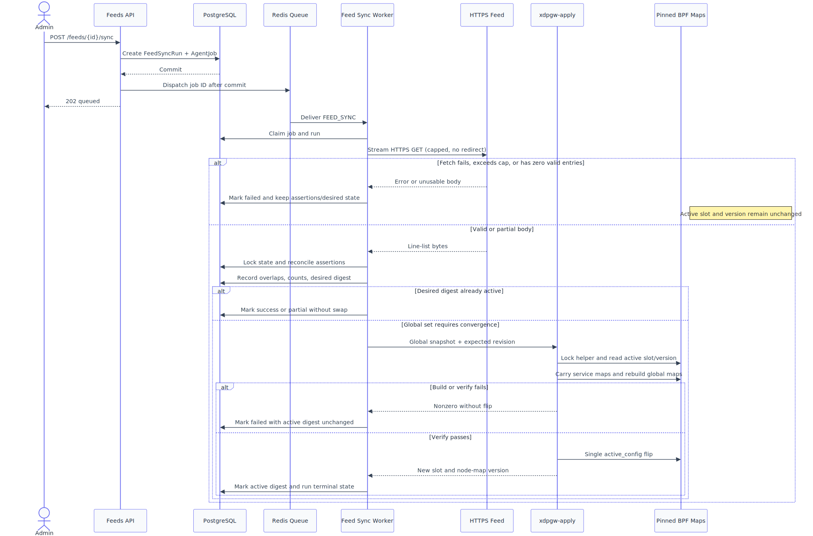

# Threat Intelligence Feed Sync Design

**Spec**: `.specs/features/threat-feed-sync/spec.md` (FEED-01..40; approved 2026-07-10)
**Context**: `.specs/features/threat-feed-sync/context.md` (D-FEED-1..3, A-FEED-1..8)
**Status**: **APPROVED** (2026-07-10) → Tasks
**Execute precondition**: Agent worker is executed. Data-plane propagation remains
hard-gated on execution of `.specs/features/double-buffer-swap/`.
**Diagrams**: `diagrams/feed-sync-architecture.{mmd,svg}` and
`diagrams/feed-sync-sequence.{mmd,svg}`

---

## Architecture Overview

The feature adds an admin-only feed-management surface and a new worker pipeline:

1. `/feeds` mutations and manual/scheduled sync requests create durable `FeedSyncRun` + `AgentJob`
   records and use the existing post-commit Redis dispatcher.
2. The worker streams one HTTPS line-list under explicit wall-clock and byte limits, parses canonical
   IPv4 CIDRs, and fails before reconciliation if the result has zero valid entries.
3. A PostgreSQL reconciliation transaction replaces only that source's assertions, materializes the
   distinct global-deny union into the existing `blacklist_entry` table, records whitelist overlaps,
   and advances a singleton desired-state revision only when the effective CIDR set changes.
4. When desired and active global-deny digests differ, `GlobalDenyApplier` invokes the same planned
   `xdpgw-apply` binary from M4 #2 in **global mode**. The helper carries all service-scoped map objects
   forward, rebuilds only `global_blacklist_bloom` / `global_blacklist_lpm` / `gbl_meta`, verifies the
   inactive slot, and commits with the existing single `active_config` write.

The provenance model deliberately separates **assertions** from the one
materialized global row. A CIDR may have assertions from many feeds but still
has exactly one `BlacklistEntry`. A manual row wins presentation and deletion
semantics without destroying feed assertions. The singleton `GlobalDenyState`
separately tracks the database's desired digest and the last successfully
applied digest, so an apply failure cannot be mistaken for a no-op on the next
byte-identical sync.

---

## Research Notes

### Codebase and project contracts

- `control-plane/app/db/models.py` currently makes `AgentJob.target_id` a non-null foreign key to
  `protected_service`, and `control-plane/app/services/apply.py` assumes every job owns a service state
  machine. Feed work therefore needs a job-lifecycle adapter; merely adding an enum value would fail in
  `mark_applying` before the handler runs.
- `control-plane/app/worker/{processor,handlers,worker}.py` already supplies the single-in-flight loop,
  `HANDLERS` registry, startup/periodic ledger sweep, Redis degradation, and post-commit job dispatch.
- `BlacklistEntry` has a partial unique index on global `source_cidr`, while `WhitelistEntry` is scoped
  by service. A nullable `feed_source_id` on the blacklist row cannot represent multiple feeds claiming
  the same CIDR without either losing provenance or violating that unique
  index. The assertion table below resolves the conflict.
- `control-plane/app/services/lists.py` already centralizes canonical IPv4 validation, manual global-list
  CRUD, audit calls, and duplicate-to-409 translation. The feed parser reuses the canonical parsing
  primitive but intentionally does **not** call `reject_reserved`: public feeds may legitimately list
  bogon/reserved ranges, while only IPv6, `0.0.0.0/0`, and host-bit CIDRs are forbidden by this spec.
- `.specs/features/double-buffer-swap/design.md` defines the planned helper, binary snapshot, inactive
  build, structural verify, feed-map carry-forward, and single-write commit. That helper does not exist
  yet; the global mode in this design is an explicit extension to be implemented only after its base
  service mode lands.
- No `.specs/codebase/CONCERNS.md` exists. The fragile boundaries are the service-coupled job lifecycle,
  the global partial unique index, the worker's single foreground lane, and the one shared
  `active_config` slot/version; the design isolates
  each behind a small contract rather than adding a second queue or BPF writer.

### Verified external semantics

- HTTPX supports async streaming through `AsyncClient.stream()` and `aiter_bytes()`; redirects are off
  unless explicitly enabled. The fetcher uses those APIs so the byte cap is enforced while reading,
  rather than after buffering the full response. See the
  [HTTPX async streaming documentation](https://www.python-httpx.org/async/) and
  [API reference](https://www.python-httpx.org/api/).
- HTTPX timeouts are per connect/read/write/pool operation, so the fetcher also wraps the whole request
  in Python 3.12 `asyncio.timeout()` to enforce a true wall-clock bound. See the
  [HTTPX timeout documentation](https://www.python-httpx.org/advanced/timeouts/) and
  [Python 3.12 timeout documentation](https://docs.python.org/3.12/library/asyncio-task.html#timeouts).
- PostgreSQL's network `&&` operator means that either CIDR contains or equals the other, exactly the
  overlap relation required by FEED-19; GiST `inet_ops` indexes this operator for `inet`/`cidr` but is
  not the default operator class. See the
  [PostgreSQL network operators](https://www.postgresql.org/docs/current/functions-net.html) and
  [GiST operator classes](https://www.postgresql.org/docs/current/gist-builtin-opclasses.html).

---

## Code Reuse Analysis

### Existing components to leverage

| Component | Location | How it is used |
| --- | --- | --- |
| Admin guard / principal loading | `control-plane/app/core/deps.py`, existing admin routers | Every `/feeds` and history endpoint fails closed before handler execution |
| Transactional audit writer + secret scrub | `control-plane/app/services/audit.py` | Source mutations, dangerous delete, failures, and overlap summaries |
| Canonical IPv4 parser | `control-plane/app/core/cidr.py::parse_ipv4_cidr` | Feed line validation; bare addresses are normalized to `/32` before this call |
| Post-commit dispatcher | `control-plane/app/services/apply.py::ApplyDispatcher`, DB callback hooks | Feed jobs use the existing Redis list + durable-ledger outbox posture |
| Worker loop and reconciliation | `control-plane/app/worker/worker.py`, `processor.py` | Same single-in-flight runtime; add lifecycle and handlers, not a second process |
| Handler registry | `control-plane/app/worker/handlers.py::HANDLERS` | Register `FEED_SYNC` and the convergence-only retry handler |
| Global blacklist row and index | `control-plane/app/db/models.py::BlacklistEntry`, `uq_blacklist_global_source_cidr` | Materialized distinct manual/feed union remains the M4 snapshot source |
| Whitelist rows | `control-plane/app/db/models.py::WhitelistEntry` | SQL `cidr && cidr` overlap join across all services |
| Global bloom/LPM builder contract | `data-plane/src/blacklist.h` | Reuse `/24` bloom expansion, broad-entry escape, 1M LPM limit, and `gbl_meta` flags |
| Planned atomic apply helper | `.specs/features/double-buffer-swap/design.md` | Extend one binary/swap protocol with a global snapshot kind |

### Integration points

| System | Integration method |
| --- | --- |
| FastAPI | New `feeds` router mounted in `app/main.py`; Pydantic request/response schemas omit credential references and expose `has_credential` only |
| PostgreSQL | New source/run/assertion/overlap/global-state tables; one migration also generalizes `agent_job` safely |
| Redis | Existing `apply:jobs` list and post-commit dispatch; payload remains only the durable job UUID |
| Worker | Existing loop; job lifecycle becomes type-aware while the service transition functions remain unchanged |
| External feed | Shared injected `httpx.AsyncClient`, TLS verification on, `follow_redirects=False`, `trust_env=False`, optional bearer value resolved from an environment-variable name |
| Data plane | Versioned global-deny snapshot → `xdpgw-apply` global mode → inactive-slot verify → atomic flip |

---

## Components and Interfaces

### Feed API — `app/api/routers/feeds.py`, `app/api/schemas/feeds.py`

- **Purpose**: admin-only source CRUD, manual/dry-run enqueue, and run history.
- **Endpoints**:
  - `POST /feeds` → `201 FeedSourceResponse`
  - `GET /feeds`, `GET /feeds/{source_id}`
  - `PUT /feeds/{source_id}`
  - `DELETE /feeds/{source_id}` → logical delete + queued global rebuild
  - `POST /feeds/{source_id}/sync?dry_run=false` → `202 FeedSyncAccepted`
  - `GET /feeds/{source_id}/syncs`
- **Validation**:
  - URL scheme must be `https`; userinfo and fragments are rejected.
  - `sync_interval_seconds` is rejected with 422 outside **300..604800** seconds; it is never silently
    clamped.
  - `credential_env_var` matches `^[A-Z][A-Z0-9_]{0,127}$`; responses expose only
    `has_credential: bool`.
- **Scheduling effects**: create or re-enable sets `next_sync_at=now`; disabling sets it to null and
  keeps assertions. URL/credential changes make an enabled source due
  immediately; an interval-only change recomputes `next_sync_at` from now.
- **Reuses**: `require_admin`, `get_db`, actor loading, shared error shapes, audit writer.

### Source service — `app/services/feeds.py`

- **Purpose**: transactional CRUD and idempotent feed-job enqueue.
- **Interfaces**:
  - `create_source(db, payload, actor) -> ThreatFeedSource`
  - `update_source(db, source, payload, actor) -> ThreatFeedSource`
  - `delete_source(db, source, actor) -> FeedSyncRun`
  - `enqueue_sync(db, source, *, trigger, dry_run, actor) -> FeedSyncRun`
  - `list_due_sources(db, now, limit) -> list[ThreatFeedSource]`
- **Deletion**: set `deleted_at`, disable and hide the source from normal reads, remove its assertions and
  re-materialize the global union, then enqueue a `FEED_SYNC` run with `trigger=feed_delete`. Retaining a
  tombstone until convergence makes in-flight jobs deterministic and preserves audit/run foreign keys;
  it is API-visible as deletion, not disablement.
- **Idempotency**: each enqueue locks the source, increments `sync_sequence`, creates one run and one
  uniquely linked `AgentJob`, then registers the existing post-commit dispatch. Duplicate delivery of
  that job UUID is terminal/no-op; repeated API requests intentionally create separate runs.

### Bounded fetcher — `app/services/feed_fetch.py`

- **Purpose**: retrieve one source without unbounded memory, redirects, or leaked credentials.
- **Interface**: `fetch_line_list(source, client, settings) -> FetchResult`.
- **Defaults** (environment-tunable through `Settings`):
  - wall clock: **30 s** via `asyncio.timeout`
  - HTTPX: connect **5 s**, read **10 s**, write **5 s**, pool **5 s**
  - maximum decoded body: **32 MiB**
  - redirects: disabled; any 3xx/non-2xx is failure
- **Streaming rule**: reject an oversized `Content-Length` before reading; otherwise sum decoded chunks
  and abort immediately when the cap is crossed. The response body is never logged.
- **Credential rule**: resolve `os.environ[source.credential_env_var]` at run time and set an
  `Authorization: Bearer ...` header. A missing env variable fails the run before the request. Neither
  the variable name nor its value enters API output, audit metadata, exceptions, or structured logs.
- **Dependencies**: one client scoped to the worker lifetime, not one client per run.

### Parser — `app/core/feed_parser.py`

- **Purpose**: pure, unit-testable line-list normalization.
- **Interface**: `parse_line_list(bytes) -> ParseResult` where `ParseResult` carries physical line count,
  distinct canonical CIDRs, invalid count, duplicate count, and bounded invalid-line diagnostics.
- **Rules**:
  1. Decode UTF-8 with an optional UTF-8 BOM; invalid encoding fails the run.
  2. Strip inline content from the earliest `#` or `;`, then surrounding whitespace.
  3. Ignore blank/comment-only lines.
  4. Add `/32` to a bare IPv4 address; parse CIDRs with strict host-bit validation.
  5. Reject IPv6, `0.0.0.0/0`, malformed values, and non-canonical host-bit CIDRs.
  6. Deduplicate exact canonical CIDRs only; containment is not deduplicated.
- **Status rule**: zero distinct valid CIDRs fails before reconciliation; otherwise invalid lines make
  the terminal run `partial`, while an all-valid run is `success` if apply also succeeds.

### Assertion reconciler — `app/services/feed_reconcile.py`

- **Purpose**: atomically replace one source's assertions, preserve other sources/manual rows, detect
  overlaps, and advance desired global-deny state.
- **Interface**:
  - `reconcile(db, run, parsed) -> ReconcileResult`
  - `materialize_global_union(db) -> MaterializeResult`
  - `load_global_snapshot(db, expected_revision) -> GlobalDenySnapshot`
- **Transaction algorithm**:
  1. Lock the source and singleton `GlobalDenyState` rows. A deleted source makes an ordinary in-flight
     sync a safe no-op; the dedicated delete run continues with the already-reconciled desired set.
  2. Load distinct candidate CIDRs into a transaction-local temporary `cidr` table in bounded batches.
  3. Compute source-assertion added/removed counts; for a dry run, stop after counts/overlaps and mutate
     nothing.
  4. Upsert one global `BlacklistEntry` per candidate CIDR when none exists, then replace only this
     source's `FeedBlacklistAssertion` links to those rows.
  5. Remove `source=feed` global rows with no remaining assertion; never update/delete
     `source=manual` rows.
  6. Count the resulting distinct global rows and abort the transaction above 1,048,576 entries.
  7. Join candidate CIDRs to `WhitelistEntry.source_cidr` with `&&`; persist each identified overlap and
     one credential-free audit summary for the run. Overlap never alters candidate/global membership.
  8. Hash sorted effective global CIDRs. If it differs from `desired_digest`, increment
     `desired_revision`, store the digest, and set global apply state pending.
- **Concurrency**: the singleton row lock serializes reconciliations across sources even if multiple
  worker processes are accidentally started. The existing single-in-flight worker is still the normal
  v1 execution model.
- **Count semantics**: `valid` is the number of distinct normalized CIDRs; `added`/`removed` are this
  source's assertion deltas; `global_changed` separately tells whether the effective data-plane set
  changed.

### Manual global-list integration — `app/services/lists.py`

- **Purpose**: preserve manual precedence under the existing global unique index.
- **Changes**:
  - Adding a manual CIDR that already has a feed materialization **promotes the existing row** to
    `source=manual` and records the actor; feed assertions remain.
  - Removing a manual row with remaining feed assertions **demotes it** to `source=feed`; without
    assertions it is deleted.
  - Attempting to delete a feed-only row through manual CRUD returns 409 (feed-managed).
- **Data-plane note**: every global-list materialization updates `GlobalDenyState`; convergence uses the
  same global applier. This removes the pre-M4 gap where manual global CRUD had no apply target.

### Worker lifecycle and handlers — `app/worker/{processor,handlers,feed_jobs}.py`

- **Purpose**: support non-service jobs without weakening the executed service state machine.
- **Interfaces**:
  - `JobLifecycle.claim(db, job) -> bool`
  - `JobLifecycle.succeed(db, job, outcome) -> None`
  - `JobLifecycle.fail(db, job, error) -> None`
  - `JobLifecycle.recover(db, job) -> None`
  - `JOB_LIFECYCLES: dict[JobType, JobLifecycle]`
- **Service adapter**: delegates unchanged to `mark_applying`, `mark_active`, `mark_failed`, and the
  existing orphan retry; no behavior change to `SERVICE_UPDATE`.
- **Feed adapter**: locks `AgentJob` + `FeedSyncRun`, advances queued→running→terminal, updates source
  status/timestamps, and leaves all service apply fields untouched.
- **Handlers**:
  - `handle_feed_sync(...)`: fetch → parse → reconcile → converge desired global state.
  - `handle_global_deny_apply(...)`: convergence-only retry for `desired_digest != active_digest`; no
    fetch or source mutation.
- **Recovery**: startup turns an orphaned feed job into failed and requeues the same run while its
  attempt budget remains; duplicate terminal delivery is a no-op.

### Due-time scheduler — `app/worker/feed_scheduler.py`

- **Purpose**: extend the existing periodic reconciliation tick without an external cron.
- **Interface**: `enqueue_due_feed_syncs(session_factory, now, limit=100) -> int`.
- **Query rules**: enabled, not deleted, `next_sync_at <= now`, and no queued/running feed job for the
  source. Rows are selected with `FOR UPDATE SKIP LOCKED`; enqueue uses the same source sequence/run/job
  transaction as manual sync.
- **Completion rule**: every terminal fetch run sets `next_sync_at = finished_at + sync_interval`; a
  failure therefore retries at the next interval. Disabled sources are skipped, but manual sync remains
  allowed.
- **Convergence retry**: the tick also enqueues one `GLOBAL_DENY_APPLY` job when desired and active
  digests differ and no global apply is queued/running. This heals map-build failures and source-delete
  tombstones even when no source is otherwise due.

### Bounded feed-fetch lane — `app/worker/feed_coordinator.py`

- **Purpose**: prevent a slow 30-second upstream request from blocking ordinary service applies in the
  executed worker's foreground lane.
- **Model**: the worker may have at most one network-only feed fetch task in the background while it
  continues to process `SERVICE_UPDATE` jobs. The task holds no database transaction and cannot invoke
  the BPF helper.
- **Completion**: a successful/error fetch result returns through an in-memory `asyncio.Queue`; parse,
  reconcile, terminal ledger updates, and global apply then run in the normal single foreground lane.
- **Backpressure**: while the fetch slot is occupied, later feed jobs remain queued in the durable
  ledger; service jobs continue. Shutdown waits within the existing grace period, then cancellation
  leaves the run recoverable by the startup orphan path.
- **Why not a second worker**: v1 keeps one process, one Redis queue, one reconcile sweep, and one BPF
  writer. Only untrusted network wait is overlapped; all state mutation remains serialized.

### Global-deny applier — `app/worker/applier.py` (extension)

- **Purpose**: serialize the desired distinct global CIDR set and invoke the planned C helper.
- **Interfaces**:
  - `apply_global(snapshot: GlobalDenySnapshot) -> ApplyResult`
  - `ApplyResult(active_slot: int, node_map_version: int)`
- **Snapshot**: extend the M4 #2 wire header with `snapshot_kind = SERVICE_FULL | GLOBAL_DENY` and bump
  its schema version. `GLOBAL_DENY` carries the desired revision plus sorted `{prefixlen, address_be32}`
  entries. The Python serializer and C parser share a golden fixture.
- **Post-apply guard**: after helper success, lock `GlobalDenyState`; advance `active_revision` /
  `active_digest` only if the applied desired revision still matches. If a concurrent mutation advanced
  desired state, leave it pending so the convergence retry applies the newer snapshot.

### `xdpgw-apply` global mode — `data-plane/tools/xdpgw-apply.c` (planned extension)

- **Purpose**: inverse of M4 #2's service rebuild using the same map owner, verify gate, and commit.
- **Algorithm**:
  1. Acquire an exclusive helper lock under the pin directory; then fresh-read `{active_slot, version}`.
  2. Pointer-copy all active **service-scoped** inner maps to the inactive slot and copy
     `fair_node_config`; carry `udp_blocked_port_bitmap` unchanged.
  3. Create fresh meta-equal global bloom/LPM inners, populate them using AD-023's `/24` expansion and
     broad-entry escape, and write coherent inactive `gbl_meta`.
  4. Verify snapshot bounds, all carried inner IDs, inserted-entry count, bloom capacity policy, and
     `gbl_meta` flags. Any failure exits nonzero before the flip.
  5. Commit exactly once with `active_config={inactive, version+1}` and print a stable machine-readable
     result for the Python applier.
- **Shared-version rule**: service and global modes use the same helper lock and increment the same
  node-global `active_config.version`; neither caches the slot/version. Per-service `active_version`
  remains unrelated and is never advanced by a feed job.
- **Reuses**: M4 #2 pin-open/create-inner/verify/commit functions and AD-023 global key construction.

---

## Data Models

### `ThreatFeedSource`

| Field | Type / constraint | Notes |
| --- | --- | --- |
| `id` | UUID PK | Node-global identity |
| `name` | string, case-insensitive unique | Admin-facing name |
| `url` | text | HTTPS only; no userinfo/fragment |
| `format` | enum `line_list` | Forward-compatible discriminator |
| `enabled` | bool | Controls automatic scheduling only |
| `sync_interval_seconds` | int CHECK 300..604800 | Rejected, never clamped |
| `credential_env_var` | nullable string | Stored reference only; omitted from responses/logs |
| `sync_sequence` | bigint default 0 | Monotonic enqueue idempotency per source |
| `last_status` | nullable final run status | success / partial / failed |
| `last_error` | nullable text, capped | Credential-scrubbed summary |
| `last_sync_at`, `next_sync_at` | timestamptz | Persisted scheduler state |
| `deleted_at` | nullable timestamptz | Logical deletion/tombstone for safe in-flight handling |
| timestamps | timestamptz | Existing mixin pattern |

### `FeedSyncRun`

| Field group | Fields |
| --- | --- |
| Identity | `id`, `feed_source_id`, immutable `source_name` snapshot, `sequence`, `trigger`, `dry_run` |
| Lifecycle | `status` (`queued/running/success/partial/failed`), `started_at`, `finished_at`, `duration_ms`, `error` |
| Counts | `fetched_lines`, `valid`, `duplicates`, `added`, `removed`, `skipped_invalid`, `overlap_count` |
| Apply | `global_changed`, `desired_revision`, `node_map_version` |

Unique `(feed_source_id, sequence)` prevents duplicate enqueue for one sequence. Error text is capped and
scrubbed. Dry runs persist normal stats but have no desired revision or node version.

### `FeedBlacklistAssertion`

| Field | Type / constraint |
| --- | --- |
| `feed_source_id` | UUID FK → source, ON DELETE CASCADE |
| `blacklist_entry_id` | UUID FK → global blacklist row, ON DELETE CASCADE |
| `first_seen_at`, `last_seen_at` | timestamptz |

Primary key `(feed_source_id, blacklist_entry_id)` plus a reverse index on `blacklist_entry_id`. This is
authoritative provenance; `BlacklistEntry` remains the distinct materialized union consumed by the map
builder.

### `FeedSyncOverlap`

`id`, `feed_sync_run_id`, `feed_source_cidr`, `whitelist_entry_id`, `service_id`, `created_at`, with a
unique constraint across run/CIDR/whitelist entry. These rows are the durable, individually identified
alert events M6 can consume; the audit log stores one bounded summary per run.

Add `GiST (source_cidr inet_ops)` to `whitelist_entry` for the overlap join. The assertion table's two
directions support per-source replacement and orphan-feed-row cleanup; the temporary candidate table
needs only its primary key.

### `GlobalDenyState`

A one-row table: `desired_revision`, `active_revision`, `desired_digest`, `active_digest`,
`apply_status`, `last_error`, `last_node_map_version`, `updated_at`. The digest is SHA-256 over sorted
canonical CIDRs with a stable delimiter. This state represents the global-deny set only; it does not
replace per-service apply status or `active_config.version`.

### `AgentJob` generalization

- Add `JobType.feed_sync` and `JobType.global_deny_apply`.
- Add `feed_sync_run_id UUID NULL UNIQUE REFERENCES feed_sync_run(id) ON DELETE CASCADE`.
- Make existing service `target_id` nullable, but keep its FK to `protected_service`.
- Add checks:
  - `SERVICE_UPDATE` → service `target_id` set, `feed_sync_run_id` null.
  - `FEED_SYNC` → service `target_id` null, `feed_sync_run_id` set.
  - `GLOBAL_DENY_APPLY` → both null; `version` is the desired global revision.
- Replace the broad unique constraint with partial unique indexes for service target/version, feed run,
  and global desired revision. This preserves database referential integrity instead of converting
  `target_id` into an unchecked polymorphic UUID.
- Add triggers `feed_manual`, `feed_schedule`, `feed_delete`, `feed_dry_run`, and
  `global_deny_retry` to `ChangeTrigger`.

---

## Error Handling Strategy

| Scenario | Handling | Active data-plane effect |
| --- | --- | --- |
| Timeout, TLS/network error, redirect/non-2xx | Fail run before reconciliation; retain assertions and source status error | None; active digest/version unchanged |
| Body exceeds 32 MiB | Abort stream immediately; fail run | None |
| Invalid UTF-8 | Fail parse; no reconciliation | None |
| Some invalid lines, at least one valid | Count invalids; reconcile valid distinct subset; final status partial after convergence | Swap only if effective set changed |
| Zero valid / empty body | Fail; retain prior assertions | None |
| Secret env reference missing | Fail before request with scrubbed error | None |
| Source deleted during ordinary sync | Source lock/recheck turns it into terminal no-op | Delete run/retry owns convergence |
| Two source reconciliations race | Singleton global-state row serializes assertion materialization | No lost union update |
| Result exceeds 1M distinct global CIDRs | Roll back reconciliation; fail run | None; no partial map |
| Overlap with whitelist | Persist overlap rows + audit summary; keep global CIDR | Global deny remains present; whitelist scope behavior unchanged |
| Helper build/verify/timeout failure | Mark run/job/global state failed; leave active digest untouched; periodic convergence retry | No flip; last-active slot remains live |
| Desired state changes during helper run | Record only the applied revision; leave newer desired state pending and enqueue retry | Intermediate coherent swap, followed by latest coherent swap |
| Duplicate Redis delivery | Lifecycle terminal guard | Exactly one reconciliation/apply |
| Worker restart mid-run | Startup recovery requeues bounded attempt; persisted scheduler catches due work | Last-active slot remains live |

---

## Tech Decisions

| Open question / decision | Choice | Rationale |
| --- | --- | --- |
| FEED_SYNC ledger | Generalize `AgentJob` with an explicit `FeedSyncRun` FK and type-specific lifecycle adapters | Reuses the durable queue/worker while preserving service FK integrity and existing service transitions |
| Global-deny apply channel | Add `GLOBAL_DENY` snapshot kind to the same `xdpgw-apply` binary; shared helper lock and `active_config.version` | One audited C writer and one commit protocol; inverse carry-forward is a mode, not a sibling implementation |
| Provenance | Many-to-many `FeedBlacklistAssertion`; `BlacklistEntry` is a one-row-per-CIDR materialized union | Correct multi-feed dedup and per-source removal under the existing unique index; manual promotion/demotion is lossless |
| Overlap detection | PostgreSQL `cidr && cidr` join with GiST `inet_ops` on whitelist CIDRs | Exact containment/equality semantics in the database; avoids Python O(feed×whitelist) scans |
| Fetch limits | 30 s wall clock; HTTPX 5/10/5/5 s; 32 MiB; interval 300..604800 s | 1M maximum-length canonical IPv4/CIDR lines are about 19 MiB; the cap leaves headroom without allowing unbounded bodies |
| Apply convergence | Persist desired and active global digests/revisions separately | A failed helper cannot be mistaken for a later no-op; retries are driven by convergence, not feed-body novelty |
| Worker latency isolation | One background network-fetch slot; all DB/helper work stays in the foreground lane | A 30-second feed wait cannot consume the ≤5-second service-apply budget or create concurrent map writers |
| Source delete | API-visible logical deletion with a retained tombstone until global convergence | In-flight jobs become deterministic; deletion can retry safely without dangling targets |
| Redirects and proxy env | `follow_redirects=False`, `trust_env=False` | Matches the spec's redirect-fails rule and prevents ambient proxy configuration from changing the fetch path |

---

## Testing Notes

### Unit

- Parser table: comments, inline delimiters, whitespace, bare `/32`, canonical CIDRs, host-bit reject,
  IPv6 reject, `/0` reject, exact dedup, containment retained, UTF-8/BOM, mixed→partial, zero-valid→fail.
- Fetcher with `httpx.MockTransport`: success, redirect, non-2xx, content-length over cap, streamed
  mid-body cap, each timeout class, wall-clock timeout, missing credential, header used but never logged.
- Desired digest determinism and snapshot serializer/golden fixture.
- Scheduler due/in-flight/disabled/deleted decisions and lifecycle dispatch by job type.

### Control-plane integration

- Admin CRUD + 403 isolation + credential omission/log capture + audit coverage.
- Job/run unique linkage; duplicate job delivery; startup orphan recovery; Redis-ledger reconciliation.
- Claim replace/delta, multi-feed exact dedup, manual promotion/demotion, per-source removal, delete source,
  byte-identical no-op, 1M+1 rejection (boundary may use generated SQL fixture).
- PostgreSQL overlap cases: equal, feed contains whitelist, whitelist contains feed, disjoint; persisted
  overlap rows + audit summary; global row always retained.
- Desired/active divergence: fake helper failure, identical retry still invokes helper, later success
  converges digest/revision; concurrent desired-version guard.
- Scheduled sync uses the committed-DB fixture; integration tests remain serial per `TESTING.md`.

### Data-plane / helper

- Extend M4 #2's golden snapshot parser tests for `GLOBAL_DENY`.
- `BPF_PROG_TEST_RUN`: global mode carries service/rule/whitelist/service-blacklist/fairness maps,
  rebuilds global bloom/LPM/meta, flips once, and a listed source reaches `blacklist_drop` while clean
  service traffic is verdict-identical.
- Forced build/verify failure and killed helper: slot/version/prior verdicts unchanged.
- Alternating service-mode and global-mode swaps: both use fresh slot/version and preserve the other
  configuration group.
- Gated `make blbulk`/global-apply scale check at 1,048,576 entries; 1,048,577 fails before flip.

### Gate posture

- Control plane: existing full gate from `.specs/codebase/TESTING.md`.
- Data plane: `make test`, `make bpf skel loader apply dpstat`, then privileged smoke/scale gates once
  double-buffer execution supplies the helper and config pins.

---

## Requirement Coverage

| Requirements | Exact interpretation and design coverage | Verification home |
| --- | --- | --- |
| FEED-01..07 | 01 create/validation; 02 list/get status; 03 update/disable retention; 04 logical delete + assertion removal + rebuild; 05 mutation audit; 06 credential secrecy; 07 admin-only guard | API + service integration |
| FEED-08..18 | 08 run-linked queued job/idempotent delivery; 09 bounded HTTPS fetch; 10 line-list grammar; 11 canonical IPv4 validation; 12 invalid skip/count; 13 exact dedup; 14 per-source delta; 15 manual/multi-feed precedence; 16 source isolation; 17 keep-last on unusable fetch; 18 byte-identical no-op | Unit + worker/DB integration |
| FEED-19..23 | 19 CIDR overlap detection; 20 run overlap flag/count; 21 durable alert + audit summary; 22 global entry retained; 23 credential/PII-safe M6-consumable event | PostgreSQL integration |
| FEED-24..29 | 24 rebuild global bloom/LPM/meta; 25 inverse carry-forward; 26 abort-before-flip; 27 desired=active no-swap; 28 1M bound; 29 node version + hot-path reachability | Fake-helper integration + dp-unit/scale |
| FEED-30..34 | 30 due enabled enqueue; 31 next due after every result; 32 disabled skip/manual allowed; 33 in-flight suppression; 34 restart catch-up | Worker integration |
| FEED-35..40 | 35 persisted run stats; 36 history API; 37 partial status; 38 dry-run no mutation; 39 structured JSON summary; 40 no secret/PII in logs | API/worker integration + log capture |

**Coverage:** 40/40 requirements mapped to design; 0 unmapped.

---

## Known Gate and Follow-on

- The control-plane models, parser, CRUD, and fake-helper paths can be implemented after the executed
  agent worker.
- Real data-plane propagation, helper snapshot tests, and end-to-end success cannot execute until
  double-buffer M4 #2 lands its pins and base `xdpgw-apply` implementation.
- M5 reads source/run/global-state records; M6 consumes overlap/failure events for email/webhook delivery.
- Structured formats, authenticated schemes beyond bearer env references, per-tenant feeds, and license
  review remain out of scope exactly as specified.
