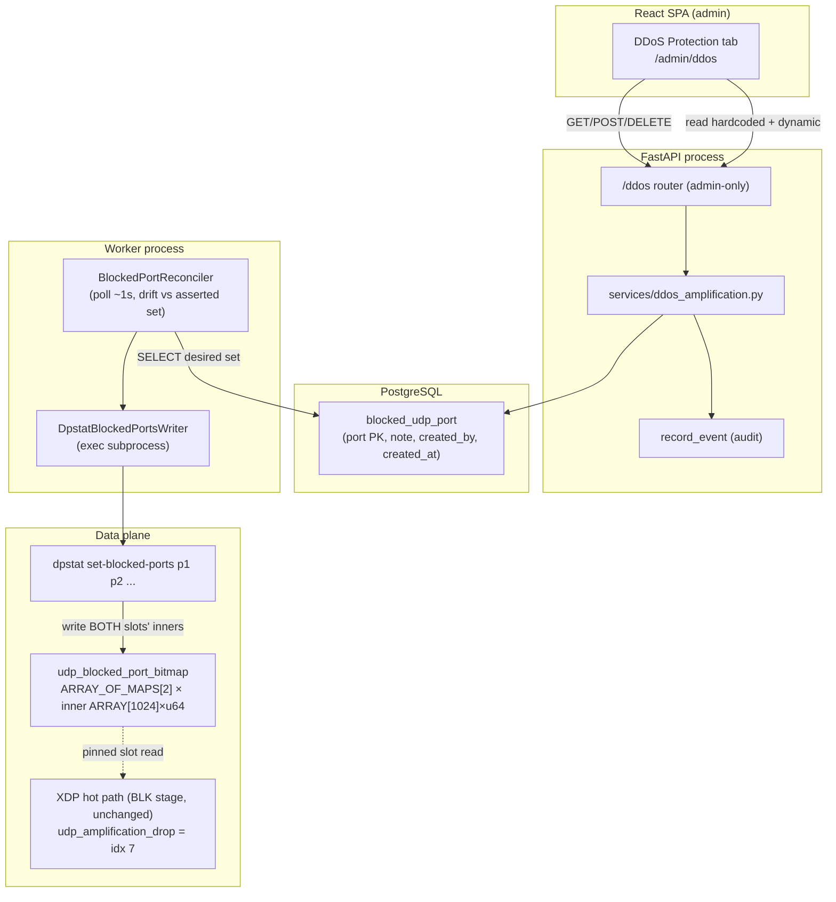

# UDP Amplification Config & DDoS Protection Tab — Design

**Spec:** `.specs/features/udp-amplification-config/spec.md` (AMP-01..21)
**Context:** `.specs/features/udp-amplification-config/context.md` (D-AMP-1..3, A-AMP-1..8)
**Decision record:** **AD-036**
**Status:** Draft — awaiting approval → Tasks

---

## AD-036 — summary

Build the deferred D-BLK-2 control-plane writer for the dynamic `udp_blocked_port_bitmap` as **four
thin tracks over verified infrastructure**, cloning the present-in-code bypass/next-hop pattern 1:1:

1. **CP model + API + audit** — a new `blocked_udp_port` table (one row/port, node-global,
   admin-only), a `/ddos` admin router, a `ddos_amplification` service with `record_event` audit.
2. **Worker reconcile lane** — `BlockedPortReconciler` + `DpstatBlockedPortsWriter` (clones
   `NodeControlReconciler` + `DpstatBypassWriter`), a background asyncio loop that polls the PG
   desired set every ~1 s and, on drift, execs the new `dpstat` subcommand.
3. **DP writer** — `dpstat set-blocked-ports [port...]` builds the 1024-word bitmap and writes it into
   **both** double-buffer slots' inner maps (carry-forward-safe). **No hot-path change.**
4. **SPA tab** — a role-filtered **DDoS Protection** nav item + `/admin/ddos` page (read-only built-in
   chips + dynamic-list CRUD), cloning the Global Blacklist page/hook/tests.

**Zero** hot-path C edit, **zero** new drop reason (reuses `DR_UDP_AMPLIFICATION_DROP=7`), **zero**
apply-snapshot wire-format change, **no** new `JobType`, **no** new Redis channel. The only cross-tier
data path is PG desired-state → worker poll → `dpstat` → BPF map.

---

## Architecture Overview

The API (FastAPI, `app/main.py`) and the worker (`app/worker/__main__.py`) are **separate
processes** sharing PostgreSQL. There is no cross-process event: a CRUD write lands in
`blocked_udp_port`; the worker's `BlockedPortReconciler` polls that table on its interval and pushes
drift to the data plane through `dpstat`. Propagation latency ≈ the reconcile interval (~1 s, well
inside the ≤5 s SLA). Enforcement itself is the **existing, verified** BLK stage — this feature only
supplies the map contents.



---

## Code Reuse Analysis

### Existing components to leverage

| Component | Location | How to use |
| --- | --- | --- |
| `DpstatBypassWriter` + `NodeControlReconciler` | `app/worker/node_control_reconciler.py` | **Clone** into `blocked_port_reconciler.py` — same subprocess-exec + `asserted_*` drift + `run_loop` shape |
| `NextHopResolver` / `DpstatNextHopWriter` | `app/worker/nexthop_resolver.py` | Secondary reference for a set-valued writer + Protocol + Fake |
| Worker lane wiring | `app/worker/worker.py` (`NodeControlLane` Protocol, conditional construct, `create_task(lane.run_loop)`) | Add a `BlockedPortLane` beside `node_control`/`nexthop` |
| Global blacklist admin router | `app/api/routers/global_blacklist.py` | **Clone** — `get_admin_principal`, POST/GET/DELETE, `_load_actor`, 201/204 |
| List service + audit | `app/services/lists.py`, `app/services/audit.py::record_event`, `services/node_control.py` | Service functions + `record_event(action, target_type, ...)` + `scrub_metadata` |
| `BlacklistEntry` model | `app/db/models.py` (`Base`, own `created_at`, `created_by` FK SET NULL) | Column shape template for `BlockedUdpPort` |
| Node-control migration | `app/db/migrations/versions/20260714_0010_node_control.py` | Alembic `create_table` + FK SET NULL + CheckConstraint template |
| Settings block | `app/core/config.py` (`worker_node_control_*`, `worker_telemetry_binary_path`/`_timeout_seconds`) | Add `worker_blocked_port_*`; reuse the dpstat binary + timeout |
| `dpstat set-bypass` + `apply_inner_fd` | `data-plane/tools/dpstat.c` (`cmd_set_bypass`, `open_pinned_map`), `data-plane/tools/xdpgw-apply.c` (`apply_inner_fd`) | Subcommand skeleton + map-of-maps inner-fd access pattern |
| Bitmap write idiom | `data-plane/loader/loader.c::seed_blocked_port_from_env` | `key=port>>6`, `bit=1<<(port&63)` word set |
| `useGlobalBlacklist` hook | `frontend/src/hooks/resources/useGlobalBlacklist.ts` | **Clone** into `useAmplificationConfig.ts` (query + add + remove mutations) |
| Global Blacklist page/form + tests | `frontend/src/features/config/global-blacklist/*` | Page/form/Vitest template for `features/config/ddos/*` |
| Sidebar + routes | `frontend/src/layout/Sidebar.tsx`, `src/App.tsx` | Add admin NavLink + `<Route path="/admin/ddos">` |
| `ui/` primitives + apiClient | `frontend/src/ui/*`, `src/api/client.ts` (`fieldErrorsFrom422`, `{detail}`) | DataTable, NumberInput, Input, ConfirmDialog, Toast, Field; 409/422 surfacing |

### Integration points

| System | Integration method |
| --- | --- |
| Existing BLK enforcement (`blacklist.h`) | **None** — read-only consumer of the map this feature fills; no C edit |
| `xdpgw-apply` double-buffer swap | **Compatibility invariant only** — carry-forward preserves inner content; writer targets both slots (see Tech Decision T2) |
| Loader pins | Reuse the already-pinned `udp_blocked_port_bitmap` (`loader.c` pins it; no new pin) |
| Worker runtime | Add one background lane task; no change to the job loop / `process_job` / Redis |

---

## Components

### 1. `BlockedUdpPort` model + migration (CP)

- **Purpose**: node-global desired-state store for dynamically blocked UDP source ports.
- **Location**: `app/db/models.py` (+ migration `app/db/migrations/versions/2026….py`).
- **Schema** (Tech Decision T3 — `port` is the natural PK; `Integer` not `SmallInteger`):
  - `port: Mapped[int]` — **PK**, `Integer`, `CheckConstraint("port >= 0 AND port <= 65535",
    name="ck_blocked_udp_port_range")`.
  - `note: Mapped[str | None]` — `String(256)`, nullable.
  - `created_by: Mapped[UUID | None]` — FK `users.id` `ondelete="SET NULL"`, nullable (mirrors
    `BlacklistEntry`).
  - `created_at: Mapped[datetime]` — `DateTime(timezone=True)`, `default=utc_now`.
  - Table `blocked_udp_port`. No `updated_at` (entries are immutable except delete). No tenant/service
    column (node-global, A-BLK-7).
- **Migration**: `create_table` mirroring `_0010_node_control` (FK SET NULL + CheckConstraint);
  `down_revision` = **live head at Execute** (head today `20260714_0011_alerting`; SLA/OLA also plans
  `_0012` — the real number/`down_revision` is pinned at Execute, A-AMP-1).
- **Reuses**: `Base`, `utc_now`, `BlacklistEntry` column idioms.

### 2. `ddos_amplification` service (CP)

- **Purpose**: business logic + audit for the dynamic port list; source of the read-only built-in set.
- **Location**: `app/services/ddos_amplification.py`.
- **Interfaces**:
  - `HARDCODED_AMP_PORTS: tuple[int, ...]` — `(17, 19, 53, 111, 123, 137, 161, 389, 520, 1900, 5353,
    11211)`, a **documented mirror** of the DP `amp_port_hardcoded` switch (T5 / A-AMP-4).
  - `list_blocked_ports(db) -> list[BlockedUdpPort]` — ordered by `port`.
  - `add_blocked_port(db, actor, port, note) -> BlockedUdpPort` — pre-check existence → raise
    `HTTPException(409, "port already blocked")` on duplicate; insert; `record_event(action=
    "ddos.amp_port.added", target_type="blocked_udp_port", target_id=str(port), metadata={"note":
    note})`.
  - `remove_blocked_port(db, actor, port) -> None` — 404 if absent; delete; `record_event(action=
    "ddos.amp_port.removed", ...)`.
- **Dependencies**: `record_event`, `scrub_metadata` (applied inside `record_event`), the model.
- **Reuses**: `services/lists.py` + `services/node_control.py` audit patterns.

### 3. `/ddos` admin router + schemas (CP)

- **Purpose**: admin-only HTTP surface for the tab.
- **Location**: `app/api/routers/ddos.py`, `app/api/schemas/ddos.py`; registered in `app/main.py`
  (`app.include_router(ddos.router)`).
- **Router** (`prefix="/ddos"`, `tags=["ddos"]`, `get_admin_principal` on every route — clone
  global_blacklist):
  - `GET /ddos/amplification` → `AmplificationConfigResponse{ hardcoded_ports: list[int],
    dynamic_ports: list[BlockedPortResponse] }` (AMP-04/05 in one contract).
  - `POST /ddos/amplification/ports` (body `BlockedPortCreateRequest`) → `201 BlockedPortResponse`;
    `409` duplicate; `422` validation.
  - `DELETE /ddos/amplification/ports/{port}` → `204`; `404` if absent.
- **Schemas**:
  - `BlockedPortCreateRequest{ port: int = Field(ge=0, le=65535), note: str | None = Field(default=
    None, max_length=256) }`.
  - `BlockedPortResponse{ port, note, created_by, created_at }`.
  - `AmplificationConfigResponse{ hardcoded_ports, dynamic_ports }`.
- **RBAC**: `require_admin` → `403` for tenant users (AMP-06). Node-global → no ownership guard.
- **Reuses**: `global_blacklist.py`, `core/deps` (`require_admin`, `get_current_user`), `get_db`.

### 4. `BlockedPortReconciler` + `DpstatBlockedPortsWriter` (worker)

- **Purpose**: converge the data-plane bitmap to the PG desired set; fail-safe.
- **Location**: `app/worker/blocked_port_reconciler.py`; wired in `app/worker/worker.py`.
- **Interfaces**:
  - `BlockedPortsWriter(Protocol): async def set(self, ports: frozenset[int]) -> bool`.
  - `DpstatBlockedPortsWriter(binary, timeout_seconds)`: `set(ports)` → `create_subprocess_exec(
    binary, "set-blocked-ports", *[str(p) for p in sorted(ports)])`; empty set → `set-blocked-ports`
    with no port args (clears the dynamic bitmap); returns `False` on `OSError` / timeout / nonzero
    (clone `DpstatBypassWriter` verbatim, list arg instead of scalar).
  - `FakeBlockedPortsWriter` (records calls, scripted results) — for CP tests.
  - `BlockedPortReconciler(session_factory, writer, interval_seconds)`:
    - `reconcile_once()`: `desired = frozenset(p.port for p in list_blocked_ports(db))`; if
      `self.asserted_ports != desired` and `await writer.set(desired)` → `self.asserted_ports =
      desired` (on failure leave asserted unchanged → retry next tick; **never** clears the map on
      error — AMP-10 fail-safe).
    - `run_loop(stop)`: interval loop identical to `NodeControlReconciler`.
- **Dependencies**: `list_blocked_ports`, `session_factory`, the dpstat binary.
- **Reuses**: `node_control_reconciler.py` structure verbatim; drift model = `asserted_bypass` → a
  `frozenset`.

### 5. `dpstat set-blocked-ports` subcommand (DP)

- **Purpose**: the privileged writer that materializes the desired port set into the BPF map.
- **Location**: `data-plane/tools/dpstat.c` (+ `usage()` line + `main` dispatch; add
  `#define UDP_BLOCKED_PORT_BITMAP_PIN_PATH PIN_DIR "/udp_blocked_port_bitmap"`).
- **Algorithm** (`cmd_set_blocked_ports`):
  1. Parse each argv as an integer `0..65535` (reject others → exit 2).
  2. Build `__u64 words[BLOCKED_PORT_WORDS]` zeroed; for each port `words[port>>6] |=
     1ULL<<(port&63)`.
  3. `outer_fd = open_pinned_map(UDP_BLOCKED_PORT_BITMAP_PIN_PATH)`.
  4. For `slot in {0,1}`: `inner_fd = apply_inner_fd(outer_fd, slot)` (i.e. `bpf_map_lookup_elem(
     outer, &slot, &inner_id)` → `bpf_map_get_fd_by_id(inner_id)`); for `w in 0..BLOCKED_PORT_WORDS-1`:
     `bpf_map_update_elem(inner_fd, &w, &words[w], BPF_ANY)`; `close(inner_fd)`.
  5. Exit 0 on full success; nonzero on any failure (gateway not loaded / map unpinned → friendly
     error, exit 1 — mirrors `set-bypass`).
- **Writes both slots** → carry-forward-safe (Tech Decision T2). No hot-path code, no verifier
  surface (userspace tool only).
- **Reuses**: `open_pinned_map`, the `apply_inner_fd` idiom, the loader word-set idiom.

### 6. DDoS Protection SPA tab (FE)

- **Purpose**: the admin UI (the named deliverable).
- **Location**: `frontend/src/features/config/ddos/DdosProtectionPage.tsx` (+ optional
  `BlockedPortForm.tsx` + `DdosProtectionPage.test.tsx`); hook
  `src/hooks/resources/useAmplificationConfig.ts`; types in `src/api/types.ts`; nav in
  `src/layout/Sidebar.tsx`; route in `src/App.tsx`.
- **Hook** (clone `useGlobalBlacklist`): `useAmplificationConfig()` → `GET /ddos/amplification`;
  `useAddBlockedPort()` → `POST /ddos/amplification/ports`; `useRemoveBlockedPort()` → `DELETE
  /ddos/amplification/ports/{port}`; all invalidate `['amplification-config']`.
- **Page**: (1) read-only "Built-in blocked source ports (always on)" — chips from `hardcoded_ports`;
  (2) "Dynamic blocked source ports" `DataTable` (port, note, remove-with-`ConfirmDialog`) + an Add
  form (`NumberInput` port 0..65535 + `Input` note) surfacing `422`/`409` via `fieldErrorsFrom422` /
  `{detail}`; success `Toast` "Blocked-port list updated; applying to data-plane" (AMP-18 — **no**
  apply-status indicator; there is no per-service apply here).
- **Nav/route**: admin-group `NavLink to="/admin/ddos"` "DDoS Protection"; `<Route path="/admin/ddos"
  element={<DdosProtectionPage />}>` inside the `allowedRoles={['admin']}` block (tenant users never
  see the item nor reach the route).
- **Tests**: Vitest with mocked `apiClient` + `QueryClient` — built-in+dynamic render, add success,
  add 409 inline, remove-with-confirm, admin-only gating; fe gate green.
- **Reuses**: `global-blacklist/*`, `ui/*`, `apiClient`, TanStack Query, `AppShell`/role routing.

---

## Data Models

```python
class BlockedUdpPort(Base):
    __tablename__ = "blocked_udp_port"
    port: Mapped[int] = mapped_column(Integer, primary_key=True)   # 0..65535 (CheckConstraint)
    note: Mapped[str | None] = mapped_column(String(256), nullable=True)
    created_by: Mapped[uuid.UUID | None] = mapped_column(
        ForeignKey("users.id", ondelete="SET NULL"), nullable=True)
    created_at: Mapped[datetime] = mapped_column(
        DateTime(timezone=True), default=utc_now, nullable=False)
    __table_args__ = (CheckConstraint("port >= 0 AND port <= 65535",
                                      name="ck_blocked_udp_port_range"),)
```

**Relationships**: `created_by` → `User` (SET NULL on user delete; provenance only, mirrors
`BlacklistEntry`). No FK to service/tenant (node-global).

**DTOs** (TS, `api/types.ts`):

```typescript
interface BlockedPortResponse { port: number; note: string | null; created_by: string | null; created_at: string }
interface AmplificationConfigResponse { hardcoded_ports: number[]; dynamic_ports: BlockedPortResponse[] }
```

---

## Error Handling Strategy

| Scenario | Handling | User impact |
| --- | --- | --- |
| Port out of range / non-integer | Pydantic `Field(ge=0, le=65535)` → `422` | Inline field error via `fieldErrorsFrom422` |
| Duplicate port | Service pre-check → `HTTPException(409, "port already blocked")` | Inline "already blocked" from `{detail}` |
| Delete absent port | Service → `404` | Toast "port not found" (list already refetched) |
| Non-admin caller | `require_admin` → `403` | Route not shown; direct hit → forbidden |
| `dpstat` nonzero / timeout / OSError | Writer returns `False`; lane keeps last-good `asserted`, logs warning, retries next tick — **never clears the map** | Ports stay enforced; brief propagation delay only |
| Gateway/map not loaded (pins absent) | CRUD still succeeds (PG = desired state); `dpstat` fails safe until pins exist | Config persists; enforced once loaded |
| Worker down | CRUD persists; convergence on worker return (asserted resets on restart) | Eventual consistency, same as every lane |
| Config apply flips slot mid-reconcile | Carry-forward never clears content; next tick re-asserts if drift | No transient open of a blocked port |

---

## Tech Decisions (non-obvious)

| # | Decision | Choice | Rationale |
| --- | --- | --- | --- |
| T1 | Propagation channel | **PG desired-state + worker poll** (~1 s), **not** a cross-process event | API and worker are separate processes sharing only PG/Redis; the bypass/next-hop lanes already work this way. Corrects `context.md` A-AMP-2's "jump-tick event" — there is no in-worker event to set from the API. Latency ≤ interval ≪ 5 s SLA. |
| T2 | Carry-forward safety | **`dpstat` writes BOTH slots' inner maps** each time | `xdpgw-apply` `carry_forward_*` uses `apply_copy_outer_inner` = **pointer-install** of the active inner into the inactive slot and **never clears content**; the bitmap inner is **never** recreated by an apply (unlike service-scoped outers). So content written to both inners survives any flip. This is the load-bearing proof for AMP-11. |
| T3 | Model key/type | `port` **natural PK**, `Integer` (not `SmallInteger`) + CheckConstraint 0..65535 | Port 65535 > `SmallInteger` max 32767. Natural PK gives free uniqueness (409) and clean delete-by-port. |
| T4 | Drift model | In-memory `asserted_ports: frozenset | None`, write on drift + restart re-assert (clone `asserted_bypass`) | Matches every sibling lane; cheap (no per-tick full write). **Known caveat:** a full loader *reload* (clears the map) while `asserted` is stale won't re-push until worker restart — identical to the bypass/next-hop gap; documented in the DP README + OLA note. A periodic force-reassert is offered as a Tasks flag (F2). |
| T5 | Built-in set exposure | CP constant `HARDCODED_AMP_PORTS` mirroring the DP switch, marked "DP header authoritative" | The set is compile-time; a trivial mirror avoids a live `dpstat` read on every list call. Drift risk is a documented single-source caveat (P3 candidate: generate from a shared header). |
| T6 | Settings | Add `worker_blocked_port_enabled` + `worker_blocked_port_interval_seconds` (1.0); **reuse** `worker_telemetry_binary_path` (dpstat) + `worker_telemetry_timeout_seconds` | Mirrors `node_control` (which reuses the telemetry binary/timeout); minimal new knobs. |
| T7 | Empty-set semantics | `set-blocked-ports` with zero port args writes an all-zero dynamic bitmap | An empty desired list is a valid state; the hardcoded set still enforces. |
| T8 | No new surfaces | No Redis `JobType`, no apply-snapshot change, no drop-reason change, no new map/pin | The map + pin + enforcement + drop reason already exist and are verified (BLK). This feature is a writer/UI only (AMP-13). |

---

## Flags for Tasks (agent discretion / to confirm during Tasks)

- **F1 — router/route naming**: `/ddos/amplification` + `/admin/ddos` proposed; alternative
  `/node/amplification`. Kept as `/ddos` so the tab (named broadly) can grow future deny-filter
  controls under one prefix.
- **F2 — periodic force-reassert**: default is drift-only (T4). Optional hardening = re-assert every
  N ticks to self-heal a loader reload; adds one knob (`worker_blocked_port_reassert_ticks`). Recommend
  **defer** (match precedent) unless the OLA runbook wants auto-heal.
- **F3 — P2 effective-state read-back (AMP-20/21)**: extend `dpstat snapshot` with a decoded
  blocked-ports set + surface `udp_amplification_drop` from the existing telemetry/node-health reader.
  Own P2 task; not on the P1 critical path.
- **F4 — overlap with hardcoded set**: accept-with-a-UI-note (A-AMP-5) vs soft-reject. Recommend
  **accept + note** (the dynamic list is an operator-controlled superset; forbidding overlap couples
  CP to DP set semantics).
- **F5 — GET shape**: single `GET /ddos/amplification` returning both sets (chosen) vs two endpoints.
  Single keeps the tab a one-request render.
- **F6 — migration number/down_revision**: pinned **live at Execute** against the real head (A-AMP-1).
- **F7 — worker lane wiring site**: inside `Worker._run` (like `node_control`/`nexthop`) vs
  `__main__.py` (like telemetry/billing/alert). Recommend **`worker.py`** to match the reconcile-lane
  siblings and share the stop event.

---

## Requirement → Component Traceability

| Req | Component(s) |
| --- | --- |
| AMP-01 | (1) model + migration |
| AMP-02 | (2) `add_blocked_port` + (3) POST/schema (ge/le/max_length, 409) |
| AMP-03 | (2) `remove_blocked_port` + (3) DELETE (404) |
| AMP-04 | (3) `GET /ddos/amplification` → both sets |
| AMP-05 | (2) `HARDCODED_AMP_PORTS` + (3) response field (T5) |
| AMP-06 | (3) `require_admin` (403) |
| AMP-07 | (2) `record_event` create/delete |
| AMP-08 | (4) `BlockedPortReconciler` poll + drift + restart re-assert (T1/T4) |
| AMP-09 | (4) `DpstatBlockedPortsWriter` + (5) `dpstat set-blocked-ports` |
| AMP-10 | (4) fail-safe (leave asserted, never clear) + (5) nonzero exit |
| AMP-11 | (5) write-both-slots + (T2) carry-forward invariant |
| AMP-12 | existing BLK stage (unchanged); idx 7; TCP unaffected |
| AMP-13 | (T8) no wire/JobType/reason change |
| AMP-14 | (6) Sidebar NavLink + role-gated route |
| AMP-15 | (6) built-in chips + dynamic DataTable |
| AMP-16 | (6) Add form + 422/409 surfacing |
| AMP-17 | (6) remove + ConfirmDialog + invalidate |
| AMP-18 | (6) success toast (no apply-status) |
| AMP-19 | (6) Vitest + fe gate |
| AMP-20 | (F3) P2 `dpstat snapshot` blocked-ports read-back |
| AMP-21 | (F3) P2 `udp_amplification_drop` surfacing |

**Coverage:** 21/21 mapped. P1 = AMP-01..19, P2 = AMP-20..21 (F3).

---

## Track structure (for Tasks)

Four tracks; the DP↔worker contract is the `dpstat set-blocked-ports` argv + exit code (fixed here),
so CP/worker tests use `FakeBlockedPortsWriter` and don't hard-gate on the DP track.

- **DP**: `dpstat set-blocked-ports` (+ usage/dispatch/pin define) → build + a small dp-unit/privileged
  smoke (write both slots, verify a seeded port drops idx 7, absent passes).
- **CP-API**: model + migration → service + audit → `/ddos` router + schemas → register.
- **CP-worker**: `blocked_port_reconciler.py` (+ Fake) → `worker.py` wiring + `worker_blocked_port_*`
  settings.
- **FE**: types + hook → page + form + nav + route → Vitest.

CP-API and CP-worker serialize on `compose.test.yml` (integration tests); DP and FE run their own
toolchains in parallel. Baselines (`B_cp` = `pytest -q` head, `B_dp` = `make test` head, `B_fe` =
Vitest head) pinned live at Execute.
