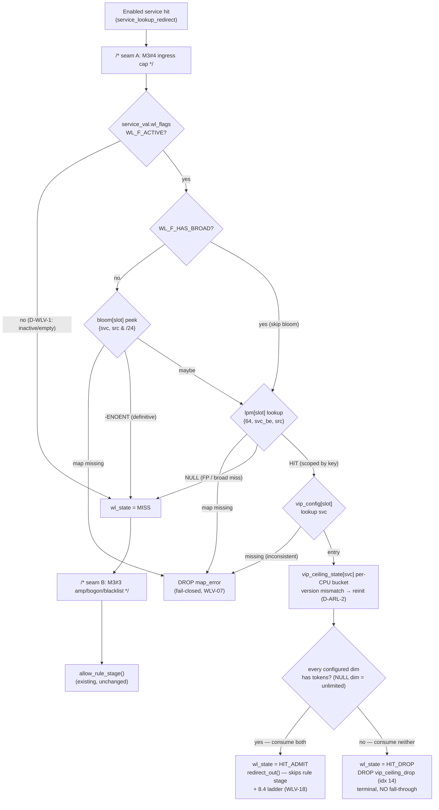

# Whitelist/VIP (Scoped) & VIP Ceiling Design

**Spec**: `.specs/features/whitelist-vip/spec.md` (WLV-01..25)
**Context**: `.specs/features/whitelist-vip/context.md` (D-WLV-1 NULL ceiling = whitelist inactive)
**Status**: Approved (2026-07-09) → Tasks
**Execute precondition**: allow-rule-ratelimit fully executed (A-WLV-8) — this design reads ARL's
`rules.h` helpers and inserts into the same hot-path region.

---

## Architecture Overview

The whitelist stage is one new header (`src/whitelist.h`) inserted between the enabled-service hit and
ARL's rule stage ([xdp_gateway.bpf.c:127](../../../data-plane/src/xdp_gateway.bpf.c) enabled branch),
plus three slotted config maps and one unslotted runtime map:

- **`whitelist_bloom`** — `ARRAY_OF_MAPS[2]` of `BLOOM_FILTER` inners. Value = 8-byte
  `{service_id, src&/24}`. Guard only: peek-miss = definitive negative (skip LPM), peek-hit = must be
  confirmed. **Bloom inners are replace-only** (no delete/clear exists) — the natural fit for the
  double-buffer: M4 builds a *fresh* bloom, swaps it into the inactive slot's outer entry, then flips
  `active_slot`.
- **`whitelist_lpm`** — `ARRAY_OF_MAPS[2]` of `LPM_TRIE` inners with a **composite scoped key**
  `{prefixlen, service_id(be32), src_ip(be32)}` (max_prefixlen 64). Every entry carries
  `prefixlen = 32 + cidr_len ≥ 32`, so all 32 `service_id` bits are always fully matched — an entry
  for service A **cannot** match service B by construction (BL-02 enforced by key shape, not by a
  check). Lookup uses `prefixlen = 64`.
- **`vip_config_map`** — `ARRAY_OF_MAPS[2]` of `HASH` inners (`service_id → struct vip_config
  {version, flags, pps, bps}`), same shape as `rule_block_map`. Present **only for services whose
  whitelist is active** (D-WLV-1); consulted only on an LPM hit (rare path).
- **`vip_ceiling_state`** — `PERCPU_HASH` `service_id → struct rl_bucket` (**reuses ARL's bucket
  struct and rate-parametric helpers verbatim**). Unslotted runtime (§8.3); lazy version-reset against
  `vip_config.version` (D-ARL-2 pattern) — a slot flip self-resets the service's VIP bucket with zero
  worker plumbing.

Two existing structs each donate a pad byte (sizes unchanged, no ABI churn):

- **`service_val.wl_flags`** (was `_pad[0]`): `WL_F_ACTIVE` + `WL_F_HAS_BROAD`. This is how **D-WLV-1
  is enforced kernel-side at zero cost** — the service lookup already fetched this value, so a service
  with no active whitelist (no entries, or both ceilings NULL) skips bloom *and* LPM with a single
  flag test. No per-packet hash lookup for the common no-whitelist case.
- **`pkt_meta.wl_state`** (was `_pad[0]` of 2): `0 none / 1 miss / 2 hit-admitted / 3 hit-dropped`,
  observable via `test_meta_map` (WLV-09, A-WLV-7).

Hot path per enabled-service packet:

```
service_lookup_redirect()                              (existing, SLRD/ARL)
  └─ enabled hit
       /* WLV-24 seam A: M3#4 ingress-cost cap inserts HERE */
       → whitelist_stage(ctx, meta, slot, service->wl_flags)   (NEW, whitelist.h)
           ├─ !(wl_flags & WL_F_ACTIVE)          → miss path   (D-WLV-1: inactive = empty, WLV-06/13)
           ├─ unless WL_F_HAS_BROAD:
           │    bloom[slot] peek {svc, src&/24}
           │      outer/inner missing            → DR_MAP_ERROR (fail-closed, WLV-07)
           │      -ENOENT                        → miss path   (definitive negative, WLV-04)
           ├─ lpm[slot] lookup {64, svc_be, src}
           │      outer/inner missing            → DR_MAP_ERROR (fail-closed, WLV-07)
           │      NULL                           → miss path   (bloom FP or broad miss — clean, WLV-06)
           ├─ HIT → vip_config[slot] lookup svc
           │      missing entry/inner            → DR_MAP_ERROR (ACTIVE+hit ⇒ config must exist)
           │      neither SET flag               → miss path   (defense in depth: not active, D-WLV-1)
           │      → vip bucket (both dims, lazy version reset)
           │           tokens                    → wl_state=HIT_ADMIT; redirect_out(meta)
           │                                        (bypasses rule stage AND the future 8.4 ladder —
           │                                         WLV-05/18; NOT via admit_clean())
           │           exhausted                 → wl_state=HIT_DROP; DR_VIP_CEILING_DROP (idx 14,
           │                                        terminal — WLV-11)
           └─ miss path: wl_state=MISS
                /* WLV-24 seam B: M3#3 amplification/bogon/blacklist insert HERE */
                → allow_rule_stage(ctx, meta, slot)   (existing, unchanged)
```



**Rendered diagrams**: `diagrams/whitelist-stage-flow.{mmd,svg}` (the stage flowchart above) ·
`diagrams/whitelist-map-layout.{mmd,svg}` (scoped-key encoding + slotted/runtime map split).

---

## Research (verified 2026-07-09; Context7 unavailable, web + kernel docs)

1. **`BPF_MAP_TYPE_BLOOM_FILTER`** (kernel ≥ 5.16; node runs 6.8) — no keys (`key_size = 0`); add via
   `bpf_map_push_elem()` (BPF) / `bpf_map_update_elem(NULL key)` (userspace); query via
   `bpf_map_peek_elem()` (BPF) / `bpf_map_lookup_elem(NULL key)` (userspace) → `0` = *possibly*
   present, `-ENOENT` = **definitely absent**. False positives possible, false negatives are not
   (exactly WLV-04's guard property). `max_entries` sizes the bitmap (overfilling raises FP rate);
   `map_extra` low 4 bits = number of hash functions (default 5). **No element delete, no clear** —
   a bloom is rebuilt, never edited. ([kernel docs](https://docs.kernel.org/bpf/map_bloom_filter.html))
2. **Bloom as inner map** — kernel docs state a bloom filter "may be used as an inner map", and the
   implementation registers `.map_meta_equal`, the explicit opt-in required for inner-map use.
   Replacement inners must match type/key/value/flags/`max_entries`/`map_extra` (meta-equal check) —
   pinned in the M4 contract below. Static-inner declaration inside `__array(values, …)` alongside
   `map_extra` in BTF map defs is the one *composition* not explicitly documented → proven at the
   first build/load gate with a two-step fallback (see De-risk). ([eBPF docs](https://docs.ebpf.io/linux/map-type/BPF_MAP_TYPE_BLOOM_FILTER/),
   [map-of-maps docs](https://docs.kernel.org/bpf/map_of_maps.html))
3. **LPM composite key** — LPM tries support prefix lengths 8..2048 bits; data is matched MSB-first in
   network byte order; lookups pass `prefixlen = max_prefixlen`; `BPF_F_NO_PREALLOC` mandatory. An
   8-byte `{service_id_be, src_ip_be}` data with max_prefixlen 64 is within spec; entries whose
   prefixlen ≥ 32 always fully match `service_id` → scoping by construction. SLRD already proved
   LPM-as-inner on this kernel. ([kernel LPM docs](https://docs.kernel.org/bpf/map_lpm_trie.html))
4. **Per-CPU hash / lazy-reset / bounded loops** — unchanged from AD-019's verification (current-CPU
   access, zero-fill on create, bounded loops ≥ 5.3); the VIP bucket reuses that machinery as-is.

---

## Code Reuse Analysis

### Existing Components to Leverage

| Component | Location | How to Use |
| --- | --- | --- |
| Slot double-buffer (`ARRAY_OF_MAPS`[2] + static inners) | `src/xdp_gateway.bpf.c` (`service_map`), `src/rules.h` (`rule_block_map`) | Same shape ×3: `whitelist_bloom`, `whitelist_lpm`, `vip_config_map` |
| Pinned `active_slot` | SLRD slot pin | `whitelist_stage` receives the already-pinned slot (WLV-01) |
| `struct rl_bucket` + `rl_refill_dim` / `rl_burst` / `rl_cpu_count` / `rl_test_no_refill` / `rl_ncpus` | `src/rules.h` | VIP bucket **reuses the struct and every rate-parametric helper verbatim**; only thin `vip_bucket_{reset,refill,consume,admit}` wrappers needed (the rule-side ones take `rule_entry`, these take `vip_config`). `rules.h` itself is **not modified** |
| `rl_config.test_no_refill` | `src/rules.h` | **Shared deterministic knob** for all M3 buckets (WLV-17) — one switch, documented in TESTING.md |
| `record_drop(meta, reason)` | `src/drop_reason.h` | `DR_VIP_CEILING_DROP` (14) — exact count + sampling for free (WLV-20) |
| `redirect_out(meta)` + `test_meta_map` | `src/xdp_gateway.bpf.c` | VIP admit terminal; tests observe `verdict` + `wl_state` device-free |
| Seed helper + `const volatile` rodata idiom | `loader/loader.c` | Extend seed with optional whitelist + VIP config (WLV-21) |
| `BPF_PROG_TEST_RUN` harness, CPU pinning, packet builders | `tests/test_parse.c` | All new cases; baseline needs **zero migration** (no whitelist seeded = miss path, WLV-22) |

### Integration Points

| System | Integration Method |
| --- | --- |
| `service_lookup_redirect()` | Enabled branch calls `whitelist_stage(ctx, meta, slot, service->wl_flags)`; the stage's miss path calls `allow_rule_stage()` — ARL behavior byte-identical on miss |
| M4 worker (future) | Builds fresh bloom + LPM + vip_config inners for the inactive slot, sets `service_val.wl_flags`, one `active_slot` flip swaps all; layouts in `whitelist.h` + the `service_val`/key encodings **are** the contract (see Data Models notes) |
| SRL rows | `WhitelistEntry(service_id, source_cidr)` → LPM entries + bloom /24 keys; `ProtectedService.vip_pps/vip_bps` → `vip_config` flags+values; **D-WLV-1: both NULL → `WL_F_ACTIVE` stays unset and no vip_config entry is emitted** (builder-side primary, kernel flag test = belt-and-braces) |
| `dpstat` / pinned maps | **Zero change** — index 14 already decodes via `drop_reason_name[]` |
| M3 #3 / #4 (future) | Seam B (miss path, inside `whitelist_stage`) and seam A (before the `whitelist_stage` call) — marked comments + stable boundaries (WLV-24) |

---

## Components

### Whitelist stage — `src/whitelist.h` — NEW

- **Purpose**: whitelist/vip map definitions + the whole scoped-match/ceiling stage as one
  `__always_inline` function.
- **Interfaces**:
  - `whitelist_stage(struct xdp_md *ctx, struct pkt_meta *meta, __u32 slot, __u8 wl_flags) -> int
    (XDP action)` — called from the enabled-service hit; miss path tail-calls `allow_rule_stage()`.
  - Internal: `wl_bloom_maybe(slot, svc, src)`, `wl_lpm_hit(slot, svc, src)`,
    `vip_bucket_admit(cfg, meta, pkt_len)` (mirrors `rl_bucket_admit`, keyed `service_id` only).
- **Dependencies**: `pkt_meta.h`, `service.h` (`wl_flags`), `drop_reason.h`, `rules.h` (bucket
  helpers + `allow_rule_stage` — include order: `whitelist.h` after `rules.h`).
- **Reuses**: `rl_bucket` machinery; SLRD/ARL map-in-map shape.

### `service_val` extension — `src/service.h` — MODIFIED

- `__u8 wl_flags` takes one `_pad` byte (`_pad[3]` → `wl_flags` + `_pad[2]`); value size stays 8 —
  no SLRD test churn. `WL_F_ACTIVE` set by builder/seed only when entries exist **and** ≥1 ceiling
  dimension is set (D-WLV-1); `WL_F_HAS_BROAD` set when any entry has cidr_len < 24 (bloom cannot
  represent it — stage skips bloom and always LPM-confirms for that service).

### `pkt_meta` extension — `src/pkt_meta.h` — MODIFIED

- `__u8 wl_state` takes one `_pad` byte (`_pad[2]` → `wl_state` + `_pad[1]`); size stays 32.
  Values: `WL_STATE_NONE=0` (stage not reached/inactive), `WL_STATE_MISS=1`, `WL_STATE_HIT_ADMIT=2`,
  `WL_STATE_HIT_DROP=3`.

### Hot-path wiring — `src/xdp_gateway.bpf.c` — MODIFIED

- Enabled branch: `return whitelist_stage(ctx, meta, slot, service->wl_flags);` with the seam-A
  comment above the call. ARP path untouched (redirects before service lookup).

### Loader seed — `loader/loader.c` — MODIFIED

- Default seed **unchanged** (no whitelist → live smoke and baseline behavior identical). Optional
  env-driven whitelist seed (e.g., `XDPGW_SEED_WL_CIDR` + `XDPGW_SEED_VIP_PPS`/`_BPS`): inserts the
  LPM entry + bloom key(s) into both slots' inners, writes `vip_config`, sets `WL_F_ACTIVE`
  (+`WL_F_HAS_BROAD` if cidr < /24) on the seeded service — demoable without M4 (WLV-21). Exact
  flag/env spelling is a task-level choice.

### Tests — `tests/test_parse.c` — MODIFIED

- `seed_whitelist(service_id, cidr, vip_cfg)` helper writing bloom/LPM/vip_config inners via the
  skeleton + flipping `wl_flags` in `service_map`; new WLV cases per the test plan; baseline
  untouched (WLV-22).

### Docs — `TESTING.md` + `data-plane/README.md` — MODIFIED

- TESTING.md: whitelist-seeding convention + the **shared** `test_no_refill` knob covering rule and
  VIP buckets (WLV-25). README: D-WLV-1 onboarding note ("whitelist requires a VIP ceiling to take
  effect") + BL-08 residual failure mode (spoofed VIP flood → `vip_ceiling_drop` self-DoS, bounded;
  alert = M6).

---

## Data Models

```c
/* src/whitelist.h — the M4 build contract (config side) */
#define WL_BLOOM_PREFIX 24              /* bloom granularity: /24 buckets of source space */
#define WL_BLOOM_MAX_ENTRIES 65536      /* bitmap sizing target; map_extra = 5 hashes (default) */
#define WL_LPM_MAX_ENTRIES 65536
#define VIP_CONFIG_MAX_ENTRIES 1024     /* = service_inner_*/rule_block_* capacity */

enum wl_service_flags {                 /* lives in service_val.wl_flags */
    WL_F_ACTIVE    = 1 << 0,            /* D-WLV-1: entries exist AND ≥1 ceiling dim set */
    WL_F_HAS_BROAD = 1 << 1,            /* any entry cidr_len < 24 → skip bloom, always LPM */
};

enum vip_flags {
    VIP_F_PPS_SET = 1 << 0,             /* unset = unlimited dim; set + 0 = block (D-WLV-1) */
    VIP_F_BPS_SET = 1 << 1,
};

struct wl_lpm_key {                     /* whitelist_lpm inner: LPM_TRIE, max_prefixlen 64 */
    __u32 prefixlen;                    /* 32 + cidr_len ∈ [32, 64] — service_id always fully matched */
    __be32 service_id;                  /* big-endian: MSB-first LPM bit order (builder: htonl) */
    __be32 src;                         /* network order, as in pkt_meta */
};                                      /* LPM value: __u8 = 1 (presence only) */

struct wl_bloom_key {                   /* whitelist_bloom inner value (blooms have no keys) */
    __be32 service_id;
    __be32 src24;                       /* src & htonl(0xFFFFFF00) */
};                                      /* 8 bytes */

struct vip_config {                     /* vip_config_map inner: HASH service_id → */
    __u32 version;                      /* service config version — VIP bucket reset key (D-ARL-2) */
    __u8  flags;                        /* vip_flags */
    __u8  _pad[3];
    __u64 pps;                          /* packets/sec */
    __u64 bps;                          /* BYTES/sec — builder converts (rules.h precedent) */
};                                      /* 24 bytes */

/* runtime side (unslotted, §8.3): vip_ceiling_state PERCPU_HASH
 *   key = __u32 service_id, value = struct rl_bucket (REUSED from rules.h) */
```

**Maps** (all in `whitelist.h`):

| Map | Type | Size | Notes |
| --- | --- | --- | --- |
| `whitelist_bloom_0/1` | `BLOOM_FILTER` (inner), value `struct wl_bloom_key` | 65536, `map_extra` 5 | no key type; push/peek only; **replace-only** (no clear) |
| `whitelist_bloom` | `ARRAY_OF_MAPS`[2] | 2 | static inner assignment (de-risked, see below) |
| `whitelist_lpm_0/1` | `LPM_TRIE` (inner), `wl_lpm_key → __u8`, `BPF_F_NO_PREALLOC` | 65536 | composite scoped key |
| `whitelist_lpm` | `ARRAY_OF_MAPS`[2] | 2 | same as `service_map` |
| `vip_config_0/1` | `HASH` (inner), `__u32 → struct vip_config` | 1024 | same shape as `rule_block_*` |
| `vip_config_map` | `ARRAY_OF_MAPS`[2] | 2 | — |
| `vip_ceiling_state` | `PERCPU_HASH`, `__u32 → struct rl_bucket` | 1024 | **preallocated**; ~32 B × 1024 × nCPU (≈2 MiB at 64 CPUs) |

**Bloom granularity (A-WLV-1 resolved)** — entries with `cidr_len ≥ 24` contribute **exactly one**
bloom key (their /24 bucket: a /24 is one bucket; /25../32 lie inside one). Entries with
`cidr_len < 24` would need up to 2^(24−len) keys (a /8 → 65536) — instead they set
`WL_F_HAS_BROAD` on the service, which skips the bloom and LPM-confirms every packet **of that
service only**. Rationale: whitelists are trusted-source lists — overwhelmingly /24-or-narrower; the
broad case stays correct at LPM cost without bloom blow-up, and other services' bloom behavior is
unaffected. Packet-side key is always `src & /24` — one masked peek, no per-prefix-length loop.

**Bucket math** — identical to AD-019's (rate ÷ nCPU via `rl_ncpus` rodata, remainder-preserving
ns refill, burst = 1 s of per-CPU rate floored at 1, deterministic mode loads the quota as the whole
budget): the VIP bucket calls the same `rl_burst`/`rl_refill_dim` with `vip_config.pps/bps`.
Documented deviation bound (WLV-16) = node VIP admit ∈ [ceiling/nCPU, ceiling], never above. Miss
path builds locally + `BPF_ANY` insert; insert failure → `DR_MAP_ERROR` (never "no bucket = free
pass").

**M4 contract notes (pinned in `whitelist.h` comments)**:
- Bloom inners are **created fresh and swapped** (no clear); replacements must match
  `value_size`/`max_entries`/`map_extra` exactly (`bpf_map_meta_equal`).
- Bloom must be populated **superset-of-LPM per slot** (WLV-04's no-false-negative property is a
  build invariant, not a kernel one).
- `WL_F_ACTIVE`/`WL_F_HAS_BROAD` in `service_val` are built from the same snapshot as the whitelist
  inners of that slot (flag and maps swap atomically together — both live in slotted config).
- D-WLV-1: both ceilings NULL → `WL_F_ACTIVE` unset **and** no `vip_config` entry **and** (space
  saving, optional) no bloom/LPM entries emitted.

---

## Error Handling Strategy

| Error Scenario | Handling | Observable As |
| --- | --- | --- |
| `whitelist_bloom`/`whitelist_lpm`/`vip_config_map` outer or inner missing (consulted only when `WL_F_ACTIVE`) | `record_drop(DR_MAP_ERROR)` | fail-closed (WLV-07) — broken slot ≠ "no whitelist" |
| Bloom peek `-ENOENT` | definitive miss → rule stage | clean miss (WLV-04/06) |
| Bloom hit + LPM `NULL` (false positive, or broad-flag miss) | miss → rule stage | verdict identical to no-bloom (WLV-04); FP counter = M3 #3 |
| LPM hit + `vip_config` entry missing | `record_drop(DR_MAP_ERROR)` | inconsistent build — cannot be a clean state |
| `vip_config` entry with neither `SET` flag | treat as inactive → miss path | defense in depth for D-WLV-1 (builder never emits this) |
| VIP bucket exhausted (any configured dim) | `record_drop(DR_VIP_CEILING_DROP)` | index 14, terminal (WLV-11); drop consumes no tokens (WLV-14) |
| `vip_ceiling_state` insert fails | `record_drop(DR_MAP_ERROR)` | fail-closed |
| `WL_F_ACTIVE` unset (incl. D-WLV-1 NULL/NULL) | flag test → miss path, no map touched | behaves exactly as WLV-06 clean miss (WLV-13) |
| Config swap mid-flood | VIP bucket lazily reinits via version mismatch | one extra VIP burst per apply (D-ARL-2 posture, accepted) |
| Whitelisted src to disabled service / unmatched dst | never reaches the stage | `service_disabled` / `service_miss` (existing) |

---

## De-risk (first build/load gate, fail-fast — project convention)

Proven before any behavioral work, in ladder order; each rung preserves the external contract:

1. **Primary**: static `BLOOM_FILTER` inners declared in `__array(values, …)` of an `ARRAY_OF_MAPS`,
   `map_extra` via BTF map def, `bpf_map_peek_elem` from XDP, `bpf_map_push_elem` from userspace via
   skeleton. (Bloom-as-inner is documented; the *static-inner BTF declaration* combination is the
   unproven part.)
2. **Fallback A**: loader creates bloom inners with `bpf_map_create()` (`map_extra` explicit) and
   inserts them into the outer array before attach — same maps, runtime composition (this is exactly
   the M4 flow anyway).
3. **Fallback B (last resort, documented deviation)**: no bloom — stage behaves as if every service
   has `WL_F_HAS_BROAD` (always LPM-confirm). Verdicts identical by WLV-04's design (bloom is a cost
   optimization); PRD §8.1's bloom-before-LPM is then deferred to M3 #3's blacklist work and the
   deviation recorded in STATE.

---

## Test Plan (dp-unit unless noted; runner already CPU-pinned)

1. **De-risk case** (gate of the first task): bloom push (userspace) → peek (XDP) round-trip through
   the slot indirection; load succeeds native.
2. **Baseline zero-migration (WLV-22)**: full post-ARL suite green with no whitelist seeded
   (`wl_state == 0` spot-checked on an enabled-service case).
3. **Scope isolation (WLV-02/03)**: whitelist `198.51.100.0/24` on svc A only; src in-range → A
   redirects with **no rule block seeded** (`wl_state=2`, `rule_idx=NONE`); same src → svc B
   `not_allowed` (`wl_state=1`); src out-of-range → A takes rule path (`wl_state=1`).
4. **Bloom guard (WLV-04)**: forced FP — push a bloom key with no LPM entry → clean miss, verdict
   identical; bloom-miss path returns without LPM (asserted via verdict + `wl_state`, cost not
   directly observable).
5. **Broad entry (A-WLV-1)**: `/16` entry with `WL_F_HAS_BROAD` → hit works although its /24 keys
   were never bloomed.
6. **D-WLV-1 (WLV-13)**: LPM+bloom seeded but `WL_F_ACTIVE` unset → clean miss; `vip_config` with one
   dim set → other dim unlimited; `pps=0`+`PPS_SET` → every whitelisted packet drops index 14.
7. **Ceiling exact (WLV-10/11/17)**: `test_no_refill=1`, `pps=3` → exactly 3 redirects + N−3 drops,
   counter 14 exact; a seeded match-all rule receives **none** of the overflow (terminal).
8. **Dim independence (WLV-14)**: pps-exhausted drop leaves `bps_tokens` untouched.
9. **Reset-on-swap (WLV-15)**: exhaust → rewrite `vip_config` with `version+1` → next packet admits.
10. **Fail-closed (WLV-07)**: `WL_F_ACTIVE` set with LPM inner removed → `map_error`; LPM hit with
    `vip_config` entry deleted → `map_error`.
11. **Aggregate sharing (WLV-12)**: two distinct whitelisted sources drain **one** budget (3+2 admits
    from burst 5, order-independent).
12. **Pipeline neighbors**: disabled service + whitelist → `service_disabled`; ARP still redirects;
    ICMP/GRE from a whitelisted source redirects (bypass is protocol-blind — rules never consulted).
13. **Live smoke (dp-integration, gated)**: default seed whitelist-free → `make smoke` unchanged
    (WLV-22/23); optional env-seeded VIP demo is manual, not gated.

---

## Tech Decisions (non-obvious ones)

| Decision | Choice | Rationale |
| --- | --- | --- |
| Scoping mechanism | Composite LPM key `{svc_be32, src_be32}`, entries prefixlen ≥ 32 | BL-02 enforced by key construction — no per-entry check, no per-service inner-map management; LPM data is MSB-first so a fully-matched leading `service_id` partitions the trie |
| D-WLV-1 enforcement point | Builder-side primary (`WL_F_ACTIVE` unset, no vip_config) + kernel flag test | Kernel check costs zero (flag rides the already-fetched `service_val`); builder omission saves map space; both together = no state where entries bypass without a ceiling |
| Where "whitelist active" lives | `service_val.wl_flags` pad byte, not a separate lookup | The common case (service without whitelist) pays **no** extra map access; value size unchanged (8 B) so SLRD contract/tests unaffected |
| Bloom granularity | /24 buckets; broader entries → per-service `WL_F_HAS_BROAD` (always-LPM) | One masked peek per packet, no prefix-length loop; no 2^k key blow-up for broad CIDRs; broadness degrades only the owning service to LPM-cost |
| VIP ceiling delivery | Separate slotted `vip_config_map`, consulted only on LPM hit | pps/bps/version don't fit `service_val` without growing SLRD's value ABI; hit path is rare so one hash lookup there is cheap; version field gives the bucket its D-ARL-2 reset key |
| VIP bucket | Reuse `struct rl_bucket` + rate-parametric `rl_*` helpers; new thin `vip_*` wrappers in `whitelist.h`; `rules.h` untouched | ARL is mid-execution — zero churn to its files; one bucket algebra across M3 (single deterministic knob, single deviation-bound story) |
| VIP admit terminal | `redirect_out()` directly, **not** `admit_clean()` | §8.4.6: VIP branch never enters the fairness ladder; `admit_clean` is exactly where M3 #4 inserts that ladder — routing VIP around it now prevents a silent future coupling |
| Bloom swap model | Replace-only inners (fresh build per swap), meta-equal params pinned | Blooms cannot be cleared or deleted from; double-buffer + inner replacement is the only correct rebuild path — documented so M4 doesn't attempt in-place updates |
| `wl_state` in `pkt_meta` | 4-state byte from a pad byte | Tests must distinguish miss vs hit-admit vs hit-drop vs not-consulted (WLV-09) without inferring from verdict alone; size stays 32 |
