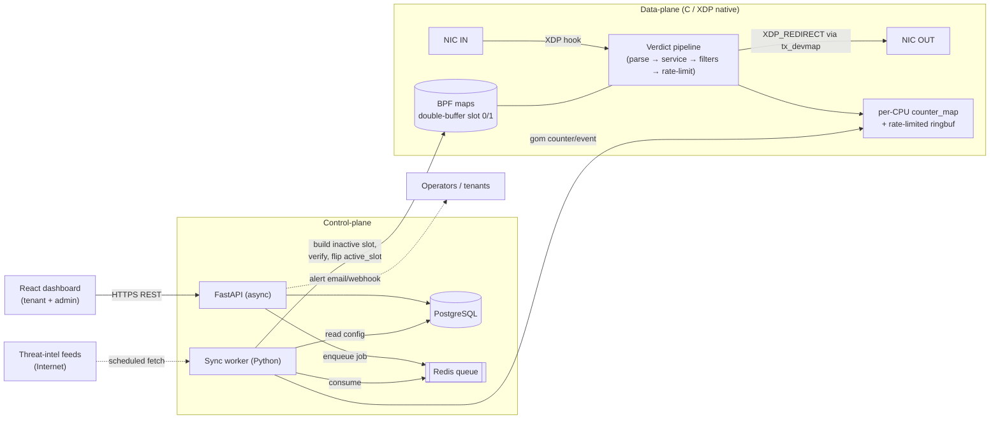
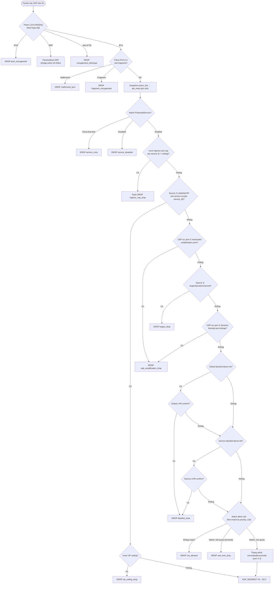
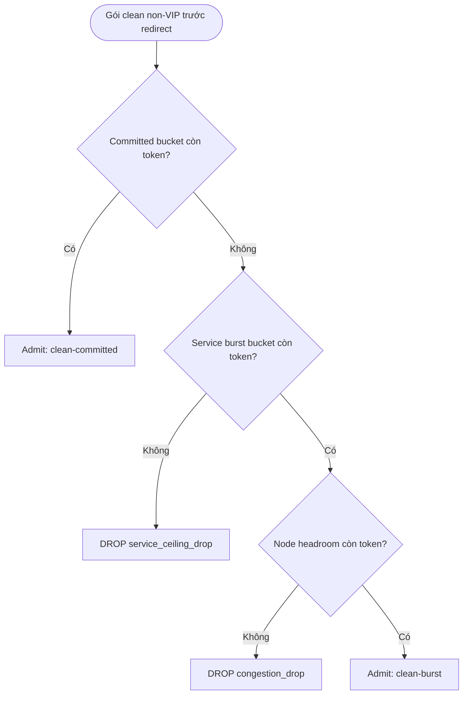

# TDD — Anti-DDoS Scrubbing Gateway

> Technical Design Document (thiết kế kỹ thuật) cho toàn hệ thống Pilot MVP v1 (M1–M6) và định hướng GA (M7).
> Tài liệu này diễn giải **cách hiện thực** các yêu cầu trong [PRD.md](../../PRD.md) và [PROJECT.md](PROJECT.md); nó là nguồn tham chiếu thiết kế cho đội phát triển, đặt cạnh [ROADMAP.md](ROADMAP.md) và [STATE.md](STATE.md).

| Trường | Giá trị |
|---|---|
| Sản phẩm | Anti-DDoS Scrubbing Gateway |
| Loại tài liệu | Technical Design Document (TDD) |
| Phạm vi | Toàn hệ thống — Pilot MVP v1 (M1–M6) + GA track (M7) |
| Phiên bản | v1.0 (Draft) |
| Trạng thái | **Draft — chờ review kỹ thuật** |
| Ngôn ngữ | Tiếng Việt |
| PRD nguồn | [PRD.md](../../PRD.md) v1.0 (Final) |
| Tech Lead | _(điền tên)_ |
| Product Owner | _(điền tên)_ |
| Đội phát triển | _(điền: data-plane / control-plane / frontend / SRE)_ |
| Epic/Ticket | _(link Jira/Linear)_ |
| Ngày tạo | 2026-07-07 |
| Cập nhật gần nhất | 2026-07-07 |

---

## 1. Bối cảnh (Context)

### Background

Anti-DDoS Scrubbing Gateway là một **scrubbing node đơn lẻ (single-node)** đặt inline trước hạ tầng được bảo vệ, hoạt động như một lớp lá chắn L3/L4. Node có 2 card mạng: `IN` (nhận traffic từ upstream/WAN) và `OUT` (chuyển traffic sạch sang backend/clean zone). Gateway phân loại gói **theo thời gian thực tại tầng XDP/eBPF ngay ở driver NIC**, loại bỏ traffic độc hại (volumetric L3/L4), và **redirect** gói sạch từ `IN` sang `OUT` theo mô hình **L2 transparent bridge inbound-only**: giữ nguyên header L3, không giảm TTL, không tính lại IP checksum, không đi qua Linux networking stack.

Đây là dự án **greenfield** — chưa có hệ thống tiền nhiệm để migrate. Hiện tại repo đã khởi tạo control-plane (FastAPI + PostgreSQL) và đang ở milestone **M1** (auth/RBAC, tenant & CIDR allocation — xem [STATE.md](STATE.md)).

### Domain

Hệ thống thuộc miền **network security / DDoS mitigation** kết hợp **multi-tenant SaaS nội bộ có tính phí**. Ba trục nghiệp vụ đan xen:

1. **Data-plane hiệu năng cao** — lọc gói ở tốc độ đường truyền (line-rate) bằng eBPF.
2. **Control-plane multi-tenant** — quản trị tenant, cấp phát IP/CIDR, cấu hình service/rule/list/feed với cách ly tenant chặt.
3. **Chargeback nội bộ** — đo băng thông sạch theo p95 Gbps, xuất `BillingUsage` để tính phí giữa các đơn vị nội bộ.

### Stakeholders

- **Tenant users** — các đơn vị nội bộ trả phí, sở hữu IP/CIDR đứng sau scrubber; tự cấu hình và giám sát service của mình.
- **System admin** — cấp phát tenant/CIDR/threat feed, giám sát node, vận hành bypass/maintenance.
- **Đội SRE/vận hành** — giám sát health data-plane, phản ứng alert, thực thi runbook bypass.
- **Bộ phận tài chính nội bộ** — tiêu thụ `BillingUsage` cho chargeback/showback.
- **Product/Legal** — theo dõi các mục Pilot còn mở (IPv6 blackhole, capacity positioning, license threat feed).

---

## 2. Định nghĩa vấn đề & Động lực (Problem Statement & Motivation)

### Vấn đề cần giải quyết

- **Tấn công volumetric L3/L4 làm nghẽn hạ tầng được bảo vệ.** UDP/SYN/ICMP flood, port scan, UDP reflection/amplification hướng vào IP/CIDR của tenant.
  - Tác động: mất truy cập dịch vụ, downtime, thiệt hại cho các đơn vị nội bộ đứng sau.
- **Không có lớp lọc hiệu năng cao đặt trước hạ tầng.** Lọc bằng stack kernel/iptables thông thường không đạt được throughput mục tiêu (≥40 Gbps / 20 Mpps) với added latency đủ thấp.
  - Tác động: hoặc chặn nhầm traffic sạch, hoặc không kịp lọc dưới tải cao.
- **Không cách ly & không đo lường được tài nguyên giữa các đơn vị dùng chung một node.** Không có mô hình fairness/committed-bandwidth ⇒ "noisy neighbor" (tấn công vào tenant A làm cạn tài nguyên của tenant B) và không tính phí công bằng được.
  - Tác động: không cam kết SLA per-tenant; không chargeback được.

### Vì sao bây giờ?

- **Nghiệp vụ:** mô hình thương mại nội bộ có thu phí (chargeback) đã được chốt (D4/15.6) → cần đo lường + cưỡng chế trần băng thông ngay từ Pilot.
- **Kỹ thuật:** XDP/eBPF native mode cho phép lọc gói tại driver NIC với chi phí CPU thấp — nền tảng để đạt line-rate mà stack truyền thống không đạt được.
- **Người dùng:** các đơn vị nội bộ cần một điểm scrubbing tập trung, tự phục vụ (self-service dashboard) thay vì xử lý DDoS rời rạc.

### Hệ quả nếu không giải quyết

- **Nghiệp vụ:** không có sản phẩm scrubbing nội bộ; các đơn vị tự chịu rủi ro DDoS; không có cơ chế chargeback.
- **Kỹ thuật:** tích lũy nợ kỹ thuật khi vá tạm bằng các giải pháp lọc kém hiệu năng.
- **Người dùng:** downtime khi bị tấn công; không có công cụ giám sát/cấu hình tập trung.

---

## 3. Phạm vi (Scope)

### ✅ Trong phạm vi (Pilot MVP v1 — M1..M6)

- **Data-plane XDP native** trên `IN`, redirect clean sang `OUT`; L2 transparent bridge inbound-only, header-preserving.
- **Lọc volumetric L3/L4:** UDP/SYN/ICMP flood, port scan, UDP reflection/amplification (bằng rate-limit + blacklist + hardcoded/dynamic amplification ports + bogon).
- **Service allowlist** theo IP/CIDR, protocol, source/destination port range; allow-rule **first-match theo `priority`** (tối đa 16 rule/service) với rate-limit aggregate PPS/BPS.
- **Whitelist/VIP** (bypass có scope theo `service_id`, chịu VIP ceiling); **blacklist** tenant/service scoped + **global blacklist** + **threat-intel feed** theo lịch.
- **Fairness & committed clean-bandwidth reservation** per-service (token bucket 2 tầng + node headroom + ingress-cost cap).
- **Worker Python + Redis job pipeline;** rebuild/swap BPF map bằng double-buffer `active_slot` với rollback.
- **Dashboard tenant + admin;** telemetry service-level; chargeback p95 clean-Gbps (`ServicePlan`/`BillingUsage`).
- **Auth/RBAC** cách ly tenant chặt (fail-closed); audit log; alerting (email/webhook); global bypass + maintenance mode.

### ❌ Ngoài phạm vi (v1)

- WAF/L7/HTTP inspection/reverse proxy.
- IPv6 forwarding đầy đủ (IPv6 **hard-drop** trong v1); IPv4 fragment bị drop.
- HA/failover/clustering (single-node duy nhất).
- BGP dynamic routing / Flowspec / route advertisement.
- MAC/bridge learning động; packet-level forensic đầy đủ / lưu payload.
- Auto-mitigation / auto-rule generation (v1 chỉ manual config).

### 🔮 Định hướng tương lai (GA — M7 trở đi)

- HA active/passive + link bypass (CM-01, **GA blocker**) — điều kiện cam kết Availability.
- IPv6 forwarding (CM-02); auto-response/one-click mitigate (OP-02); monitor/count-only rule mode (OP-04); one-click rollback UI (OP-05).
- Sampled per-tenant drop-flow records (OP-06); `expires_at` reconciliation sweep (BL-07); stateless SYN-cookie/scan detection (BL-04); PII retention cho `top_src` (CM-08); multi-admin (OP-07); SSO/MFA (CM-10).

---

## 4. Giải pháp kỹ thuật (Technical Solution)

### 4.1. Tổng quan kiến trúc

Hệ thống gồm 5 mặt phẳng (plane) chính, tách biệt theo trách nhiệm và hot-path:

| Thành phần | Công nghệ | Trách nhiệm |
|---|---|---|
| **Data-plane** | C — XDP/eBPF (native), libbpf | Hot path: parse gói, verdict pipeline, redirect `IN→OUT`, per-CPU counter/token-bucket. **Không bao giờ chạm database.** |
| **Control-plane API** | Python + FastAPI (async) | REST/dashboard API: auth/RBAC, CRUD service/rule/list/feed, apply-status, monitoring/health query. Ghi database, đẩy job Redis. |
| **Sync worker** | Python | Nhận job Redis, build BPF map slot inactive từ database, verify, swap `active_slot`; đồng bộ feed; gom telemetry. |
| **Job queue** | Redis | Hàng đợi job control-plane → worker; idempotent theo `job_id`/version. |
| **Database** | PostgreSQL (`inet`/`cidr`, GiST) | Nguồn sự thật cho toàn bộ cấu hình, billing, audit; ràng buộc CIDR non-overlap. |
| **Dashboard** | React SPA | UI tenant + admin; realtime telemetry (refresh ≤ 2s). |

**Nguyên tắc kiến trúc cốt lõi:**

1. **Tách hot-path khỏi control-path tuyệt đối.** Data-plane chỉ đọc BPF map; mọi thay đổi cấu hình đi qua control-plane → Redis → worker → map. Điều này giữ hot path không có I/O chặn và không có state per-source-IP (chống hash-map thrashing khi bị spoofed-IP flood).
2. **Config propagation atomic qua một `active_slot` duy nhất** (double-buffer) — không bao giờ swap từng map lẻ (BL-06/AD-005).
3. **Fail-closed ở control-plane** (RBAC/ownership) và **fail-closed ở packet-level** tại data-plane; **fail-open chỉ ở device-level** (link bypass) khi process/host chết (OP-03).
4. **Chính xác cho tiền, xấp xỉ cho telemetry.** Byte-count clean phục vụ billing lấy từ per-CPU counter chính xác trên hot path; ringbuf/perf sampling (rate-limited) chỉ dùng cho telemetry sự kiện.

#### Sơ đồ kiến trúc thành phần



### 4.2. Data-plane — verdict pipeline (M2–M3)

Mỗi gói vào XDP trên `IN` được **parse một lần** vào `pkt_meta`, **snapshot `active_slot`** một lần tại ingress (pin slot — mọi lookup của gói dùng cùng một version, không thấy trạng thái lai old/new), rồi chạy qua pipeline fail-fast dưới đây. Verdict là `XDP_REDIRECT` (clean) hoặc `XDP_DROP` (kèm drop reason chuẩn hóa).



**Quyết định thiết kế đã chốt (ảnh hưởng trực tiếp pipeline):**

- **Service `disabled` = drop-all** với reason riêng `service_disabled` (phân biệt `service_miss`), **không pass-through** — vì inline inbound-only, disable là ngắt bảo vệ chủ đích (AD-002/BL-03; yêu cầu confirm UI + audit ở control-plane).
- **Allow-rule first-match theo `priority` tăng dần, verdict terminal, không fall-through.** Rule khớp đầu tiên quyết định; nếu hết quota → `rate_limit_drop` (AD-004/BL-05). UI cảnh báo rule chồng lấn.
- **Whitelist/VIP bypass có scope `service_id`** — không sửa global map, không bypass chéo service (AD-003/BL-01/BL-02).
- **Hardcoded UDP amplification ports** chạy **sau** whitelist/VIP nhưng **trước** bogon/blacklist/rule (fail-fast reflection phổ biến nhưng bảo toàn ngoại lệ VIP). **Dynamic blocked-port bitmap** chỉ áp dụng **sau** service match (tránh chi phí lookup trên traffic không phục vụ).
- **L2 transparent bridge:** không TTL decrement, không incremental checksum, không ARP next-hop refresh trong forwarding chính của v1.

### 4.3. BPF map contract (M2–M4)

Hai nhóm map, tách theo tính chất **config (versioned/slotted)** và **runtime-state (không slot)**:

| Map | Loại gợi ý | Nhóm | Mục đích |
|---|---|---|---|
| `active_config` | array/global-data | — | `active_slot` (0/1) + version + cờ runtime (bypass/maintenance). **Điểm swap atomic duy nhất.** |
| `service_map` | hash/LPM theo dst IPv4/CIDR | config (slot) | Service enabled + metadata |
| `rule_block_map` | array/hash theo `service_id` | config (slot) | ≤16 allow-rule/service |
| `global_blacklist_bloom` / `_lpm` | bloom + LPM trie | config (slot) | Global blacklist (bloom guard → LPM confirm) |
| `service_blacklist_bloom` / `_lpm` | bloom + LPM trie | config (slot) | Service/tenant blacklist |
| `whitelist_bloom` / `_lpm` | bloom + LPM trie, key = `service_id`+src CIDR | config (slot) | Whitelist/VIP scoped (không bypass chéo) |
| `udp_blocked_port_bitmap` | array/bitmap | config (slot) | Dynamic source-port block |
| `rate_limit_state` | per-CPU array/hash | runtime | Aggregate token bucket per service/rule |
| `svc_committed_state` / `svc_burst_state` | per-CPU `PERCPU_HASH` *(amended by C1)* | runtime | Token bucket 2 tầng per-service (non-VIP) |
| `node_burst_state` | per-CPU array | runtime | Node headroom bucket = `node_clean_capacity − Σ committed` |
| `service_ingress_cap_state` | per-CPU array/hash | runtime | Trần chi phí ingress per-service (`k × ceiling`) |
| `vip_ceiling_state` | per-CPU array/hash | runtime | Aggregate token bucket cho whitelist/VIP |
| `counter_map` | per-CPU array/hash | runtime | PPS/BPS/drop-reason/bloom false-positive/billing bytes |
| `tx_devmap` | devmap | runtime | Redirect gói sạch `IN→OUT` |

**Ràng buộc slot (BL-06/AD-005):** nhóm config được version hóa theo **2 slot** (double-buffer) — hiện thực bằng map-in-map (`ARRAY_OF_MAPS`) chọn theo `active_slot`, hoặc thêm chiều slot vào key. Worker chỉ lật slot khi **toàn bộ** config map của slot inactive build xong **và verify**. Ghi `active_slot` là một thao tác atomic; lật ngược = **rollback tức thời**. Nhóm runtime-state là trạng thái sống, **không slot**.

### 4.4. Fairness & bảo đảm băng thông per-service (M3, mục 8.4 PRD)

Mục tiêu (CM-04): mỗi service luôn được giao đủ `committed_clean_gbps`, không bị service khác đang bị tấn công kéo xuống dưới mức cam kết trên data-plane dùng chung. Ba cơ chế:

1. **Token bucket 2 tầng per-service (`service_agg_rate_state`):**
   - *Committed bucket* refill theo `committed_clean_gbps / ncpus`, dùng **per-CPU (`PERCPU_HASH`)** *(amended by C1)*. Gói khớp bucket này **luôn admit**.
   - *Burst bucket* refill theo `ceiling − committed`, dùng **per-CPU** (chấp nhận sai số). Gói vượt committed nhưng dưới ceiling rút từ đây.
   - Vì bucket tách theo service, service A bị flood chỉ tiêu committed+burst của **chính A** ⇒ committed của B được bảo toàn.
2. **Node headroom bucket (`node_burst_state`, per-CPU)** = `node_clean_capacity − Σ committed`. Gói **burst** phải rút token từ **cả** service-burst **và** node-headroom; gói **committed** bỏ qua node bucket. Node cạn headroom → shed toàn bộ burst (`congestion_drop`), committed vẫn chảy. Ràng buộc `Σ committed ≤ node_clean_capacity` (7.2) đảm bảo committed luôn có chỗ.
3. **Ingress-cost cap per-service (`service_ingress_cap_state`, per-CPU):** ngay **sau service match, trước lookup đắt**, áp trần pps/bps thô = `k × ceiling` (k≈2–4). Vượt → early random-drop `ingress_cap_drop` rất rẻ, giới hạn CPU mà một service bị tấn công tiêu tốn. Trần theo **destination service** (không theo source) ⇒ miễn nhiễm spoofing.



**Giới hạn residual (tài liệu hóa — 8.4.6):** committed clean bandwidth được **bảo đảm cứng**; nhưng dưới flood PPS vượt tổng năng lực phân loại của node, ingress-cost cap **giới hạn nhưng không loại bỏ** tranh chấp CPU — đây là giới hạn vật lý single-node, thuộc bài toán capacity/HA (CM-01/CM-06), **không che giấu trong cam kết SLA**. Nhánh whitelist/VIP dùng VIP ceiling riêng, không đi qua thang admit này.

### 4.5. Config propagation & apply-status (M1 API + M4 worker)

Mỗi thay đổi control-plane chạy qua state machine apply-status hiển thị trên UI (9.2):

```mermaid
sequenceDiagram
    participant U as Dashboard/API client
    participant A as FastAPI
    participant DB as PostgreSQL
    participant R as Redis
    participant W as Worker
    participant M as BPF maps

    U->>A: PUT /services/{id} (đổi cấu hình)
    A->>A: RBAC + tenant-ownership check (fail-closed)
    A->>DB: ghi config (status=pending) + audit event
    A->>R: enqueue job (SERVICE_UPDATE, version=N)  [status=queued]
    A-->>U: 202 Accepted (apply_status=queued, version=N)
    W->>R: consume job (idempotent theo job_id/version)
    W->>DB: đọc config đầy đủ  [status=applying]
    W->>M: build slot inactive từ DB, verify toàn bộ config map
    alt build+verify OK
        W->>M: ghi active_slot (swap atomic)  [status=active]
        W->>DB: cập nhật apply_status=active, active_version=N
    else build/verify fail
        W->>DB: apply_status=failed + error; giữ slot active cũ
    end
```

Trạng thái: `pending` (đã ghi DB, chưa gửi job) → `queued` (đã tạo Redis job) → `applying` (worker đang rebuild/swap) → `active` (data-plane dùng version mới) → `failed` (apply lỗi, giữ active cũ). **Mục tiêu propagation ≤ 5 giây** từ API update tới active.

**Job worker (M4):** `SERVICE_UPDATE`, `RULE_UPDATE`, `LIST_UPDATE`, `FEED_SYNC`, `MAP_REBUILD`, `ACTIVE_SLOT_SWAP`, `TELEMETRY_AGGREGATE`. Yêu cầu reliability: idempotent theo `job_id`/version; swap chỉ khi mọi map build thành công; swap fail → giữ slot active cũ + ghi lỗi; worker restart không mất active state; retry không tạo trùng hoặc swap version cũ đè version mới.

### 4.6. API surface & control-plane (M1, M5, M6)

REST API async (FastAPI), auth session-based, mọi write kiểm tra RBAC + tenant-ownership (fail-closed). Các nhóm endpoint đại diện (hợp đồng cấp cao, path minh họa):

| Nhóm | Endpoint đại diện | Method | Mô tả |
|---|---|---|---|
| Auth/session | `/auth/login`, `/auth/logout` | POST | Đăng nhập session, hash password argon2/bcrypt |
| User CRUD | `/users`, `/users/{id}` | GET/POST/PUT/DELETE | Admin quản lý user, gán tenant, reset password |
| Tenant & CIDR | `/tenants`, `/tenants/{id}/cidrs` | GET/POST/DELETE | Cấp phát/thu hồi `AllocatedCIDR` (non-overlap toàn cục) |
| Service | `/services`, `/services/{id}` | GET/POST/PUT/DELETE | CRUD `ProtectedService`+`ServicePlan`; disable cần confirm+audit |
| Allow-rule | `/services/{id}/rules` | GET/POST/PUT/DELETE | CRUD `AllowRule` (≤16, `priority` unique); cảnh báo overlap |
| Whitelist/Blacklist | `/services/{id}/whitelist`, `/blacklist` | GET/POST/DELETE | CRUD list scoped; whitelist trùng feed → alert+audit |
| Threat feed | `/feeds`, `/feeds/{id}/sync` | GET/POST/PUT/POST | CRUD nguồn feed + trigger sync thủ công |
| Monitoring | `/services/{id}/telemetry`, `/billing/usage` | GET | Query realtime + billing (p95 clean Gbps) |
| Node health | `/node/health`, `/node/bypass`, `/node/maintenance` | GET/POST | XDP mode, map version, bypass/maintenance (audit) |

**Ví dụ hợp đồng (minh họa, không phải schema cuối):**

```json
// POST /services  →  tạo ProtectedService + ServicePlan
{
  "cidr_or_ip": "203.0.113.0/24",
  "name": "web-frontend",
  "mode": "allow-rule-only",
  "enabled": true,
  "vip_pps": 50000, "vip_bps": 400000000,
  "plan": { "committed_clean_gbps": 2, "ceiling_clean_gbps": 5,
            "billing_metric": "p95_clean_bps", "overage_policy": "billed" }
}
// 202 Accepted
{ "id": "…", "apply_status": "queued", "version": 7, "active_version": 6 }
```

### 4.7. Mô hình dữ liệu (PostgreSQL — M1, M5)

Object chính (trường tối thiểu — xem PRD 7.1) và ràng buộc trọng yếu:

| Object | Ghi chú thiết kế |
|---|---|
| `Tenant` | `id, name, status`; xóa bị chặn nếu còn user/CIDR active (`suspend` là off-switch có thể đảo — AD-009). |
| `User` | `tenant_id, role (admin/tenant_user), username, password_hash, status`; `password_hash` argon2/bcrypt. |
| `AllocatedCIDR` | dùng type `cidr`; **non-overlap toàn cục** qua **GiST exclusion constraint** partial trên `status='active'` (AD-009). CIDR non-canonical / `0.0.0.0/0` bị từ chối. |
| `ProtectedService` | `cidr_or_ip` phải nằm trong `AllocatedCIDR` của tenant; gắn đúng **một** `ServicePlan` active (1:1). |
| `AllowRule` | `priority` unique trong cùng `service_id`; protocol/port-range; `pps/bps`. |
| `WhitelistEntry` / `BlacklistEntry` | hỗ trợ CIDR IPv4; có `service_id`+`scope`; IPv6 bị từ chối. |
| `ServicePlan` | `committed_clean_gbps ≤ ceiling_clean_gbps`; `Σ committed active ≤ node_clean_capacity` (oversubscription → cảnh báo admin). |
| `BillingUsage` | `p95_clean_gbps, committed, billed_gbps, overage_gbps`; `billed_gbps = max(committed, p95)`. |
| `ThreatFeedSource`, `TelemetryCounter`, `AgentJob` | feed source + lịch; counter theo `window_ts`; job idempotent theo version. |

### 4.8. Chargeback (M5, mục 10.3 PRD)

- **Đơn vị:** Gbps **sạch** (đã redirect `IN→OUT`, không tính drop). Chỉ số mặc định `billing_metric = p95 clean bps` trong kỳ.
- **Công thức:** `billed_gbps = max(committed_clean_gbps, p95_clean_gbps)`; phần vượt là `overage_gbps` xử lý theo `overage_policy` (`billed` = tính phí vượt; `capped` = đã chặn cứng ở ceiling).
- **Độ chính xác:** byte-count clean lấy từ **per-CPU counter chính xác trên hot path**, tách khỏi ringbuf/perf sampling (AD-006). Sampling chỉ dùng cho telemetry sự kiện, không tính tiền.
- Kết quả ghi `BillingUsage` theo `billing_period` (mặc định hàng tháng), export cho hệ thống chargeback nội bộ.

---

## 5. Rủi ro (Risks)

| Rủi ro | Tác động | Xác suất | Biện pháp giảm thiểu |
|---|---|---|---|
| Hash-map thrashing do spoofed source IP | Cao (sụt throughput) | Trung bình | **Không** dùng per-source-IP state trên default rule path; token bucket per-CPU/aggregate (PRD 13, 6.4) |
| XDP rơi về generic mode | Cao (mất phần lớn hiệu năng) | Trung bình | Health check **bắt buộc** cảnh báo khi không chạy native; benchmark chỉ nhận native (11.1) |
| Config swap không nhất quán (rule mới + service cũ) | Cao (drop nhầm/pass nhầm) | Thấp | Double-buffer `active_slot`, swap atomic một lần ghi, pin slot tại ingress (AD-005/BL-06) |
| Bloom filter fill-rate cao | Trung bình (LPM lookup tăng âm thầm) | Trung bình | Đo `bloom_hit_lpm_miss`; rebuild/resize theo lịch (PRD 13, 6.6) |
| Vỡ cách ly tenant (whitelist gỡ global cho tenant khác) | Cao (bảo mật) | Thấp | Bypass **scoped** `service_id`, không sửa global map; alert+audit khi trùng feed (AD-003/BL-01/02) |
| Per-CPU token bucket sai số | Trung bình (quota lệch theo CPU/RSS) | Cao | Tài liệu hóa sai số; per-CPU committed bucket (C1) bù đắp bằng khả năng mở rộng đa lõi; benchmark theo cấu hình prod |
| Single-node SPOF (fail-closed inline) | Cao (outage khi lỗi/bảo trì) | Trung bình | **Pilot:** loại Availability khỏi SLA + link bypass + global bypass + maintenance + OLA runbook (AD-007/OP-03). **GA:** HA active/passive (CM-01) |
| Whitelist spoofing (giả IP whitelisted) | Trung bình | Trung bình | VIP ceiling aggregate bắt buộc; audit + review whitelist định kỳ; cảnh báo khi VIP ceiling chạm liên tục (BL-08) |
| IPv6 hard-drop blackhole cho user hợp lệ | Cao (mất truy cập) | Trung bình | Cảnh báo onboarding rõ + checklist (tắt AAAA / route IPv6 vòng qua) — CM-02 (Pilot, Product-owned) |
| Over-claim SYN-flood/port-scan (chỉ rate-limit thô) | Trung bình (kỳ vọng sai) | Trung bình | Hạ cam kết thành "giảm thiểu bằng rate-limit/blacklist" ở tài liệu; SYN-cookie/scan detection là GA (BL-04) |
| Billing sai do dùng sampled events | Cao (tính tiền sai) | Thấp | Billing bytes từ per-CPU counter chính xác, tách khỏi sampling (AD-006) |
| Feed sync một nguồn lỗi làm hỏng feed active | Trung bình | Thấp | Build slot mới đầy đủ mới swap; feed mới lỗi → giữ version active gần nhất (6.7) |

**Thang điểm:** *Tác động* — Cao (down/mất dữ liệu/sai tiền) / Trung bình (giảm UX) / Thấp. *Xác suất* — Cao (>50%) / Trung bình (20–50%) / Thấp (<20%).

---

## 6. Kế hoạch triển khai (Implementation Plan)

Triển khai theo milestone dependency-ordered (M1–M6 = Pilot MVP; M7 = GA). Chi tiết feature xem [ROADMAP.md](ROADMAP.md).

| Milestone | Nội dung chính | Deliverable then chốt | Trạng thái |
|---|---|---|---|
| **M1 — Control-plane foundation & tenant model** | Auth/RBAC fail-closed, tenant isolation; Tenant & `AllocatedCIDR` (GiST non-overlap); Service/rule/list CRUD; apply-status state machine | Admin/tenant login, cấp CIDR, CRUD service/rule/list; mọi write tenant-scoped + audit | **IN PROGRESS** (auth-rbac + tenant-cidr spec drafted) |
| **M2 — Data-plane verdict pipeline (XDP core)** | Parse & fail-fast; service lookup + transparent redirect `IN→OUT`; `active_slot` pin; per-CPU drop-reason counters | Clean IPv4 → service enabled forwarded; unsupported drop đúng reason; counter chạy | PLANNED |
| **M3 — Policy enforcement & fairness** | Allow-rule first-match + rate-limit; whitelist/VIP scoped + VIP ceiling; blacklist bloom→LPM + amplification/bogon; fairness 8.4 | Pipeline 8.2 đầy đủ; test fairness pass (flood A không starve committed của B) | PLANNED |
| **M4 — Worker sync & threat feed** | Redis job pipeline; double-buffer build/swap + rollback; threat-feed sync resilient per source | Config change → active ≤ 5s; build fail giữ slot cũ; feed sync ghi stats | PLANNED |
| **M5 — Observability & chargeback** | `TELEMETRY_AGGREGATE`; dashboard tenant/admin; p95 clean-Gbps metering | Dashboard refresh ≤ 2s; `BillingUsage` từ per-CPU byte-count chính xác | PLANNED |
| **M6 — Operations & SLA** | Global bypass + maintenance (audit/alert); alerting (email/webhook, severity/hysteresis/dedup); SLA/OLA report per-tenant | Bypass/maintenance hoạt động; alert phủ data-plane/control-plane/SLA; SLA report | PLANNED |
| **M7 — GA track** | HA active/passive + link bypass (CM-01); IPv6 forwarding; auto-response; monitor/count-only; one-click rollback UI | Cam kết Availability SLA sau HA | PLANNED (Future) |

**Phụ thuộc & đường tới hạn (critical path):** M1 → M2 → M3 → M4 → M5 → M6. M2 cần M1 (config trong DB) để có dữ liệu build map; M3 cần khung pipeline M2; M4 cần map contract M2/M3; M5 cần counter M2–M3; M6 cần telemetry M5. M7 sau khi Pilot ổn định.

---

## 7. Cân nhắc bảo mật (Security Considerations)

> Đây là hệ thống **auth + multi-tenant + tính phí** → mục này bắt buộc.

### 7.1. Xác thực & phân quyền

- **Authentication:** session-based; password hash bằng **argon2/bcrypt** (không tự chế). Pilot **không** yêu cầu MFA/account-lockout (CM-10, hạ Backlog nếu tích hợp SSO/IdP nội bộ; nếu tự quản danh tính thì giữ GA).
- **Authorization:** RBAC 2 vai trò `admin` / `tenant_user`, **fail-closed** — lỗi phân quyền trả lỗi truy cập, **không** trả dữ liệu partial của tenant khác.
- **Cách ly tenant (5.2):** mọi API write kiểm tra ownership theo `tenant_id` **và** phạm vi `AllocatedCIDR`. Tenant chỉ tạo service trong CIDR được cấp; không xem/sửa/xóa tài nguyên hay telemetry của tenant khác. Whitelist scoped `service_id` (không bypass chéo).

### 7.2. Bảo vệ dữ liệu

- **Secrets/feed credential:** **không** log plaintext; lưu qua secret manager / env (PRD 11.2). Rà license threat feed trước Pilot (CM-07).
- **PII:** `TelemetryCounter.top_src` lưu source IP — là dữ liệu cá nhân theo GDPR/tương đương. Pilot chấp nhận; GA thêm **chính sách retention/anonymization + tùy chọn data residency** (CM-08).
- **In transit:** API dashboard qua HTTPS/TLS. Data-plane là L2 bridge (không TLS-terminate).

### 7.3. Audit & thao tác nguy hiểm

- **Audit log bắt buộc** cho thay đổi service/rule/list/feed/user.
- Thao tác nguy hiểm — **delete tenant, disable service, flush feed, kích hoạt global bypass/maintenance** — phải sinh **audit event** và (bypass/maintenance) **alert critical** + banner "BYPASS ACTIVE".

### 7.4. Best practices

- ✅ Input validation mọi endpoint; CIDR canonical hóa & từ chối `0.0.0.0/0`, non-canonical, IPv6.
- ✅ Chống SQL injection (parameterized / ORM async SQLAlchemy).
- ✅ RBAC + tenant-ownership trên mọi write; fail-closed.
- ✅ Rate-limit API control-plane (chống abuse), tách hoàn toàn khỏi rate-limit data-plane.
- ✅ Không đưa secret/PII vào log; scrub trước khi ghi.

---

## 8. Chiến lược kiểm thử (Testing Strategy)

Quy ước testing control-plane (AD-008): async (asyncpg + SQLAlchemy 2.0 `AsyncSession`, `redis.asyncio`, httpx `AsyncClient`); pytest với marker `unit`/`integration`; integration chạy trên docker-compose test stack (`compose.test.yml` PG+Redis). Quick gate = **ruff + mypy + unit**; full gate thêm integration.

| Loại test | Phạm vi | Mục tiêu | Cách tiếp cận |
|---|---|---|---|
| **Unit** | Service layer, RBAC/ownership, CIDR logic, billing math (p95, `max(committed,p95)`) | > 80% control-plane | pytest + mock |
| **Integration** | API + PostgreSQL (citext/JSONB/CHECK/GiST), Redis job enqueue/consume | Critical paths | pytest `integration` + compose PG/Redis |
| **Data-plane functional** | Verdict pipeline: mỗi drop reason, redirect, scope whitelist, first-match rule | Mọi nhánh 8.2 | Gói tổng hợp (packet crafting) + BPF map assertion |
| **Fairness/reservation** | Flood A không starve committed của B; burst shed `congestion_drop`; `ingress_cap_drop` | Bảo đảm 8.4 | Traffic generator đa service trên phần cứng mục tiêu |
| **Performance/Load** | Throughput, added latency, propagation | ≥40Gbps/20Mpps, p99 ≤1ms, ≤5s | Native XDP benchmark, multi-queue NIC + RSS |
| **Ops/E2E** | Bypass/maintenance, alerting dedup/hysteresis/auto-resolve, feed sync fail | Kịch bản 12.7 | Kiểm thử trên phần cứng có NIC bypass |

**Kịch bản trọng yếu (từ PRD 12):**

- **RBAC/isolation:** Tenant A không xem/sửa/xóa tài nguyên của B; không tạo service ngoài `AllocatedCIDR`.
- **Service policy:** `service_miss` vs `service_disabled` (drop-all + confirm/audit); `not_allowed`; first-match terminal → `rate_limit_drop` không fall-through.
- **Whitelist/blacklist:** whitelist A **không** bypass B; vượt VIP ceiling → `vip_ceiling_drop`; global blacklist giữ nguyên khi có whitelist; whitelist IP thuộc feed → alert+audit.
- **Packet verdict:** IPv6 → `ipv6_unsupported`; malformed → `malformed_ipv4`; fragment → `fragment_unsupported`; clean giữ nguyên TTL/checksum, redirect `IN→OUT`.
- **Chargeback/SLA:** vượt ceiling non-VIP → `service_ceiling_drop`; `BillingUsage` đúng `p95` & `max(committed,p95)`; billing byte-count khớp lưu lượng redirect độc lập sampling; fairness khi A bị tấn công.
- **Vận hành:** global bypass → pass-through + audit + alert + banner; process chết + NIC bypass → fail-to-wire; maintenance chặn `ACTIVE_SLOT_SWAP`; alert per-tenant không rò rỉ.

---

## 9. Giám sát & Observability (Monitoring & Observability)

### 9.1. Metrics theo dõi

Nguồn: `counter_map` per-CPU (chính xác, hot-path) + ringbuf/perf sampling (rate-limited, telemetry sự kiện). Worker `TELEMETRY_AGGREGATE` gom lên dashboard (refresh ≤ 2s).

| Metric | Ngưỡng cảnh báo | Đối tượng |
|---|---|---|
| PPS/BPS per service & node | Vượt ngưỡng attack-onset theo thời gian | Tenant (service của mình) / Admin (node) |
| Clean vs drop packets/bytes, drop-reason distribution | — | Tenant + Admin |
| `bloom_hit_lpm_miss` (bloom false-positive) | Fill-rate/FP vượt ngưỡng | Admin |
| XDP mode (native/generic/off) | **Rớt native→generic hoặc detach** | Admin (critical) |
| Map active version + apply status | `failed` | Admin |
| `map_error` counter | > 0 | Admin (critical) |
| Node clean throughput vs capacity | Gần capacity (congestion) | Admin |
| Committed honored per service (fairness) | Breach `committed_clean_gbps` | Tenant + Admin (SLA) |
| Added latency p99 | Vượt 1ms | Admin (SLA) |
| Worker job status / backlog | Down / stuck / backlog | Admin |
| Feed sync status | Fail per source hoặc toàn bộ | Admin |
| Bypass/maintenance active | Khi active | Admin (critical) + banner |

### 9.2. Drop reason chuẩn hóa (10.2)

`ipv6_unsupported`, `unsupported_ethertype`, `malformed_ipv4`, `fragment_unsupported`, `bogon_drop`, `service_miss`, `service_disabled`, `udp_amplification_drop`, `blacklist_drop`, `not_allowed`, `rate_limit_drop`, `service_ceiling_drop`, `congestion_drop`, `ingress_cap_drop`, `vip_ceiling_drop`, `map_error`.

### 9.3. Structured logging & alerting (M6, mục 11.5.2)

- **Log JSON có ngữ cảnh** (tenant_id, service_id, action, version, duration_ms). **Không** log secret/feed credential, PII thô.
- **Alerting (OP-01):** kênh **email + webhook HTTP generic**, routing theo severity (≥3 mức info/warning/critical), **threshold + hysteresis** chống alert storm, **dedup/rate-limit**, **auto-resolve** khi hết điều kiện.
- **Sự kiện:** attack onset; `map_error`; XDP native→generic; bypass/maintenance; trần chạm liên tục; bloom FP vượt ngưỡng; node gần capacity; feed sync fail; apply `failed`; worker down/backlog; whitelist trùng feed; fairness breach; latency vượt ngưỡng.
- **Cách ly:** alert per-tenant chỉ gửi tenant liên quan (tôn trọng 5.2); alert node/hệ thống gửi admin. Alert critical ghi audit; lịch sử alert query được. **Không đụng hot path** — alert sinh từ worker/control-plane dựa trên counter.

---

## 10. Kế hoạch Rollback (Rollback Plan)

### 10.1. Cấp cấu hình (data-plane) — rollback tức thời

Cơ chế cốt lõi là **double-buffer `active_slot`** (AD-005): worker build/verify slot inactive rồi lật `active_slot` bằng **một** thao tác ghi. **Rollback = lật ngược `active_slot`** về slot trước (OP-05) — tức thời, không cần rebuild.

| Trigger | Hành động |
|---|---|
| Apply config `failed` khi build/verify | **Tự động giữ slot active cũ**; ghi lỗi + alert; không swap |
| Config lỗi đã active (drop nhầm/pass nhầm nghi ngờ) | Lật ngược `active_slot` về version trước (one-flip); điều tra |
| Nghi gateway drop nhầm diện rộng | **Global bypass flag** (`active_config`) → pass-through `IN→OUT` bỏ filtering (khẩn cấp) + audit + alert critical + banner |
| Process/host gateway chết | **Link bypass (fail-to-wire)** ở NIC/thiết bị giữ kết nối (fail-open device-level) |

### 10.2. Cấp triển khai (deploy)

- **Data-plane / worker:** revert về build trước (BPF object + worker version). Vì runtime-state map không slot, worker restart **không** mất active state; retry job idempotent không swap version cũ đè mới.
- **Control-plane / dashboard:** deploy chuẩn (revert image); migration DB reversible (down migration), snapshot DB trước migration.

### 10.3. Sau rollback

- Root cause analysis trong 24h; fix ở môi trường dev; re-test (full suite + test cho root cause); re-deploy theo quy trình.
- Bypass/maintenance ghi audit; traffic qua bypass đếm **riêng** (không tính clean-scrubbed) để đối soát chargeback.

> **Lưu ý phân biệt fail policy (11.5.1):** (1) mức *packet* luôn **fail-closed** (gói không parse được → drop); (2) mức *thiết bị* (process/host chết) chọn được **fail-open** (link bypass). Hai phạm vi khác nhau, không mâu thuẫn; chính sách fail-open vs fail-closed phải cấu hình được và nêu trong OLA.

---

## 11. Chỉ số thành công (Success Metrics)

| Chỉ số | Baseline | Mục tiêu | Đo lường |
|---|---|---|---|
| Throughput/node | N/A (mới) | ≥ 40 Gbps hoặc 20 Mpps | Native XDP benchmark |
| Added latency (clean) | N/A | p99 ≤ 1 ms | Benchmark |
| Config propagation | N/A | ≤ 5 giây (API update → active) | Đo end-to-end |
| Dashboard realtime refresh | N/A | ≤ 2 giây | Frontend |
| Clean accuracy | N/A | Zero known false drop trong bộ test v1 | Test v1 + drop reason |
| Fairness | N/A | Committed clean bandwidth honored per-service khi neighbor bị flood | Test 8.4 |
| Scale envelope | N/A | ≤ 100 tenants, 1.000 services, 16 rules/service, 1M global blacklist | Load test |
| Chargeback | N/A | `BillingUsage` xuất đúng `billed_gbps = max(committed, p95)` | Đối soát billing |
| Availability | N/A | **Pilot: best-effort, KHÔNG cam kết SLA** (loại trừ có chủ đích); cao là mục tiêu GA sau HA | Uptime node |

---

## 12. Thuật ngữ (Glossary)

| Thuật ngữ | Giải thích |
|---|---|
| **XDP / eBPF** | eXpress Data Path — hook xử lý gói sớm nhất trong kernel, chạy ở driver NIC (native mode); eBPF là VM an toàn trong kernel chạy chương trình data-plane. |
| **Native / Generic XDP** | Native = driver NIC (hiệu năng cao, bắt buộc cho benchmark); Generic = fallback kernel (chậm, cần alert). |
| **L2 transparent bridge** | Cầu nối trong suốt tầng 2, không sửa header L3 (không giảm TTL, không đổi checksum). |
| **Inbound-only** | Chỉ xử lý chiều `IN→OUT`; return path đi đường khác (asymmetric/DSR). |
| **LPM trie / Bloom filter** | LPM = tra cứu CIDR theo longest-prefix-match; bloom = bộ lọc xác suất bỏ qua LPM khi chắc chắn không khớp (có FP đo được). |
| **Token bucket** | Cơ chế rate-limit; per-CPU giảm contention (chấp nhận sai số theo CPU/RSS); committed bucket per-CPU (C1). |
| **Committed / Ceiling clean Gbps** | Committed = băng thông sạch cam kết (bảo đảm cứng, cơ sở SLA & floor chargeback); Ceiling = trần cứng aggregate non-VIP. |
| **VIP ceiling** | Trần aggregate PPS/BPS cho traffic whitelist/VIP (giảm rủi ro spoofing). |
| **Active slot / double-buffer** | Hai bộ config map; swap atomic bằng một lần ghi `active_slot`; lật ngược = rollback. |
| **p95** | Bách phân vị thứ 95 — chuẩn ngành tính phí băng thông. |
| **Pilot / GA / OLA / SPOF / RSS** | Pilot = chạy thử có khách nội bộ trả phí; GA = production diện rộng; OLA = thỏa thuận vận hành nội bộ; SPOF = điểm hỏng đơn; RSS = Receive-Side Scaling (phân phối gói vào nhiều queue/CPU). |

---

## 13. Các phương án đã cân nhắc (Alternatives Considered)

Ánh xạ tới nhật ký quyết định ([STATE.md](STATE.md) AD-001..009; PRD 15.5). Các quyết định đã chốt 2026-07-07:

| Quyết định | Phương án đã chọn | Vì sao (loại phương án khác) | Ref |
|---|---|---|---|
| Stack control-plane | FastAPI + PostgreSQL + React | FastAPI chung Python với worker; Postgres có `inet/cidr` native; React hợp dashboard ≤2s | AD-001 |
| CIDR non-overlap | **Toàn cục** qua GiST exclusion | Một ràng buộc DB + scope check rõ (superset PRD 7.2); loại per-tenant-only vì mơ hồ | AD-009 |
| Service `disabled` | Drop-all + reason riêng + confirm/audit | Loại pass-through: inline inbound-only, disable là ngắt chủ đích | AD-002 |
| Whitelist bypass | Scope `service_id`, không sửa global | Loại "gỡ khỏi global map": vỡ cách ly tenant (A gỡ bảo vệ của B/C) | AD-003 |
| Allow-rule match | First-match by priority, terminal | Loại fall-through: sẽ làm rỗng ý nghĩa per-rule limit | AD-004 |
| Config swap | Double-buffer `active_slot` atomic | Loại swap từng map: tạo cửa sổ cấu hình lai new/old | AD-005 |
| Chargeback | p95 clean Gbps, per-CPU byte-count | Loại sampled events cho tiền: sampling mất mẫu; p95 là chuẩn ngành | AD-006 |
| SLA Availability | Loại khỏi SLA ở Pilot (best-effort) | Single-node fail-closed = SPOF; Availability chỉ cam kết được sau HA (GA) | AD-007 |

---

## 14. Phụ thuộc (Dependencies)

| Phụ thuộc | Loại | Trạng thái | Rủi ro |
|---|---|---|---|
| PostgreSQL (`inet/cidr`, GiST) | Hạ tầng | Có (M1) | Thấp |
| Redis (job queue) | Hạ tầng | Cần setup | Thấp |
| Phần cứng: server 2 NIC, **multi-queue + symmetric RSS**, hỗ trợ **native XDP** | Hạ tầng | Cần cung cấp | **Cao** — bắt buộc cho benchmark & fairness |
| NIC/thiết bị **bypass (fail-to-wire)** | Hạ tầng | Cần cho OP-03 | Trung bình |
| Kernel Linux hỗ trợ XDP native + libbpf | Nền tảng | Cần xác nhận version | Trung bình |
| Threat-intel feed sources | Ngoài | Cần rà **license** (CM-07) | Trung bình |
| Upstream provisioning (absorption capacity) | Mạng | Phụ thuộc định vị (CM-06) | Trung bình |
| Topology hỗ trợ asymmetric routing (inbound-only) | Mạng | Nội bộ kiểm soát | Thấp (CM-09) |

**Yêu cầu phê duyệt:** review bảo mật (auth/tenant isolation); rà license feed (CM-07); Product ký định vị capacity (CM-06) & cảnh báo IPv6 (CM-02); SRE sẵn sàng monitoring/bypass.

---

## 15. Yêu cầu hiệu năng (Performance Requirements)

| Chỉ tiêu | Yêu cầu | Cách đo |
|---|---|---|
| Throughput/node | ≥ 40 Gbps **hoặc** 20 Mpps | Native XDP benchmark trên phần cứng mục tiêu |
| Added latency (clean) | p99 ≤ 1 ms | Benchmark |
| Config propagation | ≤ 5 giây | API update → active data-plane |
| Dashboard refresh | ≤ 2 giây | Frontend |
| Committed bandwidth | Bảo đảm cứng per-service kể cả khi neighbor bị flood | Test fairness 8.4 |

**Điều kiện hiệu năng bắt buộc (11.1):** native XDP driver mode; multi-queue NIC + RSS enabled; **không** per-source-IP state trên default rule path; LPM lookup luôn có bloom guard (trừ rebuild/debug riêng); ringbuf/perf phải sampling + rate-limit để không nghẽn hot path. **Scalability:** hiệu năng đơn node là small/mid scrubber; scale-out/HA là roadmap GA — absorption capacity phụ thuộc upstream provisioning (CM-06).

---

## 16. Câu hỏi mở (Open Questions)

| # | Câu hỏi | Bối cảnh | Chủ trì | Trạng thái | Cổng |
|---|---|---|---|---|---|
| 1 | Cảnh báo IPv6 blackhole + checklist trong onboarding | IPv6 hard-drop → user hợp lệ mất truy cập | Product | 🔴 Open | Pilot (CM-02) |
| 2 | Định vị capacity (40G node = small/mid; absorption phụ thuộc upstream) | Tránh over-claim khả năng hấp thụ | Product | 🔴 Open | Pilot (CM-06) |
| 3 | Rà license threat feed cho dùng thương mại/nội bộ có phí | Nhiều feed cấm tái phân phối/commercial | Legal | 🔴 Open | Pilot (CM-07) |
| 4 | SYN-cookie stateless / scan detection để đỡ cam kết SYN-flood/port-scan | Hiện chỉ rate-limit thô | Tech Lead | 🟡 Deferred | GA (BL-04) |
| 5 | `expires_at` reconciliation sweep cho whitelist/blacklist | Entry hết hạn vẫn active nếu không rebuild | Backend | 🟡 Deferred | GA (BL-07) |
| 6 | Auto-response / one-click mitigate | Manual-only quá chậm cho pattern mới | Tech Lead | 🟡 Deferred | GA (OP-02) |
| 7 | PII retention/anonymization cho `top_src` | Source IP là dữ liệu cá nhân | Product/Legal | 🟡 Deferred | GA (CM-08) |

**Legend:** 🔴 Open · 🟡 Deferred (đã ghi vào roadmap/backlog) · ✅ Resolved.

---

## 17. Roadmap / Timeline

Tham chiếu chuẩn: [ROADMAP.md](ROADMAP.md). **M1–M6 = Pilot MVP v1; M7 = GA track.** Milestone dependency-ordered.

| Milestone | Mốc | Điều kiện hoàn thành (exit) |
|---|---|---|
| M1 Control-plane foundation | 🎯 Auth/tenant/CIDR/CRUD/apply-status | Login + CRUD tenant-scoped + audit; apply-status hiển thị version |
| M2 Data-plane XDP core | 🎯 Redirect clean, fail-fast drops | Clean IPv4 forwarded; drop reason đúng; counter chạy; slot pin |
| M3 Policy & fairness | 🎯 Pipeline 8.2 đầy đủ | Test fairness pass; whitelist scoped; blacklist bloom→LPM |
| M4 Worker & feed | 🎯 Propagation ≤5s, rollback | Build fail giữ slot cũ; feed resilient; swap atomic |
| M5 Observability & chargeback | 🎯 Dashboard ≤2s; `BillingUsage` | Metering từ per-CPU byte-count chính xác |
| M6 Operations & SLA | 🎯 **Pilot GO** | Bypass/maintenance + alerting + SLA report |
| M7 GA track | 🎯 GA (Availability SLA) | HA active/passive + link bypass (CM-01) |

**Critical path:** M1 → M2 → M3 → M4 → M5 → M6 → (Pilot) → M7 (GA).

---

## 18. Phê duyệt & Sign-off (Approval & Sign-off)

| Vai trò | Tên | Trạng thái | Ghi chú |
|---|---|---|---|
| Tech Lead | _(điền)_ | ⏳ Pending | Duyệt kiến trúc data-plane + fairness |
| Product Owner | _(điền)_ | ⏳ Pending | Xác nhận scope Pilot + mục CM-02/06/07 |
| Security review | _(điền)_ | 🔴 Not started | Auth/tenant isolation/PII |
| SRE/Ops | _(điền)_ | 🔴 Not started | Monitoring/bypass/OLA runbook |
| Legal | _(điền)_ | 🔴 Not started | License threat feed (CM-07) |

**Tiêu chí phê duyệt:** ✅ mọi mục mandatory đầy đủ · ✅ security review (auth/isolation) · ✅ rủi ro đã có mitigation · ⏳ test strategy QA duyệt · ⏳ monitoring/bypass SRE duyệt · ⏳ Product ký các mục Pilot mở.

**Bước tiếp theo sau phê duyệt:** cập nhật trạng thái TDD → In Review; tiếp tục M1 (auth-rbac → Execute, tenant-cidr → Design); tạo Epic/breakdown theo ROADMAP.

---

_— Hết TDD —_
