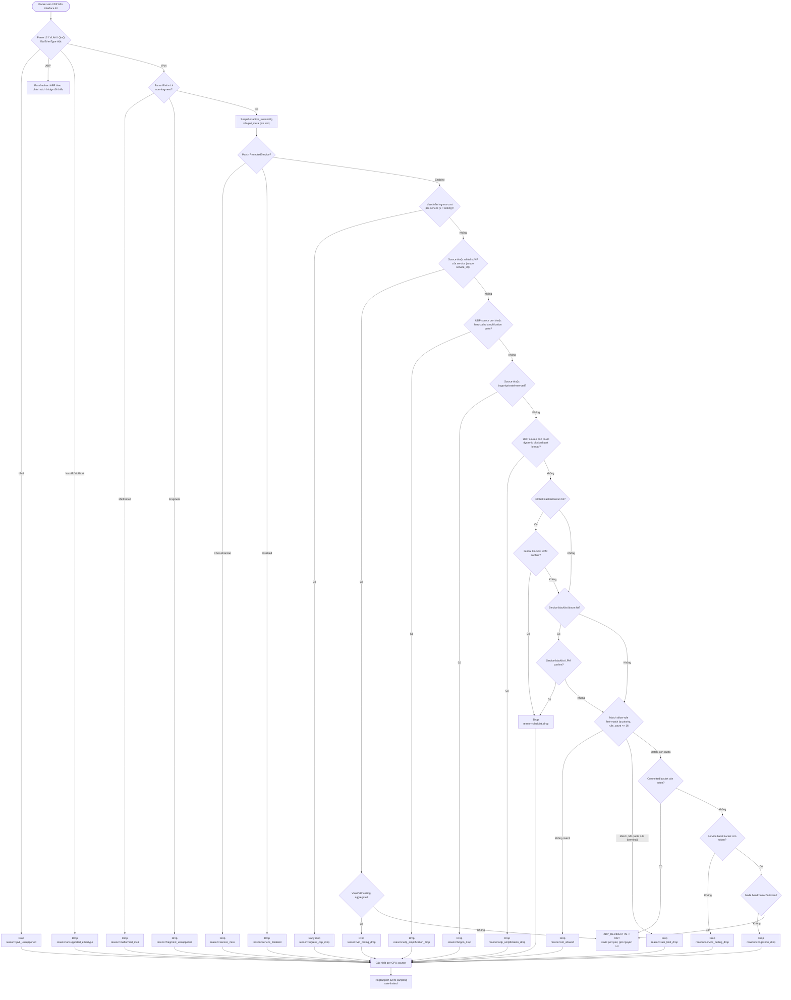
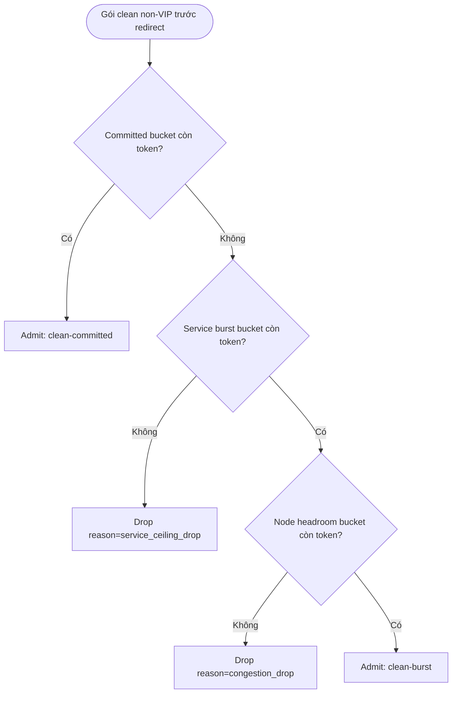

# PRD — Cổng Lọc và Giảm thiểu Tấn công DDoS (Anti-DDoS Scrubbing Gateway)

## Mục lục

1. Thông tin tài liệu
2. Tóm tắt sản phẩm
3. Mục tiêu và chỉ số thành công
4. Phạm vi
5. Personas và RBAC
6. Yêu cầu chức năng
7. Mô hình dữ liệu tối thiểu
8. Data-plane XDP/eBPF
9. Control-plane và API surface
10. Observability
11. Yêu cầu phi chức năng
12. Test plan và acceptance criteria
13. Rủi ro kỹ thuật và biện pháp giảm thiểu
14. Giả định MVP
15. Rà soát nghiệp vụ & nhật ký quyết định (BA Review & Decision Log)
16. Phụ lục — Thuật ngữ

## 1. Thông tin tài liệu

| Trường | Giá trị |
|---|---|
| Sản phẩm | Anti-DDoS Scrubbing Gateway |
| Loại tài liệu | Product Requirements Document (PRD) |
| Phiên bản | v1.0 (MVP v1) |
| Trạng thái | **Final — Sẵn sàng bàn giao cho phát triển Pilot** |
| Ngôn ngữ | Tiếng Việt |
| Ngày tạo | 2026-07-07 |
| Cập nhật gần nhất | 2026-07-07 |
| Mô hình thương mại | Thương mại nội bộ, có thu phí (chargeback giữa các đơn vị nội bộ) |
| Phạm vi phát hành | Nội bộ |
| Chủ sở hữu tài liệu | Product Owner _(điền tên)_ |
| Rà soát nghiệp vụ | Business Analyst (xem Mục 15) |
| Người phê duyệt | _(điền tên / ngày phê duyệt)_ |

### 1.1. Lịch sử phiên bản

| Phiên bản | Ngày | Nội dung chính |
|---|---|---|
| 0.1 | 2026-07-07 | Draft kỹ thuật đầu tiên: phạm vi MVP, data-plane XDP, control-plane, API surface. |
| 1.0 | 2026-07-07 | Hoàn tất rà soát BA (logic nghiệp vụ, vận hành, thương mại hóa); chốt 6 quyết định sản phẩm (Mục 15.5); bổ sung `ServicePlan`/chargeback (7.1/8.2/8.3/10.3), fairness/reservation data-plane (8.4), SLA/OLA (11.4), vận hành bypass + alerting (11.5); đóng 10 finding. Chuẩn hóa thành bản final bàn giao. |

### 1.2. Tình trạng sẵn sàng bàn giao

- **Đã chốt & thiết kế:** toàn bộ hạng mục logic nghiệp vụ, kỹ thuật data-plane và vận hành lõi — 10 finding đã đóng (Mục 15).
- **Còn mở trước Pilot (phi kỹ thuật):** CM-02 (cảnh báo IPv6 blackhole trong onboarding), CM-06 (định vị capacity), CM-07 (rà license threat feed) — thuộc Product/Legal, **không chặn phát triển**.
- **Điều kiện GA:** HA/failover (CM-01, Blocker) và các hạng mục GA khác — xem Mục 15.4.
- Tài liệu này là nguồn tham chiếu chuẩn (source of truth) cho đội phát triển Pilot.

## 2. Tóm tắt sản phẩm

Anti-DDoS Scrubbing Gateway là hệ thống lọc và giảm thiểu tấn công DDoS L3/L4 đặt tại scrubbing data center, đứng trước hạ tầng được bảo vệ như một lớp "lá chắn". Hệ thống nhận lưu lượng lớn từ phía upstream/WAN, phân loại theo thời gian thực tại tầng XDP/eBPF, loại bỏ traffic độc hại, và chuyển tiếp traffic sạch sang vùng backend/clean zone.

MVP v1 tập trung vào một gateway node đơn lẻ, chạy native XDP trên server có 2 card mạng:

- `IN`: nhận traffic từ upstream/WAN.
- `OUT`: chuyển traffic sạch sang backend/clean zone.

Gateway hoạt động theo mô hình L2 transparent bridge inbound-only: packet sạch được giữ nguyên header L3, không giảm TTL, không cập nhật IP checksum, không route qua Linux kernel networking stack, và được XDP redirect từ `IN` sang `OUT` theo static port pair.

## 3. Mục tiêu và chỉ số thành công

### 3.1. Mục tiêu sản phẩm

- Bảo vệ các IP/CIDR được admin cấp phát cho tenant trước tấn công volumetric L3/L4.
- Cho phép tenant tự cấu hình service, allow-rule, whitelist, blacklist, và theo dõi tình trạng traffic theo thời gian thực.
- Cho phép admin quản trị tenant, user, IP/CIDR, service toàn hệ thống, whitelist/blacklist, và threat intelligence feed.
- Đảm bảo data-plane có hiệu năng cao bằng native XDP/eBPF, fail-fast verdict pipeline, bloom filter, LPM trie, per-CPU counter/rate-limit, và cập nhật map an toàn qua worker.

### 3.2. Chỉ số thành công MVP v1

| Nhóm | Yêu cầu |
|---|---|
| Throughput mỗi node | Tối thiểu 40Gbps hoặc 20Mpps trong benchmark native XDP |
| Added latency | p99 <= 1ms với clean traffic trong benchmark MVP |
| Config propagation | Thay đổi service/rule/list/feed được cập nhật xuống data-plane <= 5 giây |
| Dashboard realtime | Số liệu service-level refresh <= 2 giây |
| Clean traffic accuracy | Zero known false drop trong bộ test v1; IPv6, fragment, malformed nằm ngoài cam kết pass |
| Scale envelope | Tối đa 100 tenants, 1.000 services, 16 rules/service, 1M global blacklist entries |
| Availability | Pilot: single-node, **Availability best-effort — không nằm trong cam kết SLA** (có maintenance window/bypass trong OLA). HA/failover là điều kiện GA cho cam kết Availability |

## 4. Phạm vi

### 4.1. Trong phạm vi MVP v1

- Lọc volumetric L3/L4: UDP flood, TCP SYN flood, ICMP flood, port scan, UDP reflection/amplification.
- XDP native mode trên interface `IN`, redirect clean traffic sang interface `OUT`.
- L2 transparent bridge inbound-only với static port pair.
- Service allowlist theo IP/CIDR, protocol, source port, destination port, và rate-limit aggregate PPS/BPS.
- Tenant whitelist/VIP và blacklist theo phạm vi service/tenant.
- Global blacklist từ threat intelligence feed theo lịch.
- Dashboard tenant/admin và worker Python nhận job qua Redis.
- Telemetry service-level: PPS/BPS, clean/drop, top source, top destination port, drop reason, bloom false-positive counters.

### 4.2. Ngoài phạm vi MVP v1

- WAF/L7 filtering, HTTP/HTTPS inspection, reverse proxy, cookie/header analysis.
- IPv6 forwarding/filtering đầy đủ; IPv6 bị drop cứng trong v1.
- BGP dynamic routing, BGP Flowspec, route advertisement tự động.
- HA/failover, active/passive pair, active/active cluster.
- MAC learning động hoặc bridge learning như Linux bridge.
- Packet-level forensic đầy đủ hoặc lưu payload.
- Auto-mitigation tự tạo rule; v1 chỉ hỗ trợ manual config.

## 5. Personas và RBAC

### 5.1. Vai trò

| Vai trò | Mô tả | Quyền chính |
|---|---|---|
| `admin` | Quản trị toàn hệ thống; chỉ có 1 admin chính trong MVP | Quản lý user, tenant, IP/CIDR, service toàn hệ thống, whitelist/blacklist, threat feed, trạng thái node |
| `tenant_user` | Người dùng thuộc tenant, tài nguyên độc lập với tenant khác | Quản lý service/rule/list trong IP/CIDR được cấp; xem monitoring service của mình |

### 5.2. Nguyên tắc cách ly tenant

- Tenant chỉ được tạo service trên IP/CIDR đã được admin cấp phát.
- Tenant không được xem, sửa, xóa service, whitelist, blacklist, telemetry chi tiết của tenant khác.
- Mọi API ghi dữ liệu phải kiểm tra ownership theo `tenant_id` và phạm vi `AllocatedCIDR`.
- Lỗi phân quyền phải fail-closed: trả lỗi truy cập, không trả dữ liệu partial của tenant khác.

## 6. Yêu cầu chức năng

### 6.1. Admin dashboard

Admin phải có các nhóm chức năng sau:

- Quản lý user: thêm, sửa, xóa, reset mật khẩu, gán tenant.
- Quản lý IP/CIDR: cấp phát, thu hồi, xem trạng thái sử dụng, kiểm tra overlap.
- Quản lý service toàn hệ thống: xem danh sách service kèm tenant/người tạo/trạng thái áp dụng data-plane.
- Quản lý whitelist/blacklist toàn hệ thống: xem entry kèm tenant/người tạo/nguồn tạo.
- Quản lý threat intelligence feed: thêm/sửa/xóa nguồn feed, lịch đồng bộ, trạng thái lần sync gần nhất, số entry hợp lệ/bị loại.
- Monitoring node: trạng thái XDP attach, native/generic mode, interface `IN/OUT`, throughput, drop reason, lỗi map update.
- Cấu hình alerting: kênh (email/webhook), ngưỡng, severity, routing (xem 11.5.2).
- Điều khiển vận hành: bật/tắt global bypass, maintenance mode, xem trạng thái bypass (xem 11.5.1).

### 6.2. Tenant dashboard

Tenant user phải có các nhóm chức năng sau:

- Quản lý service trên IP/CIDR được cấp phát.
- Quản lý allow-rule của service.
- Quản lý whitelist/VIP để bypass list/rule sau khi packet parse hợp lệ, nhưng vẫn chịu VIP ceiling.
- Quản lý blacklist tenant/service scoped.
- Xem realtime monitoring theo service: PPS/BPS, clean/drop, top source IP, top destination port, drop reason.

### 6.3. Service management

`ProtectedService` đại diện cho một IP/CIDR hoặc một endpoint được bảo vệ. Mỗi service phải có:

- Tenant sở hữu.
- IP/CIDR thuộc vùng đã được admin cấp.
- Trạng thái `enabled` hoặc `disabled`.
- Chế độ policy mặc định: `allow-rule only`.
- Tối đa 16 allow-rules trong MVP v1.
- Cấu hình VIP ceiling aggregate PPS/BPS.
- Gắn `ServicePlan`: `committed_clean_gbps` (băng thông sạch cam kết — cơ sở SLA/fairness và floor chargeback) và `ceiling_clean_gbps` (trần cứng aggregate cho traffic non-VIP).

Acceptance criteria:

- Tạo service ngoài IP/CIDR được cấp phải bị từ chối.
- Packet đến IP **chưa khai báo service** bị drop reason `service_miss`.
- Packet đến service **`disabled`** bị drop reason `service_disabled` (phân biệt với `service_miss`). Disable là hành động **chủ đích ngắt bảo vệ, KHÔNG pass-through**; thao tác disable phải có xác nhận UI + audit event (11.2).
- Packet đến service enabled nhưng không match allow-rule và không thuộc whitelist/VIP phải bị drop với reason `not_allowed`.

### 6.4. Allow-rule và rate-limit

Allow-rule là luật cho phép traffic đi qua service sau khi vượt qua các kiểm tra hard drop. Rule gồm:

- Protocol: TCP, UDP, ICMP, hoặc ANY trong phạm vi được hỗ trợ.
- Source port range: optional, chỉ áp dụng TCP/UDP.
- Destination port range: optional, chỉ áp dụng TCP/UDP.
- Reason/description.
- Rate-limit aggregate theo service/rule: PPS và BPS.
- Trạng thái enabled/disabled.

Yêu cầu kỹ thuật:

- Rate-limit mặc định không dùng state per-source-IP trên hot path để tránh hash-map thrashing khi bị spoofed-IP flood.
- Token bucket dùng per-CPU state và chấp nhận sai số theo số CPU/RSS queue.
- Vòng lặp rule phải dùng `rule_count` thực tế và early-exit khi có verdict terminal; không lặp cứng 16 lần nếu service có ít rule hơn.
- **Ngữ nghĩa match: first-match theo `priority` tăng dần.** Rule enabled khớp đầu tiên quyết định verdict và là **terminal**; nếu rule đó hết quota rate-limit → drop `rate_limit_drop`, **KHÔNG fall-through** sang rule khác (tránh làm rỗng ý nghĩa per-rule limit vì traffic tràn sang rule lỏng hơn). UI phải cảnh báo khi allow-rule chồng lấn để admin sắp đúng thứ tự priority.

### 6.5. Whitelist/VIP

Whitelist/VIP dùng để đảm bảo traffic hợp lệ quan trọng không bị chặn bởi blacklist, threat feed hoặc allow-rule thông thường.

Chính sách precedence:

- Chỉ áp dụng sau khi packet đã parse hợp lệ trong phạm vi IPv4 non-fragment.
- IPv6, malformed IPv4, fragment, EtherType không hỗ trợ vẫn bị drop trước khi whitelist được xét.
- Whitelist/VIP yêu cầu packet match một `ProtectedService` enabled; IP đích chưa khai báo service vẫn bị `service_miss`.
- Whitelist/VIP bypass bogon check, global blacklist, service blacklist, threat-intel feed, UDP amplification policy và allow-rule — **chỉ trong phạm vi service/tenant sở hữu whitelist**; lookup data-plane dùng key có `service_id` nên không bypass chéo sang service khác.
- Whitelist **không** chỉnh sửa hay loại entry khỏi global blacklist/threat-feed map; bypass được đánh giá per-packet theo scope. Whitelist một IP đang nằm trong threat feed phải phát **cảnh báo + audit**, và admin có cờ chính sách cấm whitelist IP thuộc feed.
- Whitelist/VIP vẫn chịu VIP ceiling aggregate PPS/BPS per service để giảm rủi ro spoofing whitelist.

Acceptance criteria:

- IP nguồn nằm trong whitelist/VIP của service được pass nếu packet hợp lệ và chưa vượt VIP ceiling.
- Khi vượt VIP ceiling, packet bị drop với reason `vip_ceiling_drop`.
- Whitelist của service A **không** được bypass cho service B (kiểm tra scope).
- Global blacklist/threat-feed map giữ nguyên đầy đủ khi có whitelist; whitelist chỉ bypass ở data-plane theo scope, **không xóa** entry global.

### 6.6. Blacklist

Blacklist gồm 2 phạm vi:

- Global blacklist: do admin hoặc threat intelligence feed tạo.
- Service/tenant blacklist: do tenant hoặc admin tạo trong phạm vi service/tenant.

Yêu cầu:

- Non-whitelisted traffic match blacklist phải bị drop với reason `blacklist_drop`.
- Blacklist lookup phải dùng bloom filter trước LPM trie để giảm lookup tốn kém.
- Hệ thống phải đo bloom false-positive bằng counter `bloom_hit_lpm_miss`.

### 6.7. Threat intelligence feed

Threat intelligence feed đồng bộ IP/CIDR xấu từ nhiều nguồn Internet theo lịch.

Yêu cầu:

- Admin cấu hình nguồn feed, lịch đồng bộ, trạng thái enabled/disabled.
- Worker Python tải feed theo lịch, validate, normalize, deduplicate, lưu database. **Không loại whitelist/VIP khỏi global map** (bypass whitelist xử lý per-scope ở data-plane — xem 6.5); thay vào đó đánh dấu và cảnh báo các IP feed trùng whitelist.
- Sau khi dữ liệu hợp lệ được lưu, worker rebuild map và active swap theo double-buffer/active slot.
- Lỗi sync một nguồn không được làm hỏng dữ liệu feed đang active.

Acceptance criteria:

- Feed sync phải ghi nhận số entry tải về, số entry hợp lệ, số entry bị loại do invalid/duplicate, và số IP feed trùng whitelist (đánh dấu cảnh báo, **không** xóa khỏi global).
- Nếu feed mới lỗi toàn bộ, data-plane tiếp tục dùng version blacklist active gần nhất.

### 6.8. Agent worker

Agent worker chạy Python, nhận job qua Redis và chịu trách nhiệm đồng bộ control-plane xuống data-plane.

Job bắt buộc:

| Job | Mục đích | Kết quả mong đợi |
|---|---|---|
| `SERVICE_UPDATE` | Cập nhật service enabled/disabled, CIDR, policy | Service map/rule map được rebuild/swap |
| `RULE_UPDATE` | Cập nhật allow-rule/rate-limit | Rule block map được rebuild/swap |
| `LIST_UPDATE` | Cập nhật whitelist/blacklist | LPM trie/bloom map được rebuild/swap |
| `FEED_SYNC` | Tải và xử lý threat feed | Database và global blacklist map được cập nhật |
| `MAP_REBUILD` | Rebuild toàn bộ BPF map từ database | New slot được chuẩn bị đầy đủ trước khi active |
| `ACTIVE_SLOT_SWAP` | Chuyển data-plane sang map slot mới | Swap atomic qua global config/active slot |
| `TELEMETRY_AGGREGATE` | Gom counter/event từ eBPF | Dashboard có số liệu refresh <= 2 giây |

Yêu cầu reliability:

- Job phải idempotent theo `job_id` hoặc version.
- Map swap chỉ được thực hiện khi toàn bộ map liên quan build thành công.
- Nếu swap thất bại, hệ thống giữ slot active cũ và ghi lỗi vận hành.

## 7. Mô hình dữ liệu tối thiểu

### 7.1. Object chính

| Object | Trường tối thiểu |
|---|---|
| `Tenant` | `id`, `name`, `status`, `created_at`, `updated_at` |
| `User` | `id`, `tenant_id`, `role`, `username`, `password_hash`, `status`, `last_login_at` |
| `AllocatedCIDR` | `id`, `tenant_id`, `cidr`, `status`, `allocated_by`, `created_at` |
| `ProtectedService` | `id`, `tenant_id`, `cidr_or_ip`, `name`, `mode`, `enabled`, `plan_id`, `vip_pps`, `vip_bps` |
| `AllowRule` | `id`, `service_id`, `protocol`, `src_port_start`, `src_port_end`, `dst_port_start`, `dst_port_end`, `pps`, `bps`, `reason`, `enabled`, `priority` |
| `WhitelistEntry` | `id`, `tenant_id`, `service_id`, `cidr`, `scope`, `reason`, `created_by`, `expires_at`, `enabled` |
| `BlacklistEntry` | `id`, `tenant_id`, `service_id`, `cidr`, `scope`, `source`, `reason`, `expires_at`, `enabled` |
| `ThreatFeedSource` | `id`, `name`, `url`, `format`, `schedule`, `enabled`, `last_sync_status`, `last_sync_at` |
| `TelemetryCounter` | `service_id`, `window_ts`, `pps`, `bps`, `clean_packets`, `drop_packets`, `drop_reason`, `top_src`, `top_dst_port` |
| `AgentJob` | `id`, `type`, `payload`, `status`, `version`, `created_at`, `started_at`, `finished_at`, `error` |
| `ServicePlan` | `id`, `service_id`, `committed_clean_gbps`, `ceiling_clean_gbps`, `billing_metric`, `billing_period`, `overage_policy`, `effective_from`, `effective_to` |
| `BillingUsage` | `id`, `service_id`, `tenant_id`, `period`, `p95_clean_gbps`, `committed_clean_gbps`, `billed_gbps`, `overage_gbps`, `sample_count`, `generated_at` |

### 7.2. Ràng buộc dữ liệu

- `AllocatedCIDR` không được overlap giữa tenant khác nhau trong MVP.
- `ProtectedService.cidr_or_ip` phải nằm trong `AllocatedCIDR` của tenant.
- `AllowRule.priority` phải unique trong cùng `service_id`.
- `WhitelistEntry` và `BlacklistEntry` phải hỗ trợ CIDR IPv4.
- IPv6 entry không được nhận trong MVP v1.
- Mỗi `ProtectedService` phải gắn đúng một `ServicePlan` active (1:1) tại một thời điểm.
- `committed_clean_gbps` <= `ceiling_clean_gbps`; `ceiling_clean_gbps` không vượt capacity clean node đã phân bổ.
- Tổng `committed_clean_gbps` của các service active không được vượt capacity clean cam kết của node; oversubscription phải cảnh báo admin (điều kiện đảm bảo SLA — xem 11.4).

## 8. Data-plane XDP/eBPF

### 8.1. Nguyên tắc thiết kế

- Native XDP driver mode là bắt buộc cho benchmark MVP.
- Fail-fast với các packet chắc chắn không hỗ trợ: EtherType lạ, IPv6, malformed IPv4, fragment.
- Parse packet một lần vào `pkt_meta`.
- Dùng bloom filter trước LPM trie cho whitelist/blacklist.
- Dùng per-CPU counter và per-CPU token bucket để giảm contention.
- **Cập nhật cấu hình atomic qua một `active_slot` duy nhất (double-buffer):** mọi config map được version hóa theo 2 slot; worker build đầy đủ slot inactive rồi lật `active_slot` bằng **một** thao tác ghi vào `active_config`. Không bao giờ swap từng map lẻ (tránh cửa sổ lai rule-mới/service-cũ).
- **Data-plane pin slot tại ingress:** mỗi packet snapshot `active_slot` một lần vào `pkt_meta` (xem 8.2) và dùng **cùng một** slot cho toàn bộ lookup của packet đó, đảm bảo không thấy trạng thái lai old/new giữa các map. Lật slot giữa chừng chỉ ảnh hưởng packet sau, không ảnh hưởng packet đang xử lý. Lật ngược `active_slot` về slot trước là cơ chế rollback tức thời (OP-05).
- Tất cả struct key dùng zero-init và xử lý padding nhất quán trước lookup/update map.

### 8.2. Pipeline verdict MVP v1

Ghi chú kỹ thuật:

- Service lookup được đặt sớm để xác định ngữ cảnh bảo vệ và whitelist/VIP; đây là lookup metadata rẻ, không phải vòng lặp rule.
- Hardcoded UDP amplification ports chạy sau whitelist/VIP nhưng trước bogon/blacklist/rule để vừa fail-fast reflection phổ biến vừa bảo toàn ngoại lệ VIP. Dynamic blocked-port bitmap chỉ áp dụng sau service match để tránh chi phí map lookup trên traffic không phục vụ.
- Vì MVP là L2 transparent bridge, các requirement L3 như `TTL decrement`, `incremental checksum`, `neighbor unresolved`, `ARP next-hop refresh` không thuộc data-plane forwarding chính của v1.
- Nhánh service match `Không` phân biệt 2 trường hợp: IP **chưa khai báo service** → `service_miss`; service tồn tại nhưng **`disabled`** → `service_disabled` (disable là ngắt chủ đích, không pass-through).
- Vòng lặp allow-rule là **first-match theo `priority` tăng dần**; rule khớp đầu tiên là terminal (kể cả khi hết quota → `rate_limit_drop`), không fall-through.
- Trên nhánh non-VIP, sau khi allow-rule match và còn quota per-rule, packet đi qua **thang admit committed/burst** (8.4): committed bucket còn token → admit; nếu không, burst bucket + node headroom → admit, ngược lại drop `service_ceiling_drop` (burst cạn) hoặc `congestion_drop` (node bão hòa). Đây là điểm cưỡng chế băng thông sạch phục vụ chargeback theo Gbps sạch và fairness per-service. Nhánh whitelist/VIP dùng VIP ceiling riêng, không đi qua thang admit này.

### 8.3. BPF map contract

| Map | Loại gợi ý | Mục đích |
|---|---|---|
| `active_config` | global data/array map | Lưu active slot/version và cờ runtime |
| `service_map` | hash/LPM theo destination IPv4/CIDR | Xác định service enabled và metadata |
| `rule_block_map` | array/hash theo `service_id` | Lưu block allow-rule tối đa 16 rule/service |
| `global_blacklist_bloom` | bloom/bitmap | Bypass LPM khi chắc chắn không match global blacklist |
| `global_blacklist_lpm` | LPM trie | Confirm global blacklist CIDR |
| `service_blacklist_bloom` | bloom/bitmap | Bypass LPM service blacklist |
| `service_blacklist_lpm` | LPM trie | Confirm service/tenant blacklist CIDR |
| `whitelist_bloom` | bloom/bitmap | Bypass LPM khi không match whitelist/VIP |
| `whitelist_lpm` | LPM trie, key = `service_id` + source CIDR | Confirm whitelist/VIP theo scope service (không bypass chéo service) |
| `udp_blocked_port_bitmap` | array/bitmap | Dynamic source-port block |
| `rate_limit_state` | per-CPU array/hash | Aggregate token bucket per service/rule |
| `service_agg_rate_state` | 2 tầng: committed = global array + `bpf_spin_lock`; burst = per-CPU | Token bucket per service (non-VIP): tầng committed (`committed_clean_gbps`, bảo đảm chính xác) + tầng burst (`ceiling_clean_gbps − committed_clean_gbps`) — xem 8.4 |
| `node_burst_state` | per-CPU array | Node headroom bucket = `node_clean_capacity − Σ committed_clean_gbps`; chỉ traffic burst rút token, committed bỏ qua — xem 8.4 |
| `service_ingress_cap_state` | per-CPU array/hash | Trần chi phí ingress per-service (`k × ceiling`) áp sớm sau service match để bảo vệ CPU phân loại — xem 8.4 |
| `vip_ceiling_state` | per-CPU array/hash | Aggregate token bucket cho whitelist/VIP |
| `counter_map` | per-CPU array/hash | PPS/BPS/drop reason/bloom false positive |
| `tx_devmap` | devmap | Redirect packet sạch từ `IN` sang `OUT` |

**Mô hình slot (ràng buộc atomic — BL-06):**

- Nhóm **config map version hóa theo 2 slot** (double-buffer): `service_map`, `rule_block_map`, `global_blacklist_bloom`, `global_blacklist_lpm`, `service_blacklist_bloom`, `service_blacklist_lpm`, `whitelist_bloom`, `whitelist_lpm`, `udp_blocked_port_bitmap`. Hiện thực bằng map-in-map (`ARRAY_OF_MAPS`) chọn theo `active_slot`, hoặc thêm chiều slot vào key.
- Nhóm **runtime state không slot** (là trạng thái sống, không phải config): `rate_limit_state`, `service_agg_rate_state`, `node_burst_state`, `service_ingress_cap_state`, `vip_ceiling_state`, `counter_map`, `tx_devmap`.
- `active_config` giữ `active_slot` (0/1) + version; ghi `active_slot` là **điểm swap atomic duy nhất**. Worker chỉ lật slot khi **toàn bộ** config map của slot inactive build xong và verify (6.8, 11.3). Lật ngược = rollback (OP-05). Data-plane pin slot tại ingress (8.1) nên mỗi packet chỉ thấy một version nhất quán.

### 8.4. Công bằng và bảo đảm băng thông per-service (fairness/reservation)

Mục tiêu (CM-04, 11.4): mỗi service luôn được giao đủ `committed_clean_gbps`, không bị service khác đang bị tấn công kéo xuống dưới mức cam kết trên data-plane dùng chung.

#### 8.4.1. Phân tách 2 loại tài nguyên tranh chấp

- **Băng thông clean (egress `OUT`):** chia sẻ được và **bảo đảm cứng** per-service bằng token bucket 2 tầng (8.4.2).
- **CPU phân loại gói (ingress XDP):** tài nguyên dùng chung **không thể reserve tuyệt đối** trên single-node vì gói tấn công phải được parse trước khi drop. Chỉ **giới hạn được** (8.4.4). Đây là giới hạn residual, được tài liệu hóa và thuộc bài toán capacity/HA (CM-01/CM-06), không được che giấu trong cam kết SLA.

#### 8.4.2. Cơ chế 1 — Token bucket 2 tầng per-service (committed + burst)

`service_agg_rate_state` giữ 2 bucket mỗi service:

- **Committed bucket:** refill đều theo `committed_clean_gbps`. Gói clean khớp bucket này **luôn được admit** (ưu tiên cao nhất). Để bảo đảm đúng mức cam kết bất kể phân bố RSS/CPU, committed bucket dùng **map global + `bpf_spin_lock`**; tranh chấp bị chặn trên bởi committed rate (thấp), không phải attack rate.
- **Burst bucket:** refill theo `ceiling_clean_gbps − committed_clean_gbps`, dùng **per-CPU** (chấp nhận sai số như các bucket per-CPU khác). Gói vượt committed nhưng dưới ceiling rút từ đây, chỉ admit khi node còn headroom (Cơ chế 2).

Vì bucket tách theo service, service A bị flood chỉ tiêu committed+burst của **chính A**; không thể chạm token của B ⇒ committed của B được bảo toàn.

#### 8.4.3. Cơ chế 2 — Node headroom bucket (bảo vệ committed khi node bão hòa)

`node_burst_state` (per-CPU) đại diện năng lực dư toàn node = `node_clean_capacity − Σ committed_clean_gbps`. Gói **burst** phải rút token từ **cả** service burst bucket **và** node headroom bucket; gói **committed** bỏ qua node bucket. Khi node headroom cạn, toàn bộ burst bị shed (`congestion_drop`) nhưng committed của mọi service vẫn chảy. Ràng buộc `Σ committed_clean_gbps ≤ node_clean_capacity` (7.2) đảm bảo committed luôn có chỗ.

#### 8.4.4. Cơ chế 3 — Trần chi phí ingress per-service (bảo vệ CPU phân loại)

`service_ingress_cap_state` (per-CPU): ngay **sau service match, trước các lookup đắt** (whitelist/blacklist/rule), áp trần pps/bps thô per-service = `k × ceiling` (k cấu hình, mặc định 2–4). Vượt trần → early random-drop `ingress_cap_drop` rất rẻ. Vì trần đặt **cao hơn ceiling**, traffic hợp lệ (kể cả VIP, committed) gần như không bị chạm; chỉ phần flood dư thừa bị chặn sớm, giới hạn CPU mà một service bị tấn công tiêu tốn, bảo vệ năng lực phân loại cho service khác. Trần theo **destination service** (không theo source) nên miễn nhiễm spoofing.

#### 8.4.5. Vị trí trong pipeline (bổ sung cho 8.2)

Ngay sau `service match`: áp **Cơ chế 3** (ingress cost cap) trước whitelist/VIP. Trên nhánh non-VIP, trước `redirectOut` là **thang admit** (Cơ chế 1+2), đã thể hiện trong sơ đồ 8.2; chi tiết:

Nhánh whitelist/VIP giữ nguyên VIP ceiling per-service (đã cô lập), không đi qua thang admit này.

#### 8.4.6. Giới hạn residual (tài liệu hóa — phần còn lại của SLA)

- Băng thông clean committed per-service: **bảo đảm cứng**.
- Dưới flood PPS vượt tổng năng lực phân loại của node, Cơ chế 3 giới hạn nhưng không loại bỏ hoàn toàn tranh chấp CPU; đây là giới hạn vật lý single-node, xử lý bằng capacity planning và HA scale-out (CM-01/CM-06). Cam kết SLA committed-bandwidth vẫn giữ; availability tuyệt đối dưới flood cực đại thuộc GA/HA.
- RSS: flood single-flow không spoof có thể dồn 1 queue/CPU; khuyến nghị symmetric RSS + đủ queue. Flood spoofed-source trải đều nên thuận lợi.

#### 8.4.7. Observability

Per-service counter (trong `counter_map`): clean-committed, clean-burst, `congestion_drop`, `ingress_cap_drop`, `service_ceiling_drop`, và ingress CPU-cost proxy (packets/cycles) để lộ diện noisy neighbor. SLA report (11.4) dùng các counter này để chứng minh committed được honor cho từng service.

## 9. Control-plane và API surface

### 9.1. Nhóm API/dashboard bắt buộc

- Auth/session và RBAC.
- User CRUD.
- Tenant và IP/CIDR allocation.
- Service CRUD.
- Allow-rule CRUD.
- Whitelist/blacklist CRUD.
- Threat feed source CRUD và trigger sync thủ công.
- Realtime monitoring query.
- Node/data-plane health query.

### 9.2. Trạng thái apply cấu hình

Mỗi thay đổi control-plane phải có trạng thái apply rõ ràng:

- `pending`: đã ghi database, chưa gửi job.
- `queued`: đã tạo Redis job.
- `applying`: worker đang rebuild/swap map.
- `active`: data-plane đang dùng version mới.
- `failed`: apply thất bại, có lỗi chi tiết.

Acceptance criteria:

- UI phải hiển thị version active hiện tại và trạng thái apply gần nhất của service/list/feed.
- Nếu apply thất bại, cấu hình active cũ vẫn tiếp tục chạy.

## 10. Observability

### 10.1. Dashboard metrics

Tenant nhìn thấy theo service:

- Current PPS/BPS.
- Clean packets/bytes.
- Dropped packets/bytes.
- Drop reason distribution.
- Top source IP.
- Top destination port.
- Rate-limit hit count.
- VIP ceiling hit count.

Admin nhìn thấy thêm:

- Tổng PPS/BPS theo node/interface.
- XDP mode: native/generic/off.
- Map active version.
- Worker job status.
- Threat feed sync status.
- Bloom hit, LPM confirm, bloom false-positive.
- Trạng thái bypass/maintenance, throughput so với capacity, lịch sử alert (xem 11.5).

### 10.2. Drop reason chuẩn hóa

Các reason tối thiểu:

- `ipv6_unsupported`
- `unsupported_ethertype`
- `malformed_ipv4`
- `fragment_unsupported`
- `bogon_drop`
- `service_miss`
- `service_disabled`
- `udp_amplification_drop`
- `blacklist_drop`
- `not_allowed`
- `rate_limit_drop`
- `service_ceiling_drop`
- `congestion_drop`
- `ingress_cap_drop`
- `vip_ceiling_drop`
- `map_error`

### 10.3. Đo lường chargeback (clean Gbps)

Chargeback nội bộ tính theo **Gbps sạch (clean)** — băng thông đã được redirect `IN -> OUT`, không tính traffic bị drop.

- Chỉ số tính phí mặc định (`billing_metric`): **95th percentile của clean bps** trong kỳ (chuẩn ngành cho băng thông), lấy mẫu theo `window_ts` của `TelemetryCounter`.
- Công thức: `billed_gbps = max(committed_clean_gbps, p95_clean_gbps)`; phần vượt `committed_clean_gbps` là `overage_gbps`, xử lý theo `overage_policy` (`billed` = tính phí vượt; `capped` = đã chặn cứng ở `ceiling_clean_gbps`).
- Kết quả ghi vào `BillingUsage` theo `billing_period` (mặc định hàng tháng) và export được cho hệ thống chargeback nội bộ.
- **Độ chính xác billing:** byte-count clean dùng cho billing phải lấy từ per-CPU counter chính xác trên hot path, **tách khỏi** ringbuf/perf event sampling rate-limited (vốn có thể mất mẫu). Sampling chỉ dùng cho telemetry sự kiện, không dùng để tính tiền.
- Dashboard tenant/admin hiển thị: clean Gbps hiện tại, p95 kỳ hiện tại, `committed_clean_gbps`, overage dự kiến.

## 11. Yêu cầu phi chức năng

### 11.1. Hiệu năng

- Benchmark phải chạy ở native XDP driver mode.
- Server phải có multi-queue NIC và RSS enabled.
- Pipeline không được dùng per-source-IP state trên default rule path.
- LPM trie lookup phải được bloom filter guard, trừ trường hợp map rebuild/debug được cấu hình riêng.
- Ringbuf/perf event phải sampling và rate-limit để không làm nghẽn hot path.

### 11.2. Bảo mật

- Password phải được hash bằng thuật toán phù hợp cho password storage.
- API write phải kiểm tra RBAC và tenant ownership.
- Audit log bắt buộc cho thay đổi service/rule/list/feed/user.
- Secret/feed credential không được log plaintext.
- Admin action nguy hiểm như delete tenant, disable service, flush feed, **kích hoạt global bypass/maintenance mode** phải có audit event.

### 11.3. Tính ổn định

- Data-plane fail-closed với packet không parse được hoặc EtherType không hỗ trợ.
- Control-plane fail-safe với map update: chỉ swap active slot khi build đầy đủ thành công.
- Worker restart không được làm mất trạng thái active hiện tại.
- Redis/job retry không được tạo dữ liệu trùng hoặc swap version cũ đè version mới.

### 11.4. SLA/OLA nội bộ per-tenant (mức: cao)

Mức cam kết per-tenant được chốt là **cao**. Các chiều SLA và cách đo:

| Chiều SLA | Mục tiêu đề xuất | Đo lường | Ghi chú |
|---|---|---|---|
| Băng thông sạch cam kết | Giao đủ tới `committed_clean_gbps`/service kể cả khi node bị tấn công vào service khác | Clean bps per service vs committed | Yêu cầu fairness/reservation ở data-plane |
| Độ chính xác clean | Zero known false drop trong committed envelope | Bộ test v1 + drop reason | Kế thừa 3.2 |
| Added latency | p99 <= 1ms với clean traffic | Benchmark | Kế thừa 3.2 |
| Config propagation / time-to-mitigate | <= 5 giây | API update -> active | Kế thừa 3.2 |
| Availability | **Pilot: best-effort, KHÔNG cam kết SLA** (loại trừ có chủ đích); cam kết Availability cao là mục tiêu GA sau khi có HA | Uptime node | Phụ thuộc HA |

Yêu cầu phát sinh do SLA cao:

- **Fairness/reservation ở data-plane (CM-04) — đã thiết kế ở 8.4:** `committed_clean_gbps` là băng thông *được đảm bảo* per-service qua token bucket 2 tầng (committed global + burst per-CPU), node headroom bucket shed burst khi node bão hòa, và trần chi phí ingress per-service bảo vệ CPU phân loại. Committed clean bandwidth được bảo đảm cứng; residual CPU-fairness dưới flood cực đại là giới hạn single-node (8.4.6), thuộc capacity/HA.
- **Quyết định (đã chốt 2026-07-07): chọn phương án (ii).** Ở Pilot **loại trừ có chủ đích chiều Availability** khỏi cam kết SLA (best-effort, có maintenance window + bypass procedure ghi trong OLA); cam kết cao ở các chiều latency/accuracy/propagation/fairness. **HA (active/passive + bypass) là điều kiện GA** để cam kết Availability cao. OLA nội bộ phải nêu rõ giới hạn Availability giai đoạn Pilot để bên trả phí đồng thuận trước khi vận hành.
- **SLA report per-tenant định kỳ** (đạt/không đạt từng chiều) là bắt buộc, gắn với `BillingUsage` để đối soát chargeback.

### 11.5. Vận hành: bypass/maintenance và alerting

Mục này gom hai yêu cầu vận hành bắt buộc cho Pilot (đóng OP-03, OP-01). Bypass là biện pháp bù cho CM-01; alerting là điều kiện để vận hành DDoS thời gian thực.

#### 11.5.1. Bypass và maintenance mode (OP-03)

Vì gateway là inline single-node fail-closed (SPOF), phải có cơ chế tránh outage toàn phần khi thiết bị lỗi/bảo trì.

- **Link bypass (fail-to-wire) ở mức thiết bị:** khuyến nghị NIC/thiết bị bypass trên cặp `IN`/`OUT`; khi process/host chết hoặc mất heartbeat, cặp port tự nối để traffic đi thẳng (fail-open ở mức link) — đánh đổi: mất scrubbing tạm thời để giữ kết nối. Chính sách fail-open (link) vs fail-closed phải cấu hình được và nêu trong OLA.
- **Hai tầng fail policy (nêu rõ để không mâu thuẫn 11.3):** (1) mức *packet* vẫn fail-closed — packet không parse được bị drop; (2) mức *thiết bị* (process/host chết) chọn được fail-open (link bypass). Đây là hai phạm vi khác nhau, không mâu thuẫn.
- **Global bypass flag (soft bypass):** cờ trong `active_config` cho admin chuyển data-plane sang pass-through toàn bộ có kiểm soát (XDP redirect `IN→OUT`, bỏ filtering) để khôi phục dịch vụ khẩn cấp khi nghi gateway drop nhầm. Bắt buộc audit + alert critical + hiển thị "BYPASS ACTIVE" nổi bật. Khác với disable service (per-service, drop-all).
- **Maintenance mode (per-node):** trạng thái node `maintenance` cho phép drain, chặn các job swap nguy hiểm (`ACTIVE_SLOT_SWAP`) ngoài ý muốn, và thông báo.
- **Runbook văn bản (đính kèm OLA):** khi nào bật bypass; cách rút gateway khỏi path (upstream reroute/link bypass); tiêu chí quay lại active; ai được phép thao tác.
- Traffic đi qua bypass được đếm riêng trong telemetry (không tính là clean-scrubbed) để đối soát và cảnh báo.

#### 11.5.2. Alerting (OP-01)

Mục 10 chỉ có dashboard passive; cần push alert chủ động.

- **Kênh:** tối thiểu email + webhook HTTP generic; routing theo severity (Slack/Telegram qua webhook là tùy chọn).
- **Sự kiện data-plane/health bắt buộc:** attack onset (PPS/BPS service/node vượt ngưỡng theo thời gian); `map_error`; XDP rớt native→generic hoặc detach; bypass/maintenance active; service/VIP/rate-limit chạm trần liên tục; bloom fill-rate/false-positive vượt ngưỡng; node clean throughput gần capacity (congestion — 8.4).
- **Sự kiện control-plane/worker:** feed sync fail (per source) hoặc lỗi toàn bộ; apply config `failed` (9.2); worker down / job backlog / job stuck; whitelist trùng threat feed (6.5/6.7); secret/credential feed sắp hết hạn.
- **Sự kiện SLA per-tenant:** service không đạt `committed_clean_gbps` (fairness breach — 11.4); added latency vượt ngưỡng.
- **Chất lượng alert:** ≥ 3 severity (info/warning/critical); threshold + hysteresis chống alert storm; dedup/rate-limit; auto-resolve khi hết điều kiện.
- **Cách ly:** alert per-tenant chỉ gửi tenant liên quan (tôn trọng 5.2); alert node/hệ thống gửi admin.
- **Audit & lịch sử:** alert critical ghi audit; lịch sử alert query được.
- **Không đụng hot path:** alert sinh từ worker/control-plane dựa trên counter/telemetry, không thêm chi phí XDP.

## 12. Test plan và acceptance criteria

### 12.1. RBAC và tenant isolation

- Tenant A không thể xem/sửa/xóa service/list/IP/CIDR của Tenant B.
- Tenant không thể tạo service ngoài `AllocatedCIDR`.
- Admin xem được danh sách service/list kèm tenant/người tạo.

### 12.2. Service policy

- Packet đến IP chưa khai báo service bị drop `service_miss`.
- Packet đến service `disabled` bị drop `service_disabled`; thao tác disable có xác nhận + audit.
- Packet đến service enabled nhưng không match allow-rule bị drop `not_allowed`.
- Rule khớp đầu tiên theo `priority` quyết định verdict; rule khớp bị hết quota → `rate_limit_drop`, không fall-through sang rule lỏng hơn.
- Packet match allow-rule và chưa vượt limit được redirect `IN -> OUT`.

### 12.3. Whitelist/blacklist

- Whitelist/VIP hợp lệ bypass blacklist/feed/rule sau parse hợp lệ, **chỉ trong scope service của whitelist**.
- Whitelist service A không bypass cho service B (kiểm tra scope, BL-02).
- Whitelist/VIP vượt VIP ceiling bị drop `vip_ceiling_drop`.
- Non-whitelisted source thuộc global blacklist bị drop `blacklist_drop`.
- Global blacklist giữ nguyên đầy đủ khi có whitelist; whitelist một IP thuộc feed sinh cảnh báo + audit.

### 12.4. Packet verdict

- IPv6 bị drop `ipv6_unsupported`.
- Malformed IPv4 bị drop `malformed_ipv4`.
- IPv4 fragment bị drop `fragment_unsupported`.
- UDP source port amplification hardcoded bị drop sớm khi không thuộc whitelist/VIP.
- Dynamic UDP blocked-port chỉ áp dụng sau service match.
- Clean traffic giữ nguyên TTL/checksum và được redirect từ `IN` sang `OUT`.

### 12.5. Performance

- Native XDP benchmark đạt tối thiểu 40Gbps hoặc 20Mpps trên phần cứng mục tiêu.
- Added latency p99 <= 1ms với clean traffic.
- Config propagation từ API update đến active data-plane <= 5 giây.
- Dashboard realtime refresh <= 2 giây.
- Bloom false-positive counters hoạt động và hiển thị được cho admin.

### 12.6. Chargeback và SLA

- Service vượt `ceiling_clean_gbps` (non-VIP) bị drop `service_ceiling_drop`; clean traffic trong trần được redirect bình thường.
- Byte-count clean dùng cho billing khớp lưu lượng thực redirect trong sai số cho phép, độc lập với event sampling.
- `BillingUsage` kỳ tính đúng `p95_clean_gbps` và `billed_gbps = max(committed, p95)`; export được cho hệ thống chargeback.
- Khi service A bị tấn công volumetric, service B (tenant khác) vẫn được giao đủ tới `committed_clean_gbps` của B (kiểm thử fairness/reservation — 8.4).
- Traffic burst của A vượt committed bị shed bằng `congestion_drop` khi node headroom cạn, không tiêu token của B.
- Flood gross tới service A bị chặn sớm bằng `ingress_cap_drop` (trần `k × ceiling`), không làm cạn CPU phân loại của service khác.
- SLA report per-tenant sinh đúng trạng thái đạt/không đạt từng chiều, chứng minh được committed của mỗi service được honor.

### 12.7. Vận hành (bypass và alerting)

- Kích hoạt global bypass → traffic `IN→OUT` pass-through, có audit + alert critical, dashboard hiển thị "BYPASS ACTIVE".
- Process gateway chết với NIC bypass → link giữ kết nối (fail-to-wire), kiểm thử trên phần cứng mục tiêu.
- Maintenance mode chặn `ACTIVE_SLOT_SWAP` ngoài ý muốn và cho drain.
- Vượt ngưỡng PPS/BPS cấu hình sinh alert đúng kênh trong ngưỡng thời gian.
- Feed sync fail, apply `failed`, XDP generic fallback đều sinh alert ở mức phù hợp.
- Alert per-tenant không rò rỉ sang tenant khác; alert có dedup/hysteresis và auto-resolve.

## 13. Rủi ro kỹ thuật và biện pháp giảm thiểu

| Rủi ro | Tác động | Biện pháp |
|---|---|---|
| Hash-map thrashing do spoofed source IP | Giảm throughput nghiêm trọng | Không dùng per-source-IP state trên default rule path |
| Bloom filter fill-rate cao | LPM lookup tăng âm thầm | Theo dõi bloom false-positive và rebuild/resize theo lịch |
| Generic XDP mode | Mất phần lớn lợi ích hiệu năng | Health check bắt buộc cảnh báo khi không chạy native mode |
| Fragment DNS hợp lệ bị drop | Có thể ảnh hưởng resolver/NTP đặc biệt | Ghi rõ giới hạn v1; khuyến nghị EDNS buffer nhỏ/fallback TCP |
| Per-CPU token bucket sai số | Tổng quota thực tế phụ thuộc CPU/RSS | Tài liệu hóa sai số và benchmark theo cấu hình production |
| Whitelist spoofing | Attacker giả source IP whitelist | VIP ceiling aggregate bắt buộc; audit và review whitelist định kỳ |

## 14. Giả định MVP

- MVP chạy single-node, không yêu cầu HA/failover; hệ quả: **Availability không nằm trong cam kết SLA ở Pilot** (best-effort + maintenance window/bypass trong OLA). HA là điều kiện GA để cam kết Availability (xem 11.4).
- Traffic được xử lý inbound-only từ `IN` sang `OUT`.
- Gateway là L2 transparent bridge, không làm L3 routing cho clean traffic.
- IPv6 và IPv4 fragment không được hỗ trợ trong MVP v1.
- Monitoring chỉ ở service-level + reason; không lưu packet-level forensic đầy đủ.
- Mitigation là manual config; hệ thống không tự tạo rule hoặc auto-mitigate trong v1.

## 15. Rà soát nghiệp vụ & nhật ký quyết định (BA Review & Decision Log)

Mục này là phụ lục truy vết (traceability) cho bản final: ghi lại phát hiện rà soát, quyết định đã chốt và trạng thái xử lý, giúp đội phát triển hiểu **vì sao** một yêu cầu được thiết kế như vậy. Chi tiết đã được đưa vào thân tài liệu ở các mục tham chiếu tương ứng.

> Phạm vi rà soát: Tính toàn vẹn logic nghiệp vụ (Business Logic Integrity), Trải nghiệm vận hành (Operational UX), Rủi ro thương mại hóa (Commercialization Risks).
> Ngày rà soát: 2026-07-07. Vai trò: Business Analyst.
> Quy ước cột **Mức độ**: `Blocker` / `Cao` / `Trung bình` / `Thấp`; giá trị **✅ Đã xử lý** nghĩa là finding đã được chốt/thiết kế trong thân tài liệu và đóng.
> Cổng release: `Pilot` = trước khi chạy thử có khách · `GA` = trước khi vận hành production diện rộng · `Backlog` = xử lý sau.
> **Tổng quan:** 10 finding đã đóng (toàn bộ hạng mục kỹ thuật lõi & logic nghiệp vụ); còn lại là mục Pilot phi kỹ thuật và mục GA. Nhật ký quyết định sản phẩm ở 15.5.

### 15.1. Tính toàn vẹn logic nghiệp vụ

| ID | Mức độ | Cổng | Phát hiện | Rủi ro nghiệp vụ | Khuyến nghị hành động |
|---|---|---|---|---|---|
| BL-01 | ✅ Đã xử lý (chốt+thiết kế) | Pilot | Mục 6.5/6.7 yêu cầu loại trừ whitelist/VIP khi build **global** blacklist. Global blacklist áp dụng cho mọi tenant, nên whitelist của tenant A sẽ gỡ IP khỏi bảo vệ global của tenant B/C. | Vỡ nguyên tắc cách ly tenant (5.2); một tenant có thể vô hiệu hóa threat feed cho tenant khác. | **Đã chốt (2026-07-07):** bypass có scope (key `service_id`+source), KHÔNG sửa global map; cảnh báo+audit khi whitelist IP thuộc feed; cờ admin cấm. Ghi 6.5/6.7/8.3; test 12.3. |
| BL-02 | ✅ Đã xử lý (thiết kế) | Pilot | `WhitelistEntry` có `service_id`/`scope` (7.1) nhưng `whitelist_lpm`/`whitelist_bloom` (8.3) chỉ key theo source IPv4. Key thuần source-IP không mã hóa được service scope. | Whitelist bị over-broad: một entry cho service A vô tình bypass cho mọi service khác của cùng nguồn IP. | **Đã thiết kế:** `whitelist_lpm` key = `service_id` + source CIDR (8.3); acceptance whitelist A không bypass B (6.5/12.3). |
| BL-03 | ✅ Đã xử lý (chốt) | Pilot | 6.3/12.2: service `disabled` → packet nhận `service_miss` → drop. Trên inline bridge inbound-only, disable = blackhole toàn bộ traffic của khách. | Thao tác "disable" mang ngữ nghĩa nguy hiểm ngoài kỳ vọng; có thể gây outage do nhầm lẫn vận hành. | **Đã chốt (2026-07-07):** `disabled` = drop-all với reason riêng `service_disabled` + xác nhận UI + audit (không pass-through). Ghi 6.3/8.2/10.2; test 12.2. |
| BL-04 | Trung bình | GA | 4.1 cam kết chống **TCP SYN flood** và **port scan**, nhưng pipeline 8.2 không có SYN cookie/SYN proxy/scan detection (do chủ trương tránh per-source state); thực chất chỉ rate-limit thô. | Chênh lệch giữa cam kết phạm vi và năng lực thực thi → over-promise, rủi ro pháp lý/datasheet. | Hoặc bổ sung cơ chế (SYN cookie stateless, ngưỡng scan) hoặc hạ cam kết thành "giảm thiểu bằng rate-limit/blacklist" và ghi rõ giới hạn. |
| BL-05 | ✅ Đã xử lý (chốt) | Pilot | Pipeline coi `rate_limit_drop` tại rule match đầu tiên là verdict terminal; không xét tiếp rule priority khác còn quota. | Traffic hợp lệ có thể bị drop dù tồn tại rule khác cho phép → false drop. | **Đã chốt (2026-07-07):** first-match theo `priority` tăng dần, verdict terminal (hết quota → `rate_limit_drop`, không fall-through); UI cảnh báo rule chồng lấn. Ghi 6.4/8.2; test 12.2. |
| BL-06 | ✅ Đã xử lý (thiết kế) | Pilot | 6.8 yêu cầu swap chỉ khi mọi map build thành công, nhưng có nhiều map độc lập (service/rule/blacklist/whitelist). Cần khẳng định swap là atomic qua **một** `active_slot`. | Nếu swap từng map, tồn tại cửa sổ cấu hình không nhất quán (rule mới + service cũ). | **Đã thiết kế (8.1/8.3):** config map double-buffer theo `active_slot`; data-plane pin slot tại ingress; swap = một lần ghi `active_slot`; runtime-state map không slot; rollback = lật ngược slot. |
| BL-07 | Trung bình | GA | `expires_at` của whitelist/blacklist (7.1) không có tiến trình cưỡng chế hết hạn. Nếu không có rebuild, entry hết hạn vẫn active trong data-plane. | Entry hết hạn tiếp tục bypass/chặn traffic ngoài ý muốn → rủi ro bảo mật/đúng đắn. | Thêm job reconciliation định kỳ (worker) rà `expires_at` và trigger `LIST_UPDATE`/rebuild; hiển thị "next expiry sweep" trên dashboard. |
| BL-08 | Thấp | Backlog | Whitelist/VIP vẫn chịu VIP ceiling: attacker spoof IP whitelisted làm cạn ceiling → traffic hợp lệ của chính IP đó bị `vip_ceiling_drop`. | Self-DoS lên khách VIP thông qua spoofing — đã có mitigation nhưng chưa nêu failure mode. | Tài liệu hóa failure mode; cân nhắc cảnh báo khi VIP ceiling bị chạm liên tục (dấu hiệu spoof). |
| BL-09 | ✅ Đã xử lý (thiết kế) | GA | Chỉ có rate-limit per-rule (6.4) và VIP ceiling (6.3); không có aggregate limit toàn service cho traffic non-VIP. Tổng quota 16 rule có thể vượt capacity provisioned của service. | Không kiểm soát được trần tài nguyên bán cho khách → khó gắn với gói dịch vụ/SLA. | **Đã thiết kế:** `ServicePlan.ceiling_clean_gbps` + map `service_agg_rate_state` + reason `service_ceiling_drop` (8.2/8.3), test 12.6. |

### 15.2. Trải nghiệm vận hành (Operational UX)

| ID | Mức độ | Cổng | Phát hiện | Rủi ro vận hành | Khuyến nghị hành động |
|---|---|---|---|---|---|
| OP-01 | ✅ Đã xử lý (thiết kế) | Pilot | Mục 10 chỉ có dashboard passive; không có yêu cầu alerting/notification. | Operator phải "canh" dashboard; sự cố (attack onset, map fail, feed fail) không được báo động kịp. | **Đã thiết kế (11.5.2):** kênh email/webhook, danh mục sự kiện data-plane/control-plane/SLA, severity+hysteresis+dedup, cách ly per-tenant; test 12.7. |
| OP-02 | Cao | GA | 14: mitigation manual-only; 3.2: propagation ≤ 5s. DDoS diễn ra theo giây, human-in-the-loop quá chậm cho pattern mới. | Cửa sổ thiệt hại lớn trước khi operator kịp phản ứng. | Tối thiểu: alert → "one-click mitigate" template. Roadmap: auto-response theo ngưỡng (rate-limit/blacklist tạm) với review sau. Ghi rõ v1 chỉ bảo vệ tự động phần static (rule/blacklist/feed). |
| OP-03 | ✅ Đã xử lý (thiết kế) | Pilot | Single-node + fail-closed inline (11.3, 14) không có bypass/maintenance mode. | Thiết bị lỗi/nâng cấp = khách offline hoàn toàn (inline SPOF). | **Đã thiết kế (11.5.1):** link bypass fail-to-wire, hai tầng fail policy, global soft bypass flag (`active_config`), maintenance mode, runbook OLA; test 12.7. |
| OP-04 | Trung bình | GA | Không có dry-run/monitor(count-only) mode cho allow-rule/blacklist. | Rule/blacklist sai được apply thẳng vào live → drop traffic hợp lệ mà không cảnh báo trước. | Thêm trạng thái rule "monitor/count-only": đếm hit nhưng không drop, để validate trước khi enforce. |
| OP-05 | Trung bình | GA | 9.2 có trạng thái apply nhưng không có rollback một-chạm về version active trước. | Config lỗi đang active phải sửa tay + chờ propagation lần nữa. | Tận dụng double-buffer để hỗ trợ "revert to previous active version" một thao tác; lưu lịch sử version. |
| OP-06 | Trung bình | GA | Telemetry chỉ service-level aggregate (10.1); packet-level forensic ngoài scope. Tenant khó debug vì sao traffic bị `not_allowed`. | Self-service kém; tăng ticket hỗ trợ. | Bổ sung sampled drop-flow records (5-tuple + reason, rate-limited) cho tenant, tách khỏi forensic đầy đủ. |
| OP-07 | Trung bình | GA | 5.1: "chỉ có 1 admin chính". | Bus factor, không phủ 24/7, không tách nhiệm vụ (separation of duties). | Cho phép nhiều user role `admin` (vẫn 1 role) trong v1; roadmap phân quyền admin chi tiết hơn. |
| OP-08 | Thấp | Backlog | Onboarding có "vách default-deny": bật service là traffic bị drop cho tới khi rule đúng. | Trải nghiệm khởi tạo khó, dễ gây gián đoạn khi go-live. | Guided onboarding + "learning mode" đề xuất rule từ traffic quan sát (dựa OP-04 count-only). |

### 15.3. Rủi ro thương mại hóa (Product Commercialization Risks)

| ID | Mức độ | Cổng | Phát hiện | Rủi ro thương mại | Khuyến nghị hành động |
|---|---|---|---|---|---|
| CM-01 | Blocker (GA); Pilot: chấp nhận có biện pháp bù | GA | Single-node, no HA, fail-closed inline (3.2, 4.2, 14) → SPOF. | Không đạt uptime cao → không bán production nếu chưa có HA. | **Đã quyết (ii):** Pilot loại Availability khỏi cam kết SLA + biện pháp bù OLA/bypass (OP-03) — xem 3.2/11.4/14. **Blocker GA:** HA active/passive + bypass là điều kiện GA. |
| CM-02 | Cao | Pilot | IPv6 bị drop cứng (4.2, 8.2). 2026 nhiều mạng mobile/dual-stack ưu tiên IPv6. | Người dùng IPv6 hợp lệ của khách bị blackhole ngay khi đặt sau scrubber → mất truy cập, khiếu nại. | Cảnh báo onboarding rất rõ + checklist: tắt AAAA hoặc route IPv6 vòng qua scrubber. Roadmap IPv6 forwarding là ưu tiên GA cao. |
| CM-03 | ✅ Đã xử lý (thiết kế) | Pilot | Không có object gói dịch vụ/tier/committed bandwidth/metering/billing; rate-limit là control kỹ thuật, không phải bậc thương mại. | Không có mô hình định giá/quota gắn SLA; không xuất được usage để tính phí. | **Đã thiết kế:** `ServicePlan`/`BillingUsage` (7.1), chargeback theo p95 clean Gbps (10.3), cưỡng chế trần (8.2/8.3), test 12.6. |
| CM-04 | ✅ Đã xử lý (thiết kế) | GA | Data-plane dùng chung, ngân sách CPU/PPS/40G là của cả node; không có fairness/isolation per-tenant (11.1). | Noisy neighbor: tấn công vào tenant A làm cạn tài nguyên xử lý của tenant B → không cam kết được SLA per-tenant. | **Đã thiết kế (8.4):** token bucket 2 tầng committed/burst per-service + node headroom bucket (`congestion_drop`) + trần ingress-cost per-service (`ingress_cap_drop`); committed clean bandwidth bảo đảm cứng; residual CPU-fairness single-node tài liệu hóa (8.4.6, CM-01/CM-06). Test 12.6. |
| CM-05 | Thấp (↓ từ TB) | Backlog | Datasheet có thể quảng bá SYN flood/port scan trong khi năng lực thực tế hạn chế (xem BL-04). | Rủi ro uy tín/kỳ vọng nội bộ do over-claim (pháp lý thấp vì không bán ngoài). | Đồng bộ tài liệu năng lực nội bộ với thực tế. **Hạ mức theo 15.6** (biên giới nội bộ). |
| CM-06 | Trung bình | Pilot | 40Gbps/20Mpps mỗi node; tấn công volumetric hiện đại đạt hàng trăm Gbps–Tbps. | Định vị sai kỳ vọng "khả năng hấp thụ tấn công" vs "throughput line-rate". | Truyền thông rõ: absorption capacity phụ thuộc upstream provisioning; single 40G node là small/mid scrubber; scale-out là roadmap. |
| CM-07 | Trung bình | Pilot | Threat feed lấy từ "nhiều nguồn Internet" (6.7); nhiều feed cấm tái phân phối/thương mại. | Vi phạm license feed khi thương mại hóa. | Rà soát điều khoản license từng nguồn feed; chỉ dùng feed cho phép commercial/redistribution. |
| CM-08 | Trung bình | GA | Telemetry lưu `top_src` (source IP) — IP là dữ liệu cá nhân theo GDPR và tương đương. | Rủi ro tuân thủ (retention, data residency) khi bán khách EU/khu vực quản chặt. | Thêm chính sách retention/anonymization cho source IP + tùy chọn data residency; ghi vào 11.2. |
| CM-09 | Thấp (↓ từ TB) | Backlog | Inbound-only (IN→OUT); return path đi đường khác (asymmetric/DSR). | Cần topology hỗ trợ asymmetric routing; nội bộ kiểm soát được nên ma sát thấp. | Ghi điều kiện tiên quyết mạng vào tài liệu triển khai. **Hạ mức theo 15.6** (mạng nội bộ tự kiểm soát). |
| CM-10 | Thấp | Backlog (nếu dùng SSO nội bộ) | 11.2 có hash password/RBAC/audit nhưng không có MFA/account lockout/session policy cho admin. | Thiếu yêu cầu bảo mật tối thiểu cho admin. | Tích hợp SSO/IdP nội bộ (kế thừa MFA/lockout); nếu tự quản danh tính thì giữ GA. **Điều kiện theo 15.6.** |

### 15.4. Thứ tự ưu tiên hành động

- **Đã xử lý bằng thiết kế/chốt (đóng):** BL-01, BL-02, BL-03, BL-05, BL-06, BL-09, OP-01, OP-03, CM-03, CM-04.
- **Trước Pilot (must-fix):** CM-02, CM-06, CM-07.
- **Trước GA (must-fix):** CM-01 (Blocker; Pilot đã có biện pháp bù), BL-04, BL-07, OP-02, OP-04, OP-05, OP-06, OP-07, CM-08.
- **Backlog / Thấp:** BL-08, OP-08, CM-05, CM-09, CM-10.

### 15.5. Nhật ký quyết định sản phẩm (đã chốt 2026-07-07)

| # | Quyết định | Lựa chọn đã chốt | Finding | Tham chiếu |
|---|---|---|---|---|
| D1 | Ngữ nghĩa service `disabled` | Drop-all + reason `service_disabled` + xác nhận UI/audit (không pass-through) | BL-03 | 6.3, 8.2, 10.2, 12.2 |
| D2 | Phạm vi bypass của whitelist | Bypass có scope theo `service_id`; không sửa global map; cảnh báo+audit khi trùng feed | BL-01, BL-02 | 6.5, 6.7, 8.3, 12.3 |
| D3 | Ngữ nghĩa match allow-rule | First-match theo `priority`, verdict terminal, không fall-through | BL-05 | 6.4, 8.2, 12.2 |
| D4 | Mô hình thương mại | Thương mại nội bộ, có thu phí (chargeback) | — | 1, 15.6 |
| D5 | Đơn vị chargeback | Theo Gbps sạch, chỉ số p95 clean bps | CM-03, BL-09 | 7.1, 10.3, 8.2/8.3 |
| D6 | Mức SLA/OLA per-tenant | Cao; phương án (ii): Pilot loại Availability khỏi SLA, HA là điều kiện GA | CM-01, CM-04 | 3.2, 11.4, 8.4, 14 |

### 15.6. Điều chỉnh theo mô hình "thương mại nội bộ, trả phí" (chốt 2026-07-07)

Quyết định v1 là sản phẩm nội bộ có thu phí (chargeback), không bán ra thị trường ngoài, làm thay đổi trọng số các rủi ro thương mại hóa như sau:

- **Nâng mức — trở thành bắt buộc:**
  - **CM-03 (metering/chargeback):** Vì đã thu phí nội bộ nên cần **mô hình đo lường + xuất usage để chargeback/showback** giữa các đơn vị. Đây không còn là tùy chọn. Cần chốt đơn vị tính (IP bảo vệ / Gbps sạch / Mpps) và chu kỳ xuất. Liên kết `ServicePlan` (BL-09).
  - **CM-01 (HA/SPOF):** Đã thu phí ⇒ có kỳ vọng dịch vụ. Vẫn là rủi ro thật, **giữ là điều kiện GA**, nhưng có thể chấp nhận ở Pilot với **biện pháp bù**: OLA nội bộ ghi rõ maintenance window + bypass procedure (OP-03) + cam kết mức uptime khiêm tốn, có văn bản.
  - **CM-04 (fairness/SLA per-tenant):** Chargeback công bằng đòi hỏi tránh noisy-neighbor giữa các đơn vị trả phí. Giữ mức Cao; tối thiểu phải công bố rõ mô hình chia sẻ tài nguyên trong OLA.

- **Giảm nhẹ — do biên giới tin cậy nội bộ, mạng tự kiểm soát:**
  - **CM-05 (over-claim datasheet):** Rủi ro pháp lý thấp hơn (không bán ngoài), nhưng vẫn cần trung thực năng lực để giữ tin cậy nội bộ và tránh kỳ vọng sai. Hạ xuống Thấp.
  - **CM-09 (asymmetric routing):** Mạng nội bộ kiểm soát được ⇒ ma sát triển khai thấp. Hạ xuống Thấp; vẫn ghi vào tài liệu triển khai.
  - **CM-10 (MFA/lockout):** Nhiều khả năng dùng SSO/IdP nội bộ sẵn có. Hạ xuống Thấp nếu tích hợp SSO nội bộ; nếu tự quản lý danh tính thì giữ nguyên.

- **Không đổi (commercial-use vẫn áp dụng dù nội bộ):**
  - **CM-07 (license threat feed):** Nhiều feed cấm dùng thương mại bất kể nội bộ/ngoài; giữ nguyên, phải rà license.
  - **CM-08 (PII/GDPR trên `top_src`):** Nếu dịch vụ được bảo vệ có người dùng cuối bên ngoài, source IP vẫn là dữ liệu cá nhân; giữ nguyên chính sách retention.
  - **CM-02 (IPv6 hard-drop) và CM-06 (định vị capacity):** Rủi ro kỹ thuật/kỳ vọng không phụ thuộc nội bộ hay ngoài; giữ nguyên.

Ưu tiên cập nhật: **CM-03 chuyển từ GA sang cần chốt trước Pilot** (để tính được chi phí ngay khi chạy thu phí); các mục CM-05/CM-09/CM-10 chuyển sang Backlog nếu điều kiện giảm nhẹ ở trên được thỏa.

### 15.7. Thay đổi trạng thái finding sau vòng thiết kế (cập nhật 2026-07-07)

Sau khi chốt mô hình thương mại (nội bộ, thu phí), chargeback theo Gbps sạch, và SLA cao/phương án (ii), các finding sau được đóng hoặc hạ mức. Các finding không liệt kê ở đây **giữ nguyên** trạng thái ban đầu.

| ID | Trước | Sau | Trạng thái | Căn cứ (đã ghi trong PRD) |
|---|---|---|---|---|
| BL-01 | Cao / Pilot | ✅ Đã xử lý (chốt+thiết kế) | Đóng | Bypass scoped, không sửa global map, cảnh báo+audit (6.5/6.7/8.3/12.3) |
| BL-02 | Cao / Pilot | ✅ Đã xử lý (thiết kế) | Đóng | `whitelist_lpm` key = `service_id`+source (8.3/6.5/12.3) |
| BL-03 | Cao / Pilot | ✅ Đã xử lý (chốt) | Đóng | `disabled` = drop-all + reason `service_disabled` + confirm/audit (6.3/8.2/10.2/12.2) |
| BL-05 | TB / Pilot | ✅ Đã xử lý (chốt) | Đóng | first-match priority, terminal, no fall-through (6.4/8.2/12.2) |
| BL-06 | TB / Pilot | ✅ Đã xử lý (thiết kế) | Đóng | Double-buffer `active_slot`, pin slot tại ingress, swap 1 lần ghi (8.1/8.3) |
| BL-09 | TB / GA | ✅ Đã xử lý (thiết kế) | Đóng | `ServicePlan.ceiling_clean_gbps`, map `service_agg_rate_state`, reason `service_ceiling_drop` (8.2/8.3); test 12.6 |
| OP-01 | Cao / Pilot | ✅ Đã xử lý (thiết kế) | Đóng | Alerting đầy đủ (11.5.2); test 12.7 |
| OP-03 | Cao / Pilot | ✅ Đã xử lý (thiết kế) | Đóng | Bypass/maintenance (11.5.1); test 12.7 |
| CM-03 | Cao / GA | ✅ Đã xử lý (thiết kế) | Đóng | `ServicePlan`/`BillingUsage` (7.1); đo lường p95 clean Gbps (10.3); test 12.6 |
| CM-01 | Blocker / GA | Blocker (GA); Pilot chấp nhận có biện pháp bù | Quản trị rủi ro (Pilot) | Phương án (ii): 3.2, 11.4, 14; biện pháp bù OP-03 |
| CM-04 | Cao / GA | ✅ Đã xử lý (thiết kế) | Đóng | Cơ chế 8.4 (2 tầng committed/burst + node headroom + ingress cap); committed bảo đảm cứng, residual CPU-fairness tài liệu hóa (8.4.6); test 12.6 |
| CM-05 | TB / GA | Thấp / Backlog | Hạ mức | 15.6 (biên giới tin cậy nội bộ) |
| CM-09 | TB / Pilot | Thấp / Backlog | Hạ mức | 15.6 (mạng nội bộ tự kiểm soát) |
| CM-10 | Thấp / GA | Thấp / Backlog (có điều kiện) | Hạ mức có điều kiện | 15.6 (kế thừa SSO/IdP nội bộ) |

**Danh mục còn mở, ưu tiên cao nhất (không thay đổi hoặc mới nổi lên):**

1. **CM-02, CM-06, CM-07 (Pilot):** cảnh báo IPv6 blackhole (onboarding), định vị capacity, rà license feed — thuần tài liệu/pháp lý/truyền thông, không còn hạng mục kỹ thuật lõi.
2. **OP-02 (GA):** auto-response/one-click mitigate cho phản ứng nhanh khi có tấn công.

*Ghi chú:* residual CPU-fairness của CM-04 (dưới flood PPS vượt năng lực node) là giới hạn vật lý single-node (8.4.6), thuộc bài toán capacity/HA (CM-01/CM-06), **không phải mục treo của v1**.

## 16. Phụ lục — Thuật ngữ

| Thuật ngữ | Giải thích |
|---|---|
| XDP | eXpress Data Path — hook xử lý gói sớm nhất trong kernel Linux, chạy tại driver NIC (native mode) cho hiệu năng cao. |
| eBPF | Máy ảo an toàn trong kernel để chạy chương trình data-plane (bloom/LPM/token bucket/counter). |
| Native / Generic XDP | Native = chạy ở driver NIC (hiệu năng cao, bắt buộc cho benchmark); Generic = fallback tầng kernel (chậm). |
| L2 transparent bridge | Cầu nối trong suốt tầng 2, không sửa header L3 (không giảm TTL, không đổi checksum). |
| Inbound-only | Chỉ xử lý chiều `IN → OUT` (upstream → backend); return path đi đường khác (asymmetric). |
| LPM trie | Longest-Prefix-Match trie — cấu trúc tra cứu CIDR. |
| Bloom filter | Bộ lọc xác suất để bỏ qua LPM khi chắc chắn không khớp; có tỉ lệ false-positive được đo. |
| Token bucket | Cơ chế rate-limit; per-CPU để giảm contention (chấp nhận sai số theo CPU/RSS). |
| Committed / Ceiling clean Gbps | Committed = băng thông sạch cam kết (đảm bảo cứng, cơ sở SLA & floor chargeback); Ceiling = trần cứng aggregate non-VIP. |
| VIP ceiling | Trần aggregate PPS/BPS áp cho traffic whitelist/VIP để giảm rủi ro spoofing. |
| Active slot / double-buffer | Hai bộ config map; swap atomic bằng một lần ghi `active_slot`. |
| Whitelist/VIP | Nguồn tin cậy được bypass list/rule trong phạm vi service, vẫn chịu VIP ceiling. |
| p95 | Bách phân vị thứ 95 — chuẩn ngành để tính phí băng thông. |
| Pilot / GA | Pilot = chạy thử có khách nội bộ trả phí; GA = vận hành production diện rộng. |
| OLA | Operational-Level Agreement — thỏa thuận vận hành nội bộ (giới hạn Availability, maintenance window, bypass). |
| SPOF | Single Point of Failure — điểm hỏng đơn khiến toàn hệ thống dừng. |
| RSS | Receive-Side Scaling — phân phối gói vào nhiều queue/CPU của NIC. |

*— Hết tài liệu —*
